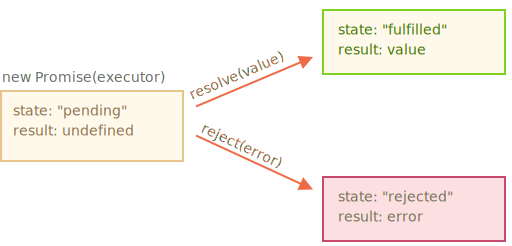

# Promise

Imagine that you're a top singer, and fans ask day and night for your upcoming single.

To get some relief, you promise to send it to them when it's published. You give your fans a list to which they can subscribe for updates. They can fill in their email addresses, so that when the song becomes available, all subscribed parties instantly receive it. And even if something goes very wrong, say, if plans to publish the song are cancelled, they will still be notified.

Everyone is happy, because the people don't crowd you anymore, and fans, because they won't miss the single.

This is a real-life analogy for things we often have in programming:

1. A "producing code" that does something and takes time. For instance, the code loads data over a network. That's a "singer".
2. A "consuming code" that wants the result of the "producing code" once it's ready. Many functions  may need that result. These are the "fans".
3. A *promise* is a special JavaScript object that links the "producing code" and the "consuming code" together. In terms of our analogy: this is the "subscription list". The "producing code" takes whatever time it needs to produce the promised result, and the "promise" makes that result available to all of the subscribed code when it's ready.

The analogy isn't terribly accurate, because JavaScript promises are more complex than a simple subscription list: they have additional features and limitations. But it's fine to begin with.

The constructor syntax for a promise object is:

```js
let promise = new Promise(function(resolve, reject) {
  // executor (the producing code, "singer")
});
```

The function passed to `new Promise` is called the *executor*. When the promise is created, this executor function runs automatically. It contains the producing code, that should eventually produce a result. In terms of the analogy above: the executor is the "singer".

The resulting `promise` object has internal properties:

- `state` — initially "pending", then changes to either "fulfilled" or "rejected",
- `result` — an arbitrary value, initially `undefined`.

When the executor finishes the job, it should call one of the functions that it gets as arguments:

- `resolve(value)` — to indicate that the job finished successfully:
    - sets `state` to `"fulfilled"`,
    - sets `result` to `value`.
- `reject(error)` — to indicate that an error occurred:
    - sets `state` to `"rejected"`,
    - sets `result` to `error`.



Later we'll see how these changes become known to "fans".

Here's an example of a Promise constructor and a simple executor function with its "producing code" (the `setTimeout`):

```js run
let promise = new Promise(function(resolve, reject) {
  // the function is executed automatically when the promise is constructed

  // after 1 second signal that the job is done with the result "done"
  setTimeout(() => *!*resolve("done")*/!*, 1000);
});
```

We can see two things by running the code above:

1. The executor is called automatically and immediately (by the `new Promise`).
2. The executor receives two arguments: `resolve` and `reject` — these functions are pre-defined by the JavaScript engine. So we don't need to create them. We only should call one of them when ready.

After one second of "processing" the executor calls `resolve("done")` to produce the result:


That was an example of a successful job completion, a "fulfilled promise".

And now an example of the executor rejecting the promise with an error:

```js
let promise = new Promise(function(resolve, reject) {
  // after 1 second signal that the job is finished with an error
  setTimeout(() => *!*reject(new Error("Whoops!"))*/!*, 1000);
});
```


To summarize, the executor should do a job (something that takes time usually) and then call `resolve` or `reject` to change the state of the corresponding Promise object.

The Promise that is either resolved or rejected is called "settled", as opposed to a initially "pending" Promise.

````smart header="There can be only a single result or an error"
The executor should call only one `resolve` or one `reject`. The promise's state change is final.

All further calls of `resolve` and `reject` are ignored:

```js
let promise = new Promise(function(resolve, reject) {
  resolve("done");

  reject(new Error("…")); // ignored
  setTimeout(() => resolve("…")); // ignored
});
```

The idea is that a job done by the executor may have only one result or an error.

Also, `resolve`/`reject` expect only one argument (or none) and will ignore additional arguments.
````

```smart header="Reject with `Error` objects"
In case something goes wrong, we can call `reject` with any type of argument (just like `resolve`). But it is recommended to use `Error` objects (or objects that inherit from `Error`). The reasoning for that will soon become apparent.
```

````smart header="Immediately calling `resolve`/`reject`"
In practice, an executor usually does something asynchronously and calls `resolve`/`reject` after some time, but it doesn't have to. We also can call `resolve` or `reject` immediately, like this:

```js
let promise = new Promise(function(resolve, reject) {
  // not taking our time to do the job
  resolve(123); // immediately give the result: 123
});
```

For instance, this might happen when we start to do a job but then see that everything has already been completed and  cached.

That's fine. We immediately have a resolved promise.
````

```smart header="The `state` and `result` are internal"
The properties `state` and `result` of the Promise object are internal. We can't directly access them from our "consuming code". We can use the methods `.then`/`.catch`/`.finally` for that. They are described below.
```

## Consumers: then, catch, finally

A Promise object serves as a link between the executor (the "producing code" or "singer") and the consuming functions (the "fans"), which will receive the result or error. Consuming functions can be registered (subscribed) using methods `.then`, `.catch` and `.finally`.

### then

The most important, fundamental one is `.then`.

The syntax is:

```js
promise.then(
  function(result) { *!*/* handle a successful result */*/!* },
  function(error) { *!*/* handle an error */*/!* }
);
```

The first argument of `.then` is a function that:

1. runs when the promise is resolved, and
2. receives the result.

The second argument of `.then` is a function that:

1. runs when the promise is rejected, and
2. receives the error.

For instance, here's a reaction to a successfully resolved promise:

```js run
let promise = new Promise(function(resolve, reject) {
  setTimeout(() => resolve("done!"), 1000);
});

// resolve runs the first function in .then
promise.then(
*!*
  result => alert(result), // shows "done!" after 1 second
*/!*
  error => alert(error) // doesn't run
);
```

The first function was executed.

And in the case of a rejection -- the second one:

```js run
let promise = new Promise(function(resolve, reject) {
  setTimeout(() => reject(new Error("Whoops!")), 1000);
});

// reject runs the second function in .then
promise.then(
  result => alert(result), // doesn't run
*!*
  error => alert(error) // shows "Error: Whoops!" after 1 second
*/!*
);
```

If we're interested only in successful completions, then we can provide only one function argument to `.then`:

```js run
let promise = new Promise(resolve => {
  setTimeout(() => resolve("done!"), 1000);
});

*!*
promise.then(alert); // shows "done!" after 1 second
*/!*
```

### catch

If we're interested only in errors, then we can use `null` as the first argument: `.then(null, errorHandlingFunction)`. Or we can use `.catch(errorHandlingFunction)`, which is exactly the same:


```js run
let promise = new Promise((resolve, reject) => {
  setTimeout(() => reject(new Error("Whoops!")), 1000);
});

*!*
// .catch(f) is the same as promise.then(null, f)
promise.catch(alert); // shows "Error: Whoops!" after 1 second
*/!*
```

The call `.catch(f)` is a complete analog of `.then(null, f)`, it's just a shorthand.

### finally

Just like there's a `finally` clause in a regular `try {...} catch {...}`, there's `finally` in promises.

The call `.finally(f)` is similar to `.then(f, f)` in the sense that it always runs when the promise is settled: be it resolve or reject.

`finally` is a good handler for performing cleanup, e.g. stopping our loading indicators, as they are not needed anymore, no matter what the outcome is.

Like this:

```js
new Promise((resolve, reject) => {
  /* do something that takes time, and then call resolve/reject */
})
*!*
  // runs when the promise is settled, doesn't matter successfully or not
  .finally(() => stop loading indicator)
*/!*
  .then(result => show result, err => show error)
```

It's not exactly an alias of `then(f,f)` though. There are several important differences:

1. A `finally` handler has no arguments. In `finally` we don't know whether the promise is successful or not. That's all right, as our task is usually to perform "general" finalizing procedures.
2. A `finally` handler passes through results and errors to the next handler.

    For instance, here the result is passed through `finally` to `then`:
    ```js run
    new Promise((resolve, reject) => {
      setTimeout(() => resolve("result"), 2000)
    })
      .finally(() => alert("Promise ready"))
      .then(result => alert(result)); // <-- .then handles the result
    ```

    And here there's an error in the promise, passed through `finally` to `catch`:

    ```js run
    new Promise((resolve, reject) => {
      throw new Error("error");
    })
      .finally(() => alert("Promise ready"))
      .catch(err => alert(err));  // <-- .catch handles the error object
    ```  

    That's very convenient, because `finally` is not meant to process a promise result. So it passes it through.

    We'll talk more about promise chaining and result-passing between handlers in the next chapter.

3. Last, but not least, `.finally(f)` is a more convenient syntax than `.then(f, f)`: no need to duplicate the function `f`.

````smart header="On settled promises handlers runs immediately"
If a promise is pending, `.then/catch/finally` handlers wait for the result. Otherwise, if a promise has already settled, they execute immediately:

```js run
// an immediately resolved promise
let promise = new Promise(resolve => resolve("done!"));

promise.then(alert); // done! (shows up right now)
```

The good thing is: a `.then` handler is guaranteed to run whether the promise takes time or settles it immediately.
````

Next, let's see more practical examples of how promises can help us to write asynchronous code.

## Example: loadScript [#loadscript]

We've got the `loadScript` function for loading a script from the previous chapter.

Here's the callback-based variant, just to remind us of it:

```js
function loadScript(src, callback) {
  let script = document.createElement('script');
  script.src = src;

  script.onload = () => callback(null, script);
  script.onerror = () => callback(new Error(`Script load error for ${src}`));

  document.head.append(script);
}
```

Let's rewrite it using Promises.

The new function `loadScript` will not require a callback. Instead, it will create and return a Promise object that resolves when the loading is complete. The outer code can add handlers (subscribing functions) to it using `.then`:

```js run
function loadScript(src) {  
  return new Promise(function(resolve, reject) {
    let script = document.createElement('script');
    script.src = src;

    script.onload = () => resolve(script);
    script.onerror = () => reject(new Error(`Script load error for ${src}`));

    document.head.append(script);
  });
}
```

Usage:

```js run
let promise = loadScript("https://cdnjs.cloudflare.com/ajax/libs/lodash.js/4.17.11/lodash.js");

promise.then(
  script => alert(`${script.src} is loaded!`),
  error => alert(`Error: ${error.message}`)
);

promise.then(script => alert('One more handler to do something else!'));
```

We can immediately see a few benefits over the callback-based pattern:


| Promises | Callbacks |
|----------|-----------|
| Promises allow us to do things in the natural order. First, we run `loadScript(script)`, and `.then` we write what to do with the result. | We must have a `callback` function at our disposal when calling `loadScript(script, callback)`. In other words, we must know what to do with the result *before* `loadScript` is called. |
| We can call `.then` on a Promise as many times as we want. Each time, we're adding a new "fan", a new subscribing function, to the "subscription list". More about this in the next chapter: [](info:promise-chaining). | There can be only one callback. |

So Promises give us better code flow and flexibility. But there's more. We'll see that in the next chapters.
