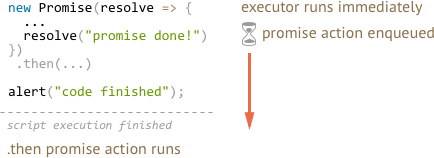

# Promise handlers queue

Promise handlers `.then`/`.catch`/`.finally` are always asynchronous.

Even when a Promise is immediately resolved, the code on the lines *below* your `.then`/`.catch`/`.finally` may still execute first.

Here's the code that demonstrates it:

```js run
// an "immediately" resolved Promise
new Promise(resolve => resolve("promise done!"))
  .then(alert); // this alert shows after the alert below

alert("code finished"); // this alert shows first
```

If you run it, you see `code finished` first, and then `promise done!`.

What's going on?

# Internal queue

Asynchronous tasks need proper management. For that, the standard specifies an internal queue of "Promise Jobs".

As said in the [specification](https://tc39.github.io/ecma262/#sec-jobs-and-job-queues):

- The queue is first-in-first-out: jobs that get enqueued first are run first.
- Execution of a job is initiated only when there is no running execution context, and the execution context stack is empty.

When a promise is ready, its `.then/catch/finally` handler is not executed right ahead. Instead, the handling is put into the queue.

Javascript engine takes a job from the queue and executes it, when it finishes executing the current code.

That's why "code finished" in the example above shows first.



If there's a chain with multiple `.then/catch/finally`, then every one of them is executed asynchronously. In other words, it first gets queued, and then executed, when all handlers before it are finished.

What if the order matters for us, and we want to see `code finished` after `promise done`?

Easy, just put it into the queue:

```js run
new Promise(resolve => resolve("promise done!"))
  .then(alert)
  .then(() => alert("code finished");
```

Now the order is as intended.

## Higher-order queues

There are other action queues, depending on the environment.

For instance, `setTimeout` enqueues an action when the time comes, or even right now if the timeout is zero:

```js
setTimeout(handler, 0); // handler is queued for immediate execution.
```

Other examples:
- Pending events (like mouse movements in the browser)
- Network operations that may take time, or may finish immediately if the result is cached.

**Promise queue has higher priority than environment-related queues.**

For instance, take a look:

```js run
setTimeout(() => alert("timeout"), 0);

new Promise(resolve => resolve("promise"))
  .then(alert);

alert("code");
```

1. `code` shows first, it's a regular synchronous call.
2. `promise` shows second, because `.then` passes through the promise queue, runs after the current code.
3. `timeout` shows last, because environment-specific queue has lower priority.

That's also true for more complex calls, e.g if we schedule an immediate `setTimeout` call inside the promise, then it also executes last:

```js run
new Promise(resolve => {
  setTimeout(() => alert("timeout"), 0);
  resolve("promise"); // shows up first
}).then(alert);
```

Here also `promise` triggers first, because promise actions have higher priority.

## Summary

Promise handling is always async, as all promise actions pass through the internal "promise jobs" queue.

**So, `.then/catch/finally` is called after the current code is finished.**

If we need to guarantee that a piece of code is executed after `.then/catch/finally`, it's best to add it into a chained `.then` call.

Other environments may have their own async actions, like events, network-related calls, filesystem tasks, and `setTimeout`-scheduled calls.

**Environment-specific async actions happen after the code is finished *and* after the promise queue is empty.**

In other words, they have lower priority.

So we know for sure a promise chain goes as far as possible first. It may finish or hang waiting for something outside of the promise queue, and only then an event-related handler or `setTimeout` may trigger.
