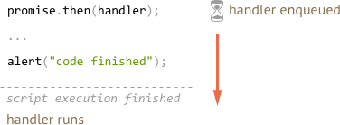
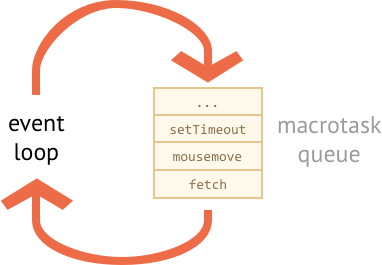

# Microtasks and event loop

Promise handlers `.then`/`.catch`/`.finally` are always asynchronous.

Even when a Promise is immediately resolved, the code on the lines *below* `.then`/`.catch`/`.finally` will still execute before these handlers .

Here's the demo:

```js run
let promise = Promise.resolve();

promise.then(() => alert("promise done"));

alert("code finished"); // this alert shows first
```

If you run it, you see `code finished` first, and then `promise done`.

That's strange, because the promise is definitely done from the beginning.

Why did the `.then` trigger afterwards? What's going on?

## Microtasks

Asynchronous tasks need proper management. For that, the standard specifies an internal queue `PromiseJobs`, more often referred to as "microtask queue" (v8 term).

As said in the [specification](https://tc39.github.io/ecma262/#sec-jobs-and-job-queues):

- The queue is first-in-first-out: tasks enqueued first are run first.
- Execution of a task is initiated only when nothing else is running.

Or, to say that simply, when a promise is ready, its `.then/catch/finally` handlers are put into the queue. They are not executed yet. JavaScript engine takes a task from the queue and executes it, when it becomes free from the current code.

That's why "code finished" in the example above shows first.



Promise handlers always go through that internal queue.

If there's a chain with multiple `.then/catch/finally`, then every one of them is executed asynchronously. That is, it first gets queued, and executed when the current code is complete and previously queued handlers are finished.

**What if the order matters for us? How can we make `code finished` work after `promise done`?**

Easy, just put it into the queue with `.then`:

```js run
Promise.resolve()
  .then(() => alert("promise done!"))
  .then(() => alert("code finished"));
```

Now the order is as intended.

## Event loop

In-browser JavaScript execution flow, as well as Node.js, is based on an *event loop*.

"Event loop" is a process when the engine sleeps and waits for events. When they occur - handles them and sleeps again.

Events may come either comes from external sources, like user actions, or just as the end signal of an internal task.

Examples of events:
- `mousemove`, a user moved their mouse.
- `setTimeout` handler is to be called.
- an external `<script src="...">` is loaded, ready to be executed.
- a network operation, e.g. `fetch` is complete.
- ...etc.

Things happen -- the engine handles them -- and waits for more to happen (while sleeping and consuming close to zero CPU).



As you can see, there's also a queue here. A so-called "macrotask queue" (v8 term).

When an event happens, while the engine is busy, its handling is enqueued.

For instance, while the engine is busy processing a network `fetch`, a user may move their mouse causing `mousemove`, and `setTimeout` may be due and so on, just as painted on the picture above.

Events from the macrotask queue are processed on "first come – first served" basis. When the engine browser finishes with `fetch`, it handles `mousemove` event, then `setTimeout` handler, and so on.

So far, quite simple, right? The engine is busy, so other tasks queue up.

Now the important stuff.

**Microtask queue has a higher priority than the macrotask queue.**

In other words, the engine first executes all microtasks, and then takes a macrotask. Promise handling always has the priority.

For instance, take a look:

```js run
setTimeout(() => alert("timeout"));

Promise.resolve()
  .then(() => alert("promise"));

alert("code");
```

What's the order?

1. `code` shows first, because it's a regular synchronous call.
2. `promise` shows second, because `.then` passes through the microtask queue, and runs after the current code.
3. `timeout` shows last, because it's a macrotask.

It may happen that while handling a macrotask, new promises are created.

Or, vice-versa, a microtask schedules a macrotask (e.g. `setTimeout`).

For instance, here `.then` schedules a `setTimeout`:

```js run
Promise.resolve()
  .then(() => {
    setTimeout(() => alert("timeout"), 0);
  })
  .then(() => {
    alert("promise");
  });
```

Naturally, `promise` shows up first, because `setTimeout` macrotask awaits in the less-priority macrotask queue.

As a logical consequence, macrotasks are handled only when promises give the engine a "free time". So if we have a chain of promise handlers that don't wait for anything, execute right one after another, then a `setTimeout` (or a user action handler) can never run in-between them.

## Unhandled rejection

Remember "unhandled rejection" event from the chapter <info:promise-error-handling>?

Now we can describe how JavaScript finds out that a rejection was not handled.

**"Unhandled rejection" is when a promise error is not handled at the end of the microtask queue.**

For instance, consider this code:

```js run
let promise = Promise.reject(new Error("Promise Failed!"));

window.addEventListener('unhandledrejection', event => {
  alert(event.reason); // Promise Failed!
});
```

We create a rejected `promise` and do not handle the error. So we have the "unhandled rejection" event (printed in browser console too).

We wouldn't have it if we added `.catch`, like this:

```js run
let promise = Promise.reject(new Error("Promise Failed!"));
*!*
promise.catch(err => alert('caught'));
*/!*

// no error, all quiet
window.addEventListener('unhandledrejection', event => alert(event.reason));
```

Now let's say, we'll be catching the error, but after `setTimeout`:

```js run
let promise = Promise.reject(new Error("Promise Failed!"));
*!*
setTimeout(() => promise.catch(err => alert('caught')));
*/!*

// Error: Promise Failed!
window.addEventListener('unhandledrejection', event => alert(event.reason));
```

Now the unhandled rejection appears again. Why? Because `unhandledrejection` is generated when the microtask queue is complete. The engine examines promises and, if any of them is in "rejected" state, then the event triggers.

In the example, the `.catch` added by `setTimeout` triggers too, of course it does, but later, after `unhandledrejection` has already occurred.

## Summary

- Promise handling is always asynchronous, as all promise actions pass through the internal "promise jobs" queue, also called "microtask queue" (v8 term).

    **So, `.then/catch/finally` handlers are called after the current code is finished.**

    If we need to guarantee that a piece of code is executed after `.then/catch/finally`, it's best to add it into a chained `.then` call.

- There's also a "macrotask queue" that keeps various events, network operation results, `setTimeout`-scheduled calls, and so on. These are also called "macrotasks" (v8 term).

    The engine uses the macrotask queue to handle them in the appearance order.

    **Macrotasks run after the code is finished *and* after the microtask queue is empty.**

    In other words, they have lower priority.

So the order is: regular code, then promise handling, then everything else, like events etc.
