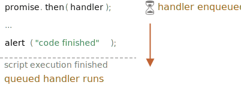

# Microtasks

Promise handlers `.then`/`.catch`/`.finally` are always asynchronous.

Even when a Promise is immediately resolved, the code on the lines *below* `.then`/`.catch`/`.finally` will still execute before these handlers.

Here's a demo:

```js run
let promise = Promise.resolve();

promise.then(() => alert("promise done!"));

alert("code finished"); // this alert shows first
```

If you run it, you see `code finished` first, and then `promise done!`.

That's strange, because the promise is definitely done from the beginning.

Why did the `.then` trigger afterwards? What's going on?

## Microtasks queue

Asynchronous tasks need proper management. For that, the ECMA standard specifies an internal queue `PromiseJobs`, more often referred to as the "microtask queue" (V8 term).

As stated in the [specification](https://tc39.github.io/ecma262/#sec-jobs-and-job-queues):

- The queue is first-in-first-out: tasks enqueued first are run first.
- Execution of a task is initiated only when nothing else is running.

Or, to put it more simply, when a promise is ready, its `.then/catch/finally` handlers are put into the queue; they are not executed yet. When the JavaScript engine becomes free from the current code, it takes a task from the queue and executes it.

That's why "code finished" in the example above shows first.



Promise handlers always go through this internal queue.

If there's a chain with multiple `.then/catch/finally`, then every one of them is executed asynchronously. That is, it first gets queued, then executed when the current code is complete and previously queued handlers are finished.

**What if the order matters for us? How can we make `code finished` appear after `promise done`?**

Easy, just put it into the queue with `.then`:

```js run
Promise.resolve()
  .then(() => alert("promise done!"))
  .then(() => alert("code finished"));
```

Now the order is as intended.

## Unhandled rejection

Remember the `unhandledrejection` event from the article <info:promise-error-handling>?

Now we can see exactly how JavaScript finds out that there was an unhandled rejection.

**An "unhandled rejection" occurs when a promise error is not handled at the end of the microtask queue.**

Normally, if we expect an error, we add `.catch` to the promise chain to handle it:

```js run
let promise = Promise.reject(new Error("Promise Failed!"));
*!*
promise.catch(err => alert('caught'));
*/!*

// doesn't run: error handled
window.addEventListener('unhandledrejection', event => alert(event.reason));
```

But if we forget to add `.catch`, then, after the microtask queue is empty, the engine triggers the event:

```js run
let promise = Promise.reject(new Error("Promise Failed!"));

// Promise Failed!
window.addEventListener('unhandledrejection', event => alert(event.reason));
```

What if we handle the error later? Like this:

```js run
let promise = Promise.reject(new Error("Promise Failed!"));
*!*
setTimeout(() => promise.catch(err => alert('caught')), 1000);
*/!*

// Error: Promise Failed!
window.addEventListener('unhandledrejection', event => alert(event.reason));
```

Now, if we run it, we'll see `Promise Failed!` first and then `caught`.

If we didn't know about the microtasks queue, we could wonder: "Why did `unhandledrejection` handler run? We did catch and handle the error!"

But now we understand that `unhandledrejection` is generated when the microtask queue is complete: the engine examines promises and, if any of them is in the "rejected" state, then the event triggers.

In the example above, `.catch` added by `setTimeout` also triggers. But it does so later, after `unhandledrejection` has already occurred, so it doesn't change anything.

## Summary

Promise handling is always asynchronous, as all promise actions pass through the internal "promise jobs" queue, also called "microtask queue" (V8 term).

So `.then/catch/finally` handlers are always called after the current code is finished.

If we need to guarantee that a piece of code is executed after `.then/catch/finally`, we can add it into a chained `.then` call.

In most Javascript engines, including browsers and Node.js, the concept of microtasks is closely tied with the "event loop" and "macrotasks". As these have no direct relation to promises, they are covered in another part of the tutorial, in the article <info:event-loop>.
