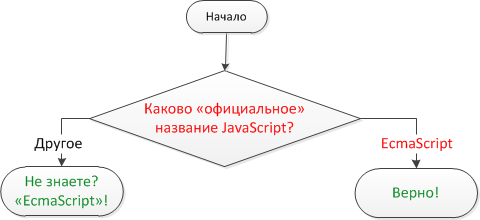

# The name of JavaScript

[importance 2]

Using the `if..else` construct, write the code which asks: 'What is the "official" name of JavaScript?'

If the visitor enters "EcmaScript", then output "Right!", otherwise -- output: "Didn't know? EcmaScript!"

[demo src="ifelse_task2"]