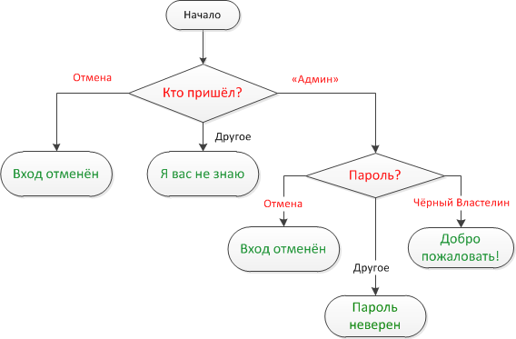

# Check the login

[importance 3]

Write the code which asks for a login with `prompt`.

If the visitor enters `"Admin"`, then `prompt` for a password, if the input is an empty line or [key Esc] -- show "Canceled.", if it's another string -- then show "I don't know you".

The password is checked as follows:
<ul>
<li>If it equals "TheMaster", then show "Welcome!",</li>
<li>Another string -- show "Wrong password",</li>
<li>For an empty string or cancelled input, show "Canceled."</li>
</ul>

The schema:

Please use nested `if` blocks. Mind the overall readability of the code.

[demo /]