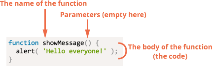

# Functions

Quite often we need to perform a similar action in many places of the script.

For example, we need to show a nice-looking message when a visitor logs in, logs out and maybe somewhere else.

Functions are the main "building blocks" of the program. They allow the code to be called many times without repetition.

[cut]

We've already seen examples of built-in functions, like `alert(message)`, `prompt(message, default)` and `confirm(question)`. But we can create functions of our own as well.

## Definition

An example of a function definition:

```js
function showMessage() {
  alert( 'Hello everyone!' );
}
```

The `function` keyword goes first, then follows the *name of the function*, then a list of *parameters* in the brackets (empty in the example above) and finally the code of the function, also named "the function body".



Once defined, the function can be called by it's name.

For instance:

```js
//+ run
function showMessage() {
  alert( 'Hello everyone!' );
}

*!*
showMessage();
showMessage();
*/!*
```

The call executes the code of the function. Here we will see the message shown two times.

In this example we can see one of the main purposes of the functions: to evade code duplication.

If we ever need to change the message or the way it is shown -- it's enough to modify the code in one place: the function which outputs it.

## Local variables

A function may declare *local* variables with `var`, `let` or `const`.

These variables are only seen from inside the function:

```js
//+ run
function showMessage() {
*!*
  var message = "Hello, I'm JavaScript!"; // local variable
*/!*

  alert( message );
}

showMessage(); // Hello, I'm JavaScript!

alert( message ); // <-- Error! The variable is local to the function
```


**Блоки `if/else`, `switch`, `for`, `while`, `do..while` не влияют на область видимости переменных.**

При объявлении переменной в таких блоках, она всё равно будет видна во всей функции.

Например:

```js
//+ no-beautify
function count() {
  // переменные i,j не будут уничтожены по окончании цикла
  for (*!*var*/!* i = 0; i < 3; i++) {
    *!*var*/!* j = i * 2;
  }

*!*
  alert( i ); // i=3, последнее значение i, при нём цикл перестал работать
  alert( j ); // j=4, последнее значение j, которое вычислил цикл
*/!*
}
```

**Неважно, где именно в функции и сколько раз объявляется переменная. Любое объявление срабатывает один раз и распространяется на всю функцию.**

Объявления переменных в примере выше можно передвинуть вверх, это ни на что не повлияет:

```js
function count() {
*!*
  var i, j; // передвинули объявления var в начало
*/!*
  for (i = 0; i < 3; i++) {
    j = i * 2;
  }

  alert( i ); // i=3
  alert( j ); // j=4
}
```

## Внешние переменные 

Функция может обратиться ко внешней переменной, например:

```js
//+ run no-beautify
var *!*userName*/!* = 'Вася';

function showMessage() {
  var message = 'Привет, я ' + *!*userName*/!*;
  alert(message);
}

showMessage(); // Привет, я Вася
```

Доступ возможен не только на чтение, но и на запись. При этом, так как переменная внешняя, то изменения будут видны и снаружи функции:

```js
//+ run
var userName = 'Вася';

function showMessage() {
  userName = 'Петя'; // (1) присвоение во внешнюю переменную

  var message = 'Привет, я ' + userName;
  alert( message );
}

showMessage();

*!*
alert( userName ); // Петя, значение внешней переменной изменено функцией
*/!*
```

Конечно, если бы внутри функции, в строке `(1)`, была бы объявлена своя локальная переменная `var userName`, то все обращения использовали бы её, и внешняя переменная осталась бы неизменной.

**Переменные, объявленные на уровне всего скрипта, называют *"глобальными переменными"*.**

В примере выше переменная `userName` -- глобальная.

Делайте глобальными только те переменные, которые действительно имеют общее значение для вашего проекта, а нужные для решения конкретной задачи -- пусть будут локальными в соответствующей функции.


[warn header="Внимание: неявное объявление глобальных переменных!"]

В старом стандарте JavaScript существовала возможность неявного объявления переменных присвоением значения.

Например:

```js
//+ run
function showMessage() {
  message = 'Привет'; // без var!
}

showMessage();

alert( message ); // Привет
```

В коде выше переменная `message` нигде не объявлена, а сразу присваивается. Скорее всего, программист просто забыл поставить `var`.

При `use strict` такой код привёл бы к ошибке, но без него переменная будет создана автоматически, причём в примере выше она создаётся не в функции, а на уровне всего скрипта.

Избегайте этого.

Здесь опасность даже не в автоматическом создании переменной, а в том, что глобальные переменные должны использоваться тогда, когда действительно нужны "общескриптовые" параметры.

Забыли `var` в одном месте, потом в другом -- в результате одна функция неожиданно поменяла глобальную переменную, которую использует другая. И поди разберись, кто и когда её поменял, не самая приятная ошибка для отладки.
[/warn]

В будущем, когда мы лучше познакомимся с основами JavaScript, в главе [](/closures), мы более детально рассмотрим внутренние механизмы работы переменных и функций.

## Параметры 

При вызове функции ей можно передать данные, которые та использует по своему усмотрению.

Например, этот код выводит два сообщения:

```js
//+ run no-beautify
function showMessage(*!*from, text*/!*) { // параметры from, text
  
  from = "** " + from + " **"; // здесь может быть сложный код оформления

  alert(from + ': ' + text);
}

*!*
showMessage('Маша', 'Привет!');
showMessage('Маша', 'Как дела?');
*/!*
```

**Параметры копируются в локальные переменные функции**.

Например, в коде ниже есть внешняя переменная `from`, значение которой при запуске функции копируется в параметр функции с тем же именем. Далее функция работает уже с параметром:

```js
//+ run
function showMessage(from, text) {
*!*
  from = '**' + from + '**'; // меняем локальную переменную from 
*/!*
  alert( from + ': ' + text );
}

var from = "Маша";

showMessage(from, "Привет");

alert( from ); // старое значение from без изменений, в функции была изменена копия
```

## Аргументы по умолчанию

Функцию можно вызвать с любым количеством аргументов.

Если параметр не передан при вызове -- он считается равным `undefined`.

Например, функцию показа сообщения `showMessage(from, text)` можно вызвать с одним аргументом:

```js
showMessage("Маша");
```

При этом можно проверить, и если параметр не передан -- присвоить ему значение "по умолчанию":

```js
//+ run
function showMessage(from, text) {
*!*
  if (text === undefined) {
    text = 'текст не передан';
  }
*/!*

  alert( from + ": " + text );
}

showMessage("Маша", "Привет!"); // Маша: Привет!
*!*
showMessage("Маша"); // Маша: текст не передан
*/!*
```

**При объявлении функции необязательные аргументы, как правило, располагают в конце списка.**

Для указания значения "по умолчанию", то есть, такого, которое используется, если аргумент не указан, используется два способа:

<ol>
<li>Можно проверить, равен ли аргумент `undefined`, и если да -- то записать в него значение по умолчанию. Этот способ продемонстрирован в примере выше.</li>
<li>Использовать оператор `||`:

```js
//+ run
function showMessage(from, text) {
  text = text || 'текст не передан';

  ...
}
```

Второй способ считает, что аргумент отсутствует, если передана пустая строка, `0`, или вообще любое значение, которое в логическом контексте является `false`. 
</li>
</ol>

Если аргументов передано больше, чем надо, например `showMessage("Маша", "привет", 1, 2, 3)`, то ошибки не будет. Но, чтобы получить такие "лишние" аргументы, нужно будет прочитать их из специального объекта `arguments`, который мы рассмотрим в главе [](/arguments-pseudoarray).

## Возврат значения 

Функция может возвратить результат, который будет передан в вызвавший её код.

Например, создадим функцию `calcD`, которая будет возвращать дискриминант квадратного уравнения по формуле <code>b<sup>2</sup> - 4ac</code>:

```js
//+ run no-beautify
function calcD(a, b, c) {
   *!*return*/!* b*b - 4*a*c;
}

var test = calcD(-4, 2, 1);
alert(test); // 20
```

**Для возврата значения используется директива `return`.** 

Она может находиться в любом месте функции. Как только до неё доходит управление -- функция  завершается и значение передается обратно.

Вызовов `return` может быть и несколько, например:

```js
//+ run
function checkAge(age) {
  if (age > 18) {
    return true;
  } else {
    return confirm('Родители разрешили?');
  }
}

var age = prompt('Ваш возраст?');

if (checkAge(age)) {
  alert( 'Доступ разрешен' );
} else {
  alert( 'В доступе отказано' );
}
```

Директива `return` может также использоваться без значения, чтобы прекратить выполнение и выйти из функции.

Например:

```js
function showMovie(age) {
  if (!checkAge(age)) {
*!*
    return;
*/!*
  }

  alert( "Фильм не для всех" ); // (*)  
  // ...
}
```

В коде выше, если сработал `if`, то строка `(*)` и весь код под ней никогда не выполнится, так как `return` завершает выполнение функции. 

[smart header="Значение функции без `return` и с пустым `return`"]
В случае, когда функция не вернула значение или `return` был без аргументов, считается что она вернула `undefined`:

```js
//+ run
function doNothing() { /* пусто */ }

alert( doNothing() ); // undefined
```

Обратите внимание, никакой ошибки нет. Просто возвращается `undefined`.

Ещё пример, на этот раз с `return` без аргумента:

```js
//+ run
function doNothing() {
  return;
}

alert( doNothing() === undefined ); // true
```

[/smart]

## Выбор имени функции [#function-naming]

Имя функции следует тем же правилам, что и имя переменной. Основное отличие -- оно должно быть глаголом, т.к. функция -- это действие.

Как правило, используются глагольные префиксы, обозначающие общий характер действия, после которых следует уточнение.

Функции, которые начинаются с `"show"` -- что-то показывают:

```js
//+ no-beautify
showMessage(..)     // префикс show, "показать" сообщение
```

Функции, начинающиеся с `"get"` -- получают, и т.п.:

```js
//+ no-beautify
getAge(..)          // get, "получает" возраст
calcD(..)           // calc, "вычисляет" дискриминант
createForm(..)      // create, "создает" форму
checkPermission(..) // check, "проверяет" разрешение, возвращает true/false
```

Это очень удобно, поскольку взглянув на функцию -- мы уже примерно представляем, что она делает, даже если функцию написал совсем другой человек, а в отдельных случаях -- и какого вида значение она возвращает. 

[smart header="Одна функция -- одно действие"]

Функция должна делать только то, что явно подразумевается её названием. И это должно быть одно действие. 

Если оно сложное и подразумевает поддействия -- может быть имеет смысл выделить их в отдельные функции? Зачастую это имеет смысл, чтобы лучше структурировать код.

**...Но самое главное -- в функции не должно быть ничего, кроме самого действия и поддействий, неразрывно связанных с ним.**

Например, функция проверки данных (скажем, `"validate"`) не должна показывать сообщение об ошибке. Её действие -- проверить.
[/smart]


[smart header="Сверхкороткие имена функций"]
Имена функций, которые используются *очень часто*, иногда делают сверхкороткими. 

Например, во фреймворке [jQuery](http://jquery.com) есть функция `$`, во фреймворке [Prototype](http://prototypejs.com) -- функция `$$`, а в библиотеке [LoDash](http://lodash.com/) очень активно используется функция с названием из одного символа подчеркивания `_`.
[/smart]

## Итого

Объявление функции имеет вид:

```js
function имя(параметры, через, запятую) {
  код функции
}
```

<ul>
<li>Передаваемые значения копируются в параметры функции и становятся локальными переменными.</li>
<li>Параметры функции копируются в её локальные переменные.</li>
<li>Можно объявить новые локальные переменые при помощи `var`.</li>
<li>Значение возвращается оператором `return ...`.</li>
<li>Вызов `return` тут же прекращает функцию.</li>
<li>Если `return;` вызван без значения, или функция завершилась без `return`, то её результат равен `undefined`.</li>
</ul>

При обращении к необъявленной переменной функция будет искать внешнюю переменную с таким именем, но лучше, если функция использует только локальные переменные:

<ul>
<li>Это делает очевидным общий поток выполнения -- что передаётся в функцию и какой получаем результат.</li>
<li>Это предотвращает возможные конфликты доступа, когда две функции, возможно написанные в разное время или разными людьми, неожиданно друг для друга меняют одну и ту же внешнюю переменную.</li> 
</ul>
</li>
</ul>

Именование функций:

<ul>
<li>Имя функции должно понятно и чётко отражать, что она делает. Увидев её вызов в коде, вы должны тут же понимать, что она делает.</li>
<li>Функция -- это действие, поэтому для имён функций, как правило, используются глаголы.</li>
</ul>

Функции являются основными строительными блоками скриптов. Мы будем неоднократно возвращаться к ним и изучать все более и более глубоко.


