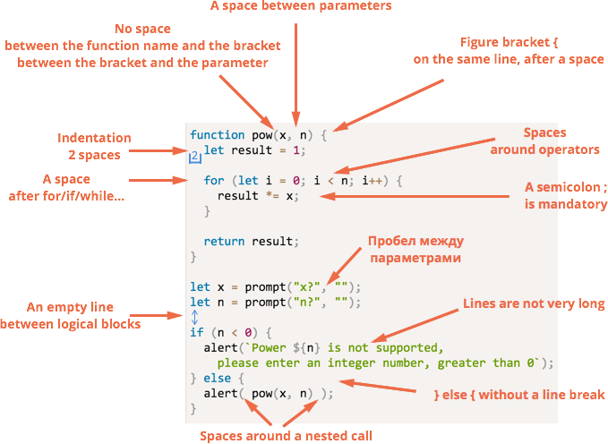
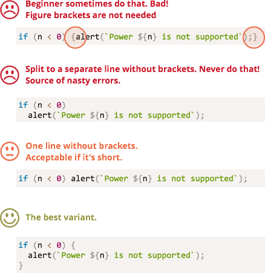

# Coding style

Our code must be as clean and easy to read as possible.

That is actually an art of programming -- to take a complex task and describe it using a programming language in a way that is both correct and human-readable.

One thing to help is a good code style. In this chapter we cover it's components.

[cut]

## Syntax

A cheatsheet with the rules (more details below):


<!--
```js
function pow(x, n) {
  let result = 1;

  for (let i = 0; i < n; i++) {
    result *= x;
  }

  return result;
}

let x = prompt("x?", "");
let n = prompt("n?", "");

if (n < 0) {
  alert(`Power ${n} is not supported,
    please enter an integer number, greater than 0`);
} else {
  alert( pow(x, n) );
}
```

-->

Nothing is "carved in stone" here, so let's discuss the rules in detail.

### Figure brackets

In most JavaScript projects figure brackets are written on the same line. A so-called "egyptian" style. There's also a space before an opening bracket.

A corner-case if a single-line `if/for`. Should we use brackets at all? If yes, then where?

Here are the annotated variants, so you can judge about their readability on your own:

<!--
```js no-beautify
if (n < 0) {alert(`Power ${n} is not supported`);}

if (n < 0) alert(`Power ${n} is not supported`);

if (n < 0) 
  alert(`Power ${n} is not supported`);

if (n < 0) {
  alert(`Power ${n} is not supported`);
}
```
-->


As a summary, for a really short code one line is acceptable: like `if (cond) return null`.

But a separate line for each statement in brackets is usually better.

### Line length

The maximal line length should be limited. No one likes to eye-follow a long horizontal line. Doesn't matter if it's a text or an OR'ed list of `if` conditions. It's better to split it.

The maximal line length is agreed on the team-level. It's usually 80 or 120 characters.

### Indents

There are two types of indents:

- **A horizontal indent: 2(4) spaces.**

    A horizantal identation is made using either spaces or the "Tab" symbol (displayed as 2 or 4 or even 8 spaces, but 8 is too much).

    Which one to choose is a kind of an old holy war. Spaces are a little more common nowadays.

    One of advantages of spaces over tabs is that they allow more flexible configurations of indents than the "Tab" symbol.

    For instance, we can align the arguments with the opening bracket, like this:

    ```js no-beautify
    show(parameters,
         aligned,
         one,
         after,
         another
      ) {
      // ...
    }
    ```

- **A vertical indent, line breaks for splitting the code in logical blocks.**

    Even a single function can often be divided in logical blocks. In the example below, the initialization of variables, the main loop and returning the result are split vertically:

    ```js
    function pow(x, n) {
      let result = 1;
      //              <--
      for (let i = 0; i < n; i++) {
        result *= x;
      }
      //              <--
      return result;
    }
    ```

    Insert an additional line break where it helps to make the code more readable. There should not be more than 9 lines of code without a vertical indentation.

### A semicolon

A semicolons should be after each statement. Even if could possibly be skipped.

There are languages where a semicolon is truly optional. It's rarely used there.

But in JavaScript a line break is sometimes interpreted as a semicolon and sometimes not. That leaves a place for programming errors, so semicolons should be at place.

### Nesting levels

There should not be too many nesting levels.

Sometimes it's a good idea to use the ["continue"](info:while-for#continue) directive in the loop to evade extra nesting in `if(..) { ... }`:

Instead of:

```js
for (let i = 0; i < 10; i++) {
  if (cond) {
    ... // <- one more nesting level
  }
}
```

We can write:

```js
for (let i = 0; i < 10; i++) {
  if (!cond) *!*continue*/!*;
  ...  // <- no extra nesting level
}
```

The similar thing can be done with `if/else` and `return`.

For example, two constructs below are identical.

The first one:

```js
function isEven(n) { // returns whether the number is even
  if (n % 2 == 0) {
    return true;
*!*
  } else {
    return false;
  }
*/!*
}
```

The second one:

```js
function isEven(n) {
  if (n % 2 == 0) {
    return true;
  }

*!*
  return false;
*/!*
}
```

If there's a `return` inside the `if` block, then we need no `else` after it.

By the way, the very this function we can be implemented in a shorter way:

```js
function isEven(n) {
  return !(n % 2);
}
```

But the code became less obvious.

...Of course we can write even shorter here:
**The most important not shortness, but simplicity and readability of the code.**

A shorter code is not always simpler to understand and maintain.

## The Naming

As a general rule:

- A variable name should be a noun.
- A function name should be a verb, or start with a verbal prefix. There can be exceptions if covered by another rule.

The camel-case notation is used for long words. 

We discussed that before -- see [function basics](info:function-basics#function-naming) and [variables](info:variables#variable-naming).

A name should be descriptive and long enough, with the exception of:
  - loop counter variables, `i` is a well-recognized name for a loop counter.
  - functions/libraries that are well known and used very often.
  - other cases when the code readability doesn't suffer.


## Functions = Comments

Functions should be short and do exactly one thing. If that thing is big, maybe it's worth to split the function into parts.

Sometimes following this rule may be not easy, but it's a definitely good thing. 

...So what's here about comments?

A separate function is not only easier to test and debug -- it's very existance is a great comment!

For instance, compare the two functions `showPrimes(n)` below. Each one outputs [prime numbers](https://en.wikipedia.org/wiki/Prime_number) up to `n`.

The first variant uses a label:

```js
function showPrimes(n) {
  nextPrime: for (var i = 2; i < n; i++) {

    for (var j = 2; j < i; j++) {
      if (i % j == 0) continue nextPrime;
    }

    alert( i ); // a prime
  }
}
```

The second variant uses an additional function `isPrime(n)` to test primality:

```js
function showPrimes(n) {

  for (let i = 2; i < n; i++) {
    *!*if (!isPrime(i)) continue;*/!*

    alert(i);  // a prime
  }
}

function isPrime(n) {
  for (let i = 2; i < n; i++) {
    if ( n % i == 0) return false;
  }
  return true;
}
```

The second variant is easier to understand isn't it? Instead of the code piece we see a name of the action (`isPrime`). Sometimes people refer to such code as *self-describing*.

## Functions below the code

There are three way to place the "helper" functions used in the code.

1. Above the code that uses them:

    ```js
    // *!*function declarations*/!*
    function createElement() {
      ...
    }

    function setHandler(elem) {
      ...
    }

    function walkAround() {
      ...
    }

    // *!*the code which uses them*/!*
    var elem = createElement();
    setHandler(elem);
    walkAround();
    ```
2. Code first, then functions

    ```js
    // *!*the code which uses the functions*/!*
    var elem = createElement();
    setHandler(elem);
    walkAround();

    // --- *!*helper functions*/!* ---

    function createElement() {
      ...
    }

    function setHandler(elem) {
      ...
    }

    function walkAround() {
      ...
    }
    ```
3. Mixed, a function is described when it's first used.

Most of time, the second variant is preferred.

That's because when reading a code, we first want to know "what it does". If the code goes first, then it provides that information. And then maybe we won't need to read functions at all, especially if their names are adequate to what they're doing.

## Bad comments

В коде нужны комментарии.

Сразу начну с того, каких комментариев быть почти не должно.

**Должен быть минимум комментариев, которые отвечают на вопрос "что происходит в коде?"**

Что интересно, в коде начинающих разработчиков обычно комментариев либо нет, либо они как раз такого типа: "что делается в этих строках".

Серьёзно, хороший код и так понятен.

Об этом замечательно выразился Р.Мартин в книге ["Чистый код"](http://www.ozon.ru/context/detail/id/21916535/): "Если вам кажется, что нужно добавить комментарий для улучшения понимания, это значит, что ваш код недостаточно прост, и, может, стоит переписать его".

Если у вас образовалась длинная "простыня", то, возможно, стоит разбить её на отдельные функции, и тогда из их названий будет понятно, что делает тот или иной фрагмент.

Да, конечно, бывают сложные алгоритмы, хитрые решения для оптимизации, поэтому нельзя такие комментарии просто запретить. Но перед тем, как писать подобное -- подумайте: "Нельзя ли сделать код понятным и без них?"

## Хорошие комментарии

А какие комментарии полезны и приветствуются?

- **Архитектурный комментарий -- "как оно, вообще, устроено".**

    Какие компоненты есть, какие технологии использованы, поток взаимодействия. О чём и зачем этот скрипт. Взгляд с высоты птичьего полёта. Эти комментарии особенно нужны, если вы не один, а проект большой.

    Для описания архитектуры, кстати, создан специальный язык [UML](http://ru.wikipedia.org/wiki/Unified_Modeling_Language), красивые диаграммы, но можно и без этого. Главное -- чтобы понятно.
- **Справочный комментарий перед функцией -- о том, что именно она делает, какие параметры принимает и что возвращает.**

    Для таких комментариев существует синтаксис [JSDoc](http://en.wikipedia.org/wiki/JSDoc).

    ```js
    /**
     * Возвращает x в степени n, только для натуральных n
     *
     * @param {number} x Число для возведения в степень.
     * @param {number} n Показатель степени, натуральное число.
     * @return {number} x в степени n.
     */
    function pow(x, n) {
      ...
    }
    ```

    Такие комментарии позволяют сразу понять, что принимает и что делает функция, не вникая в код.

    Кстати, они автоматически обрабатываются многими редакторами, например [Aptana](http://aptana.com) и редакторами от [JetBrains](http://www.jetbrains.com/), которые  учитывают их при автодополнении, а также выводят их в автоподсказках при наборе кода.

    Кроме того, есть инструменты, например [JSDoc 3](https://github.com/jsdoc3/jsdoc), которые умеют  генерировать по таким комментариям документацию в формате HTML. Более подробную информацию об этом можно также найти на сайте <http://usejsdoc.org/>.

**...Но куда более важными могут быть комментарии, которые объясняют не *что*, а *почему* в коде происходит именно это!**

Как правило, из кода можно понять, что он делает. Бывает, конечно, всякое, но, в конце концов, вы этот код *видите*. Однако гораздо важнее может быть то, чего вы *не видите*!

*Почему* это сделано именно так? На это сам код ответа не даёт.

Например:

Есть несколько способов решения задачи. Почему выбран именно этот?
: Например, пробовали решить задачу по-другому, но не получилось -- напишите об этом. Почему вы выбрали именно этот способ решения? Особенно это важно в тех случаях, когда используется не первый приходящий в голову способ, а какой-то другой.

    Без этого возможна, например, такая ситуация:

- Вы открываете код, который был написан какое-то время назад, и видите, что он "неоптимален".
- Думаете: "Какой я был дурак", и переписываете под "более очевидный и правильный" вариант.
- ...Порыв, конечно, хороший, да только этот вариант вы уже обдумали раньше. И отказались, а почему -- забыли. В процессе переписывания вспомнили, конечно (к счастью), но результат - потеря времени на повторное обдумывание.

    Комментарии, которые объясняют выбор решения, очень важны. Они помогают понять происходящее и предпринять правильные шаги при развитии кода.

Какие неочевидные возможности обеспечивает этот код? Где ещё они используются?
: В хорошем коде должно быть минимум неочевидного. Но там, где это есть -- пожалуйста, комментируйте.

```smart header="Комментарии -- это важно"
Один из показателей хорошего разработчика -- качество комментариев, которые позволяют эффективно поддерживать код, возвращаться к нему после любой паузы и легко вносить изменения.
```

## Руководства по стилю

Когда написанием проекта занимается целая команда, то должен существовать один стандарт кода, описывающий где и когда ставить пробелы, запятые, переносы строк и т.п.

Сейчас, когда есть столько готовых проектов, нет смысла придумывать целиком своё руководство по стилю. Можно взять уже готовое, и которому, по желанию, всегда можно что-то добавить.

Большинство есть на английском, сообщите мне, если найдёте хороший перевод:

- [Google JavaScript Style Guide](http://google-styleguide.googlecode.com/svn/trunk/javascriptguide.xml)
- [JQuery Core Style Guidelines](http://docs.jquery.com/JQuery_Core_Style_Guidelines)
- [Airbnb JavaScript Style Guide](https://github.com/airbnb/javascript)
- [Idiomatic.JS](https://github.com/rwldrn/idiomatic.js) (есть [перевод](https://github.com/rwldrn/idiomatic.js/tree/master/translations/ru_RU))
- [Dojo Style Guide](http://dojotoolkit.org/community/styleGuide)

Для того, чтобы начать разработку, вполне хватит элементов стилей, обозначенных в этой главе. В дальнейшем, посмотрев эти руководства, вы можете выработать и свой стиль, но лучше не делать его особенно "уникальным и неповторимым", себе дороже потом будет с людьми сотрудничать.

## Автоматизированные средства проверки

Существуют средства, проверяющие стиль кода.

Самые известные -- это:

- [JSLint](http://www.jslint.com/) -- проверяет код на соответствие [стилю JSLint](http://www.jslint.com/lint.html), в онлайн-интерфейсе вверху можно ввести код, а внизу различные настройки проверки, чтобы сделать её более мягкой.
- [JSHint](http://www.jshint.com/) -- вариант JSLint с большим количеством настроек.
- [Closure Linter](https://developers.google.com/closure/utilities/) -- проверка на соответствие [Google JavaScript Style Guide](http://google-styleguide.googlecode.com/svn/trunk/javascriptguide.xml).

В частности, JSLint и JSHint интегрированы с большинством редакторов, они гибко настраиваются под нужный стиль и совершенно незаметно улучшают разработку, подсказывая, где и что поправить.

Побочный эффект -- они видят некоторые ошибки, например необъявленные переменные. У меня это обычно результат опечатки, которые таким образом сразу отлавливаются. Очень рекомендую поставить что-то из этого. Я использую [JSHint](http://www.jshint.com/).

## Итого

Описанные принципы оформления кода уместны в большинстве проектов. Есть и другие полезные соглашения.

Следуя (или не следуя) им, необходимо помнить, что любые советы по стилю хороши лишь тогда, когда делают код читаемее, понятнее, проще в поддержке.

