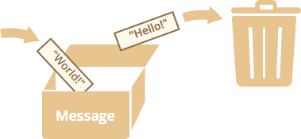

# Variables

Depending on our aims, the script needs to work with the information.

If it's an online-shop -- that's going to be the goods and the card. If it's a chat -- visitors, messages and so on.

Variables are used to store the information.

[cut]

## A variable

A [variable]("https://en.wikipedia.org/wiki/Variable_(computer_science)") is a "named storage" for the information.

To declare a variable in JavaScript, we need to use the `let` keyword.

The statement below creates (in other words: *declares* or *defines*) the variable with the name "message":

```js
let message;
```

Now we can assign some data into it:

```js
let message;

*!*
message = 'Hello'; // store the string
*/!*
```

The string is now saved into the associated memory area. We can access it using the variable name:

```js
//+ run
let message;
message = 'Hello!';

alert( message ); // shows the variable content
```

To be concise we can merge the variable declaration and assignment into a single line:

```js
let message = 'Hello!';
```

We can also declare multiple variables in one line:

```js
//+ no-beautify
let user = 'John', age = 25, message = 'Hello';
```

That might seem shorter, but it's recommended, for the sake of beter readability, to use a single line per variable.

This code is a bit longer, but easier to read:

```js
//+ no-beautify
let user = 'John';
let age = 25;
let message = 'Hello';
```

[smart header="`var` instead of `let`"]
In older scripts you may also find another keyword: `var` instead of `let`:

```js
*!*var*/!* message = 'Hello';
```

The `var` keyword is *almost* the same as `let`. It also declares a variable, but in a slightly different, "old-school" fashion. 

The subtle differences does not matter yet, but we'll cover them in detail later when going deeper into the language.
[/smart]

## Real-life analogy

We can easily grasp the concept of a "variable" if we imagine it as a "box" for the data, with the unique-named sticker on it.

For instance, the variable `message` is a box with the value `"Hello!" labelled `"message"`:

 

We can put any value into the box. And later -- we can change it.

The value can be changed as many times as we need:

```js
//+ run
let message;

message = 'Hello!';

message = 'World!'; // value changed

alert( message );
```

When the value is changed, the old data is removed from the variable:



We can also declare two variables and copy data from one into another.

```js
//+ run
let hello = 'Hello world!';

let message;

*!*
// copy value
message = hello;
*/!*

alert( hello ); // Hello world!
alert( message ); // Hello world!
```

[smart]
It may seem that the ability to change a value is natural, but it's really not so.

There also exist [functional](http://ru.wikipedia.org/wiki/%D0%AF%D0%B7%D1%8B%D0%BA_%D1%84%D1%83%D0%BD%D0%BA%D1%86%D0%B8%D0%BE%D0%BD%D0%B0%D0%BB%D1%8C%D0%BD%D0%BE%D0%B3%D0%BE_%D0%BF%D1%80%D0%BE%D0%B3%D1%80%D0%B0%D0%BC%D0%BC%D0%B8%D1%80%D0%BE%D0%B2%D0%B0%D0%BD%D0%B8%D1%8F) programming languages that forbid to change a variable once it's assigned. For example, [Scala](http://www.scala-lang.org/) and [Erlang](http://www.erlang.org/).

In such languages, once the value is in the box -- it's there forever. If we need to store something else -- please create a new box (declare a new variable), can't reuse the old one.

Though it may seem a little bit odd at the first sight, these languages are quite capable of serious development. More than that, there are areas like parallel computations where this limitation infers certain benefits. Studying of such a language (even if not planning to use soon) is recommended to broaden the mind.
[/smart]

## Variable naming [#variable-naming]

There are two limitations on the variable name in JavaScript:

<ol>
<li>The name must contain only letters, digits, symbols `$` and `_`.</li>
<li>The first character must not be a digit.</li>
</ol>

Valid name examples:

```js
let userName;
let test123;
```

When the name contains multiple words, [camelCase](https://en.wikipedia.org/wiki/CamelCase) is commonly used. That is: words go one after another with the capital letter at start: `myVeryLongName`.

What's interesting -- the dollar sign `'$'` and the underscore `'_'` are considered ordinary symbols, just like letters.

These names are valid:

```js
//+ run untrusted
let $ = 1; // declared a variable with the name "$"
let _ = 2; // and now the variable with the name "_"

alert( $ + _ ); // 3
```

Examples of incorrect variable names:

```js
//+ no-beautify
let 1a; // cannot start with a digit

let my-name; // a hyphen '-' is not allowed in the name
```

[smart header="Case matters"]
Variables named `apple` and `AppLE` -- are two different variables.
[/smart]

[smart header="Non-english letters are allowed, but not recommended."]

It is possible to use cyrillic letters or even hieroglyphs, like this:

```js
//+ run
let имя = 123;
let 我 = 456;
```

Technically, there is no error here, but there is a tradition to use only latin alphabet in variable names.
[/smart]

[warn header="Reserved names"]
There is a list of reserved words, which cannot be used as variable names, because they are used by the language itself.

For example: `var, class, return, function` and alike are reserved.

The code below will give a syntax error:

```js
//+ run no-beautify
let return = 5; // error!
```
[/warn]


## Non-Strict mode assignment

Without strict mode, it is possible to create a variable without a `let`, by a mere assignment of the value:

```js
//+ run no-strict
num = 5; // the variable "num" is created if didn't exist

alert(num);
```

...But that is allowed for compatibility with the old scripts. It is a frowned-upon feature that is disabled in the strict mode.

The code below will give an error:

```js
//+ run untrusted
"use strict";

*!*
num = 5; // error: num is not defined
*/!*
```

[smart header="Ensure that 'use strict' is at the top"]
Please make sure that `"use strict"` is on the top of the script, otherwise the strict mode may not be enabled.

There is no strict mode here:

```js
//+ run untrusted no-strict
alert("some code");
// …

"use strict"; // ignored, because not on top

*!*
num = 5; // No error! strict mode is not activated
*/!*
```
[/smart]

## Chrome (V8) needs "use strict" for "let"

In Chrome browser and Node.JS, both powered by V8 engine, `"use strict"` is required if we want to use `let` and many other modern features of the language.

Here, on-site, most examples are evaluated with implicit (omitted in text, but auto-added before execution) `"use strict"`.

But when you write JS, make sure that you do not forget `"use strict". Otherwise using `let` will give you an error in console.

## Constants

Variables with a fixed value are called "constant variables" or just *constants*.

To declare a constant variable, one can use `const`:

```js
//+ run
const myBirthday = '18.04.1982';

myBirthday = '01.01.2001'; // error!
```

A constant variable never changes, so the further code can rely on that to calculate dependant values (like the age or the sign of the zodiac). It can be sure that the calculations are always valid.

[smart header="CONSTANT_NAMING"]
There is a widespread practice to use constants as aliases for difficult-to-remember values. Such constants are named using capitals and underscores.

Like this:

```js
//+ run
const COLOR_RED = "#F00";
const COLOR_GREEN = "#0F0";
const COLOR_BLUE = "#00F";
const COLOR_ORANGE = "#FF7F00";

let color = COLOR_ORANGE;
alert( color ); // #FF7F00
```

`COLOR_ORANGE` is easy to understand and remember. It is much easier to grasp what `color = COLOR_ORANGE` means than `color = "#FF7F00"`.

Besides, it is much easier to make a typo in `"#FF7F00"` than in `COLOR_ORANGE`.

So, sometimes constants are used as aliases to complex values, to evade errors and make the code more readable.
[/smart]

## Summary

We can declare variables to store data. That can be done using `var` or `let` or `const`.

<ul>
<li>`let` -- is a normal modern variable declaration. The code must be in strict mode to use in Chrome (V8).</li>
<li>`var` -- is an old-school compatibility variable declaration. We'll study the subtle  differences from `let` later, after we get familiar with the basics.</li>
<li>`const` -- is like `let`, but the variable can't be changed.</li>
</ul>

Please name the variables sensibly.

Variable naming is one of the most important and complex skills in programming. Just looking at variable names can obviously show which code is written by a beginner and which by an experienced guru.

In the real project, most of time is spent not on writing of the completely new code, but rather on modifying and improving the existing one.

It might be not so obvious to the one who didn't write big things. Or to a freelances who writes a "read-only code" (write 5 lines, give to the customer, forget). But for the serious and especially team projects, that's always true.

It is much easier to find the information if it's well-labelled. Or, in other words, when the variables is named right. 

Please spend some time thinking about the right name for a variable before declaring it. That will repay you a lot.

[warn header="The name must always correspond to the data"]
There exist lazy programmers who instead of declaring a new variable, tend to reuse the existing one, write other data into it.

As the result, the variable is like a box where people throw different things without changing the sticker. What is inside it now? Who knows... We need to come closer and check.

Such a programmer saves a little bit on variable declaration, but looses ten times more on debugging the code.

An extra variable is good, not evil.
[/warn]
