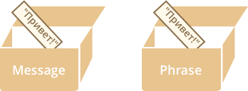
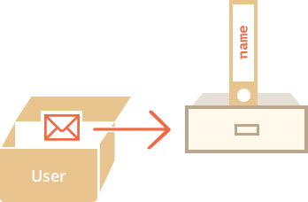

# Objects as dictionaries

Objects in JavaScript combine two functionalities.

1. First -- they are "associative arrays": a structure for storing keyed data. 
2. Second -- they provide features for object-oriented programming. 

Here we concentrate on the first part: using objects as a data store. That's the required base for studying the second part.

An [associative array](https://en.wikipedia.org/wiki/Associative_array), also called "a hash" or "a dictionary" -- is a data structure for storing arbitrary data in the key-value format.

[cut]

We can imagine it as a cabinet with signed files. Every piece of data is stored in it's file. It's easy to find a file by it's name or add/remove a file.


## Creation

An empty object ("empty cabinet") can be created using one of two syntaxes:

```js
let obj = new Object(); // works same as below
let obj = {}; 
```

Usually, the second syntax is prefered, because it's shorter and allows to define properties immediately:

```js 
let user = {
  name: "John",
  age: 30,
  "day of birth": "1 Jan 1990"
}; 
```


A property name can be only a string. No number/boolean or any other type can serve that purpose.

Note that complex property names need to be quoted, to evade syntax errors. But normally that's not required.


## Add/remove properties

Now we can read/write new properties using the dot notation and remove using the `delete` operator:

```js 
user.surname = "Smith";

delete user.age;
```

## Square brackets

To access a property, there are two syntaxes:

- The dot notation: `user.name`
- Square brackets: `user["name"]`

Square brackets are more powerful, because they allow to specify arbitrary string as a property name. In contrast, the dot notation requires the nae to be a valid variable identifier, that is: no spaces, special chracters etc.

But more than that, square brackets is the only choice when the name of the property is in a variable.

For instance:

```js run
let user = {
  name: "John", 
  age: 30
};

let key = prompt("What do you want to know about the user?", "name");

alert( user[key] ); // John (if enter "name"), 30 for the "age"
```

The square brackets literally say: "take the property name from the variable".

Also it is possible to use square brackets in object definition when the property name is stored in a variable or computed:

```js run
let fruit = prompt("Which fruit to buy?", "apple");

let bag = {
  [fruit]: 5,
};

alert( bag.apple ); // 5 if fruit="apple"
```

Here, the object `bag` is created with a property with the name from `fruit` variable and the value `5`.

Essentially, that works the same as:
```js
let bag = {};
bag[fruit] = 5; 
```

...But one statement instead of two.

We could have used a more complex expression inside square brackets or a quoted string. Anything that would return a property name:

```js
let bag = {
  [ fruit.toLowerCase() ]: 5 // if fruit is "APPLE" then bag.apple = 5
};
```

## Check for existance

A notable objects feature is that it's possible to access any property. There will be no error if the property doesn't exist! Accessing a non-existing property just returns `undefined`. It's actually a common way to test whether the property exists -- to get it and compare vs undefined:

```js run
let user = {};

alert( user.noSuchProperty === undefined ); // true means "no such property"
```

There also exists a special operator `"in"` to check for the existance of a property. 

The syntax is: 
```js
"key" in object
```

For instance:

```js run
let user = { name: "John", age: 30 };

alert( "age" in user ); // true, user.age exists
alert( "blabla" in user ); // false, user.blabla doesn't exist
```

Please note that at the left side of `in` there must be a *string*. The property name must quoted, like `"age"`. 

Without quotes, that would mean a variable containing the actual name to be tested. For instance:

```js run
let user = { age: 30 };

let key = "age";
alert( key in user ); // true, takes the name "age" from the variable and tests it
```

The `in` operator works in the certain case when the previous method doesn't. That is: when an object property stores `undefined`. 


```js run
let obj = { test: undefined };

alert( obj.test ); // undefined, no such property?

alert( "test" in obj ); // true, the property does exist!
alert( "no-such-property" in obj ); // false, no such property (just for the contrast)
```

In the code above, the property `obj.test` stores `undefined`, so the first check fails. But the `in` operator puts things right.

Situations like this happen very rarely, because `undefined` is usually not assigned. We mostly use `null` for unknown values. So the `in` operator is an exotic guest in the code.


## The "for..in" loop [#for..in]

To process every object property, there's a special loop: `for..in`.

This syntax construct is a little bit different from the `for(;;)` that we've covered before:

```js
for (key in obj) {
  /* ... do something with obj[key] ... */
}
```

The loop iterates over properties of `obj`. For each property it's name is writen in the `key` variable and the loop body is called.

````smart header="Inline variable declaration: `for (let key in obj)`"
A variable for property names can be declared right in the loop:

```js
for (*!*let key*/!* in menu) {
  // ...
}
```

The variable `key` will be only visible inside the loop body. Also we could use another variable name, like: `for(let prop in menu)`.
````

An example of the iteration:

```js run
let menu = {
  width: 300,
  height: 200,
  title: "Menu"
};

for (let key in menu) {
  // the code will be called for each menu property
  // ...and show its name and value

*!*
  alert( `Key:${key}, value:${menu[key]}` );
*/!*
}
```

Note that we're using the square brackets: `menu[key]`. As we've seen before, if the property name is stored in a variable, then we must use square brackets, not the dot notation.

### Counting properties

How to see how many properties are stored in the object? There's no method for that.

Although, we can count:

```js run
let menu = {
  width: 300,
  height: 200,
  title: "Menu"
};

*!*
let counter = 0;

for (let key in menu) {
  counter++;
}
*/!*

alert( `Total ${counter} properties` ); // Total 3 properties
```

In the next chapter we'll study arrays and see that there's a shorter way: `Object.keys(menu).length`.

### Are objects ordered?

As an example, let's consider an object with the phone codes:

```js run
let codes = {
  "49": "Germany",
  "41": "Switzerland",
  "44": "Great Britain",
  // ..,
  "1": "USA"
};

for(let code in codes) alert(code); // 1, 41, 44, 49
```

The object is used to generate HTML `<select>` list. If we're making a site mainly for German audience then we probably want `49` to be the first.

But if we try to loop over the object, we see a totally different picture: USA (1) goes first, then Switzerland (41) and so on.

That's because according to the language stantard objects have no order. The loop is officially allowed to list properties randomly.

But in practice, there's a de-facto agreement among JavaScript engines.

- The numeric properties are sorted.
- Non-numeric properties are ordered as they appear in the object.

That agreement is not enforced by a standard, but stands strong, because a lot of JavaScript code is already based on it. 

```smart header="Older JS Engines order everything"
Old JavaScript engines, like IE9-, keep all properties sorted. But this behavior is a relict nowadays.
```

Now it's easy to see that the properties were iterated in the ascending order, because they are numeric... Of course, object property names are strings, but the Javascript engine detects that it's a number and applies internal optimizations to it, including sorting. That's why we see `1, 41, 44, 49`.

On the other hand, if the keys are non-numeric, then they are listed as they appear, for instance:

```js run
let user = {
  name: "John",
  surname: "Smith"
};
user.age = 25; // add one more

*!*
// as they appear in the object
*/!*
for (let prop in user) {
  alert( prop ); // name, surname, age
}
```

So, to fix the issue with the phone codes, we can "cheat" by making the codes non-numeric. Adding a plus `"+"` sign before each code is enough.

Like this:

```js run
let codes = {
  "+49": "Germany",
  "+41": "Switzerland",
  "+44": "Great Britain",
  // ..,
  "+1": "USA"
};

for(let code in codes) {
  // explicitly convert each code to a number if required
  alert( +code ); // 49, 41, 44, 1
}
```

Now it works as intended. 


## Copying by reference

One of fundamental differences of objects vs primitives is that they are stored and copied "by reference".

Primitive values: strings, numbers, booleans -- are assigned/copied "as a whole value".

For instance:

```js
let message = "hello";
let phrase = message;
```

As a result we have two independant variables, each one is storing the string `"hello"`.



Objects are not like that.

**A variable stores not the object itself, but it's "address in memory", in other words "a reference" to it.**

Here's the picture for the object:

```js
let user = {
  name: "John"
};
```



Note that the object itself is stored somewhere in memory. The variable `user` has a "reference" to it.

**When an object variable is copied -- the reference is copied, the object is still single.**

We can easily grasp it if imagine an object as a cabinet, and a variable is a key to it. We can copy that key to another variable, the cabinet is still single.

For instance:

```js no-beautify
let user = { name: "John" }; 

let admin = user; // copy the reference
```

Now we have two variables, each one with the reference to the same object:


Compare it with the primitives' picture. There's only one object, it's not copied. The reference is. 

Just as with copied keys, we can use any variable to open the cabinet and modify its contents:

```js run
let user = { name: 'John' };

let admin = user;

*!*admin.name*/!* = 'Pete'; // changed by the "admin" reference

alert(*!*user.name*/!*); // 'Pete', changes are seen from the "user" reference
```

Quite obvious, if we used one of the keys (`admin`) and changed something inside the cabinet, then if we use another key later (`user`), we find things modified.

### Cloning objects

What if we need to duplicate an object? Create an independant copy, a clone?

That's also doable, but a little bit more difficult, because there's no such method in Javascript. Frankly, that's very rarely needed. 

But if we really want that, then we need to create a new object and replicate the structure of the existing one by iterating over its properties and copying them on the primitive level.

Like this:

```js run
let user = {
  name: "John",
  age: 30
};

*!*
let clone = {}; // the new empty object

// let's copy all user properties into it
for (let key in user) {
  clone[key] = user[key];
}
*/!*

// now clone is a fully independant clone
clone.name = "Pete"; // changed the data in it

alert( user.name ); // still John
```

Also we can use the method [Object.assign](mdn:Object/assign) for that:

```js
Object.assign(dest[, src1, src2, src3...])
```

It assumes that all arguments are objects. It copies the properties of all arguments starting from the 2nd (`src1`, `src2` etc) into the `dest`. Then it returns `dest`.

For instance:
```js 
let user = { name: "John" };

let permissions1 = { canView: true };
let permissions2 = { canEdit: true };

Object.assign(user, permissions1, permissions2);

// now user = { name: "John", canView: true, canEdit: true }
```

Here we can use it instead of the loop for copying:

```js 
let user = {
  name: "John",
  age: 30
};

*!*
let clone = Object.assign({}, user); 
*/!*
```

It copies all properties of `user` into the empty object and returns it. Actually, the same as the loop, but shorter.

Up to now we assumed that all properties of `user` are primitive. But actually properties can be references to other objects. What to do with them?

Like this:
```js run
let user = {
  name: "John",
  sizes: {
    height: 182,
    width: 50
  }
};

alert( user.sizes.height ); // 182
```

Now it's not enough to copy `clone.sizes = user.sizes`, because the `user.sizes` will be copied by reference. So `clone` and `user` will share the same sizes.

To fix that, we should examine the value of `user[key]` in the cloning loop and if it's an object, then replicate it's structure as well. That is called a "deep cloning". 

There's a standard algorithm for deep cloning that handles this case and more complex cases, called the [Structured cloning algorithm](w3c.github.io/html/infrastructure.html#internal-structured-cloning-algorithm). We can use a ready implementation from the Javascript library [lodash](https://lodash.com). The method is [_.cloneDeep(obj)](https://lodash.com/docs#cloneDeep).

## Summary

Objects are associative arrays with several special features.

- Property names are always strings.
- Values can be of any type

Property access:

- Read/write uses the dot notation: `obj.property` or square brackets `obj["property"]/obj[varWithKey]`.
- The deletion is made via the `delete` operator.
- Existance check is made by the comparison vs `undefined` or via the `in` operator.
- Loop over all properties with the `for..in` loop.

Numeric properties are sorted, otherwise they are iterated in the declaration order. To keep the order for numeric properties, we can prepend them with `+` to make them seem non-numeric.

Copying:

- Objects are assigned and copied by reference. 

