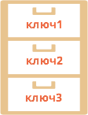
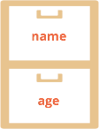

# Объекты как ассоциативные массивы

Объекты в JavaScript сочетают в себе два важных функционала.

Первый -- это  ассоциативный массив: структура, пригодная для хранения любых данных. В этой главе мы рассмотрим использование объектов именно как массивов. 

Второй -- языковые возможности для объектно-ориентированного программирования. Эти возможности мы изучим в последующих разделах учебника.

[cut]
## Ассоциативные массивы

[Ассоциативный массив](http://ru.wikipedia.org/wiki/%D0%90%D1%81%D1%81%D0%BE%D1%86%D0%B8%D0%B0%D1%82%D0%B8%D0%B2%D0%BD%D1%8B%D0%B9_%D0%BC%D0%B0%D1%81%D1%81%D0%B8%D0%B2) -- структура данных, в которой можно хранить любые данные в формате ключ-значение. 

Её можно легко представить как шкаф с подписанными ящиками. Все данные хранятся в ящичках. По имени можно легко найти ящик и взять то значение, которое в нём лежит.



В отличие от реальных шкафов, в ассоциативный массив можно в любой момент добавить новые именованные "ящики" или удалить существующие. Далее мы увидим примеры, как это делается.

Кстати, в других языках программирования такую структуру данных также называют *"словарь"* и *"хэш"*.  

## Создание объектов

Пустой объект ("пустой шкаф") может быть создан одним из двух синтаксисов:

```js
1. o = new Object();
2. o = {}; // пустые фигурные скобки
```

Обычно все пользуются синтаксисом `(2)`, т.к. он короче.

## Операции с объектом

Объект может содержать в себе любые значения, которые называются *свойствами объекта*.  Доступ к свойствам осуществляется по *имени свойства* (иногда говорят *"по ключу"*).

Например, создадим объект `person` для хранения информации о человеке:

```js
var person = {}; // пока пустой
```


Основные операции с объектами -- это создание, получение и удаление свойств.

Для обращения к свойствам используется запись "через точку", вида `объект.свойство`, например:

```js
// при присвоении свойства в объекте автоматически создаётся "ящик" 
// с именем "name" и в него записывается содержимое 'Вася'
person.name = 'Вася';

person.age = 25; // запишем ещё одно свойство: с именем 'age' и значением 25
```



Значения хранятся "внутри" ящиков. Обратим внимание -- любые значения, любых типов: число, строка -- не важно.

Чтобы прочитать их -- также обратимся через точку:
```js
alert( person.name + ': ' + person.age ); // "Вася: 25"
```

Удаление осуществляется оператором `delete`:

```js
delete person.age;
```

Осталось только свойство `name`:


Следующая операция:
<ol start="4">
<li>**Проверка существования свойства с определенным ключом.**</li>
</ol>

Для проверки существования свойства в объекте есть оператор `in`. 

Его синтаксис: `"prop" in obj`, причем имя свойства -- в виде строки, например:

```js
if ("name" in person) {
  alert( "Свойство name существует!" );
}
```

Впрочем, чаще используется другой способ -- сравнение значения с `undefined`.

Дело в том, что **в JavaScript можно обратиться к любому свойству объекта, даже если его нет**. Ошибки не будет.

Но если свойство не существует, то вернется специальное значение `undefined`:

```js
//+ run
var person = {};

alert( person.lalala ); // undefined, нет свойства с ключом lalala
```

Таким образом **мы можем легко проверить существование свойства -- получив его и сравнив с `undefined`**:

```js
//+ run
var person = {
  name: "Василий"
};

alert( person.lalala === undefined ); // true, свойства нет
alert( person.name === undefined ); // false, свойство есть.
```

[smart header="Разница между проверками `in` и `=== undefined`"]

Есть два средства для проверки наличия свойства в объекте: первое -- оператор `in`, второе -- получить его и сравнить его с `undefined`.

Они почти идентичны, но есть одна небольшая разница.

Дело в том, что технически возможно, что *свойство есть и равно `undefined`*:

```js
//+ untrusted refresh run
var obj = {};
obj.test = undefined; // добавили свойство со значением undefined

*!*
// проверим наличие свойств test и заведомо отсутствующего blabla
alert( obj.test === undefined ); // true
alert( obj.blabla === undefined ); // true
*/!*
```

...При этом, как видно из кода, при простом сравнении наличие такого свойства будет неотличимо от его отсутствия.

Но оператор `in` гарантирует правильный результат:

```js
//+ untrusted refresh run
var obj = {};
obj.test = undefined;

*!*
alert( "test" in obj ); // true 
alert( "blabla" in obj ); // false
*/!*
```

Как правило, в коде мы не будем присваивать `undefined`, чтобы корректно работали обе проверки. А в качестве значения, обозначающего неизвестность и неопределенность, будем использовать `null`.
[/smart]
 
### Доступ через квадратные скобки

Существует альтернативный синтаксис работы со свойствами, использующий квадратные скобки `объект['свойство']`:

```js
//+ run
var person = {};

person['name'] = 'Вася'; // то же что и person.name = 'Вася'
```

Записи `person['name']` и `person.name` идентичны, но квадратные скобки позволяют использовать в качестве имени свойства любую строку:

```js
//+ run
var person = {};

person['любимый стиль музыки'] = 'Джаз'; // то же что и person.name = 'Вася'
```

Такое присвоение было бы невозможно "через точку", так интерпретатор после первого пробела подумает, что свойство закончилось, и далее выдаст ошибку:

```js
//+ run
person.любимый стиль музыки = 'Джаз'; // ??? ошибка
```

В обоих случаях, **имя свойства обязано быть строкой**. Если использовано значение другого типа -- JavaScript приведет его к строке автоматически.

### Доступ к свойству через переменную

Квадратные скобки также позволяют обратиться к свойству, имя которого хранится в переменной:

```js
//+ run
var person = {
  age: 25
};
var key = 'age';

alert( person[key] ); // выведет person['age']
```

Вообще, если имя свойства хранится в переменной (`var key = "age"`), то единственный способ к нему обратиться -- это квадратные скобки `person[key]`.

Доступ через точку используется, если мы на этапе написания программы уже знаем название свойства. А если оно будет определено по ходу выполнения, например, введено посетителем и записано в переменную, то единственный выбор -- квадратные скобки.

### Объявление со свойствами  

Объект можно заполнить значениями при создании, указав их в фигурных скобках: `{ ключ1: значение1, ключ2: значение2, ... }`.

Такой синтаксис называется *литеральным* (англ. literal).

Следующие два фрагмента кода создают одинаковый объект:

```js
var menuSetup = {
  width: 300,
  height: 200,
  title: "Menu"
};

// то же самое, что:

var menuSetup = {};
menuSetup.width = 300;
menuSetup.height = 200;
menuSetup.title = 'Menu';
```

Названия свойств можно перечислять как в кавычках, так и без, если они удовлетворяют ограничениям для имён переменных.

Например:

```js
var menuSetup = {
  width: 300,
  'height': 200,
  "мама мыла раму": true
};
```

В качестве значения можно тут же указать и другой объект:

```js
var user = {
  name: "Таня",
  age: 25,
*!*
  size: {
    top: 90,
    middle: 60,
    bottom: 90
  }
*/!*
}

alert(user.name) // "Таня"

alert(user.size.top) // 90
```

Здесь значением свойства `size` является объект `{top: 90, middle: 60, bottom: 90 }`. 
## Компактное представление объектов

[warn header="Hardcore coders only"]
Эта секция относится ко внутреннему устройству структуры данных. Она не обязательна к прочтению.
[/warn]

Браузер использует специальное "компактное" представление объектов, чтобы сэкономить память в том случае, когда однотипных объектов много.

Например, посмотрим на такой объект:

```js
var user = {
  name: "Vasya",
  age: 25
};
```

Здесь содержится информация о свойстве `name` и его строковом значении, а также о свойстве `age` и его численном значении. Представим, что таких объектов много. 

Получится, что информация об именах свойств `name` и `age` дублируется в каждом объекте. Чтобы этого избежать, браузер применяет оптимизацию.

**При создании множества объектов одного и того же вида (с одинаковыми полями) интерпретатор выносит описание полей в отдельную структуру. А сам объект остаётся в виде непрерывной области памяти с данными.**

Например, есть много объектов с полями `name` и `age`:

```js
//+ no-beautify
{name: "Вася", age: 25}
{name: "Петя", age: 22}
{name: "Маша", age: 19}
...
```

Для их эффективного хранения будет создана структура, которая описывает данный вид объектов. Выглядеть она будет примерно так: `<string name, number age>`. А сами объекты будут представлены в памяти только данными:

```js
//+ no-beautify
<структура: string name, number age>
Вася 25
Петя 22
Маша 19
```

При добавлении нового объекта такой структуры достаточно хранить значения полей, но не их имена. Экономия памяти -- налицо.

А что происходит, если к объекту добавляется новое свойство? Например, к одному из них добавили свойство `isAdmin`:

```js
user.isAdmin = true;
```

В этом случае браузер смотрит, есть ли уже структура, под которую подходит такой объект. Если нет -- она создаётся и объект привязывается к ней. 
 
**Эта оптимизация является примером того, что далеко не всё то, что мы пишем, один-в-один переносится в память.**

Современные интерпретаторы очень стараются оптимизировать как код, так и структуры данных. Детали применения и реализации этого способа хранения варьируются от браузера к браузеру. О том, как это сделано в Chrome можно узнать, например, из презентации [Know Your Engines](http://www.slideshare.net/newmovie/know-yourengines-velocity2011). Она была некоторое время назад, но с тех пор мало что изменилось.


## Итого

Объекты -- это ассоциативные массивы с дополнительными возможностями:

<ul>
<li>Доступ к элементам осуществляется:
<ul>
<li>Напрямую по ключу `obj.prop = 5`</li>
<li>Через переменную, в которой хранится ключ:

```js
var key = "prop";
obj[key] = 5
```

</li>
</ul>
<li>Удаление ключей: `delete obj.name`.</li>
<li>Существование свойства может проверять оператор `in`: `if ("prop" in obj)`, как правило, работает и просто сравнение `if (obj.prop !== undefined)`.</li>
</ul>


