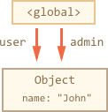
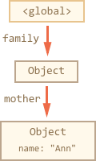

# Garbage collection

Memory management in Javascript is performed automatically and invisibly to us. We create primitives, objects, functions... All that takes memory.

What happens when something is not needed any more? How Javascript engine discovers that and cleans up?

[cut]

## Reachability

The main concept of memory management in Javascript is *reachability*. 

Simply put, "reachable" values are those that are accessible now or in the future. They are guaranteed to be stored in memory.

1. There's a base set of reachable values. For instance:

    - Local variables and parameters of the current function.
    - Variables and parameters for other functions in the current chain of nested calls.
    - Global variables.

    These variables are called *roots*.

2. Any other value is retained in memory only while it's reachable from a root by a reference of by a chain of references.

There's a background process that runs by the engine itself called [garbage collector](https://en.wikipedia.org/wiki/Garbage_collection_(computer_science)). It monitors all objects and removes those that became unreachable.

Note that only objects need reachability tracking, not primitives. For primitives things are very simple. They are copied as a whole on assignment, a single primitive can only be stored in one place, there can be no references for them. So if there was a string in a variable, and it was replaced with another string, then the old one can safely be junked.

Objects from the other hand can be referenced from multiple variables. If two variables store a reference to the same object, then even if one of them is overwritten, the object is still accessible through the second one. That's why a special "garbage collector" is needed that watches the references.

The basic garbage collection algorithm is called "mark-and-sweep".

Regularly the following "garbage collection" steps are performed:

- The garbage collector takes roots and follows all references from them.
- It remembers all objects it meets and follows their references.
- ...And so on until there are unvisited references.
- All objects except those are removed.

Let's see examples to get the better picture.

## A simple example

Here's the simplest example:

```js
// user has a reference to the object
let user = {
  name: "John"
};
```


Here an on further pictures, arrows depict references. For instance, the global variable `"user"` references John (the object `{name: "John"}`). The `"name"` property is not a reference, it stores a primitive, so it's painted inside the object.

If the `user` is overwritten, the reference is lost:

```js
user = null;
```


Now John becomes unreachable. There's no way to access it, no references to it. Garbage collector will junk the data and free the memory.

## Two references

Now let's imagine we copied the reference from `user` to `admin`:

```js
// user has a reference to the object
let user = {
  name: "John"
};

*!*
let admin = user;
*/!*
```



Now if we do the same:
```js 
user = null;
```

...Then the object is still reachable via `admin` global variable, so it's in memory. If we overwrite `admin` too, then it can be removed.


## Interlinked objects

Now a more complex example. The family:

```js
function marry(man, woman) {
  woman.husband = man;
  man.wife = woman;

  return {
    father: man,
    mother: woman
  }
}

let family = marry({
  name: "John"
}, {
  name: "Ann"
});
```

Function `marry` "marries" two objects by giving them references to each other and returns a new object that contains them both.

The resulting memory structure:


To activate garbage collection, let's remove two references:

```js
delete family.father;
delete family.mother.husband;
```

Note that if the deletion of any single one of them would not lead to anything, because all objects would still be reachable.

But if we delete both, then we can see that John has no incoming references any more:


**Outgoing references do not matter. Only incoming ones can make the object reachable.**

John, the former `family.father` is now unreachable and will be removed from the memory with all its data that also became unaccessible.

After garbage collection:



## Unreachable island

It is possible that the whole island of interlinked objects becomes unreachable and is removed from the memory.

The source object is the same as above. Then:

```js
family = null;
```

The result:


This example demonstrates how important the concept of reachability is.

It is clearly seen that John and Ann are still linked, both have incoming references. But it's not enough. 

The former `"family"` object has been unlinked from the root, there's no reference to it any more, so the whole island became unreachable and will be removed.

## Real-life algorithms

```smart header="Advanced knowledge"
The subsection contains advanced information about how things work internally. This knowledge is not required to continue learning Javascript.
```

The simple garbage collection algorithm that was described earlier in this chapter is not the best.

One of the main problems is that the collection process must be atomic: no new links should appear and no existing ones should be modified while it analyzes all references of existing objects and figures out which are unreachable. 

Essentially that means that the script execution must be paused to ensure that. Pauses may be small for simple scripts, but become noticeable (like 1000 ms or more) for big ones with many of objects. Such "hiccups" can be unpleasant and even disruptive for program systems that operate on real-time financial or medical data.

So there are many optimizations to it.

In this section we use 

### Generational collection

Most objects die very fast. For instance, local variables of functions usually don't exist for long. So a special memory area is created for them. 

  This memory area is garbage-collected in a special way. Instead of 


So many optimizations and variations of the algorithm exist.

One of most widely used optimizations in JS engines is called "generational" garbage collection.

Objects are split into two sets: "old ones" and "new ones". Each set has its own memory area.

A new object is created in the "new" memory area and, if survived long enough, migrates to the "old" one. The "new" area is usually small and is garbage collected often. The "old" area is big and rarely cleaned up.

In practice that helps a lot, because many small objects are created and destroyed almost immediately. For instance when they are local variables of a function. And few objects survive for a long time, like the object with the current visitor data.


## Summary

- Objects are retained in memory while they are reachable.
- Being referenced is not the same as being reachable (from a root): a pack of interlinked objects can become unreachable as a whole.
- Modern engines implement advanced algorithms of garbage collector that try to evade stop-the-world problem of the old ones.

If you are familiar with low-level programming, the more detailed information about V8 garbage collector is in the article [A tour of V8: Garbage Collection](http://jayconrod.com/posts/55/a-tour-of-v8-garbage-collection).

