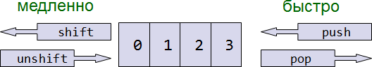
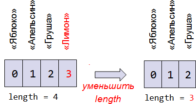

# Массивы c числовыми индексами

*Массив с числовыми индексами* -- это коллекция данных, которая хранит сколько угодно значений, причем у каждого значения -- свой уникальный номер.

Если переменная -- это *коробка для данных*, то массив -- это *шкаф с нумерованными ячейками*, в каждой из которых могут быть свои данные.
[cut]
Например, при создании электронного магазина нужно хранить список товаров -- для таких задач и придуман массив.

## Объявление

Синтаксис для создания нового массива -- квадратные скобки со списком элементов внутри. 

Пустой массив:

```js
var arr = [];
```

Массив `fruits` с тремя элементами:

```js
var fruits = ["Яблоко", "Апельсин", "Слива"];
```

**Элементы нумеруются, начиная с нуля.** Чтобы получить нужный элемент из массива -- указывается его номер в квадратных скобках:

```js
//+ run
var fruits = ["Яблоко", "Апельсин", "Слива"];

alert(fruits[0]); // Яблоко
alert(fruits[1]); // Апельсин
alert(fruits[2]); // Слива
```

Элемент можно всегда заменить:

```js
fruits[2] = 'Груша'; // теперь ["Яблоко", "Апельсин", "Груша"]
```

... Или добавить:

```js
fruits[3] = 'Лимон'; // теперь ["Яблоко", "Апельсин", "Груша", "Лимон"]
```

Общее число элементов, хранимых в массиве, содержится в его свойстве `length`:

```js
//+ run
var fruits = ["Яблоко", "Апельсин", "Груша"]; 

alert(fruits.length); // 3
```

**Через `alert` можно вывести и массив целиком.** При этом его элементы будут перечислены через запятую:

```js
//+ run
var fruits = ["Яблоко", "Апельсин", "Груша"]; 

alert(fruits); // Яблоко,Апельсин,Груша
```

**В массиве может храниться любое число элементов любого типа.** В том числе, строки, числа, объекты и т.п.:

```js
//+ run
// микс значений
var arr = [ 1, 'Имя', { name: 'Петя' }, true ];

// получить объект из массива и тут же -- его свойство
alert( arr[2].name ); // Петя
```

## Методы pop/push, shift/unshift  

Одно из применений массива -- это [очередь](http://ru.wikipedia.org/wiki/%D0%9E%D1%87%D0%B5%D1%80%D0%B5%D0%B4%D1%8C_%28%D0%BF%D1%80%D0%BE%D0%B3%D1%80%D0%B0%D0%BC%D0%BC%D0%B8%D1%80%D0%BE%D0%B2%D0%B0%D0%BD%D0%B8%D0%B5%29). В классическом программировании так называют упорядоченную коллекцию элементов, такую что элементы добавляются в конец, а обрабатываются -- с начала. 

В реальной жизни эта структура данных встречается очень часто. Например, очередь сообщений, которые надо отослать.

Очень близка к очереди еще одна структура данных: [стек](http://ru.wikipedia.org/wiki/%D0%A1%D1%82%D0%B5%D0%BA). Это такая коллекция элементов, в которой новые элементы добавляются в конец и берутся с конца. 

Например, стеком является колода карт, в которую новые карты кладутся сверху, и берутся -- тоже сверху.

Для того, чтобы реализовывать эти структуры данных, и просто для более удобной работы с началом и концом массива существуют специальные методы.

### Конец массива

<dl>
<dt>`pop`</dt>
<dd>Удаляет *последний* элемент из массива и возвращает его:

```js
//+ run
var fruits = ["Яблоко", "Апельсин", "Груша"];

alert( fruits.pop() ); // удалили "Груша"

alert(fruits); // Яблоко, Апельсин
```

</dd>
<dt>`push`</dt>
<dd>Добавляет элемент *в конец* массива:

```js
//+ run
var fruits = ["Яблоко", "Апельсин"];

fruits.push("Груша");

alert(fruits); // Яблоко, Апельсин, Груша
```

Является полным аналогом `fruits[fruits.length] = ...`.
</dd>
</dl>

### Начало массива

<dl>
<dt>`shift`</dt>
<dd>Удаляет из массива *первый* элемент и возвращает его:

```js
var fruits = ["Яблоко", "Апельсин", "Груша"];

alert( fruits.shift() ); // удалили Яблоко

alert(fruits); // Апельсин, Груша
```

</dd>
<dt>`unshift`</dt>
<dd>Добавляет элемент *в начало* массива:

```js
var fruits = ["Апельсин", "Груша"];

fruits.unshift('Яблоко');

alert(fruits); // Яблоко, Апельсин, Груша
```

</dd>
</dl>



Методы `push` и `unshift` могут добавлять сразу по несколько элементов:

```js
//+ run
var fruits = ["Яблоко"];

fruits.push("Апельсин", "Персик");
fruits.unshift("Ананас", "Лимон");

// результат: ["Ананас", "Лимон", "Яблоко", "Апельсин", "Персик"]
alert(fruits);
```

## Внутреннее устройство массива

Массив -- это объект, где в качестве ключей выбраны цифры, с дополнительными методами и свойством `length`.

Так как это объект, то в функцию он передаётся по ссылке:

```js
//+ run
function eat(arr) {
  arr.pop();
}

var arr = ["нам", "не", "страшен", "серый", "волк"]

alert(arr.length); // 5
eat(arr);
eat(arr);
alert(arr.length); // 3, в функцию массив не скопирован, а передана ссылка
```

**Ещё одно следствие -- можно присваивать в массив любые свойства.**

Например:

```js
var fruits = []; // создать массив

fruits[99999] = 5; // присвоить свойство с любым номером

fruits.age = 25; // назначить свойство со строковым именем
```

.. Но массивы для того и придуманы в JavaScript, чтобы удобно работать именно *с упорядоченными, нумерованными данными*. Для этого в них существуют специальные методы и свойство `length`. 

Как правило, нет причин использовать массив как обычный объект, хотя технически это и возможно.

[warn header="Вывод массива с \"дырами\""]
Если в массиве есть пропущенные индексы, то при выводе в большинстве браузеров появляются "лишние" запятые, например:

```js
//+ run
var a = [];
a[0] = 0;
a[5] = 5;

alert(a); // 0,,,,,5
```

Эти запятые появляются потому, что алгоритм вывода массива идёт от `0` до `arr.length` и выводит всё через запятую. Отсутствие значений даёт несколько запятых подряд.
[/warn]

### Влияние на быстродействие

Методы `push/pop` выполняются быстро, а `shift/unshift` -- медленно.

Чтобы понять, почему работать с концом массива -- быстрее, чем с его началом, разберём происходящее подробнее.

Операция `shift` выполняет два действия:
<ol>
<li>Удалить элемент в начале.</li>
<li>Обновить внутреннее свойство `length`.</li>
</ol>

При этом, так как все элементы находятся в своих ячейках, просто очистить ячейку с номером `0` недостаточно. Нужно еще и переместить все ячейки на `1` вниз (красным на рисунке подсвечены изменения):

```js
*!*fruits.shift();*/!* // убрать 1 элемент с начала
```


Чем больше элементов в массиве, тем дольше их перемещать.

Аналогично работает `unshift`: чтобы добавить элемент в начало массива, нужно сначала перенести все существующие.

У методов `push/pop` таких проблем нет. Для того, чтобы удалить элемент, метод `pop` очищает ячейку и укорачивает `length`.

```js
*!*fruits.pop();*/!*  // убрать 1 элемент с конца
```



Аналогично работает `push`.


## Перебор элементов

Для перебора элементов обычно используется цикл:

```js
//+ run
var arr = ["Яблоко", "Апельсин", "Груша"];

*!*
for (var i=0; i<arr.length; i++) {
  alert( arr[i] );
}
*/!*
```

[warn header="Не используйте `for..in` для массивов"]
Так как массив является объектом, то возможен и вариант `for..in`:

```js
//+ run
var arr = ["Яблоко", "Апельсин", "Груша"];

*!*
for (var key in arr) {
*/!*
  alert( arr[key] ); // Яблоко, Апельсин, Груша
}
```

Недостатки этого способа:

<ul>
<li>Цикл `for..in` выведет *все свойства* объекта, а не только цифровые. 

В браузере, при работе с объектами страницы, встречаются коллекции элементов, которые по виду как массивы, но имеют дополнительные нецифровые свойства, которые будут видны в цикле `for..in`. 

Бывают и библиотеки, которые предоставляют такие коллекции. Например jQuery. С виду -- массив, но есть дополнительные свойства. Для перебора только цифровых свойств нужен цикл `for(var i=0; i<arr.length...)`
</li>
<li>Цикл `for (var i=0; i<arr.length; i++)` в современных браузерах выполняется в 10-100 раз быстрее. Казалось бы, по виду он сложнее, но браузер особым образом оптимизирует такие циклы.</li>
</ul>

**Если кратко: цикл `for(var i=0; i<arr.length...)` надёжнее и быстрее.**
[/warn]


## Особенности работы length

Встроенные методы для работы с массивом автоматически обновляют его длину `length`.

**Длина `length` -- не количество элементов массива, а `последний индекс + 1`**. Так уж оно устроено.

Это легко увидеть на следующем примере:

```js
//+ run
var arr = [];
arr[1000] = true;

alert(arr.length); // *!*1001*/!*
```

Вообще, если у вас элементы массива нумеруются случайно или с большими пропусками, то стоит подумать о том, чтобы использовать обычный объект. 

Массивы предназначены именно для работы с непрерывной упорядоченной коллекцией элементов.

### Используем length для укорачивания массива

Обычно нам не нужно самостоятельно менять `length`... Но есть один фокус, который можно провернуть. 

**При уменьшении `length` массив укорачивается.** Причем этот процесс необратимый, т.е. даже если потом вернуть `length` обратно -- значения не восстановятся:

```js
//+ run
var arr = [1, 2, 3, 4, 5]; 

arr.length = 2; // укоротить до 2 элементов
alert(arr); // [1, 2]

arr.length = 5; // вернуть length обратно, как было
alert(arr[3]); // undefined: значения не вернулись
```

Самый простой способ очистить массив -- это `arr.length=0`.
   
## Создание вызовом new Array [#new-array]
   
### new Array() 
Существует еще один синтаксис для создания массива:

```js
var arr = *!*new Array*/!*("Яблоко", "Груша", "и т.п.");
```

Он редко используется, т.к. квадратные скобки `[]` короче.

Кроме того, у него есть одна особенность. Обычно `new Array(элементы, ...)` создаёт массив из данных элементов, но если у него один аргумент, и это число --то он создает массив *без элементов, но с заданной длиной*.

```js
//+ run
var arr = new Array(2,3); // создает массив [2, 3]

arr = new Array(2); // создаст массив [2] ?

alert(arr[0]); // нет! у нас массив без элементов, длины 2
```

Что же такое этот "массив без элементов, но с длиной"? Как такое возможно?

Оказывается, очень даже возможно и соответствует объекту `{length: 2}`. Получившийся массив ведёт себя так, как будто его элементы равны `undefined`.

Это может быть неожиданным сюрпризом, поэтому обычно используют квадратные скобки.

### Многомерные массивы   

Массивы в JavaScript могут содержать в качестве элементов другие массивы. Это можно использовать для создания многомерных массивов, например матриц:

```js
//+ run
var matrix = [
  [1, 2, 3],
  [4, 5, 6],
  [7, 8, 9]
];

alert(matrix[1][1]); // центральный элемент
```

## Внутреннее представление массивов

[warn header="Hardcore coders only"]
Эта секция относится ко внутреннему устройству структуры данных и требует специальных знаний. Она не обязательна к прочтению.
[/warn]

Числовые массивы, согласно спецификации, являются объектами, в которые добавили ряд свойств, методов и автоматическую длину `length`. Но внутри они, как правило, устроены по-другому.

**Современные интерпретаторы стараются оптимизировать их и хранить в памяти не в виде хэш-таблицы, а в виде непрерывной области памяти, по которой легко пробежаться от начала до конца.** 

Операции с массивами также оптимизируются, особенно если массив хранит только один тип данных, например только числа. Порождаемый набор инструкций для процессора получается очень эффективным.

Чтобы у интерпретатора получались эти оптимизации, программист не должен мешать. 

В частности:
<ul>
<li>Не ставить массиву произвольные свойства, такие как `arr.test = 5`. То есть, работать именно как с массивом, а не как с объектом.</li>
<li>Заполнять массив непрерывно. Как только браузер встречает необычное поведение массива, например устанавливается значение `arr[0]`, а потом сразу `arr[1000]`, то он начинает работать с ним, как с обычным объектом. Как правило, это влечёт преобразование его в хэш-таблицу.</li>
</ul>


Если следовать этим принципам, то массивы будут занимать меньше памяти и быстрее работать.

## Итого

Массивы существуют для работы с упорядоченным набором элементов. 

**Объявление:**

```js
// предпочтительное
var arr = [ элемент1, элемент2... ];

// new Array
var arr = new Array( элемент1, элемент2...);
```

При этом `new Array(число)` создаёт массив заданной длины, *без элементов*. Чтобы избежать ошибок, предпочтителен первый синтаксис.

**Свойство `length`** -- длина массива. Если точнее, то последний индекс массива плюс `1`. Если её уменьшить вручную, то массив укоротится. Если `length` больше реального количества элементов, то отсутствующие элементы равны `undefined`.


Массив можно использовать как очередь или стек.

**Операции с концом массива:**
<ul>
<li>`arr.push(элемент1, элемент2...)` добавляет элементы в конец.</li>
<li>`var elem = arr.pop()` удаляет и возвращает последний элемент.</li>
</ul>

**Операции с началом массива:**
<ul>
<li>`arr.unshift(элемент1, элемент2...)` добавляет элементы в начало.</li>
<li>`var elem = arr.shift()` удаляет и возвращает первый элемент.</li>
</ul>

Эти операции перенумеровывают все элементы, поэтому работают медленно.

В следующей главе мы рассмотрим другие методы для работы с массивами.


