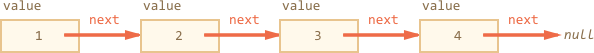

importance: 5

---

# Вывести односвязный список

[Односвязный список](http://ru.wikipedia.org/wiki/Связный_список) -- это структура данных, которая состоит из *элементов*, каждый из которых хранит ссылку на следующий. Последний элемент может не иметь ссылки, либо она равна `null`.

Например, объект ниже задаёт односвязный список, в `next` хранится ссылка на следующий элемент:

```js
var list = {
  value: 1,
  next: {
    value: 2,
    next: {
      value: 3,
      next: {
        value: 4,
        next: null
      }
    }
  }
};
```

Графическое представление этого списка:


Альтернативный способ создания:

```js no-beautify
var list = { value: 1 };
list.next = { value: 2 };
list.next.next = { value: 3 };
list.next.next.next = { value: 4 };
```

Такая структура данных интересна тем, что можно очень быстро разбить список на части, объединить списки, удалить или добавить элемент в любое место, включая начало. При использовании массива такие действия требуют обширных перенумерований.

Задачи:

1. Напишите функцию `printList(list)`, которая выводит элементы списка по очереди, при помощи цикла.
2. Напишите функцию `printList(list)` при помощи рекурсии.
3. Напишите функцию `printReverseList(list)`, которая выводит элементы списка в обратном порядке, при помощи рекурсии.
Для списка выше она должна выводить `4`,`3`,`2`,`1`
4. Сделайте вариант `printReverseList(list)`, использующий не рекурсию, а цикл.

Как лучше -- с рекурсией или без?