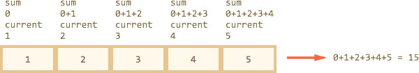

# Массив: перебирающие методы

Современный стандарт JavaScript предоставляет много методов для "умного" перебора массивов, которые есть в современных браузерах...

...Ну а для их поддержки в IE8- просто подключите библиотеку [ES5-shim](https://github.com/kriskowal/es5-shim).

[cut]

## forEach

Метод ["arr.forEach(callback[, thisArg])"](https://developer.mozilla.org/en/JavaScript/Reference/Global_Objects/Array/forEach) используется для перебора массива.

Он для каждого элемента массива вызывает функцию `callback`.

Этой функции он передаёт три параметра `callback(item, i, arr)`:

- `item` -- очередной элемент массива.
- `i` -- его номер.
- `arr` -- массив, который перебирается.

Например:

```js run
var arr = ["Яблоко", "Апельсин", "Груша"];

arr.forEach(function(item, i, arr) {
  alert( i + ": " + item + " (массив:" + arr + ")" );
});
```

Второй, необязательный аргумент `forEach` позволяет указать контекст `this` для `callback`. Мы обсудим его в деталях чуть позже, сейчас он нам не важен.

Метод `forEach` ничего не возвращает, его используют только для перебора, как более "элегантный" вариант, чем обычный цикл `for`.

## filter

Метод ["arr.filter(callback[, thisArg])"](https://developer.mozilla.org/en/JavaScript/Reference/Global_Objects/Array/filter) используется для *фильтрации* массива через функцию.

Он создаёт новый массив, в который войдут только те элементы `arr`, для которых вызов `callback(item, i, arr)` возвратит `true`.

Например:

```js run
var arr = [1, -1, 2, -2, 3];

*!*
var positiveArr = arr.filter(function(number) {
  return number > 0;
});
*/!*

alert( positiveArr ); // 1,2,3
```

## map

Метод ["arr.map(callback[, thisArg])"](https://developer.mozilla.org/en/JavaScript/Reference/Global_Objects/Array/map) используется для *трансформации* массива.

Он создаёт новый массив, который будет состоять из результатов вызова `callback(item, i, arr)` для каждого элемента `arr`.

Например:

```js run
var names = ['HTML', 'CSS', 'JavaScript'];

*!*
var nameLengths = names.map(function(name) {
  return name.length;
});
*/!*

// получили массив с длинами
alert( nameLengths ); // 4,3,10
```

## every/some

Эти методы используется для проверки массива.

- Метод ["arr.every(callback[, thisArg])"](https://developer.mozilla.org/en/JavaScript/Reference/Global_Objects/Array/every) возвращает `true`, если вызов `callback` вернёт `true` для *каждого* элемента `arr`.
- Метод ["arr.some(callback[, thisArg])"](https://developer.mozilla.org/en/JavaScript/Reference/Global_Objects/Array/some) возвращает `true`, если вызов `callback` вернёт `true` для *какого-нибудь* элемента `arr`.

```js run
var arr = [1, -1, 2, -2, 3];

function isPositive(number) {
  return number > 0;
}

*!*
alert( arr.every(isPositive) ); // false, не все положительные
alert( arr.some(isPositive) ); // true, есть хоть одно положительное
*/!*
```

## reduce/reduceRight

Метод ["arr.reduce(callback[, initialValue])"](https://developer.mozilla.org/en/JavaScript/Reference/Global_Objects/Array/reduce) используется для последовательной обработки каждого элемента массива с сохранением промежуточного результата.

Это один из самых сложных методов для работы с массивами. Но его стоит освоить, потому что временами с его помощью можно в несколько строк решить задачу, которая иначе потребовала бы в разы больше места и времени.

Метод `reduce` используется для вычисления на основе массива какого-либо единого значения, иначе говорят "для свёртки массива". Чуть далее мы разберём пример для вычисления суммы.

Он применяет функцию `callback` по очереди к каждому элементу массива слева направо, сохраняя при этом промежуточный результат.

Аргументы функции `callback(previousValue, currentItem, index, arr)`:

- `previousValue` -- последний результат вызова функции, он же "промежуточный результат".
- `currentItem` -- текущий элемент массива, элементы перебираются по очереди слева-направо.
- `index` -- номер текущего элемента.
- `arr` -- обрабатываемый массив.

Кроме `callback`, методу можно передать "начальное значение" -- аргумент `initialValue`. Если он есть, то на первом вызове значение `previousValue` будет равно `initialValue`, а если у `reduce` нет второго аргумента, то оно равно первому элементу массива, а перебор начинается со второго.

Проще всего понять работу метода `reduce` на примере.

Например, в качестве "свёртки" мы хотим получить сумму всех элементов массива.

Вот решение в одну строку:

```js run
var arr = [1, 2, 3, 4, 5]

// для каждого элемента массива запустить функцию,
// промежуточный результат передавать первым аргументом далее
var result = arr.reduce(function(sum, current) {
  return sum + current;
}, 0);

alert( result ); // 15
```

Разберём, что в нём происходит.

При первом запуске `sum` -- исходное значение, с которого начинаются вычисления, равно нулю (второй аргумент `reduce`).

Сначала анонимная функция вызывается с этим начальным значением и первым элементом массива, результат запоминается и передаётся в следующий вызов, уже со вторым аргументом массива, затем новое значение участвует в вычислениях с третьим аргументом и так далее.

Поток вычислений получается такой



В виде таблицы  где каждая строка -- вызов функции на очередном элементе массива:

<table>
 <thead>
  <tr>
   <th></th>
   <th><code>sum</code></th>
   <th><code>current</code></th>
   <th>результат</th>
  </tr>
 </thead>
 <tbody>
  <tr>
   <th>первый вызов</th>
   <td><code>0</code></td>
   <td><code>1</code></td>
   <td><code>1</code></td>
  </tr>
  <tr>
   <th>второй вызов</th>
   <td><code>1</code></td>
   <td><code>2</code></td>
   <td><code>3</code></td>
  </tr>
  <tr>
   <th>третий вызов</th>
   <td><code>3</code></td>
   <td><code>3</code></td>
   <td><code>6</code></td>
  </tr>
  <tr>
   <th>четвёртый вызов</th>
   <td><code>6</code></td>
   <td><code>4</code></td>
   <td><code>10</code></td>
  </tr>
  <tr>
   <th>пятый вызов</th>
   <td><code>10</code></td>
   <td><code>5</code></td>
   <td><code>15</code></td>
  </tr>
 </tbody>
</table>

Как видно, результат предыдущего вызова передаётся в первый аргумент следующего.

Кстати, полный набор аргументов функции для `reduce` включает в себя `function(sum, current, i, array)`, то есть номер текущего вызова `i` и весь массив `arr`, но здесь в них нет нужды.

Посмотрим, что будет, если не указать `initialValue` в вызове `arr.reduce`:

```js run
var arr = [1, 2, 3, 4, 5]

// убрали 0 в конце
var result = arr.reduce(function(sum, current) {
  return sum + current
});

alert( result ); // 15
```

Результат -- точно такой же! Это потому, что при отсутствии `initialValue` в качестве первого значения берётся первый элемент массива, а перебор стартует со второго.

Таблица вычислений будет такая же, за вычетом первой строки.

**Метод [arr.reduceRight](https://developer.mozilla.org/en/JavaScript/Reference/Global_Objects/Array/reduceRight) работает аналогично, но идёт по массиву справа-налево:**

## Итого

Мы рассмотрели методы:

- `forEach` -- для *перебора* массива.
- `filter` -- для *фильтрации* массива.
- `every/some` -- для *проверки* массива.
- `map` -- для *трансформации* массива в массив.
- `reduce/reduceRight` -- для *прохода по массиву с вычислением значения*.

Во многих ситуациях их использование позволяет написать код короче и понятнее, чем обычный перебор через `for`.
