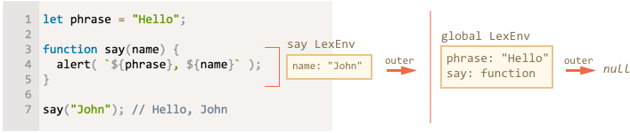
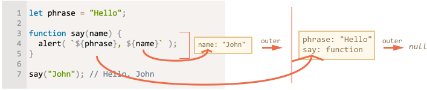
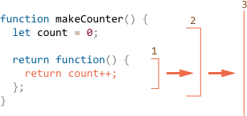
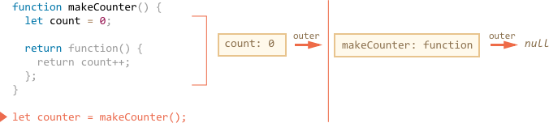
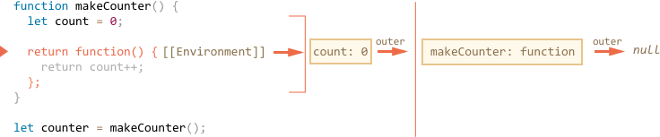
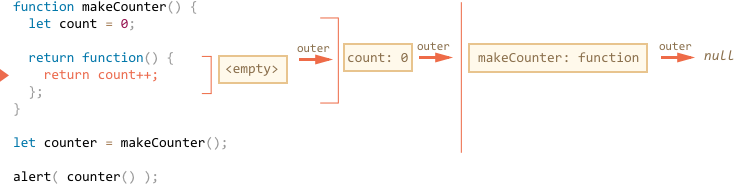
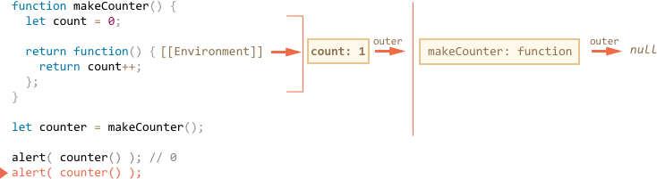

# Closure

Javascript is a very function-oriented language. There's a lot of freedom.

A function can be created at one moment, then passed as a value to another variable or function and called from a totally different place much later. In different environments, a function can be assigned to run on various events: mouse clicks, network requests etc.

We know that a function can access variables outside of it. And this feature is used quite often. 

But what happens when outer variables have change? Does a function get a new value or the old one?

Also, what happens when a function travels to another place of the code -- will it get access to variables in the new place?

We realy should understand what's going on before doing complex things with functions. There is no general programming answer for that. Different languages behave differently. Here we'll concentrate on Javascript.

[cut]

## Introductory questions

Let's formulate two questions for the seed, and then lay out the internal mechanics piece-by-piece, so that you can easily see what's going on and have no problems in the future.

1. A function uses an external variable. The variable changes. Will it pick up a new variant?

    ```js 
    let name = "John";

    function sayHi() {
      alert("Hi, " + name);
    }

    name = "Pete";

    sayHi(); // what does it show?
    ```

    Such situation often occurs in practice when we assign a function to be called on some action using in-browser mechanisms (or similar things for other JS environments). 

    Things may change between the function creation and invocation. The question is: will it pick up the changes.


2. A function makes another function and returns it. Will it access outer variables from its creation place or the invocation place?

    ```js 
    function makeWorker() {
      let name = "Pete";

      return function() {
        alert(name); // where from?
      };
    }

    let name = "John";
    let work = makeWorker();

    work(); // what does it show? "Pete" (name where created) or "John" (name where called)?
    ```


## Lexical Environment

To understand what's going on, let's first discuss what a "variable" really is.

In Javascript, every running function or a code block and a script as a whole has an associated object named *Lexical Environment*.

The Lexical Environment consists of two parts:

1. An object that stores all local variables (and other information of this kind like value of `this`). It is called *Environment Record* in the specification.
2. An reference to the *outer lexical environment*. That is the one lexically right outside of it.

For instance, let's check out this code:

```js run
let phrase = "Hello";

function say(name) {
  alert( `${phrase}, ${name}` );
}

say("John"); // Hello, John
```

During the execution of `sayHi("John")`, there are two Lexical Environments depicted below:



On the picture above the rectangles mean Environment Records (variable stores) and arrows mean outer references:

- The inner Lexical Environment corresponds to the current `sayHi` execution. It has a single variable: `name`. 
- The outer Lexical Environment is associated with the whole script. It's also called a "global lexical environment". It stores `phrase` and function `say`.
- The inner Lexical Environment references the global one. The global one references nothing. In practice, functions can be more nested, so the chain can be longer.


Please note that the Lexical Environment for function `say` only exists while the function is executing! There are no local variables or something until the function is actually called. And if the function is called multiple times, then each invocation has it's own Lexical Environment, with local variables and parameters for this very run.

The whole purpose of a Lexical Environment is to provide variables for the currently executing code. That's why it exists only for the code blocks or functions that are running. 

Technically, the term "variable" means a property of the Lexical Environment (its Environment Record to be precise). "To change a variable" means "to modify the property". 

**When a code wants to access a variable -- it is first searched in the current Lexical Environment, then in the outer one, and further until the end of the chain.**

If it's found, then it is used and modified in its place. If not found, that's an error in strict mode.

In our case:

- The code inside `say` wants to access `name`. It is a local variable, so it exists in the function Lexical Environment.
- The code also wants to access `phrase`. There is no `phrase` locally, so follows the `outer` reference and finds it globally.

That's how it works:



Now we can give the answer to the first seed question.

**The rule: a function sees external variables as they are now, not at its creation time.**

That's because of the described mechanism. Variable values are saved anywhere when a function is created. The properties on `EnvRec` are accessed as they are now.

```js run
let name = "John";

function sayHi() {
  alert("Hi, " + name);
}

name = "Pete"; // (*)

*!*
sayHi(); // Pete
*/!*
```


The execution flow of the code above:

1. The global Lexical Envrionment has `name: "John"`.
2. At the line `(*)` the variable value is overwritten, now it has `name: "Pete"`.
3. At the last line, the function is executed and takes `name: "Pete"` from the global Lexical Environment. 

```smart header="Lexical Environment is a specification object"
A Lexical Environment is an internal object. We can't get this object in our code and manipulate its properties.

Also Javascript engines are not required to use exactly objects to implement the functionality. The code must behave as if it uses them, but technically it may be much more optimized.
```


## Nested functions

We can create a function everywhere in Javascript. Even inside another function.

That can help to organize the code, like this:

```js
function sayHiBye(firstName, lastName) {

  // helper function to use below
  function getFullName() {
    return firstName + " " + lastName;
  }

  alert( "Hello, " + getFullName() );
  alert( "Bye, " + getFullName() );

}
```

Here the *nested* function `getFullName()` has access to the outer variables.

What's more interesting, a nested function can be returned. And after that it still keeps the access.

For instance:

```js run
function makeCounter() {
  let *!*count*/!* = 0;

  return function() {
    return *!*count*/!*++;
  };
}

let counter = makeCounter();

alert( counter() ); // 0
alert( counter() ); // 1
alert( counter() ); // 2
```


The `makeCounter()` creates a "counter" function that returns the next number on each invocation. In more complex cases, the counter might be a [pseudorandom number generator](https://en.wikipedia.org/wiki/Pseudorandom_number_generator) or an object, but let's stay simple for now.

The questions may arise:

1. How it works?
2. What happens if there is a global variable named `count`? Can it confuse the `counter`?
3. What if we call `makeCounter` multiple times? Are the resulting `counter` functions independant or they share the same count?

We'll answer the 1st question and the other ones will also become obvious.

**The rule: a function looks for a variable lexically from inside to outside.**

So, for the example, above, the order will be:



1. The variable is first searched among the locals of the nested function.
2. Then in the variables of the outer function.
3. Then in the outer function... And so on until it reaches globals, then the search stops.

No matter where the function is called, the rule is the same. If a variable is modified, it is modified on the place where it is found, so future accesses will get the updated variant. 

To understand things even better, let's see how it is technically implemented.

## Environments in detail

Technically, when a function is created, it gets a special hidden property `[[Environment]]` that keeps the reference to the Lexical Environment where it is created. So it kind of remembers where it was made. And when the function runs, this property is used as the outer lexical reference, giving the direction for the search.

Let's see how it works in the example above, step-by-step:

1. When the script has just started, and the execution flow is at the 1st line, there is only global Lexical Environment:

    

    At this moment there is only `makeCounter` function. And it did not run yet.

    All functions "on birth" receive a hidden property `[[Environment]]` with the reference to the Lexical Environment of creation. For `makeCounter` that's the global one.

2. The code runs on, and the call to `makeCounter()` is performed:

    

    The Lexical Environment for the `makeCounter()` call is created. It stores local variables, in our case `count: 0` is the only local variable. The property `[[Environment]]` of `makeCounter` is used as an outer lexical reference for the new Lexical Environment.

    Now we have two Lexical Environments: the first one is global, the second one is for the current `makeCounter` call, and it references the global one.

3. During the execution of `makeCounter()` the nested function is created. Here a Function Expression is used to define a function. But that doesn't matter. All functions get the `[[Environment]]` property that references the Lexical Environment where they are made. For our new nested function that is the current Lexical Environment of `makeCounter()`:

    

    Please note that at the inner function was created, but not yet called. The code inside `function() { return count++; }` is not running. 

    So we still have two Lexical Environments.

4. The call to `makeCounter()` is finished, and the result (the tiny nested function) is assigned to the global variable `counter`. When we run `counter()`, the single line of code will be executed: `return count++`.

    The `makeCounter()` call has already finished, its code will not get the control any more. 

    

    Please note that though the `counter()` function is called on the last line, outside of anything, its internal `[[Environment]]` property points back to the Lexical Environment where it was created...


5. ...So, when `counter()` code actually executes, it gets an "empty" Lexical Environment (no local variables). But the `[[Environment]]` is used for the outer lexical reference, giving it access to the variables of the former `makeCounter()` call:

    

    Now if it accesses a variable, it first searches its own Lexical Environment (empty), then the Lexical Environment of the former `makeCounter()` call, then the global one.

    When it looks for `count`, it finds it among the variables `makeCounter`, in the nearest outer Lexical Environment. 

    The funny thing is that `makeCounter()` finished some time ago. But its variables are still alive, and accessible from a nested function.

6. The call to `counter()` not only returns the value of `count`, but also increases it. Note that the modification is done "at place". The value of `count` is modified exactly in the environment where it was found.

    

    When `counter()` finishes, its Lexical Environment is cleared from memory. There are no nested function or other reason to keep it. So we return to the previous step with the only change -- the new value of `count`. The following calls all do the same.


```smart header="Closures"
There is a general programming term "closure", that developers generally should know.

A [closure](https://en.wikipedia.org/wiki/Closure_(computer_programming)) is a function that remembers its outer variables and can access them. In some languages, that's not possible or need to be explicitly specified. But as explained above, in Javascript all functions are closures.

That is: all of them automatically remember where they are created using a hidden `[[Environment]]` property, and all of them can access outer variables.

When on an interview a frontend developer gets a question about "what's a closure?", the valid answer would be a definition of the closure and an explanation that all functions in Javascript are closures, and maybe few more words about technical details: what are Lexical Environments and how they work.
```


sayHiBye("Вася", "Пупкин"); // Привет, Вася Пупкин ; Пока, Вася Пупкин

A function in Javascript can create another function or even an object with methods. They have access to the outer variables.


For instance, the method `sayHi` of the object returned by `makeUser` below takes `name` from outside:

```js run
function makeUser(name) { 
  
  let user = { 
    sayHi() {
      alert(`Hello, ${name}!`); // variable name from outside of sayHi
    }
  };

  return user;

}

let user = makeUser("John");

user.sayHi(); // Hello, John!
```

Also a function can create another function


## old


- Technically, when a function is created, it gets a special hidden property named `[[Environment]]` that keeps a reference to the current Lexical Environment.
- When the function is called, a new Lexical Environment is created


For `sayHi` to access `name`, it has to go to the global Lexical Environment. 


variable is a may be visible in the :

- A whole script (global variables)

A whole script or a function or a code block in Javascript may 

A function can access outer variables.


- A variable can be defined with `var`, `let` or `const`
-
that a function can access variables outside of it. 

