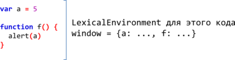
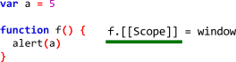
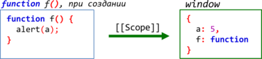
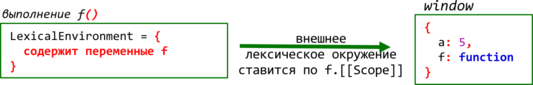
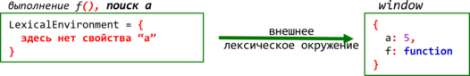
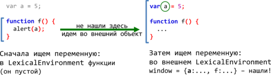

# Замыкания, функции изнутри

В этой главе мы продолжим рассматривать, как работают переменные, и, как следствие, познакомимся с замыканиями. От глобального объекта мы переходим к работе внутри функций.
[cut]
## Лексическое окружение

Все переменные внутри функции -- это свойства специального внутреннего объекта `LexicalEnvironment`, который создаётся при её запуске.

Мы будем называть этот объект "лексическое окружение" или просто "объект переменных".

При запуске функция создает объект `LexicalEnvironment`, записывает туда аргументы, функции и переменные. Процесс инициализации выполняется в том же порядке, что и для глобального объекта, который, вообще говоря, является частным случаем лексического окружения.

В отличие от `window`, объект `LexicalEnvironment` является внутренним, он скрыт от прямого доступа.

### Пример

Посмотрим пример, чтобы лучше понимать, как это работает:

```js
function sayHi(name) {
  var phrase = "Привет, " + name;
  alert(phrase);
}

sayHi('Вася');
```

При вызове функции:
<ol>
<li>До выполнения первой строчки её кода, на стадии инициализации, интерпретатор создает пустой объект `LexicalEnvironment` и заполняет его.

В данном случае туда попадает аргумент `name` и единственная переменная `phrase`:

```js
function sayHi(name) {
*!*
  // LexicalEnvironment = { name: 'Вася', phrase: undefined }
*/!*
  var phrase = "Привет, " + name;
  alert(phrase);
}

sayHi('Вася');
```

</li>
<li>Функция выполняется. 

Во время выполнения происходит присвоение локальной переменной `phrase`, то есть, другими словами, присвоение свойству `LexicalEnvironment.phrase` нового значения:

```js
function sayHi(name) {
  // LexicalEnvironment = { name: 'Вася', phrase: undefined }
  var phrase = "Привет, " + name;

*!*
  // LexicalEnvironment = { name: 'Вася', phrase: 'Привет, Вася'}
*/!*
  alert(phrase);
}

sayHi('Вася');
```

</li>
<li>В конце выполнения функции объект с переменными обычно выбрасывается и память очищается.</li>
</ol>

[smart header="Тонкости спецификации"]
Если почитать спецификацию ECMA-262, то мы увидим, что речь идёт о двух объектах: `VariableEnvironment` и `LexicalEnvironment`. 

Но там же замечено, что в реализациях эти два объекта могут быть объединены. Так что мы избегаем лишних деталей и используем везде термин `LexicalEnvironment`, это достаточно точно позволяет описать происходящее.

Более формальное описание находится в спецификации ECMA-262, секции 10.2-10.5 и 13.
[/smart]


## Доступ ко внешним переменным   

Из функции мы можем обратиться не только к локальной переменной, но и к внешней:

```js
var a = 5;

function f() {
  alert(a);  // 5
}
```

**Интерпретатор, при доступе к переменной, сначала пытается найти переменную в текущем `LexicalEnvironment`, а затем, если её нет -- ищет во внешнем объекте переменных. В данном случае им является `window`.**

Такой порядок поиска возможен благодаря тому, что ссылка на внешний объект переменных хранится в специальном внутреннем свойстве функции, которое называется `[[Scope]]`. Это свойство закрыто от прямого доступа, но знание о нём очень важно для понимания того, как работает JavaScript.

Рассмотрим, как `[[Scope]]` создаётся и используется:

<ol>
<li>Всё начинается с момента создания функции. Функция создается не в вакууме, а в некотором лексическом окружении. 

В случае выше функция создается в глобальном лексическом окружении `window`:



**Для того, чтобы функция могла в будущем обратиться к внешним переменным, в момент создания она получает скрытое свойство `[[Scope]]`, которое ссылается на лексическое окружение, в котором она была создана:**



Эта ссылка появляется одновременно с функцией и умирает вместе с ней. Программист не может как-либо получить или изменить её.
</li>
<li>Позже, приходит время и функция запускается.

Интерпретатор вспоминает, что у неё есть свойство `f.[[Scope]]`:



...И использует его при создании объекта переменных для функции.

**Новый объект `LexicalEnvironment` получает ссылку на "внешнее лексическое окружение" со значением из `[[Scope]]`. Эта ссылка используется для поиска переменных, которых нет в текущей функции.**


Например, `alert(a)` сначала ищет в текущем объекте переменных: он пустой. А потом, как показано зеленой стрелкой на рисунке ниже -- по ссылке, во внешнем окружении.




На уровне кода это выглядит как поиск во внешней области видимости, вне функции:



</li>
</ol>

Если обобщить:
<ul>
<li>Каждая функция при создании получает ссылку `[[Scope]]` на объект с переменными, в контексте которого была создана.</li>
<li>При запуске функции создаётся новый объект с переменными `LexicalEnvironment`. Он получает ссылку на внешний объект переменных из `[[Scope]]`.</li>
<li>При поиске переменных он осуществляется сначала в текущем объекте переменных, а потом -- по этой ссылке. Благодаря этому в функции доступны внешние переменные.</li>
</ul>

### Значение переменных -- всегда текущее

Значение переменной из внешней области берётся всегда текущее, на момент запуска, а не то, которое было на момент создания функции.

Например, в коде ниже функция `sayHi` берёт `phrase` из внешней области:

```js
//+ run
 
var phrase = 'Привет';

function say(name) {
  alert(name + ", " + phrase);
}

*!*
say('Вася');  // Вася, Привет (*)
*/!*

phrase = 'Пока';

*!*
say('Вася'); // Вася, Пока (**)
*/!*
```

На момент выполнения строки `(*)`, переменная `phrase` имела значение `'Привет'`, а потом изменила его на `'Пока'`. Функция всегда берёт то внешнее значение, которое есть сейчас.

Это естественно, ведь для доступа к внешним переменным функция использует ссылку на внешний объект с ними -- на внешний объект целиком! А не на каждое его свойство (переменную) по отдельности. Если переменная меняется, то при новом доступе функция всегда получит текущее, последнее её значение.


## Вложенные функции

Внутри функции можно объявлять не только локальные переменные, но и другие функции. 

К примеру, вложенная функция может помочь лучше организовать код:

```js
//+ run
function sayHi(firstName, lastName) {

  alert( "Привет, " + getFullName() );

*!*
  function getFullName() {
    return firstName + " " + lastName;
  }
*/!*

}

sayHi("Вася", "Пупкин"); // Привет, Вася Пупкин
```

Здесь, для наглядности, для вычислений создана функция `getFullName()`.

**Вложенные функции обрабатываются в точности так же, как и глобальные. Единственная разница -- они создаются в объекте переменных внешней функции, а не в `window`.**

При запуске функции `sayHi("Вася", "Пупкин")`:
<ul>
<li>Интерпретатор создаст объект для переменных.</li>
<li>Заполнит его аргументами текущего вызова и локальными переменными:

```js
function sayHi(firstName, lastName) {
*!*
//  LexicalEnvironment = { 
//    firstName: "Вася", 
//    lastName: "Пупкин",
//    getFullName: function
//  }
*/!*

  alert( "Привет, " + getFullName() ); // (*)

  function getFullName() {
    return firstName + " " + lastName;
  }

}

sayHi("Вася", "Пупкин"); // Привет, Вася Пупкин
```

</li>
<li>Далее, в строке `(*)`, при вызове `getFullName()` -- она получит ссылку на внешний объект переменных, достанет оттуда `firstName` и `lastName`.</li>
</ul>


## Возврат функции

Рассмотрим более "продвинутый" вариант, при котором внутри одной функции создаётся другая и возвращается в качестве результата.

Здесь мы будем создавать функцию-счётчик. Это, конечно, учебный пример, дальше будут задачи посложнее, поближе к реальности, ну а при изучении интерфейсов создавать и передавать туда-сюда функцию будет вообще стандартным приёмом разработки.

В примере ниже `makeCounter` создает функцию, которая считает свои вызовы:

```js
//+ run
function makeCounter() {
  var currentCount = 1;
    
  return function() { // (**)
    return currentCount++; 
  };
}

var counter = makeCounter(); // (*)

// каждый вызов увеличивает счётчик и возвращает результат
alert( counter() ); // 1 
alert( counter() ); // 2
alert( counter() ); // 3

// создать другой счётчик, он будет независим от первого
var counter2 = makeCounter();
alert( counter2() ); // 1
```

Хранение текущего числа вызовов осуществляется в переменной `currentCount` внешней функции. 
  
Что здесь, вообще, происходит?

**Первый этап -- вызов `makeCounter()`:**

<ol>
<li>В строке `(*)` запускается `makeCounter()`. При этом создаётся `LexicalEnvironment` для переменных текущего вызова. В функции есть одна переменная `var currentCount`, которая станет свойством этого объекта. Она изначально инициализуется в `undefined`, затем, в процессе  выполнения, получит значение `1`:

```js
function makeCounter() {
*!*
  // LexicalEnvironment = { currentCount: undefined } -> window
*/!*

  var currentCount = 1;

*!*
  // LexicalEnvironment = { currentCount: 1 } -> window
*/!*
    
  return function() { // [[Scope]] -> LexicalEnvironment (**)
    return currentCount++;
  };
}

var counter = makeCounter(); // (*)
```

</li>
<li>В процессе выполнения `makeCounter()` создаёт функцию в строке `(**)`. При создании эта функция получает внутреннее свойство `[[Scope]]` со ссылкой на текущий `LexicalEnvironment`.</li>
<li>Далее вызов `makeCounter()` завершается и функция `(**)` возвращается и сохраняется во внешней переменной `counter` `(*)`.</li>
</ol>

**На этом первый этап можно считать завершённым.**

В результате вызова `makeCounter` в переменную `counter` была записана функция:

```js
var counter = function() { // [[Scope]] -> {currentCount: 1} -> window
  return currentCount++;
};
```

**Возвращённая из `makeCounter()` функция `counter` отличается от "просто функции" тем, что она помнит (через `[[Scope]]`) о том, в каком окружении была создана.** 

Скорее всего, когда-нибудь функция `counter` будет вызвана. Мы не знаем, когда это произойдёт. Может быть, прямо  сейчас, но, вообще говоря, совсем не факт. Этот вызов может быть сильно отделён по времени, поэтому назовём происходящее "вторым этапом".

**Второй этап -- вызов `counter`:**

<ol>
<li>Эта функция состоит из одной строки: `return currentCount++`, ни переменных ни параметров в ней нет, поэтому её собственный объект переменных, для краткости назовём его `LE` --  будет пуст. 

Единственное, что у него есть -- так это ссылка на внешний `LexicalEnvironment`, которую он получит из `[[Scope]]`:

```js
var counter = function() {
  //в процессе запуска LE = {} -> {currentCount: 1} -> window
  return currentCount++;
};
```

</li>
<li>Чтобы увеличить и вернуть `currentCount`, интерпретатор ищет в текущем объекте переменных `LE`, но он пуст, затем идёт во внешний объект, там находит, изменяет и возвращает новое значение:

```js
//+ run
function makeCounter() {
  var currentCount = 1;
    
  return function() { 
    return currentCount++; 
  };
}

var counter = makeCounter(); // [[Scope]] -> {currentCount: 1} -> window

alert( counter() ); // 1, [[Scope]] -> {currentCount: 1} -> window
alert( counter() ); // 2, [[Scope]] -> {currentCount: 2} -> window
alert( counter() ); // 3, [[Scope]] -> {currentCount: 3} -> window
```

</li>
</ol>

Можно создать несколько счётчиков. Все они будут взаимно независимы:

```js
var counter = makeCounter();

var counter2 = makeCounter();

alert( counter() ); // 1
alert( counter() ); // 2
alert( counter() ); // 3

alert( counter2() ); // 1, *!*счётчики независимы*/!*
```

Они независимы, потому что при каждом запуске `makeCounter` создаётся свой `LexicalEnvironment`, на который имеет ссылку соответствующий счётчик.


## Альтернатива -- свойство функции

Функция в JavaScript является объектом, поэтому можно присваивать свойства прямо к ней.

Перепишем пример со счётчиком, используя запись в функцию:

```js
//+ run
*!*
function makeCounter() {    
  function counter() { 
    return counter.currentCount++; 
  };
  counter.currentCount = 1;

  return counter;
}
*/!*

var counter = makeCounter(); 
alert( counter() ); // 1
alert( counter() ); // 2
alert (counter() ); // 3
```

Как видно, с виду пример работает также. Но внутри всё по-другому.

**Свойство функции, в отличие от переменной из замыкания -- общедоступно. К нему имеет доступ любой, у кого есть объект функции.**

Например, можно взять и поменять счётчик из внешнего кода:

```js
var counter = makeCounter(); 
alert( counter() ); // 1

*!*
counter.currentCount = 5;
*/!*

alert( counter() ); // 5
```

[smart header="Статические переменные"]
Иногда свойства, привязанные к функции, называют "статическими переменными".

В некоторых языках программирования можно объявлять переменную, которая сохраняет значение между вызовами функции. В JavaScript ближайший аналог -- это свойство функции.
[/smart]


## Итого: замыкания

[Замыкание](http://en.wikipedia.org/wiki/Closure_(computer_science&#041;) -- это функция вместе со всеми внешними переменными, которые ей доступны. 

Таково стандартное определение, которое есть в Wikipedia и большинстве серьёзных источников по программированию. То есть, замыкание -- это функция + внешние переменные.

Тем не менее, в JavaScript есть небольшая терминологическая особенность. 

**Обычно, говоря "замыкание функции", подразумевают не саму эту функцию, а именно внешние переменные.**

**Иногда говорят "переменная берётся из замыкания". Это означает -- из внешнего объекта переменных.**


[smart header="Что это такое -- \"понимать замыкания?\""]
Иногда говорят "Вася крут, Вася понимает замыкания!". Что это такое -- "понимать замыкания", какой смысл обычно вкладывают в эти слова?

"Понимать замыкания" в JavaScript означает понимать следующие вещи:
<ol>
<li>Все переменные и параметры функций являются свойствами объекта переменных `LexicalEnvironment`. Каждый запуск функции создает новый такой объект. На верхнем уровне роль `LexicalEnvironment` играет "глобальный объект", в браузере это `window`.</li>
<li>При создании функция получает системное свойство `[[Scope]]`, которое ссылается на `LexicalEnvironment`, в котором она была создана (кроме `new Function`).</li>
<li>Свойство `[[Scope]]` создаётся вместе с функцией и далее не меняется. Когда бы ни была вызвана функция, куда бы её ни передали в коде -- она будет искать переменные сначала у себя, а затем во внешних `LexicalEnvironment` с места своего создания.</li>
</ol>

В следующих главах мы углубим и расширим это понимание дополнительными примерами, а также рассмотрим, что происходит с памятью.
[/smart]
