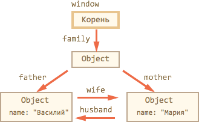
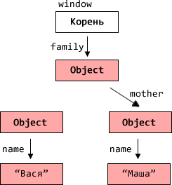
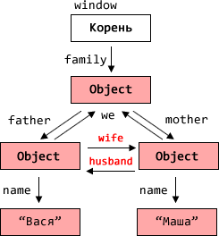
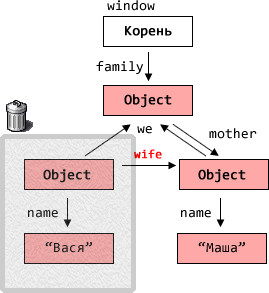

# Управление памятью в JavaScript

Управление памятью обычно незаметно. Мы создаём примитивы, объекты, функции.. Всё это занимает память.

Что происходит с объектом, когда он становится "не нужен"? Возможно ли "переполнение" памяти? Для ответа на эти вопросы -- залезем "под капот" интерпретатора.

[cut]
## Управление памятью в JavaScript

Главной концепцией управления памятью в JavaScript является принцип  *достижимости* (англ. reachability).

<ol>
<li>Определённое множество значений считается достижимым изначально, в частности:
<ul>
<li>Значения, ссылки на которые содержатся в стеке вызова, то есть -- все локальные переменные и параметры функций, которые в настоящий момент выполняются или находятся в ожидании окончания вложенного вызова.</li>
<li>Все глобальные переменные.</li>
</ul>

Эти значения гарантированно хранятся в памяти. Мы будем называть их *корнями*.
</li> 
<li>**Любое другое значение сохраняется в памяти лишь до тех пор, пока доступно из корня по ссылке или цепочке ссылок.**</li>
</ol>

Для очистки памяти от недостижимых значений в браузерах используется автоматический <a href="http://en.wikipedia.org/wiki/Garbage_collection_(computer_science)">Сборщик мусора</a> (англ. Garbage collection, GC), встроенный в интерпретатор, который наблюдает за объектами и время от времени удаляет недостижимые.

Далее мы посмотрим ряд примеров, которые помогут в этом разобраться.

### Достижимость и наличие ссылок

Можно сказать просто: "значение остаётся в памяти, пока на него есть ссылка". Но такое упрощение будет не совсем верным.

<ul>
<li>**Верно -- в том плане, что если на значение не остаётся ссылок, то память из-под него очищается.**

Например, была создана ссылка в переменной, и эту переменную тут же перезаписали:

```js
var user = { name: "Вася" };
user = null;
```

Теперь объект `{ name: "Вася" }` более недоступен. Память будет освобождена. 
</li>
<li>**Неверно -- может быть так, что ссылка есть, но при этом значение недостижимо и должно быть удалено из памяти.**

Такая ситуация возникает с объектами, при наличии ссылок друг на друга:

```js
var vasya = {};
var petya = {};
vasya.friend = petya;
petya.friend = vasya;

vasya = petya = null;
```

Несмотря на то, что на объекты `vasya`, `petya` ссылаются друг на друга через ссылку `friend`, то есть можно сказать, что на каждый из них есть ссылка, последняя строка делает эти объекты в совокупности недостижимыми. 

Поэтому они будут удалены из памяти. 

Чтобы отследить такие сложные случаи, придуман [сборщик мусора](http://ru.wikipedia.org/wiki/%D0%A1%D0%B1%D0%BE%D1%80%D0%BA%D0%B0_%D0%BC%D1%83%D1%81%D0%BE%D1%80%D0%B0), который время от времени перебирает объекты и ищет недоступные, с использованием хитрых алгоритмов и оптимизаций, чтобы это было быстро и незаметно.
</li>
</ul>

## Управление памятью в картинках

Рассмотрим пример объекта "семья":

<table>
<tr>
<th>Код</th>
<th>Структура в памяти</th>
<tr>
<td>

```js
var family = { };

family.father = {
  name: "Вася"
};

family.mother = {
  name: "Маша"
};
```

</td>
<td>


</td>
</tr>
</table>
Этот код создаёт объект `family` и два дополнительных объекта, доступных по ссылкам `family.father` и `family.mother`.

### Недостижимый объект

Теперь посмотрим, что будет, если удалить ссылку `family.father` при помощи `delete`:

<table>
<tr>
<th>Код</th>
<th>Структура в памяти</th>
<tr>
<td>

```js
var family = { };

family.father = {
  name: "Вася"
};

family.mother = {
  name: "Маша"
};

*!*
delete family.father;
*/!*
```

</td>
<td>

</td>
</tr>
</table>

### Пришёл сборщик мусора

Сборщик мусора ищет недоступные объекты. Базовый алгоритм поиска -- это идти от корня (`window`) по ссылкам и помечать все объекты, которые встретит. Тогда после окончания обхода непомеченными останутся как раз недостижимые объекты.

В нашем случае таким объектом будет бывший `family.father`. Он стал недостижимым и будет удалён вместе со своим "поддеревом", которое также более недоступно из программы.

<table>
<tr>
<th>Код</th>
<th>Структура в памяти</th>
<tr>
<td>

```js
var family = {
  father: {
    name: "Вася"
  },

  mother: {
    name: "Маша"
  }
};

*!*
delete family.father;
*/!*
```

</td>
<td>

</td>
</tr>
</table>

### После сборщика

После того, как сработает сборщик мусора, картина в памяти будет такой:

<table>
<tr>
<th>Код</th>
<th>Структура в памяти</th>
<tr>
<td>

```js
var family = {
  father: {
    name: "Вася"
  },

  mother: {
    name: "Маша"
  }
};

*!*
delete family.father;
*/!*
```

</td>
<td>

</td>
</tr>
</table>


### Достижимость -- только по входящим ссылкам 

Вернёмся к исходному коду. 

**Пусть внутренние объекты ссылаются друг на друга:**

<table>
<tr>
<th>Код</th>
<th>Структура в памяти</th>
<tr>
<td>

```js
var family = {
  father: {
    name: "Вася"
  },

  mother: {
    name: "Маша"
  }
};

// добавим перекрёстных ссылок
*!*
family.father.wife = family.mother;
family.mother.husband = family.father;
family.father.we = family;
family.mother.we = family;
*/!*
```

</td>
<td>

</td>
</tr>
</table>

Получилась сложная структура, с круговыми ссылками.

**Если удалить ссылки `family.father` и `family.mother.husband` (см. иллюстрацию ниже), то получится объект, который имеет исходящие ссылки, но не имеет входящих:**
<table>
<tr>
<th>Код</th>
<th>Структура в памяти</th>
<tr>
<td>

```js
var family = {
  father: {
    name: "Вася"
  },

  mother: {
    name: "Маша"
  }
};

family.father.wife = family.mother;
family.mother.husband = family.father;
family.father.we = family;
family.mother.we = family;

*!*
delete family.father;
delete family.mother.husband;
*/!*
```

</td>
<td>

</td>
</tr>
</table>

При стандартном алгоритме очистки памяти, сборщик мусора пойдёт от корня и не сможет достичь объект, помеченный серым. Поэтому он будет удалён. 

**И совершенно неважно, что из объекта выходят какие-то ссылки `wife`, `we`, они не влияют на достижимость этого объекта.**

### Недостижимый остров

Всё "семейство" объектов, которое мы рассматривали выше, достижимо исключительно через глобальную переменную `family` или, иными словами, через свойство `window.family`.

Если записать в `window.family` что-то ещё, то все они, вместе со своими внутренними ссылками станут "недостижимым островом" и будут удалены:

<table>
<tr>
<th>Код</th>
<th>Структура в памяти</th>
<tr>
<td>

```js
var family = {
  father: {
    name: "Вася"
  },

  mother: {
    name: "Маша"
  }
};

family.father.wife = family.mother;
family.mother.husband = family.father;
family.father.we = family;
family.mother.we = family;

*!*
family = null;
*/!*
```

</td>
<td>

</td>
</tr>
</table>

## Замыкания

Замыкания следуют тем же правилам, что и обычные объекты.

**Объект переменных внешней функции существует в памяти до тех пор, пока существует хоть одна внутренняя функция, ссылающаяся на него через свойство `[[Scope]]`.**

Например:

<ul>
<li>Обычно объект переменных удаляется по завершении работы функции. Даже если в нём есть объявление внутренней функции:

```js
function f() {
  var value = Math.random();

  function g() { } // g видна только изнутри
}

f();
```

В коде выше внутренняя функция объявлена, но она осталась внутри. После окончания работы `f()` она станет недоступной для вызовов, так что будет убрана из памяти вместе с остальными локальными переменными.
</li>
<li>...А вот в этом случае лексическое окружение, включая переменную `value`, будет сохранено:

```js
function f() {
  var value = Math.random();

  function g() { } 

*!*
  return g;
*/!*
}

var g = f(); // функция g будет жить и сохранит ссылку на объект переменных
```

Причина сохранения проста: в скрытом свойстве `g.[[Scope]]` находится ссылка на объект переменных, в котором была создана `g`. 
</li>
<li>
Если `f()` будет вызываться много раз, а полученные функции будут сохраняться, например, складываться в массив, то будут сохраняться и объекты `LexicalEnvironment` с соответствующими значениями  `value`:

```js
function f() {
  var value = Math.random();

  return function() { };
}

// 3 функции, каждая ссылается на свой объект переменных, 
// со своим значением value
var arr = [f(), f(), f()];
```

При этом совершенно не важно, имеет ли вложенная функция имя или нет.
</li>
<li>Объект `LexicalEnvironment` живёт ровно до тех пор, пока на него существуют ссылки. В коде ниже замыкание сначала сохраняется в памяти, а после удаления ссылки на `g` умирает:

```js
function f() {
  var value = Math.random();

  function g() { } 

  return g;
}

var g = f();  // функция g жива
// а значит в памяти остается соответствующий объект переменных 

g = null;     // ..а вот теперь память будет очищена
```

</li>
</ul>

### Оптимизация в V8 и её последствия 

Современные JS-движки делают оптимизации замыканий по памяти. Они анализируют использование переменных и в случае, когда переменная из замыкания абсолютно точно не используется, удаляют её.

В коде выше переменная `value` никак не используется. Поэтому она будет удалена из памяти.

**Важный побочный эффект в V8 (Chrome, Opera) состоит в том, что удалённая переменная станет недоступна и при отладке!**

Попробуйте запустить пример ниже с открытой консолью Chrome. Когда он остановится, в консоли наберите `alert(value)`.

```js
//+ run
function f() {
  var value = Math.random();

  function g() { 
    debugger; // выполните в консоли alert(value); Нет такой переменной!
  } 

  return g;
}

var g = f(); 
g();
```

Это может привести к забавным казусам при отладке, вплоть до того что вместо этой переменной будет другая, внешняя:

```js
//+ run
var value = "Сюрприз";

function f() {
  var value = "...";

  function g() { 
    debugger; // выполните в консоли alert(value); Сюрприз!
  } 

  return g;
}

var g = f(); 
g();
```

[warn header="Ещё увидимся"]
Об этой особенности важно знать. Если вы отлаживаете под Chrome/Opera, то наверняка рано или поздно с ней встретитесь!

Это не глюк отладчика, а особенность работы V8, которая, возможно, будет когда-нибудь изменена. Вы всегда сможете проверить, не изменилось ли чего, запустив примеры на этой странице.
[/warn]

## Влияние управления памятью на скорость 

На создание новых объектов и их удаление тратится время. Это важно иметь в виду в случае, когда важна производительность.

В качестве примера рассмотрим рекурсию. При вложенных вызовах каждый раз создаётся новый объект с переменными и помещается в стек. Потом память из-под него нужно очистить. Поэтому рекурсивный код будет всегда медленнее использующего цикл, но насколько?

Пример ниже тестирует сложение чисел до данного через рекурсию по сравнению с обычным циклом:

```js
//+ run
function sumTo(n) {   // обычный цикл 1+2+...+n
  var result = 0;
  for (var i=1; i<=n; i++) {
    result += i;
  }
  return result;
}

function sumToRec(n) { // рекурсия sumToRec(n) = n+SumToRec(n-1)
  return n == 1 ? 1 : n + sumToRec(n-1);
}

var timeLoop = performance.now();
for (var i=1;i<1000;i++) sumTo(1000); // цикл
timeLoop = performance.now() - timeLoop; 

var timeRecursion = performance.now();
for (var i=1;i<1000;i++) sumToRec(1000); // рекурсия
timeRecursion = performance.now() - timeRecursion;

alert("Разница в " + ( timeRecursion / timeLoop ) + " раз");
```

Различие в скорости на таком примере может составлять, в зависимости от интерпретатора, 2-10 раз. 

В большинстве ситуаций оптимизация по количеству создаваемых объектов несущественна, просто потому что "JavaScript и так достаточно быстр". Но она может быть важной для "узких мест" кода, а также при написании компьютерной графики и сложных вычислений на JS.
