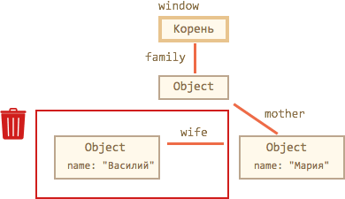
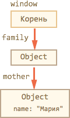
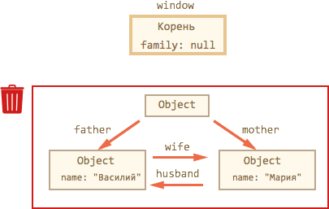

# Управление памятью в JavaScript

Управление памятью в JavaScript обычно происходит незаметно. Мы создаём примитивы, объекты, функции... Всё это занимает память.

Что происходит с объектом, когда он становится "не нужен"? Возможно ли "переполнение" памяти? Для ответа на эти вопросы -- залезем "под капот" интерпретатора.

[cut]
## Управление памятью в JavaScript

Главной концепцией управления памятью в JavaScript является принцип  *достижимости* (англ. reachability).

<ol>
<li>Определённое множество значений считается достижимым изначально, в частности:
<ul>
<li>Значения, ссылки на которые содержатся в стеке вызова, то есть -- все локальные переменные и параметры функций, которые в настоящий момент выполняются или находятся в ожидании окончания вложенного вызова.</li>
<li>Все глобальные переменные.</li>
</ul>

Эти значения гарантированно хранятся в памяти. Мы будем называть их *корнями*.
</li> 
<li>**Любое другое значение сохраняется в памяти лишь до тех пор, пока доступно из корня по ссылке или цепочке ссылок.**</li>
</ol>

Для очистки памяти от недостижимых значений в браузерах используется автоматический <a href="http://en.wikipedia.org/wiki/Garbage_collection_(computer_science)">Сборщик мусора</a> (англ. Garbage collection, GC), встроенный в интерпретатор, который наблюдает за объектами и время от времени удаляет недостижимые.

Самая простая ситуация здесь с примитивами. При присвоении они копируются целиком, ссылок на них не создаётся, так что если в переменной была одна строка, а её заменили на другую, то предыдущую можно смело выбросить.

Именно объекты требуют специального "сборщика мусора", который наблюдает за ссылками, так как на один объект может быть много ссылок из разных переменных и, при перезаписи одной из них, объект может быть всё ещё доступен из другой.

Далее мы посмотрим ряд примеров, которые помогут в этом разобраться.

### Достижимость и наличие ссылок

Есть одно упрощение для работы с памятью: "значение остаётся в памяти, пока на него есть ссылка". 

Но такое упрощение будет верным лишь в одну сторону.

<ul>
<li>**Верно -- в том плане, что если ссылок на значение нет, то память из-под него очищается.**

Например, была создана ссылка в переменной, и эту переменную тут же перезаписали:

```js
var user = {
  name: "Вася"
};
user = null;
```

Теперь объект `{ name: "Вася" }` более недоступен. Память будет освобождена. 
</li>
<li>**Неверно -- в другую сторону: наличие ссылки не гарантирует, что значение останется в памяти.**

Такая ситуация возникает с объектами, которые ссылаются друг на друга:

```js
var vasya = {};
var petya = {};
vasya.friend = petya;
petya.friend = vasya;

vasya = petya = null;
```

Несмотря на то, что на объекты `vasya`, `petya` ссылаются друг на друга через ссылку `friend`, то есть можно сказать, что на каждый из них есть ссылка, последняя строка делает эти объекты в совокупности недостижимыми. 

Поэтому они будут удалены из памяти. 

Здесь как раз и играет роль "достижимость" -- оба этих объекта становятся недостижимы из корней, в первую очередь, из глобальной области, стека.

[Сборщик мусора](http://ru.wikipedia.org/wiki/%D0%A1%D0%B1%D0%BE%D1%80%D0%BA%D0%B0_%D0%BC%D1%83%D1%81%D0%BE%D1%80%D0%B0) отслеживает такие ситуации и очищает память.
</li>
</ul>

## Алгоритм сборки мусора

Сборщик мусора идёт от корня по ссылкам и запоминает все найденные объекты. По окончанию -- он смотрит, какие объекты в нём отсутствуют и удаляет их.

Например, рассмотрим пример объекта "семья":

```js
function marry(man, woman) {
  woman.husband = man;
  man.wife = woman;

  return {
    father: man,
    mother: woman
  }
}

var family = marry({
  name: "Василий"
}, {
  name: "Мария"
});
```

Функция `marry` принимает два объекта, даёт им ссылки друг на друга и возвращает третий, содержащий ссылки на оба.

Получившийся объект `family` можно изобразить так:


Здесь стрелочками показаны ссылки, а вот свойство `name` ссылкой не является, там хранится примитив, поэтому оно внутри самого объекта.

Чтобы запустить сборщик мусора, удалим две ссылки:

```
delete family.father;
delete family.mother.husband;
```

Обратим внимание, удаление только одной из этих ссылок ни к чему бы не привело. Пока до объекта можно добраться из корня `window`, объект остаётся жив.

А если две, то получается, что от бывшего `family.father` ссылки выходят, но в него -- ни одна не идёт:



**Совершенно неважно, что из объекта выходят какие-то ссылки, они не влияют на достижимость этого объекта.**

Бывший `family.father` стал недостижимым и будет удалён вместе со своми данными, которые также более недоступны из программы.



А теперь -- рассмотрим более сложный случай. Что будет, если удалить главную ссылку `family`?

Исходный объект -- тот же, что и в начале, а затем:

```js
window.family = null;
```

Результат:



Как видим, объекты в конструкции всё ещё связаны между собой. Однако, поиск от корня их не находит, они не достижимы, и значит сборщик мусора удалит их из памяти.

[smart header="Оптимизации"]
Проблема описанного алгоритма -- в больших задержках. Если объектов много, то на поиск всех достижимых  уйдёт довольно много времени. А ведь выполнение скрипта при этом должно быть остановлено, уже просканированные объекты не должны поменяться до окончания процесса. Получатся небольшие, но неприятные паузы-зависания в работе скрипта. 

Поэтому современные интерпретаторы применяют различные оптимизации.

Самая частая -- это деление объектов на два вида "старые" и "новые". Для каждого типа выделяется своя область памяти. Каждый объект создаётся в "новой" области и, если прожил достаточно долго, мигрирует в старую. "Новая" область обычно небольшая. Она очищается часто. "Старая" -- редко.

На практике получается эффективно, обычно большинство объектов создаются и умирают почти сразу, к примеру, служа локальными переменными функции:
```js
function showTime() {
  alert( new Date() ); // этот объект будет создан и умрёт сразу
}
```

Если вы знаете низкоуровневые языки программирования, то более подробно об организации сборки мусора в V8 можно почитать, например, в статье [A tour of V8: Garbage Collection](http://jayconrod.com/posts/55/a-tour-of-v8-garbage-collection).

[/smart]

## Замыкания

Объекты переменных, о которых шла речь ранее, в главе про замыкания, также подвержены сборке мусора. Они следуют тем же правилам, что и обычные объекты. 

Объект переменных внешней функции существует в памяти до тех пор, пока существует хоть одна внутренняя функция, ссылающаяся на него через свойство `[[Scope]]`.

Например:

<ul>
<li>Обычно объект переменных удаляется по завершении работы функции. Даже если в нём есть объявление внутренней функции:

```js
function f() {
  var value = 123;

  function g() {} // g видна только изнутри
}

f();
```

В коде выше `value` и `g` являются свойствами объекта переменных. Во время выполнения `f()` её объект переменных находится в текущем стеке выполнения, поэтому жив. По окончанию, он станет недостижимым и будет убран из памяти вместе с остальными локальными переменными.
</li>
<li>...А вот в этом случае лексическое окружение, включая переменную `value`, будет сохранено:

```js
function f() {
  var value = 123;

  function g() {}

*!*
  return g;
*/!*
}

var g = f(); // функция g будет жить и сохранит ссылку на объект переменных
```

В скрытом свойстве `g.[[Scope]]` находится ссылка на объект переменных, в котором была создана `g`. Поэтому этот объект переменных останется в памяти, а в нём -- и `value`.
</li>
<li>
Если `f()` будет вызываться много раз, а полученные функции будут сохраняться, например, складываться в массив, то будут сохраняться и объекты `LexicalEnvironment` с соответствующими значениями  `value`:

```js
function f() {
  var value = Math.random();

  return function() {};
}

// 3 функции, каждая ссылается на свой объект переменных, 
// каждый со своим значением value
var arr = [f(), f(), f()];
```

</li>
<li>Объект `LexicalEnvironment` живёт ровно до тех пор, пока на него существуют ссылки. В коде ниже после удаления ссылки на `g` умирает:

```js
function f() {
  var value = 123;

  function g() {}

  return g;
}

var g = f(); // функция g жива
// а значит в памяти остается соответствующий объект переменных f() 

g = null; // ..а вот теперь память будет очищена
```

</li>
</ul>

### Оптимизация в V8 и её последствия 

Современные JS-движки делают оптимизации замыканий по памяти. Они анализируют использование переменных и в случае, когда переменная из замыкания абсолютно точно не используется, удаляют её.

В коде выше переменная `value` никак не используется. Поэтому она будет удалена из памяти.

**Важный побочный эффект в V8 (Chrome, Opera) состоит в том, что удалённая переменная станет недоступна и при отладке!**

Попробуйте запустить пример ниже с открытой консолью Chrome. Когда он остановится, в консоли наберите `alert(value)`.

```js
//+ run
function f() {
  var value = Math.random();

  function g() {
    debugger; // выполните в консоли alert( value ); Нет такой переменной!
  }

  return g;
}

var g = f();
g();
```

Как вы могли увидеть -- нет такой переменной! Недоступна она изнутри `g`. Интерпретатор решил, что она нам не понадобится и удалил.

Это может привести к забавным казусам при отладке, вплоть до того что вместо этой переменной будет другая, внешняя:

```js
//+ run
var value = "Сюрприз";

function f() {
  var value = "самое близкое значение";

  function g() {
    debugger; // выполните в консоли alert( value ); Сюрприз!
  }

  return g;
}

var g = f();
g();
```

[warn header="Ещё увидимся"]
Об этой особенности важно знать. Если вы отлаживаете под Chrome/Opera, то наверняка рано или поздно с ней встретитесь!

Это не глюк отладчика, а особенность работы V8, которая, возможно, будет когда-нибудь изменена. Вы всегда сможете проверить, не изменилось ли чего, запустив примеры на этой странице.
[/warn]

## Влияние управления памятью на скорость 

На создание новых объектов и их удаление тратится время. Это важно иметь в виду в случае, когда важна производительность.

В качестве примера рассмотрим рекурсию. При вложенных вызовах каждый раз создаётся новый объект с переменными и помещается в стек. Потом память из-под него нужно очистить. Поэтому рекурсивный код будет всегда медленнее использующего цикл, но насколько?

Пример ниже тестирует сложение чисел до данного через рекурсию по сравнению с обычным циклом:

```js
//+ run
function sumTo(n) { // обычный цикл 1+2+...+n
  var result = 0;
  for (var i = 1; i <= n; i++) {
    result += i;
  }
  return result;
}

function sumToRec(n) { // рекурсия sumToRec(n) = n+SumToRec(n-1)
  return n == 1 ? 1 : n + sumToRec(n - 1);
}

var timeLoop = performance.now();
for (var i = 1; i < 1000; i++) sumTo(1000); // цикл
timeLoop = performance.now() - timeLoop;

var timeRecursion = performance.now();
for (var i = 1; i < 1000; i++) sumToRec(1000); // рекурсия
timeRecursion = performance.now() - timeRecursion;

alert( "Разница в " + (timeRecursion / timeLoop) + " раз" );
```

Различие в скорости на таком примере может составлять, в зависимости от интерпретатора, 2-10 раз. 

Вообще, этот пример -- не показателен. Ещё раз обращаю ваше внимание на то, что такие искусственные "микротесты" часто врут. Правильно их делать -- отдельная наука, которая выходит за рамки этой главы. Но и на практике ускорение в 2-10 раз оптимизацией по количеству объектов (и вообще, любых значений) -- отнюдь не миф, а вполне достижимо.

В реальной жизни в большинстве ситуаций такая оптимизация несущественна, просто потому что "JavaScript и так достаточно быстр". Но она может быть эффективной для "узких мест" кода. 
