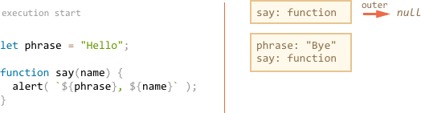
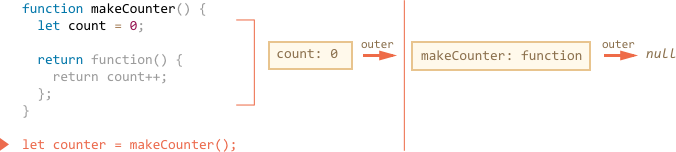
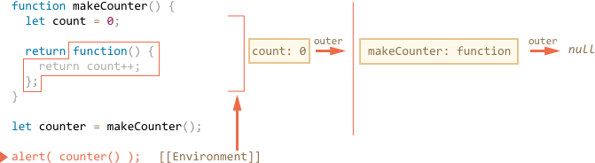

# Closure

Javascript is a very function-oriented language. There's a lot of freedom.

A function can be created at one moment, then passed as a value to another variable or function and called from a totally different place much later. In different environments, a function can be assigned to run on various events: mouse clicks, network requests etc.

We know that a function can access variables outside of it. And this feature is used quite often. 

But what happens when outer variables have change? Does a function get a new value or the old one?

Also, what happens when a function travels to another place of the code -- will it get access to variables in the new place?

We realy should understand what's going on before doing complex things with functions. There is no general programming answer for that. Different languages behave differently. Here we'll cover Javascript of course.

[cut]

## Introductory questions

Let's formulate two questions for the seed, and then lay out the internal mechanics piece-by-piece, so that you can easily see what's going on and have no problems in the future.

1. A function uses an external variable. The variable changes. Will it pick up a new variant?

    ```js 
    let name = "John";

    function sayHi() {
      alert("Hi, " + name);
    }

    name = "Pete";

    sayHi(); // what does it show?
    ```

    Such situation often occurs in practice when we assign a function to be called on some action using in-browser mechanisms (or similar things for other JS environments). 

    Things may change between the function creation and invocation. The question is: will it pick up the changes.


2. A function makes another function and returns it. Will it access outer variables from its creation place or the invocation place?

    ```js 
    function makeWorker() {
      let name = "Pete";

      return function() {
        alert(name); // where from?
      };
    }

    let name = "John";
    let work = makeWorker();

    work(); // what does it show? "Pete" (name where created) or "John" (name where called)?
    ```


## Lexical Environment

To understand what's going on, let's first discuss what a "variable" really is.

In Javascript, every running function, a code block and the script as a whole has an associated object named *Lexical Environment*.

The Lexical Environment consists of two parts:

1. An object that stores all local variables (and other information of this kind like value of `this`). It is called *Environment Record* in the specification.
2. An reference to the *outer lexical environment*, the one associated with the structure right outside of it.

For instance, in this simple code, there is only one Lexical Environment:


This is a so-called global Lexical Environment, associated with the whole script. For browsers, all `<script>` tags share the same global area.

On the picture above the rectangle means Environment Record (variable store) and the arrow means the outer reference. The global Lexical Environment has no outer one, so that's `null`.

Technically, the term "variable" means a property of the Lexical Environment (its Environment Record to be precise). "To get or change a variable" means "to get or change the property". 

Here's the bigger picture of how `let` variables work:


- When a script starts, the Lexical Environment is empty.
- The `let phrase` definition appears. Now it initially has no value, so `undefined` is stored.
- The `phrase` is assigned.
- The `phrase` changes the value.

Now let's add a function:



Here we see an important moment related to Function Declarations. They are processed when a Lexical Environment is created. For the global Lexical Environment, it means the moment when the script is started. So `say` exists from the very beginning (and we can call it prior to declaration).

The `let` definition is processed normally, so it is added later.

Now let's run the function `say()`.

When it runs, the new function Lexical Environment is created automatically, for variables and parameters of the current function call:

<!--
```js
let phrase = "Hello";

function say(name) {
  alert( `${phrase}, ${name}` );
}

say("John"); // Hello, John
```
-->


We now have two Lexical Environments: the inner (for the function call) and the outer (global):

- The inner Lexical Environment corresponds to the current `sayHi` execution. It has a single variable: `name`. 
- The outer Lexical Environment is the one outside of the function, it stores `phrase` and function `say`.
- The inner Lexical Environment references the global one. 

As we'll see further, functions can be more nested, so the chain of outer references can be longer.


Please note that the Lexical Environment for function `say` is only created when the function starts executing! And if the function is called multiple times, then each invocation has it's own Lexical Environment, with local variables and parameters for the current run.

**When a code wants to access a variable -- it is first searched in the current Lexical Environment, then in the outer one, and further until the end of the chain.**

If not found, that's always an error in strict mode. Without `use strict` an assignment to an undefined variable is possible (`phrase="Hello"` without `let`), but is not a good thing. 

In our example:

- When the `alert` inside `say` wants to access `name`, it is found immediately in the function Lexical Environment.
- When the code wants to access `phrase`, then there is no `phrase` locally, so follows the `outer` reference and finds it globally.


Now we can give the answer to the first seed question.

**A function sees external variables as they are now.**

That's because of the described mechanism. Old variable values are not saved anywhere. When a function wants them, it takes the current values from its own or an outer Lexical Environment.

So the answer is, of course, `Pete`:

```js run
let name = "John";

function sayHi() {
  alert("Hi, " + name);
}

name = "Pete"; // (*)

*!*
sayHi(); // Pete
*/!*
```


The execution flow of the code above:

1. The global Lexical Envrionment has `name: "John"`.
2. At the line `(*)` the global variable is changed, now it has `name: "Pete"`.
3. When the function `say()`, is executed and takes `name` from outside. Here that's from the global Lexical Environment where it's already `"Pete"`. 

```smart header="Lexical Environment is a specification object"
A Lexical Environment is an internal object. We can't get this object in our code and manipulate its properties.

Also Javascript engines are not required to use exactly objects to implement the functionality. The code must behave as if it uses them, but technically it may be much more optimized.
```


## Nested functions

We can create a function everywhere in Javascript. Even inside another function.

That can help to organize the code, like this:

```js
function sayHiBye(firstName, lastName) {

  // helper function to use below
  function getFullName() {
    return firstName + " " + lastName;
  }

  alert( "Hello, " + getFullName() );
  alert( "Bye, " + getFullName() );

}
```

Here the *nested* function `getFullName()` has access to the outer variables.

What's more interesting, a nested function can be returned. And used somewhere else in the code. And nevertheless it still keeps the access to the same outer variables.

An example:

```js run
function makeCounter() {
  let count = 0;

  return function() {
    return count++;
  };
}

let counter = makeCounter();

alert( counter() ); // 0
alert( counter() ); // 1
alert( counter() ); // 2
```


The `makeCounter()` creates a "counter" function that returns the next number on each invocation. In more complex cases, the counter might be a [pseudorandom number generator](https://en.wikipedia.org/wiki/Pseudorandom_number_generator) or an object, but let's stay simple for now.

The questions may arise:

1. How it works?
2. What happens if there is a global variable named `count`? Can it confuse the `counter`?
3. What if we call `makeCounter` multiple times? Are the resulting `counter` functions independent or they share the same count?

We'll answer the 1st question and the other ones will also become obvious.

**The visually simple rule: a function looks for a variable from inside to outside.**

So, for the example, above, the order will be:


1. The locals of the nested function.
2. The variables of the outer function.
3. ...And further until it reaches globals, then the search stops.

No matter where the function is called, the rule is the same. 

**If a variable is modified, it is modified on the place where it is found, so future accesses will get the updated variant.** 

So `count++` finds the outer variable and increases it "at place" every time, thus returning the next value every time.

The rule is good for eyes and usually enough, but in more complex situations, the more solid understanding of internals may be needed. So here you go.

## Environments in detail

When a function is created, it has a special hidden property `[[Environment]]` that keeps the reference to the Lexical Environment where it is created. So it kind of remembers where it was made. And when the function runs, this property is used as the outer lexical reference, giving the direction for the search.

Let's go low-level and examine how `counter()` works:

1. When the script has just started, there is only global Lexical Environment:

    

    At this moment there is only `makeCounter` function. And it did not run yet.

    All functions "on birth" receive a hidden property `[[Environment]]` with the reference to the Lexical Environment of creation. For `makeCounter` that's the global one.

2. The code runs on, and the call to `makeCounter()` is performed:

    

    The Lexical Environment for the `makeCounter()` call is created. It stores local variables, in our case `count: 0` is the only local variable. The property `[[Environment]]` of `makeCounter` is used as an outer lexical reference for the new Lexical Environment, so it points to the global one.

    Now we have two Lexical Environments: the first one is global, the second one is for the current `makeCounter` call.

3. During the execution of `makeCounter()` the tiny nested function is created. Here Function Expression is used to define the function. But that doesn't matter. All functions get the `[[Environment]]` property that references the Lexical Environment where they are made. For our new nested function that is the current Lexical Environment of `makeCounter()`:

    

    Please note that at the inner function was created, but not yet called. The code inside `function() { return count++; }` is not running. 

    So we still have two Lexical Environments. And a function which has `[[Environment]]` referencing to the inner one of them.

4. As the execution goes on, the call to `makeCounter()` finishes, and the result (the tiny nested function) is assigned to the global variable `counter`. When we run `counter()`, the single line of code will be executed: `return count++`.

    

5. Then the `counter()` call executes. An "empty" Lexical Environment is created (no local variables). But the `[[Environment]]` is used for its outer reference, providing access to the variables of the former `makeCounter()` call:

    

    Now if it accesses a variable, it first searches its own Lexical Environment (empty), then the Lexical Environment of the former `makeCounter()` call, then the global one.

    When it looks for `count`, it finds it among the variables `makeCounter`, in the nearest outer Lexical Environment. 

    The funny thing is that `makeCounter()` finished some time ago. But its variables are still alive, and accessible from a nested function.

    When `counter()` finishes, its Lexical Environment is cleared from memory. There are no nested function or other reason to keep it. But the old Lexical Environment of `makeCounter` is retained for future accesses.

6. The call to `counter()` not only returns the value of `count`, but also increases it. Note that the modification is done "at place". The value of `count` is modified exactly in the environment where it was found.

    

    So we return to the previous step with the only change -- the new value of `count`. The following calls all do the same.


The answer to the second seed question should now be obvious.

The `work()` function in the code below uses the `name` from the place of its origin through the outer lexical environment reference: 


...But if there were no `name` in `makeWorker()`, then the search would go outside and take the global variable as we can see from the chain above.

The same for `counter()` calls. The closest outer variable is always used.

```smart header="Closures"
There is a general programming term "closure", that developers generally should know.

A [closure](https://en.wikipedia.org/wiki/Closure_(computer_programming)) is a function that remembers its outer variables and can access them. In some languages, that's not possible or needs to be explicitly specified. But as explained above, in Javascript all functions are closures.

That is: all of them automatically remember where they are created using a hidden `[[Environment]]` property, and all of them can access outer variables.

When on an interview a frontend developer gets a question about "what's a closure?", the valid answer would be a definition of the closure and an explanation that all functions in Javascript are closures, and maybe few more words about technical details: the `[[Envrironment]]` property and how Lexical Environments work.
```

### An alternative: function properties

An alternative approach to the counter could be a function property:

```js run
function makeCounter() {

  function counter() {
    return counter.count++;
  };

  counter.count = 0;

  return counter;
}

let counter = makeCounter();
alert( counter() ); // 0
alert( counter() ); // 1
```

Unlike the previous example, the current `count` is now bound to the function directly, not to its outer Lexical Environment.


```smart header="Reminder"
As we remember, functions are objects in Javascript. So we can store things is them.

But properties like `counter.count` have nothing in common with function variables. Variables never use function properties and vise versa. These are just parallel words.
```

Which approach is better?

The main difference is that if the value of `count` lives in a variable, then an external code is unable to access it. Only the nested function may modify it. Such variables are sometimes called *private* (to the function).

And if it's bound to function, then such thing is possible:


```js run
function makeCounter() {

  function counter() {
    return counter.count++;
  };

  counter.count = 0;

  return counter;
}

let counter = makeCounter();

*!*
counter.count = 10;
alert( counter() ); // 10
*/!*
```

Sometimes such possibility can be a plus, but usually we want more control over `count`, and the other way is prefered.

## Code blocks and loops, IIFE

A code block has it's own Lexical Environment and hence local variables.

In the example below, when the execution goes into `if` block, the new Lexical Environment is created for it:

<!--
```js run
let phrase = "Hello";

if (true) {
  let user = "John";

  alert(`${phrase}, ${user}`); // Hello, John
}

alert(user); // Error, can't see such variable!
```
-->


The new Lexical Environment gets the enclosing one as the outer reference, so `phrase` can be found. But all variables and Function Expressions declared inside `if`, will reside in that Lexical Environment.

After `if` finishes, its Lexical Environment is normally destroyed (unless there's a living nested function). That's why the `alert` below won't see the `user`.

For a loop, every run has a separate Lexical Environment. The loop variable is its part:

```js run
for(let i = 0; i < 10; i++) {
  // Each loop has its own Lexical Environment
  // {i: value}
}
```

We also can use a "bare" code block to isolate variables.

For instance, in-browser all scripts share the same global area. So if we create a global variable in one script, it becomes available to others. That may be a source of conflicts if two scripts use the same variable name and overwrite each other.

If we don't want that, we can use a code block to isolate the whole script or an area in it:

```js run
{
  // do some job with local variables that should not be seen outside

  let message = "Hello";

  alert(message); // Hello
}

alert(message); // Error: message is not defined
```

In old scripts, you can find immediately-invoked function expressions (abbreviated as IIFE) used for this purpose.

They look like this:

```js run
(function() {
  
  let message = "Hello";

  alert(message); // Hello

})();
```

Here a Function Expression is created and immediately called. So the code executes right now and has its own private variables.

The Function Expression is wrapped with brackets `(function {...})`, because otherwise Javascript would try to read it as Function Declaration:

```js run
// Error: Unexpected token (
function() { // <-- JavaScript assumes it is a Function Declarations, but no name
  
  let message = "Hello";

  alert(message); // Hello

}();
```

...And we can't actually use Function Declaration here, because Javascript does not allow them to be called immediately:f

```js run
// syntax error
function go() {
  
}();
```

So the brackets are needed to show Javascript that we make a function in the context of another expression. Other means to do that:

```js run
!function() {
  alert("Bitwise NOT operator starts the expression");
}();

+function() {
  alert("Unary plus starts the expression");
}();
```


## The old "var"

In the very first chapter about [variables](info:variables), we mentioned three ways of variable declaration:

1. `let`
2. `const`
3. `var`

Here we only talked about `let`. But `const` behaves totally the same way in terms of Lexical Environments.

The `var` is a very different beast, coming from old times. It's generally not used in modern scripts, but still lurks in the old ones. If you don't plan meeting such scripts you may even skip this subsection or postpone until it bites. 

From the first sight, `var` behaves similar to `let`:

```js run
function sayHi() {
  var phrase = "Hello"; // local variable, "var" instead of "let"

  alert(phrase); // Hello
}

sayHi();

alert(phrase); // Error, phrase is not defined
```

...But let's list the differences.

`var` variables only live in function and global Lexical Environments, they ignore blocks.
: For instance:

    ```js
    if (true) {
      var test = true; // use "var" instead of "let"
    }

    *!*
    alert(test); // true, the variable lives after if
    */!*
    ```

    If we used `let test` on the 2nd line, then it wouldn't be visible to `alert`. But `var` variables ignore code blocks, so here we've got a global `test`.

    The same thing for loops:

    ```js
    for(var i = 0; i < 10; i++) {
      // ...
    }

    *!*
    alert(i); // 10, "i" is visible after loop, it's a global variable
    */!*
    ```

    If a code block in inside a function, then `var` becomes a function-level variable:

    ```js 
    function sayHi() {
      if (true) {
        var phrase = "Hello";
      }

      alert(phrase); // works
    }

    sayHi(); 
    alert(phrase); // Error: phrase is not defined
    ```

    As we can see, `var` pierces through `if`, `for` or other code blocks. That's because long time ago in Javascript blocks had no Lexical Environments. And `var` is a reminiscence of that.

`var` declarations are processed when the function starts (or script starts for globals).
: In other words, unlike `let/const` that appear at the moment of their declaration, `var` variables are defined from the beginning of the function. 

    So this code:

    ```js 
    function sayHi() {
      phrase = "Hello";

      alert(phrase); 

    *!*
      var phrase;
    */!*
    }
    ```

    ...Is technically the same as this:

    ```js
    function sayHi() {
    *!*
      var phrase;
    */!*
      phrase = "Hello";

      alert(phrase); 
    }
    ```

    ...Or even as this (remember, code blocks are ignored):

    ```js
    function sayHi() {
      phrase = "Hello";

      *!*
      if (false) {
        var phrase;
      }
      */!*
    
      alert(phrase); 
    }
    ```

    People also call such behavior "hoisting" (raising), because all `var` are "hoisted" (raised) to the top of the function. 

    So in the example above, `if (false)` branch never executes, but that doesn't matter. The `var` inside it is processed in the beginning of the function.

    **The pitfall is that assignments are not hoisted**.

    For instance:

    ```js run
    function sayHi() {
      alert(phrase);  

    *!*
      var phrase = "Hello";
    */!*
    }

    sayHi();
    ```

    The line `var phrase = "Hello"` has two actions in it: variable declaration `var` and assignment `=`.

    The declaration is hoisted, but the assignment is not. So the code works essentially as this:

    ```js run
    function sayHi() {
    *!*
      var phrase; // variable is declared from the top...
    */!*

      alert(phrase); // undefined

    *!*
      phrase = "Hello"; // ...but assigned when the execution reaches this line.
    */!*
    }

    sayHi();
    ```

The `alert` works, because the variable is defined from the start of the function. But its value is assigned below, so it shows `undefined`.


The features described above make using `var` inconvenient most of time. First, we can't create block-local variables. And hoisting just creates more space for errors. So, once again, for new scripts `var` is used exceptionally rarely.


## Global object

A *global object* is the object that provides access to built-in functions and values, defined by the specification and the environment.

In a browser it is named "window", for Node.JS it is "global", for other environments it may have another name.

For instance, we can call `alert` directly or as a method of `window`:

```js run
alert("Hello");

// the same as
window.alert("Hello");
```

And the same applies to other built-ins. E.g. we can use `window.Array` instead of `Array`. 

The global object also carries global Function Declarations and `var` variables. We can read them and write using its properties, for instance:

<!-- no-strict to move variables out of eval -->
```js untrusted run no-strict refresh
var phrase = "Hello";

function sayHi() {
  alert(phrase);
}

// can read from window
alert( window.phrase ); // Hello (global var)
alert( window.sayHi ); // function (global function declaration)

// can write to window (creates a new sglobal variable)
window.test = 5;

alert(test); // 5
```

...But the global object does not have variables declared with `let/const`:

```js untrusted run no-strict refresh
*!*let*/!* user = "John";
alert(user); // John

alert(window.user); // undefined, don't have let
alert("user" in window); // false
```

Here you can clearly see that `let user` is not in `window`.

That's because the idea of a global object as a way to access "all global things" comes from ancient times. Nowadays is not considered to be a good thing. Modern language features like `let/const` do not make friends with it, but old ones try to be compatible.

### Uses of "window"

In server-side environments like Node.JS, the `global` object is used exceptionally rarely. Probably it would be fair to say "never".

In-browser `window` is sometimes used for following purposes:

1. To access exactly the global variable if the function has the local one with the same name.

    ```js untrusted run no-strict refresh
    var user = "Global";

    function sayHi() {
      var user = "Local";

    *!*
      alert(window.user); // Global
    */!*
    }

    sayHi();
    ```

    Such use is typically a workaround. Would be better to name variables in a way that does require to write it this way. And note the `var user`. The trick doesn't work with `let` variables.

2. To check if a certain global variable or a builtin exists.

    For instance, we want to check whether a global function `XMLHttpRequest` exists.

    We can't write `if (XMLHttpRequest)`, because if there's no such global, that's an access to undefined variable, an error.

    But we can get it via `window.XMLHttpRequest`:

    ```js run
    if (window.XMLHttpRequest) { 
      alert('XMLHttpRequest exists!')
    }
    ```

    If there is no such global function then `window.XMLHttpRequest` is just an access to unexisting object property. That's `undefined`, no error, so it works. 

    We can also write the test without `window`:

    ```js
    if (typeof XMLHttpRequest == 'function') {
      /* is there a function XMLHttpRequest? */
      /* this will also use a local XMLHttpRequest if exists */
    }
    ```


3. The rare, special in-browser usage is to take the variable from the right window. 

    A browser may open multiple windows and tabs. A window may also embed another one in `<iframe>`. Every browser window has its own `window` object and global variables. Javascript allows windows that come from the same site (same protocol, host, port) to access variables from each other. 

    That use is a little bit beyound our scope for now, but it looks like:
    ```html run
    <iframe src="/" id="iframe"></iframe>

    <script>
      alert( innerWidth ); // get innerWidth property of the current window (browser only)
      alert( Array ); // get Array of the current window (javascript core builtin)

      // when the iframe loads...
      iframe.onload = function() { 
        // get width of the iframe window
      *!*
        alert( iframe.contentWindow.innerWidth );
      */!*
        // get the builtin Array from the iframe window
      *!*
        alert( iframe.contentWindow.Array );
      */!*
      }
    </script>
    ```

````smart header="Window and \"this\""
As we know, usually `this` is used inside an object method to access the object. But there are special cases when `this` equals `window`:

1. The value of the global `this` is `window`:

    ```js run
    // outside of functions
    alert( this === window ); // true
    ```

2. When a function with `this` is called in not-strict mode:
    ```js run no-strict
    // not in strict mode (!)
    function f() {
      alert(this); // [object Window] (in strict mode would be undefined)
    }

    f(); // called without an object
    ```

````


