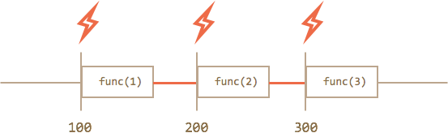
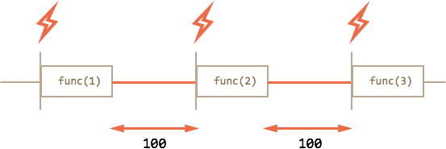

# Scheduling: setTimeout and setInterval [todo]

There are two methods to schedule function execution:

- `setTimeout` allows the function to run once after the given interval of time.
- `setInterval` allows the function to run regularly.

These methods are not the part of Javascript specification. But most environments have internal scheduler and provide these methods. In particular, they are supported in all browsers and Node.JS.


[cut]

## setTimeout

The syntax:

```js
let timerId = setTimeout(func / code, delay[, arg1, arg2...])
```

Parameters:

`func/code`
: Function or a string of code to execute.
Usually, that's a function. For historical reasons, a string of code can be passed, but that's not recommended.

`delay`
: The delay before run, in milliseconds (1000 ms = 1 second).

`arg1`, `arg2`...
: Arguments to pass the function (not supported in IE9-)


For instance, this code calls `sayHi()` after one second:

```js run
function sayHi() {
  alert( 'Привет' );
}

*!*
setTimeout(sayHi, 1000);
*/!*
```

With arguments:

```js run
function sayHi(phrase, who) {
  alert( phrase + ', ' + who );
}

*!*
setTimeout(sayHi, 1000, "John", "Hello"); // Hello, John
*/!*
```

If the first argument is a string, then Javascript creates a function from it. 

So, this will also work:

```js run no-beautify
setTimeout("alert('Hello')", 1000);
```

But using strings is not recommended, use functions instead of them, like this:

```js run no-beautify
setTimeout(() => alert('Hello'), 1000);
```

````smart header="Pass a function, don't run it"
Novice developers sometimes make a mistake by adding brackets `()` after the function:

```js
// wrong!
setTimeout(sayHi(), 1000);
```
That doesn't work, because `setTimeout` expects a reference to function. And here `sayHi()` runs the function, and the result of its execution is passed as the first argument. In our case the result of `sayHi()` is `undefined` (function returns nothing), so nothing is scheduled.
````

### Canceling with clearTimeout

The call to `setTimeout` returns a "timer identifier" `timerId`, that we can use to cancel the execution.

The syntax to cancel:

```js
let timerId = setTimeout(...);
clearTimeout(timerId);
```

In the code below we schedule the function, and then cancel it (changed our mind). As a result, nothing happens:

```js run no-beautify
let timerId = setTimeout(() => alert("never happens"), 1000);
alert(timerId); // timer identifier 

clearTimeout(timerId);
alert(timerId); // same identifier (doesn't become null after canceling)
```

As we can see from `alert` output, in browsers timer identifier is a number. In other environments, that can be something else. For instance, Node.JS returns a timer object, with additional methods.

Again, there is no universal specification for these methods.

For browsers, timers are described in the [timers section](https://www.w3.org/TR/html5/webappapis.html#timers) of HTML5 standard.

## setInterval

Method `setInterval` has the same syntax as `setTimeout`:

```js
let timerId = setInterval(func / code, delay[, arg1, arg2...])
```

All arguments have the same meaning. But, unlike `setTimeout`, it runs the function not only once, but regularly with the given interval of time.

To stop the execution, we should call `clearInterval(timerId)`.

The following example will show the message every 2 seconds. After 5 seconds, the output is stopped:

```js run
// repeat with the interval of 2 seconds
let timerId = setInterval(() => alert('tick'), 2000);

// after 5 seconds stop
setTimeout(() => { clearInterval(timerId); alert('stop'); }, 5000);
```

```smart header="Modal windows freeze time in Chrome/Opera/Safari"
In browsers Chrome, Opera and Safari the internal timer is "frozen" while showing `alert/confirm/prompt`. And in IE or Firefox it continues ticking.

So if you run the code above and hold the `alert` window for a long time, then in Firefox/IE next `alert` will be shown at once (internal timer ticked up), and in Chrome/Opera/Safari -- after 2 seconds.
```

## Recursive setTimeout

There are two ways of running something regularly.

One is `setInterval`. The other one is a recursive `setTimeout`:

```js
/** instead of:
let timerId = setInterval(() => alert('tick'), 2000);
*/

let timerId = setTimeout(function tick() {
  alert('tick');
*!*
  timerId = setTimeout(tick, 2000);
*/!*
}, 2000);
```

The `setTimeout` above schedules next call right at the end of the previous one.

**Recursive `setTimeout` is more flexible method than `setInterval`: the next call may be planned differently, depending on the results of the current one.**

For instance, we have a service that each 5 seconds sends a request to server asking for data. In case if the server is overloaded, we can increase the interval to 10, 20, 60 seconds... And then return it back when everything stabilizes.

And if we regulary have CPU-hungry tasks, then we can measure the time taken by the execition and plan the next call sooner or later.

**Recursive `setTimeout` guarantees a delay before the executions, `setInterval` -- does not.**

Let's compare two code fragments. The first one uses `setInterval`:

```js
let i = 1;
setInterval(function() {
  func(i);
}, 100);
```

The second one uses recursive `setTimeout`:

```js
let i = 1;
setTimeout(function run() {
  func(i);
  setTimeout(run, 100);
}, 100);
```

For `setInterval` the internal scheduler will run `func(i)` every 100ms:



Did you notice?...

**The real delay between `func` calls for `setInterval` is less than in the code!**

That's natural, because the time taken by `func` execution "consumes" a part of the interval.

It is possible that `func` execution turns out to be longer than we expected and takes more than 100ms.

In this case the engine waits for `func` to complete, then checks the scheduler and if the time is up, then runs it again *immediately*.

As an edge case, if the function always takes longer to execute than `delay` argument, then the calls will happen without pause at all.

And this is the picture for recursive `setTimeout`:



**Recursive `setTimeout` guarantees fixed delay (here 100ms).**

That's because a new call is planned at the end of the previous one.

````smart header="Garbage collection"
Garbage collector does not clean scheduled functions while they are actual.

When a function is passed in `setInterval/setTimeout`, an internal reference is created to it and saved in the scheduler. It prevents the function form being collected. 

```js
// the function will stay in memory until the scheduler calls it
setTimeout(function() {}, 100);
```

For `setTimeout` the reference is removed after a single execution. For `setInterval` -- only when `cancelInterval` is called.

Так как функция также тянет за собой всё замыкание, то ставшие неактуальными, но не отменённые `setInterval` могут приводить к излишним тратам памяти.
````

## Минимальная задержка таймера

У браузерного таймера есть минимальная возможная задержка. Она меняется от примерно нуля до 4 мс в современных браузерах. В более старых она может быть больше и достигать 15 мс.

По [стандарту](http://www.w3.org/TR/html5/webappapis.html#timers), минимальная задержка составляет 4 мс.  Так что нет разницы между `setTimeout(..,1)` и `setTimeout(..,4)`.

Посмотреть минимальное разрешение "вживую" можно на следующем примере.

**В примере ниже каждая полоска удлиняется вызовом `setInterval` с указанной на ней задержкой -- от 0 мс (сверху) до 20 мс (внизу).**

Позапускайте его в различных браузерах. Вы заметите, что несколько первых полосок анимируются с одинаковой скоростью. Это как раз потому, что слишком маленькие задержки таймер не различает.

[iframe border="1" src="setinterval-anim" link edit]

```warn
В Internet Explorer, нулевая задержка `setInterval(.., 0)` не сработает. Это касается именно `setInterval`, т.е. `setTimeout(.., 0)` работает нормально.
```

```smart header="Откуда взялись эти 4 мс?"
Почему минимальная задержка -- 4 мс, а не 1 мс? Зачем она вообще существует?

Это -- "привет" от прошлого. Браузер Chrome как-то пытался убрать минимальную задержку в своих ранних версиях, но оказалось, что существуют сайты, которые используют `setTimeout(..,0)` рекурсивно, создавая тем самым "асинхронный цикл". И, если задержку совсем убрать, то будет 100% загрузка процессора, такой сайт "подвесит" браузер.

Поэтому, чтобы не ломать существующие скрипты, решили сделать задержку. По возможности, небольшую. На время создания стандарта оптимальным числом показалось 4 мс.
```

## Реальная частота срабатывания

В ряде ситуаций таймер будет срабатывать реже, чем обычно. Задержка между вызовами  `setInterval(..., 4)` может быть не 4 мс, а 30 мс или даже 1000 мс.

- Большинство браузеров (десктопных в первую очередь) продолжают выполнять `setTimeout/setInterval`, даже если вкладка неактивна.

    При этом ряд из них (Chrome, FF, IE10) снижают минимальную частоту таймера, до 1 раза в секунду. Получается, что в "фоновой" вкладке будет срабатывать таймер, но редко.
- При работе от батареи, в ноутбуке -- браузеры тоже могут снижать частоту, чтобы реже выполнять код и экономить заряд батареи. Особенно этим известен IE. Снижение может достигать нескольких раз, в зависимости от настроек.
- При слишком большой загрузке процессора JavaScript может не успевать обрабатывать таймеры вовремя. При этом некоторые запуски `setInterval` будут пропущены.

**Вывод: на частоту 4 мс стоит ориентироваться, но не стоит рассчитывать.**

```online
Посмотрим снижение частоты в действии на небольшом примере.

При клике на кнопку ниже запускается `setInterval(..., 90)`, который выводит список интервалов времени между 25 последними срабатываниями таймера. Запустите его. Перейдите на другую вкладку и вернитесь.

<div id="timer-interval-log"></div>

<button onclick="timerIntervalLog()">Запустить повтор с интервалом в 90 мс</button>
<button onclick="clearInterval(timerIntervalLogTimer)">Остановить повтор</button>

<script>
var timerIntervalLogTimer;
function timerIntervalLog() {
  var arr = [];
  var d = new Date;
  timerIntervalLogTimer = setInterval(function() {
    var diff = new Date - d;
    if (diff > 100) diff = '<span style="color:red">'+diff+'</span>';
    arr.push( diff );
    if (arr.length > 25) arr.shift();
    document.getElementById('timer-interval-log').innerHTML = arr;
    d = new Date;
  }, 90);
}
</script>

Если ваш браузер увеличивает таймаут при фоновом выполнении вкладки, то вы увидите увеличенные интервалы, помеченные <span style="color:red">красным</span>.

Кроме того, вы заметите, что таймер не является идеально точным ;)
```

## Разбивка долгих скриптов

Нулевой или небольшой таймаут также используют, чтобы разорвать поток выполнения "тяжелых" скриптов.

Например, скрипт для подсветки синтаксиса должен проанализировать код, создать много цветных элементов для подсветки и добавить их в документ -- на большом файле это займёт много времени, браузер может даже подвиснуть, что неприемлемо.

Для того, чтобы этого избежать, сложная задача разбивается на части, выполнение каждой части запускается через мини-интервал после предыдущей, чтобы дать браузеру время.

Например, осуществляется анализ и подсветка первых 100 строк, затем через 20 мс -- следующие 100 строк и так далее. При этом можно подстраиваться под CPU посетителя: замерять время на анализ 100 строк и, если процессор хороший, то в следующий раз обработать 200 строк, а если плохой -- то 50. В итоге подсветка будет работать с адекватной быстротой и без тормозов на любых текстах и компьютерах.

## Итого

- Методы `setInterval(func, delay)` и `setTimeout(func, delay)` позволяют запускать `func` регулярно/один раз через `delay` миллисекунд.
- Оба метода возвращают идентификатор таймера. Его используют для остановки выполнения вызовом `clearInterval/clearTimeout`.
- В случаях, когда нужно гарантировать задержку между регулярными вызовами или гибко её менять, вместо `setInterval` используют рекурсивный `setTimeout`.
- Минимальная задержка по стандарту составляет `4 мс`. Браузеры соблюдают этот стандарт, но некоторые другие среды для выполнения JS, например Node.JS, могут предоставить и меньше задержки.
- В реальности срабатывания таймера могут быть гораздо реже, чем назначено, например если процессор перегружен, вкладка находится в фоновом режиме, ноутбук работает от батареи или по какой-то иной причине.

Браузерных особенностей почти нет, разве что вызов `setInterval(..., 0)` с нулевой задержкой в IE недопустим, нужно указывать `setInterval(..., 1)`.

