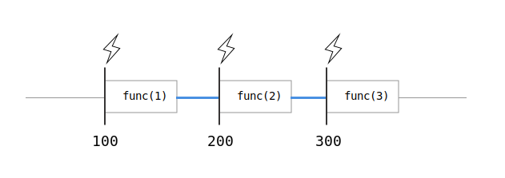
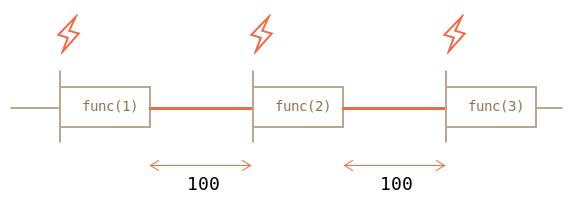

# setTimeout и setInterval

Почти все реализации JavaScript имеют внутренний таймер-планировщик, который позволяет задавать вызов функции через заданный период времени.

В частности, эта возможность поддерживается в браузерах и в сервере Node.JS.

[cut]
## setTimeout

Синтаксис:

```js
var timerId = setTimeout(func/code, delay[, arg1, arg2...])
```

Параметры:

<dl>
<dt>`func/code`</dt>
<dd>Функция или строка кода для исполнения. 
Строка поддерживается для совместимости, использовать её не рекомендуется.</dd>
<dt>`delay`</dt>
<dd>Задержка в милисекундах, 1000 милисекунд равны 1 секунде.</dd>
<dt>`arg1`, `arg2`...</dt>
<dd>Аргументы, которые нужно передать функции. Не поддерживаются в IE9-.</dd>
</dl>

Исполнение функции произойдёт спустя время, указанное в параметре `delay`. 

Например, следующий код вызовет `func()` через одну секунду:

```js
//+ run
function func() { 
  alert('Привет');
}

*!*
setTimeout(func, 1000);
*/!*
```

С передачей аргументов (не сработает в IE9-):

```js
//+ run
function func(phrase, who) { 
  alert(phrase + ', ' + who);
}

*!*
setTimeout(func, 1000, "Привет", "Вася");  // Привет, Вася
*/!*
```

Если первый аргумент является строкой, то интерпретатор создаёт анонимную функцию из этой строки.

То есть такая запись тоже сработает:

```js
//+ run
setTimeout("alert('Привет')", 1000);
```

Однако, использование строк не рекомендуется, так как они могут вызвать проблемы при минимизации кода, и, вообще, сама возможность использовать строку сохраняется лишь для совместимости.

Вместо них используйте анонимные функции, вот так:

```js
//+ run
setTimeout(function() { alert('Привет') }, 1000);
```

### Отмена исполнения clearTimeout

Функция `setTimeout` возвращает числовой идентификатор таймера `timerId`, который можно использовать для отмены действия.

Синтаксис:

```js
var timerId = setTimeout(...);
clearTimeout(timerId);
```

В следующем примере мы ставим таймаут, а затем удаляем (передумали). В результате ничего не происходит.

```js
//+ run
var timerId = setTimeout(function() { alert(1) }, 1000);
alert(timerId); // число - идентификатор таймера

clearTimeout(timerId);
alert(timerId); // всё ещё число, оно не обнуляется после отмены
```

Как видно из `alert`, в браузере идентификатор таймера является обычным числом. Другие JavaScript-окружения, например Node.JS, могут возвращать объект таймера, с дополнительными методами.

**Такие разночтения вполне соответствуют стандарту просто потому, что в спецификации JavaScript про таймеры нет ни слова.**

Таймеры -- это надстройка над JavaScript, которая описана в [секции Timers](http://www.w3.org/TR/html5/webappapis.html#timers) стандарта HTML5 для браузеров и в [документации к Node.JS](http://nodejs.org/docs/latest/api/timers.html) -- для сервера. 

## setInterval   

Метод `setInterval` имеет синтаксис, аналогичный `setTimeout`.

```js
var timerId = setInterval(func/code, delay[, arg1, arg2...])
```

Смысл аргументов -- тот же самый. Но, в отличие от `setTimeout`, он запускает выполнение функции не один раз, а  регулярно повторяет её через указанный интервал времени. Остановить исполнение можно вызовом `clearInterval(timerId)`.

Следующий пример при запуске станет выводить сообщение каждые две секунды, пока не пройдёт 5 секунд:

```js
//+ run
// начать повторы с интервалом 2 сек
var timerId = setInterval(function() { 
  alert("тик");
}, 2000);

// через 5 сек остановить повторы
setTimeout(function() { 
  clearInterval(timerId);
  alert('стоп');
}, 5000);
```

[smart header="Модальные окна замораживают время в Chrome/Opera/Safari"]
Что будет, если долго не жать `OK` на появившемся `alert`? Это зависит от браузера. 

В браузерах Chrome, Opera и Safari внутренний таймер "заморожен" во время показа `alert/confirm/prompt`. А вот в IE и Firefox внутренний таймер продолжит идти.

Поэтому, если закрыть `alert` после небольшой паузы, то в Firefox/IE следующий `alert` будет показан сразу же (время подошло), а в Chrome/Opera/Safari -- только через 2 секунды после закрытия. 
[/smart]


### Рекурсивный setTimeout

Важная альтернатива `setInterval` -- рекурсивный `setTimeout`:

```js
/** вместо:
var timerId = setInterval(function() { 
  alert("тик");
}, 2000);
*/

var timerId = setTimeout(function tick() {
  alert("тик");
*!*
  timerId = setTimeout(tick, 2000);
*/!*
}, 2000);
```

В коде выше следующее выполнение планируется сразу после окончания предыдущего.

**Рекурсивный `setTimeout` -- более гибкий метод тайминга, чем `setInterval`, так как время до следующего выполнения можно запланировать по-разному, в зависимости от результатов текущего.**

Например, у нас есть сервис, который в 5 секунд опрашивает сервер на предмет новых данных. В случае, если сервер перегружен, можно увеличивать интервал опроса до 10, 20, 60 секунд... А потом вернуть обратно, когда всё нормализуется.

Если у нас регулярно проходят грузящие процессор задачи, то мы можем оценивать время, потраченное на их выполнение, и планировать следующий запуск раньше или позже.

**Рекурсивный `setTimeout` гарантирует паузу между вызовами, `setInterval` -- нет.**

Давайте сравним два кода. Первый использует `setInterval`:

```js
var i = 1;
setInterval(function() {
  func(i);
}, 100);
```

Второй использует рекурсивный `setTimeout`:

```js
var i = 1;
setTimeout(function run() {
  func(i);
  setTimeout(run, 100);
}, 100);
```

При `setInterval` внутренний таймер будет срабатывать чётко каждые `100` мс и вызывать `func(i)`:



Вы обратили внимание?...

**Реальная пауза между вызовами `func` при `setInterval` меньше, чем указана в коде!**

Это естественно, ведь время работы функции никак не учитывается, оно "съедает" часть интервала. 

Возможно и такое что `func` оказалась сложнее, чем мы рассчитывали и выполнялась дольше, чем 100мс. 

В этом случае интерпретатор будет ждать, пока функция завершится, затем проверит таймер и, если время вызова `setInterval` уже подошло (или прошло), то следующий вызов произойдёт *сразу же*.

**Если функция и выполняется дольше, чем пауза `setInterval`, то вызовы будут происходить вообще без перерыва.**

Исключением является IE, в котором таймер "застывает" во время выполнения JavaScript.

А так будет выглядить картинка с рекурсивным `setTimeout`:



**При рекурсивном `setTimeout` задержка всегда фиксирована и равна 100мс.**

Это происходит потому, что каждый новый запуск планируется только после окончания текущего.

[smart header="Управление памятью"]
Сборщик мусора в JavaScript не чистит функции, назначенные в таймерах, пока таймеры актуальны. 

При передаче функции в `setInterval/setTimeout` создаётся внутренняя ссылка на неё, через которую браузер её будет запускать, и которая препятствует удалению из памяти, даже если функция анонимна.

```js
// Функция будет жить в памяти, пока не сработал (или не был очищен) таймер
setTimeout(function() {}, 100);
```

<ul>
<li>Для `setTimeout` -- внутренняя ссылка исчезнет после исполнения функции.</li>
<li>Для `setInterval` -- ссылка исчезнет при очистке таймера.</li>
</ul>

Так как функция также тянет за собой всё замыкание, то ставшие неактуальными, но не отменённые `setInterval` могут приводить к излишним тратам памяти.
[/smart]


## Минимальная задержка таймера

У браузерного таймера есть минимальная возможная задержка. Она меняется от примерно нуля до 4мс в современных браузерах. В более старых она может быть больше и достигать 15мс.

По [стандарту](http://www.w3.org/TR/html5/webappapis.html#timers), минимальная задержка составляет 4мс.  Так что нет разницы между `setTimeout(..,1)` и `setTimeout(..,4)`. 

Посмотреть минимальное разрешение "вживую" можно на следующем примере.

**В примере ниже каждая полоска удлиняется вызовом `setInterval` с указанной на ней задержкой -- от 0мс (сверху) до 20мс (внизу).**

Позапускайте его в различных браузерах. Вы заметите, что несколько первых полосок анимируются с одинаковой скоростью. Это как раз потому, что слишком маленькие задержки таймер не различает.

[iframe border="1" src="setInterval-anim" link edit]

[warn]
В Internet Explorer, нулевая задержка `setInterval(.., 0)` не сработает. Это касается именно `setInterval`, т.е. `setTimeout(.., 0)` работает нормально. 
[/warn]

[smart header="Откуда взялись эти 4мс?"]
Почему минимальная задержка -- 4мс, а не 1мс? Зачем она вообще существует?

Это -- "привет" от прошлого. Браузер Chrome как-то пытался убрать минимальную задержку в своих ранних версиях, но оказалось, что существуют сайты, которые используют `setTimeout(..,0)` рекурсивно, создавая тем самым "асинхронный цикл". И, если задержку совсем убрать, то будет 100% загрузка процессора, такой сайт "подвесит" браузер.

Поэтому, чтобы не ломать существующие скрипты, решили сделать задержку. По возможности, небольшую. На время создания стандарта оптимальным числом показались 4мс.
[/smart]

## Реальная частота срабатывания

В ряде ситуаций таймер будет срабатывать реже, чем обычно. Задержка между вызовами  `setInterval(..., 4)` может быть не 4мс, а 30мс или даже 1000мс.

<ul>
<li>Большинство браузеров (десктопных в первую очередь) продолжают выполнять `setTimeout/setInterval`, даже если вкладка неактивна.

При этом ряд из них (Chrome, FF, IE10) снижают минимальную частоту таймера, до 1 раза в секунду. Получается, что в "фоновой" вкладке будет срабатывать таймер, но редко.</li>
<li>При работе от батареи, в ноутбуке -- браузеры тоже могут снижать частоту, чтобы реже выполнять код и экономить заряд батареи. Особенно этим известен IE. Снижение может достигать нескольких раз, в зависимости от настроек.</li>
<li>При слишком большой загрузке процессора JavaScript может не успевать обрабатывать таймеры вовремя. При этом некоторые запуски `setInterval` будут пропущены.</li>
</ul>

**Вывод: на частоту 4мс стоит ориентироваться, но не стоит рассчитывать.**

[online]
Посмотрим снижение частоты в действии на небольшом примере. 


При клике на кнопку ниже запускается `setInterval(..., 90)`, который выводит список интервалов времени между 25 последними срабатываниями таймера. Запустите его. Перейдите на другую вкладку и вернитесь.

<div id="timer-interval-log"></div>

<button onclick="timerIntervalLog()">Запустить повтор с интервалом в 90 мс</button> 
<button onclick="clearInterval(timerIntervalLogTimer)">Остановить повтор</button>

<script>
var timerIntervalLogTimer;
function timerIntervalLog() {
  var arr = [];
  var d = new Date;
  timerIntervalLogTimer = setInterval(function() {
    var diff = new Date - d;
    if (diff > 100) diff = '<span style="color:red">'+diff+'</span>';
    arr.push( diff );
    if (arr.length > 25) arr.shift();
    document.getElementById('timer-interval-log').innerHTML = arr;
    d = new Date;
  }, 90);
}
</script>

Если ваш браузер увеличивает таймаут при фоновом выполнении вкладки, то вы увидите увеличенные интервалы, помеченные <span style="color:red">красным</span>.

Кроме того, вы заметите, что таймер не является идеально точным ;)
[/online]

## Разбивка долгих скриптов

Нулевой или небольшой таймаут также используют, чтобы разорвать поток выполнения "тяжелых" скриптов.

Например, скрипт для подсветки синтаксиса должен проанализировать код, создать много цветных элементов для подсветки и добавить их в документ -- на большом файле это займёт много времени, браузер может даже подвиснуть, что неприемлемо.

Для того, чтобы этого избежать, сложная задача разбивается на части, выполнение каждой части запускается через мини-интервал после предыдущей, чтобы дать браузеру время. 

Например, осуществляется анализ и подсветка первых 100 строк, затем через 20 мс -- следующие 100 строк и так далее. При этом можно подстраиваться под CPU посетителя: замерять время на анализ 100 строк и, если процессор хороший, то в следующий раз обработать 200 строк, а если плохой -- то 50. В итоге подсветка будет работать с адекватной быстротой и без тормозов на любых текстах и компьютерах.

## Итого

<ul>
<li>Методы `setInterval(func, delay)` и `setTimeout(func, delay)` позволяют запускать `func` регулярно/один раз через `delay` миллисекунд.</li>
<li>Оба метода возвращают идентификатор таймера. Его используют для остановки выполнения вызовом `clearInterval/clearTimeout`.</li>
<li>В случаях, когда нужно гарантировать задержку между регулярными вызовами или гибко её менять, вместо `setInterval` используют рекурсивный `setTimeout`.</li>
<li>Минимальная задержка по стандарту составляет `4мс`. Браузеры соблюдают этот стандарт, но некоторые другие среды для выполнения JS, например Node.JS, могут предоставить и меньше задержки.</li>
<li>В реальности срабатывания таймера могут быть гораздо реже, чем назначено, например если процессор перегружен, вкладка находится в фоновом режиме, ноутбук работает от батареи или по какой-то иной причине.</li>

Браузерных особенностей почти нет, разве что вызов `setInterval(..., 0)` с нулевой задержкой в IE недопустим, нужно указывать `setInterval(..., 1)`.


