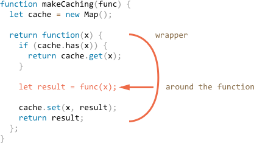

# Decorators and forwarding, call/apply

Javascript has exceptionally flexible functions. They can be passed around, used as objects, and now we will see how one function can pass its call to another one transparently. We'll use it to wrap new functionality around existing functions.

[cut]

## Transparent caching

Let's say we have a function `slow(x)` which is CPU-heavy, but for same `x` it always returns the same value.

Naturally, we'd want to cache (remember) the result, so that on the same future call we can return it without executing the function. 

But caching is something orthogonal to the function itself. So instead of mixing it into the function itself, we'll write a *caching decorator*.

A working example is better than thousand words here:

```js run
function slow(x) {
  // Math.random() is used to make caching exceptionally noticeable 
  return x * Math.random(); // actually, there is a scary CPU-heavy task here
}

function cachingDecorator(func) {
  let cache = new Map();

  return function(x) {
    if (cache.has(x)) { // if in the map
      return cache.get(x); // return
    }

    let result = func(x); // otherwise call func
    
    cache.set(x, result); // and remember
    return result;
  };
}

slow = cachingDecorator(slow);

alert( slow(1) ); // slow(1) is cached
alert( slow(1) ); // the same 

alert( slow(2) ); // slow(2) is cached
alert( slow(2) ); // the same as the previous line
```

In the code above `cachingDecorator` is a *decorator*: a special function that takes another function and alters its behavior.

The result of `cachingDecorator(func)` is a "wrapper": `function(x)` that "wraps" the call of `func(x)` into caching logic:



As we can see, the decorator did not change how function works. From an outside, the wrapped `slow` function still does the same. It just got a caching aspect added to its behavior. 


There are several benefits of using a separate `cachingDecorator` instead of altering the code of `slow` itself:

- The `cachingDecorator` is reusable. We can apply it to another function.
- The caching logic is separate, it did not increase the complexity of `slow` itself (if there were any).
- We can combine multiple decorators if needed (other decorators will follow).


## Using "func.call" for the context

The caching decorator mentioned above is not suited to work with object methods.

For instance, in the code below `user.format()` stops working after the decoration:

```js run
let obj = {
  random() {
    return Math.random(); // actually, there is a scary CPU-heavy task here
  },

  slow(x) {
*!*
    return this.random() * x; // (*)
*/!*
  }
};

function cachingDecorator(func) {
  let cache = new Map();
  return function(x) {
    if (cache.has(x)) {
      return cache.get(x); 
    }
*!*
    let result = func(x); // "this" is not passed (**)
*/!*
    cache.set(x, result); 
    return result;
  };
}

alert( obj.slow(1) ); // the original method works

obj.slow = cachingDecorator(obj.slow); // now make it caching

*!*
alert( obj.slow(2) ); // WOPS! Error: Cannot read property 'random' of undefined
*/!*
```

The error actually happens in the line `(*)` that tries to access `this.random` and fails. Guess you can see, why?

The decorated `obj.slow` calls the original one as `func(x)` in the line `(**)`. In this manner, the function always gets `this = undefined`.

As if we run:

```js
let func = obj.slow;
func(2);
```

Let's fix it.

There's a special built-in function method [func.call(context, ...args)](mdn:js/Function/call) that allows to call a function explicitly setting `this`.

The syntax is:

```js
func.call(context, arg1, arg2, ...)
```

It runs the `func` providing the first argument as `this`, and the next as the arguments.

For instance, in the code below `sayHi.call(user)` runs `sayHi`, providing `this=user`. And the next line sets `this=admin`:

```js run
function sayHi() {
  alert(this.name);
}

let user = { name: "John" };
let admin = { name: "Admin" };

// use call to pass different objects as "this"
sayHi.call( user ); // John 
sayHi.call( admin ); // Admin 
```

And here we use `call` to call `say` with the given context and phrase:


```js run
function say(phrase) {
  alert(this.name + ': ' + phrase);
}

let user = { name: "John" };

say.call( user, "Hello" ); // John: Hello
```

To put it simple, these calls are almost equivalent:
```js
func(1, 2, 3);
func.call(obj, 1, 2, 3)
```

They both call `func` with arguments `1`, `2` and `3`. The only difference is that `call` also sets `this` to `obj`.

For our case, the wrapper should pass the context that it gets to the original function:


```js run
let obj = {
  random() {
    return Math.random(); // actually, there is a scary CPU-heavy task here
  },

  slow(x) {
    return this.random() * x; 
  }
};

function cachingDecorator(func) {
  let cache = new Map();
  return function(x) {
    if (cache.has(x)) {
      return cache.get(x); 
    }
*!*
    let result = func.call(this, x); // "this" is passed 
*/!*
    cache.set(x, result); 
    return result;
  };
}

obj.slow = cachingDecorator(obj.slow); // now make it caching

alert( obj.slow(2) ); // works 
alert( obj.slow(2) ); // same (cached)
```

Now everything is fine.

To prevent misunderstandings, let's see more deeply into what's going on during `obj.slow(2)` call:

1. After the decoration `obj.slow` is now the wrapper `function (x) { ... }`.
2. So when `obj.slow(2)` is executed, the wrapper gets `this` set to `obj` (it's the object before dot).
3. Inside the wrapper, assuming the result is not yet cached, `func.call(this, x)` passes the current `this` (`=obj`) and the current argument further to the original method. 

## Going multi-argument with "func.apply"

Now let's make `cachingDecorator` even more universal. Till now it was working only with single-argument functions.

Now how to cache this `obj.slow`?

```js 
let obj = {
  slow(min, max) {
    // returns a random number from min to max
    return min + Math.random() * (max - min); // scary CPU-hogger is assumed
  }
};

// should remember same-argument calls
obj.slow = cachingDecorator(obj.slow);
```

We have two tasks to solve here. 

First is how to use both arguments `min` and `max` for the key in `cache` map. Previously, we could just `cache.set(x, result)` to save the result and `cache.get(x)` to retrieve it. But now we need to remember the result for a *combination of arguments*. The native `Map` takes single value only as the key.

There are many solutions possible:

1. Implement (or use a third-party) a new map-like data structure that is more versatile and allows such keys.
2. Use nested maps: `cache.set(min)` will be a `Map` that stores the pair `(max, result)`. So we can get `result` as `cache.get(min).get(max)`. 
3. Allow to provide a *hashing function* for the decorator, that knows how to make a one value from many.

For our particular case and for many practical applications, the 3rd variant is good enough.

The second is how to pass many arguments to `func`. Currently, the wrapper `function(x)` assumes a single argument, and `func.call(this, x)` passes it.


Here we can use another built-in method [func.apply](mdn:js/Function/apply). 

The syntax is:

```js
func.apply(context, args)
```

It runs the `func` setting `this=context` and using an array-like object `args` as the list of arguments.

```smart header="Reminder: array-likes and iterables"
Array-like objects are those that have `length` and indexed properties. Iterables are those that have `Symbol.iterator` method.

Arrays are both array-like and iterable. More on that in the chapter <info:iterable>.
``` 


For instance, these two calls are almost the same:

```js
func(1, 2, 3);
func.apply(context, [1, 2, 3])
```

Both run `func` giving it arguments `1,2,3`. But `apply` also sets `this=context`.

For instance, here `say` is called with `this=user` and `messageData` as a list of arguments:

```js run
function say(time, phrase) {
  alert(`[${time}] ${this.name}: ${phrase}`);
}

let user = { name: "John" };

let messageData = ['10:00', 'Hello']; // become time and phrase

*!*
say.apply(user, messageData); // [10:00] John: Hello (this=user)
*/!*
```

Actually, the only syntax difference between `call` and `apply` is that `call` expects a list of arguments, while `apply` takes an array-like object with them.

These two calls do the same:

```js
let args = [1, 2, 3];

*!*
func.call(context, ...args);
func.apply(context, args);
*/!*
```

If we come closer, there's a minor difference between such uses of `call` and `apply`.

- The spread operator `...` allows to pass *iterable* `args` as the list to `call`.
- The `apply` accepts only *array-like* `args`.

So, where we expect an iterable, `call` works, where we expect an array-like, `apply` works.

If something is both iterable and array-like, like a real array, then we should use `apply`, because it is is more optimized internally than `call + spread`.

The universal "wrapper formula" that allows to pass everything to another function is:

```js
let wrapper = function() {
  return anotherFunction.apply(this, arguments);
};
```

That's called *call forwarding*. The `wrapper` passes everything it gets: context and arguments to `anotherFunction` and returns back its result.

When an external code calls such `wrapper`, it is undistinguishable from the call of the original function.

Finally, the all-powerful `cachingDecorator`:

```js run
let obj = {
  slow(min, max) {
    return min + Math.random() * (max - min); 
  }
};

function cachingDecorator(func, hash) {
  let cache = new Map();
  return function() {
*!*
    let key = hash(arguments); // (*)
*/!*
    if (cache.has(key)) {
      return cache.get(key); 
    }

*!*
    let result = func.apply(this, arguments); // (**)
*/!*

    cache.set(key, result); 
    return result;
  };
}

function hash(args) {
  return args[0] + ',' + args[1];
}

obj.slow = cachingDecorator(obj.slow, hash); 

alert( obj.slow(3, 5) ); // works 
alert( obj.slow(3, 5) ); // same (cached)

alert( obj.slow(2, 5) ); // another value
```

Now the wrapper operates with any number of arguments. 

There are two changes:

- In the line `(*)` it calls `hash` to create a single key from `arguments`. Here we use a simple "glue" function that turns `(3, 5)` into key `"3,5"`. More complex cases may require other hashing functions.
- Then `(**)` uses `func.apply` to pass both the context and all arguments the wrapper got (no matter how many) to the original function.


## Borrowing a method [#method-borrowing]

Now let's make one more minor improvement in the hashing function:

```js
function hash(args) {
  return args[0] + ',' + args[1];
}
```

As of now, it works only on two arguments. It would be better if it could glue any number of `args`.

The natural solution would be to use [arr.join](mdn:js/Array/join) method:

```js
function hash(args) {
  return args.join();
}
```

...Unfortunately, that won't work. Because `hash(arguments)` receives `arguments` object, and it is both iterable and array-like, but not a real array.

So calling `join` on it fails:

```js run
function hash() {
*!*
  alert( arguments.join() ); // Error: arguments.join is not a function
*/!*
}

hash(1, 2);
```

Still, there's an easy way to use array join:

```js run
function hash() {
*!*
  alert( [].join.call(arguments) ); // 1,2
*/!*
}

hash(1, 2);
```

The trick is called *method borrowing*.

We take (borrow) a join method from a regular array `[].join`. And use `[].join.call` to run it in the context of `arguments`.

The internal algorithm of native method `[].join` is very simple. It's like this:

1. Let `glue` be the first argument or, if no arguments, then a comma `","`.
2. Let `result` be an empty string.
3. Append `this[0]` to `result`.
4. Append `glue`.
5. Append `this[1]`.
6. Append `glue`.
7. Append `this[2]`
8. ...Until `this.length` items are glued.
9. Return `result`.

For arrays `arr.join()` has `this=arr`, so it joins the array `arr`.

But it is written in a way that allows any array-like `this` (not a coincidence, many methods follow this practice), so it also works with `this=arguments`.


## Summary

*Decorator* is a wrapper around a function that alters its behavior. The main job is still carried out by the function.

It is generally safe to replace a function or a method with decorated one, except for one little thing. If the original function had properties on it, like `func.calledCount` or whatever, then the decorated one will not provide them. Because that is a wrapper. So one need to be careful if he uses them. Some decorators provide their own properties.

Decorators can be seen as "features" or "aspects" that can be added to a function. We can add one or add many. And all this without changing its code!

To implement `cachingDecorator`, we studied methods:

- [func.call(context, arg1, arg2...)](mdn:js/Function/call) -- calls `func` with given context and arguments.
- [func.apply(context, args)](mdn:js/Function/apply) -- calls `func` passing `context` as `this` and array-like `args` into a list of arguments.

The generic *call forwarding* is usually done with `apply`:

```js
let wrapper = function() {
  return original.apply(this, arguments);
}
```

We also saw an example of *method borrowing* when we take a method from an object and `call` it in the context of another object. It is quite common to take array methods and apply them to arguments. The alternative is to use rest parameters object that is a real array.


There are many decorators there in the wilds. Check how well you got them by solving the tasks of this chapter.

