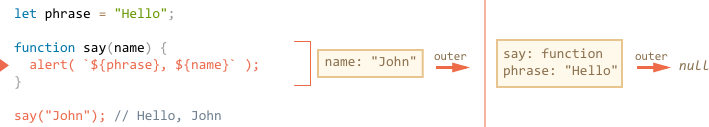

# Closure

Javascript is a very function-oriented language, it gives a lot of freedom. A function can be created at one moment, then passed as a value to another variable or function and called from a totally different place much later. 

We know that a function can access variables outside of it. And this feature is used quite often. 

But what happens when outer variables have change? Does a function get a new value or the old one?

Also, what happens when a function travels to another place of the code -- will it get access to variables in the new place?

We realy should understand what's going on before doing complex things with functions. There is no general programming answer for that. Different languages behave differently. Here we'll cover Javascript.

[cut]

## A couple of questions

Let's formulate two questions for the seed, and then study internal mechanics piece-by-piece, so that you will be able to answer them and have no problems with similar ones in the future.

1. A function uses an external variable `name`. The variable changes before function runs. Will it pick up a new variant?

    ```js 
    let name = "John";

    function sayHi() {
      alert("Hi, " + name);
    }

    name = "Pete";

    sayHi(); // what will it show: "John" or "Pete"?
    ```

    Such situations are common in both browser and server-side development. A function may be assigned to execute on user action or network request etc.

    So, the the question is: does it pick up latest changes?


2. A function can make another function and return it. That new function can be called from somewhere else. Will it have access to outer variables from its creation place or the invocation place or maybe both?

    ```js 
    function makeWorker() {
      let name = "Pete";

      return function() {
        alert(name); 
      };
    }

    let name = "John";

    // create a function
    let work = makeWorker();

    // call it
    work(); // what will it show? "Pete" (name where created) or "John" (name where called)?
    ```


## Lexical Environment

To understand what's going on, let's first discuss what a "variable" technically is.

In Javascript, every running function, code block and the script as a whole have an associated object named *Lexical Environment*.

The Lexical Environment object consists of two parts:

1. *Environment Record* -- an object that has all local variables as its properties (and some other information like the value of `this`).
2. An reference to the *outer lexical environment*, the one associated with the structure right outside of it.

So, a "variable" is just a property of the special internal object, Environment Record. "To get or change a variable" means "to get or change the property". 

For instance, in this simple code, there is only one Lexical Environment:


This is a so-called global Lexical Environment, associated with the whole script. For browsers, all `<script>` tags share the same global area.

On the picture above the rectangle means Environment Record (variable store) and the arrow means the outer reference. The global Lexical Environment has no outer one, so that's `null`.

Here's the bigger picture of how `let` variables work:


1. When a script starts, the Lexical Environment is empty.
2. The `let phrase` definition appears. Now it initially has no value, so `undefined` is stored.
3. The `phrase` is assigned.
4. The `phrase` changes the value.

To summarize: 

- A variable is a property of a special internal object, associated with the currently executing block/function/script.
- Working with variables is actually working with the properties of that object.

### Function Declaration

Function Declarations are a bit special. They are processed when a Lexical Environment is created. For the global Lexical Environment, it means the moment when the script is started. 

That's why we can use them even before they are defined, like `say` in the code below:


Here we have `say` defined from the beginning of the script, and `let` appears a bit later.

### Inner and outer Lexical Environment

Now let's run the function `say()`.

When a function runs, a new function Lexical Environment is created automatically, for variables and parameters of the call:

<!--
```js
let phrase = "Hello";

function say(name) {
  alert( `${phrase}, ${name}` );
}

say("John"); // Hello, John
```
-->



```smart
Please note that a function Lexical Environment is only created when a function starts executing! 

And if a function is called multiple times, then each invocation will have its own Lexical Environment, with local variables and parameters specific for that very run.
```

We now have two Lexical Environments: the inner (for the function call) and the outer (global):

- The inner Lexical Environment corresponds to the current `say` execution. It has a single variable: `name`. 
- The outer Lexical Environment is the one where the function is defined, "right outside" of its definition. Here the function is defined in the global Lexical Environment, so this is it. The inner Lexical Environment references the global one. 


**When a code wants to access a variable -- it is first searched in the inner Lexical Environment, then in the outer one, and further until the end of the chain.**

If a variable is not found anywhere, that's an error in strict mode. Without `use strict` an assignment to an undefined variable is possible, but is not a good thing. 

Let's see what it means for our example:

- When the `alert` inside `say` wants to access `name`, it is found immediately in the function Lexical Environment.
- When the code wants to access `phrase`, then there is no `phrase` locally, so follows the `outer` reference and finds it globally.


Now we can give the answer to the first seed question.

**A function sees external variables as they are now.**

That's because of the described mechanism. Old variable values are not saved anywhere. When a function wants them, it takes the current values from its own or an outer Lexical Environment.

So the answer is, of course, `Pete`:

```js run
let name = "John";

function sayHi() {
  alert("Hi, " + name);
}

name = "Pete"; // (*)

*!*
sayHi(); // Pete
*/!*
```


The execution flow of the code above:

1. The global Lexical Envrionment has `name: "John"`.
2. At the line `(*)` the global variable is changed, now it has `name: "Pete"`.
3. When the function `say()`, is executed and takes `name` from outside. Here that's from the global Lexical Environment where it's already `"Pete"`. 

```smart header="Lexical Environment is a specification object"
"Lexical Environment" is a specification object. We can't get this object in our code and manipulate it directly. Javascript engines also may tweak it, exclude variables that are obviously unused and apply other optimizations.
```


## Nested functions

A function is called "nested" when it is created inside another function.

Technically, that is easily possible. 

We can use it to organize the code, like this:

```js
function sayHiBye(firstName, lastName) {

  // helper nested function to use below
  function getFullName() {
    return firstName + " " + lastName;
  }

  alert( "Hello, " + getFullName() );
  alert( "Bye, " + getFullName() );

}
```

Here the *nested* function `getFullName()` is made for convenience. It has access to outer variables.

What's more interesting, a nested function can be returned: as a property of an object or as a result by itself. And then used somewhere else. But no matter where, it still keeps the access to the same outer variables.

An example with [constructor function](info:constructor-new):

```js run
// constructor function returns a new object
function User(name) {
  // method is actually a nested function
  this.sayHi = function() {
    alert(name);
  };
}

let user = new User("John");
user.sayHi();
```

An example with function result:

```js run
function makeCounter() {
  let count = 0;

  return function() {
    return count++;
  };
}

let counter = makeCounter();

alert( counter() ); // 0
alert( counter() ); // 1
alert( counter() ); // 2
```

We'll continue on with `makeCounter` example. It creates the "counter" function that returns the next number on each invocation. Despite being simple, such code structure still has practical applications, for instance, a [pseudorandom number generator](https://en.wikipedia.org/wiki/Pseudorandom_number_generator).

The questions may arise:

1. How it works?
2. Can we somehow reset the counter?
3. What if we call `makeCounter` multiple times? Are the resulting `counter` functions independent or they share the same `count`?

The first question has two answers: a simple one, easy to understand and apply, and a complex one, involving knowledge of internals.

The simple one is: a function looks for a variable from inside to outside.

So, for the example, above, the order will be:


1. The locals of the nested function.
2. The variables of the outer function.
3. ...And further until it reaches globals, then the search stops.

No matter where the function is called, the rule is the same. Doesn't matter where the function is called: it searches variables from where it was born.

Then, if a variable is found and modified, it's changed on the place where it is found.

So `count++` finds the outer variable and increases it "at place" every time, thus returning the next value every time.

That simple rule is usually good enough, but in more complex situations, more in-depth understanding of internals may be needed. So here you go.

## Environments in detail

For a more in-depth understanding, this section elaborates `makeCounter` example in more detail, adding some missing pieces.

Here's what's going on step-by-step:

1. When the script has just started, there is only global Lexical Environment:

    

    At this moment there is only `makeCounter` function. And it did not run yet.

    All functions "on birth" receive a hidden property `[[Environment]]` with the reference to the Lexical Environment of their creation. So a function kind of remembers where it was made. In the future, when the function runs, `[[Environment]]` is used  as the outer lexical reference.

    Here, `makeCounter` is created in the global Lexical Environment, so `[[Environment]]` keeps the reference to it.

2. Then the code runs on, and the call to `makeCounter()` is performed:

    

    The Lexical Environment for the `makeCounter()` call is created. 

    As all Lexical Environments, it stores two things:
    - Environment Record with local variables, in our case `count` is the only local variable. 
    - The outer lexical reference, which is set using `[[Environment]]` of the function.

    Here `[[Environment]]` of `makeCounter` references the global Lexical Environment. So, now we have two Lexical Environments: the first one is global, the second one is for the current `makeCounter` call, with the outer reference to global.

3. During the execution of `makeCounter()`, a tiny nested function is created. 

    It doesn't matter how the function is created: using Function Declaration or Function Expression or an object method. All functions get the `[[Environment]]` property that references the Lexical Environment where they are made. 

    For our new nested function that is the current Lexical Environment of `makeCounter()`:

    

    Please note that at the inner function was created, but not yet called. The code inside `function() { return count++; }` is not running. 

    So we still have two Lexical Environments. And a function which has `[[Environment]]` referencing to the inner one of them.

4. As the execution goes on, the call to `makeCounter()` finishes, and the result (the tiny nested function) is assigned to the global variable `counter`:

    

    That function has only one line: `return count++`, that will be executed when we run it.

5. When the `counter()` is called, an "empty" Lexical Environment is created for it. It has no local variables by itself. But the `[[Environment]]` of `counter` is used for the outer reference, so it has access to the variables of the former `makeCounter()` call, where it was created:

    

    Now if it accesses a variable, it first searches its own Lexical Environment (empty), then the Lexical Environment of the former `makeCounter()` call, then the global one.

    When it looks for `count`, it finds it among the variables `makeCounter`, in the nearest outer Lexical Environment. 

    Please note how memory management works here. When `makeCounter()` call finished some time ago, its Lexical Environment was retained in memory, because there's a nested function with `[[Environment]]` referencing it.

    Generally, a Lexical Environment object lives until there is a function which may use it. And when there are none, it is cleared.

6. The call to `counter()` not only returns the value of `count`, but also increases it. Note that the modification is done "at place". The value of `count` is modified exactly in the environment where it was found.

    

    So we return to the previous step with the only change -- the new value of `count`. The following calls all do the same.

7. Next `counter()` invocations do the same.

The answer to the second seed question should now be obvious.

The `work()` function in the code below uses the `name` from the place of its origin through the outer lexical environment reference: 


So, the result is `"Pete"`.

...But if there were no `name` in `makeWorker()`, then the search would go outside and take the global variable as we can see from the chain above. In that case it would be `"John"`.

```smart header="Closures"
There is a general programming term "closure", that developers generally should know.

A [closure](https://en.wikipedia.org/wiki/Closure_(computer_programming)) is a function that remembers its outer variables and can access them. In some languages, that's not possible, or a function should be written in a special way to make it happen. But as explained above, in Javascript all functions are closures.

That is: all of them automatically remember where they are created using a hidden `[[Environment]]` property, and all of them can access outer variables.

When on an interview a frontend developer gets a question about "what's a closure?", the valid answer would be a definition of the closure and an explanation that all functions in Javascript are closures, and maybe few more words about technical details: the `[[Envrironment]]` property and how Lexical Environments work.
```

## Code blocks and loops, IIFE

The examples above concentrated on functions. But Lexical Environments also exist for code blocks `{...}`.

They are created when a code block runs and contain block-local variables.

In the example below, when the execution goes into `if` block, the new Lexical Environment is created for it:

<!--
```js run
let phrase = "Hello";

if (true) {
  let user = "John";

  alert(`${phrase}, ${user}`); // Hello, John
}

alert(user); // Error, can't see such variable!
```
-->


The new Lexical Environment gets the enclosing one as the outer reference, so `phrase` can be found. But all variables and Function Expressions declared inside `if`, will reside in that Lexical Environment.

After `if` finishes, the `alert` below won't see the `user`.

For a loop, every run has a separate Lexical Environment. The loop variable is its part:

```js run
for(let i = 0; i < 10; i++) {
  // Each loop has its own Lexical Environment
  // {i: value}
}
```

We also can use a "bare" code block to isolate variables.

For instance, in-browser all scripts share the same global area. So if we create a global variable in one script, it becomes available to others. That may be a source of conflicts if two scripts use the same variable name and overwrite each other.

If we don't want that, we can use a code block to isolate the whole script or an area in it:

```js run
{
  // do some job with local variables that should not be seen outside

  let message = "Hello";

  alert(message); // Hello
}

alert(message); // Error: message is not defined
```

In old scripts, you can find immediately-invoked function expressions (abbreviated as IIFE) used for this purpose.

They look like this:

```js run
(function() {
  
  let message = "Hello";

  alert(message); // Hello

})();
```

Here a Function Expression is created and immediately called. So the code executes right now and has its own private variables.

The Function Expression is wrapped with brackets `(function {...})`, because when Javascript meets `"function"` in the main code flow, it understands it as a start of Function Declaration. But a Function Declaration must have a name, so there will be an error:

```js run
// Error: Unexpected token (
function() { // <-- JavaScript cannot find function name, meets ( and gives error
  
  let message = "Hello";

  alert(message); // Hello

}();
```

We can say "okay, let it be Function Declaration, let's add a name", but it won't work. Javascript does not allow Function Declarations to be called immediately:

```js run
// syntax error because of brackets below
function go() {
  
}(); // <-- can't call Function Declaration immediately
```

So the brackets are needed to show Javascript that the function is created in the context of another expression, and hence it's a Function Expression. Needs no name and can be called immediately.

There are other ways to tell Javascript that we mean Function Expression:

```js run
// Ways to create IIFE

(function() { 
  alert("Brackets around the function");
}*!*)*/!*();

(function() { 
  alert("Brackets around the whole thing");
}()*!*)*/!*;

*!*!*/!*function() { 
  alert("Bitwise NOT operator starts the expression");
}();

*!*+*/!*function() {
  alert("Unary plus starts the expression");
}();
```

In all cases above we declare a Function Expression and run it immediately.

## Garbage collection

Lexical Environment objects that we've been talking about are subjects to same memory management rules as regular values.

- Usually, Lexical Environment is cleaned up after the function run. For instance:

    ```js
    function f() {
      let value1 = 123;
      let value2 = 456;
    }

    f();
    ```

    It's obvious that both values are unaccessible after the end of `f()`. Formally, there are no references to Lexical Environment object with them, so it gets cleaned up.

- But if there's a nested function that is still reachable after the end of `f`, then its `[[Environment]]` reference keeps the outer lexical environment alive as well:

    ```js
    function f() {
      let value = 123;

      function g() {}

    *!*
      return g;
    */!*
    }

    let g = f(); // g is reachable, and keeps the outer lexical environment in memory
    ```

- If `f()` is called many times, and resulting functions are saved, then the corresponding Lexical Environment objects will also be retained in memory. All 3 of them in the code below:

    ```js
    function f() {
      var value = Math.random();

      return function() {};
    }

    // 3 functions in array, every of them links to LexicalEnvrironment
    // from the corresponding f() run
    //         LE   LE   LE
    let arr = [f(), f(), f()];
    ```
- A Lexical Environment object dies when no nested functions remain that reference it. In the code below, after `g` becomes unreachable, it dies with it:

    ```js
    function f() {
      var value = 123;

      function g() {}

      return g;
    }

    let g = f(); // while g is alive
    // there corresponding Lexical Environment lives

    g = null; // ...and now the memory is cleaned up
    ```

### Real-life optimizations

As we've seen, in theory while a function is alive, all outer variabels are also retained. 

But in practice, Javascript engines try to optimize that. They analyze variable usage and if it's easy to see that an outer variable is not used -- it is removed.

**An important side effect in V8 (Chrome, Opera) is that such variable will become unavailable in debugging.**

Try running the example below with the open Developer Tools in Chrome.

When it pauses, in console type `alert(value)`.

```js run
function f() {
  var value = Math.random();

  function g() {
    debugger; // in console: type alert( value ); No such variable!
  }

  return g;
}

var g = f();
g();
```

As you could see -- there is no such variable! In theory, it should be accessible, but the engine optimized it out.

That may lead to funny (if not such time-consuming) debugging issues. One of them -- we can see a same-named outer variable instead of the expected one:

```js run global
let value = "Surprise!";

function f() {
  let value = "the closest value";

  function g() {
    debugger; // in console: type alert( value ); Surprise!
  }

  return g;
}

let g = f();
g();
```

```warn header="See ya!"
This feature of V8 is good to know. If you are debugging with Chrome/Opera, sooner or later you will meet it.

That is not a bug of debugger, but a special feature of V8. Maybe it will be changed sometimes. 
You always can check for it by running examples on this page.
```


## The old "var"

In the very first chapter about [variables](info:variables), we mentioned three ways of variable declaration:

1. `let`
2. `const`
3. `var`

`let` and `const` behave exactly the same way in terms of Lexical Environments.

But `var` is a very different beast, that originates from very old times. It's generally not used in modern scripts, but still lurks in the old ones. If you don't plan meeting such scripts you may even skip this subsection or postpone, but then there's a chance that it bites you. 

From the first sight, `var` behaves similar to `let`. That is, declares a variable:

```js run
function sayHi() {
  var phrase = "Hello"; // local variable, "var" instead of "let"

  alert(phrase); // Hello
}

sayHi();

alert(phrase); // Error, phrase is not defined
```

...But here are the differences.

`var` variables are either funciton-wide or global, they are visible through blocks.
: For instance:

    ```js
    if (true) {
      var test = true; // use "var" instead of "let"
    }

    *!*
    alert(test); // true, the variable lives after if
    */!*
    ```

    If we used `let test` on the 2nd line, then it wouldn't be visible to `alert`. But `var` ignores code blocks, so we've got a global `test`.

    The same thing for loops: `var` can not be block or loop-local:

    ```js
    for(var i = 0; i < 10; i++) {
      // ...
    }

    *!*
    alert(i); // 10, "i" is visible after loop, it's a global variable
    */!*
    ```

    If a code block in inside a function, then `var` becomes a function-level variable:

    ```js 
    function sayHi() {
      if (true) {
        var phrase = "Hello";
      }

      alert(phrase); // works
    }

    sayHi(); 
    alert(phrase); // Error: phrase is not defined
    ```

    As we can see, `var` pierces through `if`, `for` or other code blocks. That's because long time ago in Javascript blocks had no Lexical Environments. And `var` is a reminiscence of that.

`var` declarations are processed when the function starts (or script starts for globals).
: In other words, `var` variables are defined from the beginning of the function. 

    So this code:

    ```js 
    function sayHi() {
      phrase = "Hello";

      alert(phrase); 

    *!*
      var phrase;
    */!*
    }
    ```

    ...Is technically the same as this:

    ```js
    function sayHi() {
    *!*
      var phrase;
    */!*
      phrase = "Hello";

      alert(phrase); 
    }
    ```

    ...Or even as this (remember, code blocks are ignored):

    ```js
    function sayHi() {
      phrase = "Hello";

      *!*
      if (false) {
        var phrase;
      }
      */!*
    
      alert(phrase); 
    }
    ```

    People also call such behavior "hoisting" (raising), because all `var` are "hoisted" (raised) to the top of the function. 

    So in the example above, `if (false)` branch never executes, but that doesn't matter. The `var` inside it is processed in the beginning of the function.

    **The important thing is that declarations are hoisted, but assignments are not.**

    For instance:

    ```js run
    function sayHi() {
      alert(phrase);  

    *!*
      var phrase = "Hello";
    */!*
    }

    sayHi();
    ```

    The line `var phrase = "Hello"` has two actions in it: variable declaration `var` and assignment `=`.

    The declaration is processed at the start of function execution (hoisted), but the assignment is not. So the code works essentially like this:

    ```js run
    function sayHi() {
    *!*
      var phrase; // variable is declared from the top...
    */!*

      alert(phrase); // undefined

    *!*
      phrase = "Hello"; // ...but assigned when the execution reaches this line.
    */!*
    }

    sayHi();
    ```

**In other words, all `var` variables exist, but are `undefined` at the beginning of a function.**

Tthey are assigned later as the execution reaches assignments.

In the example above, `alert` runs without an error, because the variable `phrase` exists. But its value is not yet assigned, so it shows `undefined`.

```warn header="Why `var` is not used"
Special behaviors of described in this section make using `var` inconvenient most of time. First, we can't create block-local variables. And hoisting just creates more space for errors. So, once again, for new scripts `var` is used exceptionally rarely.
```


## Global object

When Javascript was created, there was an idea of a "global object" that provides all global variables and functions. It was planned that multiple in-browser scripts would use that single global object and share variables through it.

Since then, Javascript greatly evolved, and that idea of linking code through global variables became much less appealing. In modern Javascript, the concept of modules too its place.

But the global object still remains in the specification. 

In a browser it is named "window", for Node.JS it is "global", for other environments it may have another name. 

It does two things:

1. Provides access to built-in functions and values, defined by the specification and the environment.
    For instance, we can call `alert` directly or as a method of `window`:

    ```js run
    alert("Hello");

    // the same as
    window.alert("Hello");
    ```

    The same applies to other built-ins. E.g. we can use `window.Array` instead of `Array`. 

2. Provides access to global Function Declarations and `var` variables. We can read them and write using its properties, for instance:

    <!-- no-strict to move variables out of eval -->
    ```js untrusted run no-strict refresh
    var phrase = "Hello";

    function sayHi() {
      alert(phrase);
    }

    // can read from window
    alert( window.phrase ); // Hello (global var)
    alert( window.sayHi ); // function (global function declaration)

    // can write to window (creates a new sglobal variable)
    window.test = 5;

    alert(test); // 5
    ```

...But the global object does not have variables declared with `let/const`!

```js untrusted run no-strict refresh
*!*let*/!* user = "John";
alert(user); // John

alert(window.user); // undefined, don't have let
alert("user" in window); // false
```

```smart header="The global object is not a global Environment Record"
In versions of ECMAScript prior to ES-2015, there were no `let/const` variables, only `var`. And global object was used as a global Environment Record (wordings were a bit different, but that's the gist).

But starting from ES-2015, these entities are split apart. There's a global Lexical Environment with its Environment Record. And there's a global object that provides *some* of global variables.

As a practical difference, global `let/const` variables are definitively properties of the global Environment Record, but they do not exist in the global object.

Naturally, that's because the idea of a global object as a way to access "all global things" comes from ancient times. Nowadays is not considered to be a good thing. Modern language features like `let/const` do not make friends with it, but old ones are still compatible.
```


### Uses of "window"

In server-side environments like Node.JS, the `global` object is used exceptionally rarely. Probably it would be fair to say "never".

In-browser `window` is sometimes used though.

Usually, it's not a good idea to use it, but here are some examples you can meet.

1. To access exactly the global variable if the function has the local one with the same name.

    ```js untrusted run no-strict refresh
    var user = "Global";

    function sayHi() {
      var user = "Local";

    *!*
      alert(window.user); // Global
    */!*
    }

    sayHi();
    ```

    Such use is a workaround. Would be better to name variables differently, that won't require use to write the code it this way. And please note `"var"` before `user`. The trick doesn't work with `let` variables.

2. To check if a certain global variable or a builtin exists.

    For instance, we want to check whether a global function `XMLHttpRequest` exists.

    We can't write `if (XMLHttpRequest)`, because if there's no `XMLHttpRequest`, there will be an error (variable not defined).

    But we can read it from `window.XMLHttpRequest`:

    ```js run
    if (window.XMLHttpRequest) { 
      alert('XMLHttpRequest exists!')
    }
    ```

    If there is no such global function then `window.XMLHttpRequest` is just a non-existing object property. That's `undefined`, no error, so it works. 

    We can also write the test without `window`:

    ```js
    if (typeof XMLHttpRequest == 'function') {
      /* is there a function XMLHttpRequest? */
    }
    ```

    This doesn't use `window`, but is (theoretically) less reliable, because `typeof` may use a local XMLHttpRequest, and we want the global one.


3. To take the variable from the right window. That's probably the most valid use case.

    A browser may open multiple windows and tabs. A window may also embed another one in `<iframe>`. Every browser window has its own `window` object and global variables. Javascript allows windows that come from the same site (same protocol, host, port) to access variables from each other. 

    That use is a little bit beyound our scope for now, but it looks like:
    ```html run
    <iframe src="/" id="iframe"></iframe>

    <script>
      alert( innerWidth ); // get innerWidth property of the current window (browser only)
      alert( Array ); // get Array of the current window (javascript core builtin)

      // when the iframe loads...
      iframe.onload = function() { 
        // get width of the iframe window
      *!*
        alert( iframe.contentWindow.innerWidth );
      */!*
        // get the builtin Array from the iframe window
      *!*
        alert( iframe.contentWindow.Array );
      */!*
      };
    </script>
    ```

    Here, first two alerts use the current window, and the latter two take variables from `iframe` window. Can be any variables if `iframe` originates from the same protocol/host/port.

### "this" and global object

There are two special cases that link `this` and global object.

1. In the browser, the value of `this` in the global area is `window`:

    ```js run
    // outside of functions
    alert( this === window ); // true
    ```

    Other, non-browser environments, may use another value for `this` in such cases.

2. When a function with `this` is called in not-strict mode, it gets the global object as `this`:
    ```js run no-strict
    // not in strict mode (!)
    function f() {
      alert(this); // [object Window] 
    }

    f(); // called without an object
    ```

    By specification, `this` in this case must be the global object, even in non-browser environments like Node.JS. That's for compatibility with old scripts, in strict mode `this` would be `undefined`.

