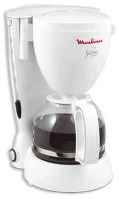
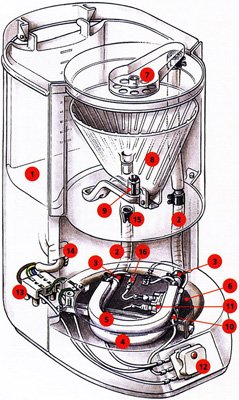

# Внутренний и внешний интерфейс

Один из важнейших принципов ООП -- отделение внутреннего интерфейса от внешнего.

Это -- обязательная практика в разработке чего угодно сложнее hello world.

Чтобы это понять, отвлечемся от разработки и переведем взгляд на объекты реального мира. 

Как правило, устройства, с которыми мы имеем дело, весьма сложны. Но *разделение интерфейса на внешний и внутренний* позволяет использовать их без малейших проблем.
[cut]
## Пример из жизни

Например, кофеварка. Простая снаружи: кнопка, индикатор, отверстия,... И, конечно, результат -- кофе :)



Но внутри... (картинка из пособия по ремонту)



Масса деталей. Но мы можем пользоваться ей, совершенно не зная об этом.

Кофеварки -- довольно-таки надежны, не правда ли? Можно пользоваться годами, и только когда что-то пойдет не так -- придется нести к мастеру.

Секрет надежности и простоты кофеварки -- в том, что все детали отлажены и *спрятаны* внутри.

Если снять с кофеварки защитный кожух, то использование её будет более сложным (куда нажимать?) и опасным (током ударить может). 

Как мы увидим, объекты очень схожи с кофеварками.

Только для того, чтобы прятать внутренние детали, используется не кожух, а специальные средства языка и соглашения.

## Внутренний и внешний интерфейс

В программировании мы будем разделять методы и свойства объекта на две группы:

<ul>
<li>*Внутренний интерфейс* -- это свойства и методы, доступ к которым может быть осуществлен только из других методов объекта, их также называют "приватными" (есть и другие термины, встретим их далее).</li>
</li>
<li>*Внешний интерфейс* -- это свойства и методы, доступные снаружи объекта, их называют "публичными".</li>
</ul>

Если продолжить аналогию с кофеваркой -- то, что спрятано внутри кофеварки: трубка кипятильника, нагревательный элемент, тепловой предохранитель и так далее -- это её внутренний интерфейс. 

Внутренний интерфейс используется для обеспечения работоспособности объекта, его детали используют друг друга. Например, трубка кипятильника подключена к нагревательному элементу. 

Но снаружи кофеварка закрыта специальным кожухом, чтобы никто к ним не подобрался. Детали скрыты и недоступны. Виден лишь внешний интерфейс.

Получив объект, всё, что нужно для пользования им -- это знать внешний интерфейс. О внутреннем же знать вообще не обязательно.

Это были общие слова по теории программирования.

Далее мы реализуем кофеварку на JavaScript с приватными и публичными свойствами. В кофеварке много деталей, мы конечно, не будем моделировать каждый винтик, а сосредоточимся на основных приёмах разработки.

## Шаг 1: публичное и приватное свойство

Конструктор кофеварок будет называться `CoffeeMachine`.

```js
//+ run
function CoffeeMachine(power) {
  this.waterAmount = 0; // количество воды в кофеварке

  alert( 'Создана кофеварка мощностью: ' + power + ' ватт' );
}

// создать кофеварку
var coffeeMachine = new CoffeeMachine(100);

// залить воды
coffeeMachine.waterAmount = 200;
```

**Локальные переменные, включая параметры конструктора, можно считать приватными свойствами.**

В примере выше это `power` -- мощность кофеварки, которая указывается при создании и далее будет использована для расчёта времени кипячения. 

К локальным переменным конструктора нельзя обратиться снаружи, но они доступны внутри самого конструктора.

**Свойства, записанные в `this`, можно считать публичными.**

Здесь свойство `waterAmount` записано в объект, а значит -- доступно для модификации снаружи. Можно доливать и выливать воду в любом количестве. 

[smart header="Вопрос терминологии"]
Далее мы будем называть `power` как "локальной переменной", так и "приватным свойством" объекта.

Это, смотря, с какой стороны посмотреть.

Термины "приватное свойство/метод", "публичное свойство/метод" относятся к общей теории ООП. А их конкретная реализация в языке программирования может быть различной. 

Здесь ООП-принцип "приватного свойства" реализован через локальные переменные, поэтому и "локальная переменная" и "приватное свойство" -- правильные термины, в зависимости от того, с какой точки зрения взглянуть -- кода или архитектуры ООП.
[/smart]


## Шаг 2: публичный и приватный методы

Добавим публичный метод `run`, запускающий кофеварку, а также вспомогательные внутренние методы `getBoilTime` и `onReady`:

```js
//+ run
function CoffeeMachine(power) {

  this.waterAmount = 0;

*!*
  // расчёт времени для кипячения
  function getBoilTime() {
    return 1000; // точная формула расчета будет позже
  }

  // что делать по окончании процесса
  function onReady() {
    alert( 'Кофе готово!' );
  }

  this.run = function() {
    // setTimeout - встроенная функция, 
    // она запустит onReady через getBoilTime() миллисекунд
    setTimeout(onReady, getBoilTime());
  };
*/!*
}

var coffeeMachine = new CoffeeMachine(100);
coffeeMachine.waterAmount = 200;

coffeeMachine.run();
```

Приватные методы, такие как `onReady`, `getBoilTime` могут быть объявлены как вложенные функции.

В результате естественным образом получается, что доступ к ним (через замыкание) имеют только другие функции, объявленные в том же конструкторе.

## Шаг 3: константа

Для расчёта времени на кипячение воды используется формула `c*m*ΔT / power`, где:
<ul>
<li>`c` -- коэффициент теплоёмкости воды, физическая константа равная `4200`.</li>
<li>`m` -- масса воды, которую нужно согреть.</li>
<li>`ΔT` -- температура, на которую нужно подогреть, будем считать, что изначально вода -- комнатной температуры 20°С, то есть до 100° нужно греть на `ΔT=80`.</li>
<li>`power` -- мощность.</li>
</ul>

Используем её в более реалистичном варианте `getBoilTime()`, включающем использование приватных свойств и константу:

```js
//+ run
"use strict"

function CoffeeMachine(power) {

  this.waterAmount = 0;

*!*
  // физическая константа - удельная теплоёмкость воды для getBoilTime
  var WATER_HEAT_CAPACITY = 4200;

  // расчёт времени для кипячения
  function getBoilTime() {
      return this.waterAmount * WATER_HEAT_CAPACITY * 80 / power; // ошибка!
    }
*/!*

  // что делать по окончании процесса
  function onReady() {
    alert( 'Кофе готово!' );
  }

  this.run = function() {
    setTimeout(onReady, getBoilTime());
  };

}

var coffeeMachine = new CoffeeMachine(1000);
coffeeMachine.waterAmount = 200;

coffeeMachine.run();
```

Удельная теплоёмкость `WATER_HEAT_CAPACITY` выделена большими буквами, так как это константа.

Внимание, при запуске кода выше в методе `getBoilTime` будет ошибка. Как вы думаете, почему?

## Шаг 4: доступ к объекту из внутреннего метода 

Внутренний метод вызывается так: `getBoilTime()`. А чему при этом равен `this`?... Как вы наверняка помните, в современном стандарте он будет `undefined` (в старом -- `window`), из-за этого при чтении `this.waterAmount` возникнет ошибка!

Её можно решить, если вызвать `getBoilTime` с явным указанием контекста: `getBoilTime.call(this)`:

```js
//+ run
function CoffeeMachine(power) {
  this.waterAmount = 0;
  var WATER_HEAT_CAPACITY = 4200;

  function getBoilTime() {
    return this.waterAmount * WATER_HEAT_CAPACITY * 80 / power;
  }

  function onReady() {
    alert( 'Кофе готово!' );
  }

  this.run = function() {
*!*
    setTimeout(onReady, getBoilTime.call(this));
*/!*
  };

}

// создаю кофеварку, мощностью 100000W чтобы кипятила быстро
var coffeeMachine = new CoffeeMachine(100000);
coffeeMachine.waterAmount = 200;

coffeeMachine.run();
```

Такой подход будет работать, но он не очень-то удобен. Ведь получается, что теперь везде, где мы хотим вызвать `getBoilTime`, нужно явно указывать контекст, т.е. писать `getBoilTime.call(this)`.

К счастью существуют более элегантные решения.

### Привязка через bind

Можно при объявлении привязать `getBoilTime` к объекту через `bind`, тогда вопрос контекста отпадёт сам собой:

```js
//+ run
function CoffeeMachine(power) {
  this.waterAmount = 0;

  var WATER_HEAT_CAPACITY = 4200;

*!*
  var getBoilTime = function() {
    return this.waterAmount * WATER_HEAT_CAPACITY * 80 / power;
  }.bind(this);
*/!*

  function onReady() {
    alert( 'Кофе готово!' );
  }

  this.run = function() {
*!*
    setTimeout(onReady, getBoilTime());
*/!*
  };

}

var coffeeMachine = new CoffeeMachine(100000);
coffeeMachine.waterAmount = 200;

coffeeMachine.run();
```

Это решение будет работать, теперь функцию можно просто вызывать без `call`. Но объявление функции стало менее красивым.

### Сохранение this в замыкании

Пожалуй, самый удобный и часто применяемый путь решения состоит в том, чтобы предварительно скопировать `this` во вспомогательную переменную и обращаться из внутренних функций уже к ней.

Вот так:

```js
//+ run
function CoffeeMachine(power) {
  this.waterAmount = 0;

  var WATER_HEAT_CAPACITY = 4200;

*!*
  var self = this;

  function getBoilTime() {
      return self.waterAmount * WATER_HEAT_CAPACITY * 80 / power;
    }
*/!*

  function onReady() {
    alert( 'Кофе готово!' );
  }

  this.run = function() {
    setTimeout(onReady, getBoilTime());
  };

}

var coffeeMachine = new CoffeeMachine(100000);
coffeeMachine.waterAmount = 200;

coffeeMachine.run();
```

Теперь `getBoilTime` получает `self` из замыкания. 

**Конечно, чтобы это работало, мы не должны изменять `self`, а все приватные методы, которые хотят иметь доступ к текущему объекту, должны использовать внутри себя `self` вместо `this`.**

Вместо `self` можно использовать любое другое имя переменной, например `var me = this`.

## Итого

Итак, мы сделали кофеварку с публичными и приватными методами и заставили их корректно работать.

В терминологии ООП отделение и защита внутреннего интерфейса называется [инкапсуляция](http://ru.wikipedia.org/wiki/%D0%98%D0%BD%D0%BA%D0%B0%D0%BF%D1%81%D1%83%D0%BB%D1%8F%D1%86%D0%B8%D1%8F_%28%D0%BF%D1%80%D0%BE%D0%B3%D1%80%D0%B0%D0%BC%D0%BC%D0%B8%D1%80%D0%BE%D0%B2%D0%B0%D0%BD%D0%B8%D0%B5%29). 

Кратко перечислим бонусы, которые она даёт:

<dl>
<dt>Защита пользователей от выстрела себе в ногу</dt>
<dd>Представьте, команда разработчиков пользуется кофеваркой. Кофеварка создана фирмой "Лучшие Кофеварки" и, в общем, работает хорошо, но с неё сняли защитный кожух и, таким образом, внутренний интерфейс стал доступен.

Все разработчики цивилизованны -- и пользуются кофеваркой как обычно. Но хитрый Вася решил, что он самый умный, и подкрутил кое-что внутри кофеварки, чтобы кофе заваривался покрепче. Вася не знал, что те изменения, которые он произвёл, приведут к тому, что кофеварка испортится через два дня. 

Виноват, разумеется, не только Вася, но и тот, кто снял защитный кожух с кофеварки, и тем самым позволил Васе проводить манипуляции.

В программировании -- то же самое. Если пользователь объекта будет менять то, что не рассчитано на изменение снаружи -- последствия могут быть непредсказуемыми. 
</dd>
<dt>Удобство в поддержке</dt>
<dd>Ситуация в программировании сложнее, чем с кофеваркой, т.к. кофеварку один раз купили и всё, а программа может улучшаться и дорабатываться.

**При наличии чётко выделенного внешнего интерфейса, разработчик может свободно менять внутренние свойства и методы, без оглядки на коллег.** 

Гораздо легче разрабатывать, если знаешь, что ряд методов (все внутренние) можно переименовывать, менять их параметры, и вообще, переписать как угодно, так как внешний код к ним абсолютно точно не обращается.

Ближайшая аналогия в реальной жизни -- это когда выходит "новая версия" кофеварки, которая работает гораздо лучше. Разработчик мог переделать всё внутри, но пользоваться ей по-прежнему просто, так как внешний интерфейс сохранён.</dd>
<dt>Управление сложностью</dt>
<dd>Люди обожают пользоваться вещами, которые просты с виду. А что внутри -- дело десятое. 

Программисты здесь не исключение. 

**Всегда удобно, когда детали реализации скрыты, и доступен простой, понятно документированный внешний интерфейс.**
</dd>
</dl>

