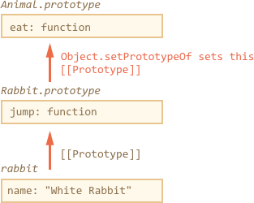

# Class patterns

There's a special syntax construct and a keyword `class` in JavaScript. But before turning to it, we should consider that the term "class" comes the theory of OOP. And it actually has a broader meaning.

In JavaScript there are several well-known programming patterns to make classes even without using the `class` construct. And here we'll talk about them first.

The `class` construct will come naturally in the next chapter.

When talking about classes, it's important to start from the roots, to evade any ambiguity. So here's the definition of the term.

[cut]

```quote author="Wikipedia"
In object-oriented programming, a *class* is an extensible program-code-template for creating objects, providing initial values for state (member variables) and implementations of behavior (member functions or methods).
```

## Functional class pattern

The constructor function below can be considered a class according to the definition:

```js run
function User(name) {
  this.sayHi = function() {
    alert(name;
  };
}

let user = new User("John");
user.sayHi(); // John
```

It follows all parts of the definition:

1. It is a program-code-template for creating objects (callable with `new`).
2. It provides initial values for state (`name` from parameters).
3. It provides methods (`sayHi`).

This is called *functional class pattern*. It is rarely used, because prototypes are generally better. 

Here's the same class rewritten using prototypes:

```js run
function User(name) {
  this.name = name;
}

User.prototype.sayHi = function() {
  alert(this.name);
};

let user = new User("John");
user.sayHi(); // John
```

Now the method `sayHi` is shared between all users through prototype. That's more memory-efficient as putting a copy of it into every object like the functional pattern does. Prototype-based classes are also more convenient for inheritance. As we've seen, that's what the language itself uses, and we'll be using them further on.

### Internal properties and methods

In the functional class pattern, variables and functions inside `User`, that are not assigned to `this`, are visible from inside, but not accessible by the outer code.

Here's a bigger example:

```js run
function User(name, birthday) {

  function calcAge() {
    new Date().getFullYear() - birthday.getFullYear();
  }

  this.sayHi = function() {
    alert(name + ', age:' + calcAge());
  };
}

let user = new User("John", new Date(2000,0,1));
user.sayHi(); // John
```

Variables `name`, `birthday` and the function `calcAge()` are internal, *private* to the object. They are only visible from inside of it. The external code that creates the `user` only can see a *public* method `sayHi`.

In short, functional classes provide a shared outer lexical environment for private variables and methods.

Prototype-bases classes do not have it. As we can see, methods are created outside of the constructor, in the prototype. And per-object data like `name` is stored in object properties. So, technically they are all available for external code.

But there is a widely known agreement that internal properties are prepended with an underscore `"_"`.

Like this:

```js run
function User(name, birthday) {
*!*
  this._name = name;
  this._birthday = birthday;
*/!*
}

*!*
User.prototype._calcAge = function() {
*/!*
  return new Date().getFullYear() - this._birthday.getFullYear();
};

User.prototype.sayHi = function() {
  alert(this._name + ', age:' + this._calcAge());
};

let user = new User("John", new Date(2000,0,1));
user.sayHi(); // John
```

Technically, that changes nothing. But most developers recognize the meaning of `"_"` and try not to touch prefixed properties and methods in external code. 

## Prototype-based classes

Prototype-based classes are structured like this:


The code example:

```js run
function Animal(name) {
  this.name = name;
}

Animal.prototype.eat = function() {
  alert(this.name + ' eats.');
};

function Rabbit(name) {
  this.name = name;
}

*!*
// inherit methods
Object.setPrototypeOf(Rabbit.prototype, Animal.prototype); // (*)
*/!*

Rabbit.prototype.jump = function() {
  alert(this.name + ' jumps!');
};

let rabbit = new Rabbit("White Rabbit")
rabbit.eat();
rabbit.jump();
```

Here the line `(*)` sets up the prototype chain. So that `rabbit` first searches methods in `Rabbit.prototype`, then `Animal.prototype`. And then `Object.prototype`, because `Animal.prototype` is a regular plain object, so it inherits from it, that's not painted for brevity.

The structure of exactly that code piece is:




## Todo

call parent method (overrides)


