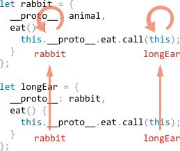

# Classes

The "class" construct allows to define prototype-based classes with a much more comfortable syntax than before.

But more than that -- there are also other inheritance-related features baked in.

[cut]

## The "class" syntax

<!--The class syntax is versatile, so we'll first see the overall picture and then explore it by examples.-->

The class syntax is versatile, so we'll start from a simple class, and then build on top of it.

A prototype-based class `User`:

```js 
function User(name) {
  this.name = name;
}

User.prototype.sayHi = function() {
  alert(this.name);
}
```

Can be rewritten as:

```js
class User {
  
  constructor(name) {
    this.name = name;
  }

  sayHi() {
    alert(this.name);
  }

}
```

The `"class"` construct is tricky from the beginning. We may think that it defines a new lanuage-level entity, but no!

The resulting variable `User` is actually a function labelled as a `"constructor"`. The value of `User.prototype` is an object with methods listed in the definition. Here it includes `sayHi` and, well, the reference to `constructor` also.


Here, let's check it:

```js run
class User {
  constructor(name) { this.name = name; }
  sayHi() { alert(this.name);  }
}

// proof: User is the same as constructor
alert(User == User.prototype.constructor); // true

// And there are two methods in its "prototype"
alert(Object.getOwnPropertyNames(User.prototype)); // constructor, sayHi

// The usage is same:
let user = new User("John");
user.sayHi(); // John
```

The class constructor function has two special features:

- It can't be called without `new`.
- If we output it like `alert(User)`, some engines show `"class User..."`, while others show `"function User..."`. Please don't be confused: the string representation may vary, but that doesn't affect anything.

Please note that no code statements and `property:value` assignments are allowed inside `class`. There may be only methods (without a comma between them) and getters/setters.

Here we use a getter/setter pair for `name` to make sure that it is valid:

```js run
class User {
  
  constructor(name) {
    // invokes the setter
    this.name = name;
  }

*!*
  get name() {
*/!*
    return this._name;
  }

*!*
  set name(value) {
*/!*
    if (value.length < 4) {
      throw new Error("Name too short.");
    }
    this._name = value;
  }

}

let user = new User("John");
alert(user.name); // John

user = new User(""); // Error: name too short
```

```smart header="Class methods are non-enumerable"
Class definition sets `enumerable` flag to `false` for all methods in the `"prototype"`. That's good, because if we `for..in` over an object, we usually don't want its methods.
```

```smart header="What if there's no constructor?"
If there's no `constructor` in the `class` construct, then an empty function is generated, same as `constructor() {}`. So things still work the same way.
```


## Class Expression

Just like functions, classes can be defined inside any other expression, passed around, returned from functions etc:

```js run
function getClass() {
*!*
  return class {
    sayHi() { 
      alert("Hello");
    };
  };
*/!*
}

let User = getClass();

new User().sayHi(); // Hello
```

That's normal if we recall that `class` is just a special form of constructor-and-prototype definition.

Such classes also may have a name, that is visible inside that class only:

```js run
let User = class *!*MyClass*/!* {
  sayHi() {
    alert(MyClass);
  }
};

new User().sayHi(); // works

alert(MyClass); // error, MyClass is only visible in methods of the class
```


## Inheritance, super

To inherit from another class, we can specify `"extends"` and the parent class before the brackets `{..}`.

Here `Rabbit` inherits from `Animal`:

```js run
class Animal {
  
  constructor(name) {
    this.speed = 0;
    this.name = name;
  }

  run(speed) {
    this.speed += speed;
    alert(`${this.name} runs with speed ${this.speed}.`);
  }

  stop() {
    this.speed = 0;
    alert(`${this.name} stopped.`);
  }

}

*!*
// Inherit from Animal
class Rabbit extends Animal {
  hide() {
    alert(`${this.name} hides!`);
  }
}
*/!*

let rabbit = new Rabbit("White Rabbit");

rabbit.run(5); // White Rabbit runs with speed 5.
rabbit.hide(); // White Rabbit hides!
```

The `extends` keyword adds a `[[Prototype]]` reference from `Rabbit.prototype` to `Animal.prototype`, just as you expect it to be, and as we've seen before.

Now let's move forward and override a method. Naturally, if we specify our own `stop` in `Rabbit`, then the inherited one will not be called:

```js
class Rabbit extends Animal {
  stop() {
    // ...this will be used for rabbit.stop() 
  }
}
```

...But usually we don't want to fully replace a parent method, but rather to build on top of it, tweak or extend its functionality. So we do something in our method, but call the parent method before/after or in the process.

Classes provide `"super"` keyword for that.

- `super.method(...)` to call a parent method.
- `super(...)` to call a parent constructor (inside our constructor only).

For instance, let our rabbit autohide when stopped:

```js run
class Animal {
  
  constructor(name) {
    this.speed = 0;
    this.name = name;
  }

  run(speed) {
    this.speed += speed;
    alert(`${this.name} runs with speed ${this.speed}.`);
  }

  stop() {
    this.speed = 0;
    alert(`${this.name} stopped.`);
  }

}

class Rabbit extends Animal {
  hide() {
    alert(`${this.name} hides!`);
  }

*!*
  stop() {
    super.stop(); // call parent stop
    hide(); // and then hide
  }
*/!*
}

let rabbit = new Rabbit("White Rabbit");

rabbit.run(5); // White Rabbit runs with speed 5.
rabbit.stop(); // White Rabbit stopped. White rabbit hides!
```

With constructors, it is a bit more tricky.

Let's add a constructor to `Rabbit` that specifies the ear length:

```js run
class Animal {
  
  constructor(name) {
    this.speed = 0;
    this.name = name;
  }

  // ...
}

class Rabbit extends Animal {

*!*
  constructor(name, earLength) {
    this.speed = 0;
    this.name = name;
    this.earLength = earLength;
  }
*/!*

  // ...
}

*!*
// Doesn't work!
let rabbit = new Rabbit("White Rabbit", 10); // Error
*/!*
```

Wops! We've got an error, now we can't create rabbits. What went wrong?

The short answer is: "constructors in inheriting classes must call `super(...)`, and do it before using `this`".

...But why? What's going on here? Indeed, the requirement seems strange.

Of course, there's an explanation.

In JavaScript, there's a distinction between a constructor function of an inheriting class and all others. If there's an `extend`, then the constructor is labelled with an internal property `[[ConstructorKind]]:"derived"`.

- When a normal constructor runs, it creates an empty object as `this` and continues with it.
- But when a derived constructor runs, it doesn't do it. It expects the parent constructor to do this job.

So we have a choice:

- Either do not specify a constructor in the inheriting class at all. Then it will be created by default as `constructor(...args) { super(...args); }`, so `super` will be called.
- Or if we specify it, then we must call `super`, at least to create `this`. The topmost constructor in the inheritance chain is not derived, so it will make it.

The working variant:

```js run
class Animal {
  
  constructor(name) {
    this.speed = 0;
    this.name = name;
  }

  // ...
}

class Rabbit extends Animal {

  constructor(name, earLength) {
*!*
    super(name);
*/!*
    this.earLength = earLength;
  }

  // ...
}

*!*
// now fine
let rabbit = new Rabbit("White Rabbit", 10); 
alert(rabbit.name); // White Rabbit
alert(rabbit.earLength); // 10
*/!*
```


## Super: internals, [[HomeObject]]

Let's get a little deeper under the hood of `super` and learn some interesting things by the way.

First to say, from all components that we've learned till now, it's impossible for `super` to work.

Indeed, how it can work? When an object method runs, all it knows is `this`. If `super` wants to take parent methods, maybe it can just use its `[[Prototype]]`?

Let's try to do it. Without classes, using bare objects at first.

Here, `rabbit.eat()` should call `animal.eat()`. 

```js run
let animal = {
  name: "Animal",
  eat() {
    alert(this.name + " eats.");
  }
};

let rabbit = {
  __proto__: animal,
  name: "Rabbit",
  eat() {
*!*
    this.__proto__.eat.call(this); // (*)
*/!*
  }
};

rabbit.eat(); // Rabbit eats.
```

At the line `(*)` we take `eat` from the prototype (`animal`) and call it in the context of the current object. Please note that `.call(this)` is important here, because a simple `this.__proto__.eat()` would execute parent `eat` in the context of the prototype, not the current object. 

And it works. 


Now let's add one more object to the chain, and see how things break:

```js run
let animal = {
  name: "Animal",
  eat() {
    alert(this.name + " eats.");
  }
};

let rabbit = {
  __proto__: animal,
  eat() {
    // bounce around rabbit-style and call parent
    this.__proto__.eat.call(this);
  }
};

let longEar = {
  __proto__: rabbit,
  eat() {
    // do something with long ears and call parent  
    this.__proto__.eat.call(this);
  }
};

*!*
longEar.eat(); // Error: Maximum call stack size exceeded 
*/!*
```

Doesn't work any more! If we trace `longEar.eat()` call, it becomes obvious, why:

1. Inside `longEar.eat()`, we pass the call to `rabbit.eat` giving it the same `this=longEar`.
2. Inside `rabbit.eat`, we want to pass the call even higher in the chain, but `this=longEar`, so `this.__proto__.eat` ends up being the same `rabbit.eat`!
3. ...So it calls itself in the endless loop.



There problem seems unsolvable, because `this` must always be the calling object itself, no matter which parent method is called. So its prototype will always be the immediate parent of the object. We can't ascend any further.

To provide the solution, JavaScript adds one more special property for functions: `[[HomeObject]]`.

**When a function is specified as a class or object method, its `[[HomeObject]]` property becomes that object.**

This actually violates the idea of "unbound" functions, because methods remember their objects. And `[[HomeObject]]` can't be changed, so this bound is forever. 

But `[[HomeObject]]` is used only for calling parent methods, to resolve the prototype. So it doesn't break compatibility.

Let's see how it works:

```js run
let animal = {
  name: "Animal",
  eat() {         // [[HomeObject]] == animal
    alert(this.name + " eats.");
  }
};

let rabbit = {
  __proto__: animal,
  name: "Rabbit",
  eat() {         // [[HomeObject]] == rabbit
    super.eat();
  }
};

let longEar = {
  __proto__: rabbit,
  name: "Long Ear",
  eat() {         // [[HomeObject]] == longEar
    super.eat();
  }
};

*!*
longEar.eat();  // Long Ear eats.
*/!*
```

Okay now, because `super` always resolves the parent relative to the method's `[[HomeObject]]`. 

`[[HomeObject]]` works both in classes and objects. But for objects, methods must be specified exactly the given way: as `method()`, not as `"method: function()"`.

Here non-method syntax is used, so `[[HomeObject]]` property is not set and the inheritance doesn't work:

```js run
let animal = {
  eat: function() { // should be the short syntax: eat() {...}
    // ...
  }
};

let rabbit = {
  __proto__: animal,
  eat: function() {
    super.eat();
  }
};

*!*
rabbit.eat();  // Error in super, because there's no [[HomeObject]]
*/!*
```

## Static methods

Static methods are bound to the class function, not to its `"prototype"`.

An example:

```js run
class User {
*!*
  static staticMethod() {
*/!*
    alert(this == User); 
  }
}

User.staticMethod(); // true
```

That actually does the same as assigning it as a function property:

```js 
function User() { }

User.staticMethod = function() { 
  alert(this == User);
};
```

The value of `this` inside `User.staticMethod()` is the class constructor `User` itself (the "object before dot" rule).

Usually, static methods are used when the code is related to the class, but not to a particular object of it.

For instance, we have `Article` objects and need a function to compare them. The natural choice would be `Article.compare`, like this:

```js run
class Article {
  constructor(title, date) {
    this.title = title;
    this.date = date;
  }

*!*
  static compare(articleA, articleB) {
    return articleA.date - articleB.date;
  }
*/!*
}

// usage
let articles = [
  new Article("Mind", new Date(2016, 1, 1)),
  new Article("Body", new Date(2016, 0, 1)),
  new Article("JavaScript", new Date(2016, 11, 1))
];

*!*
articles.sort(Article.compare);
*/!*

alert( articles[0].title ); // Body
```

Here `Article.compare` stands "over" the articles, as a meants to compare them.

Another example would be a so-called "factory" method, that creates an object with specific parameters. 

Like `Article.createTodays()` here:

```js run
class Article {
  constructor(title, date) {
    this.title = title;
    this.date = date;
  }

*!*
  static createTodays() {
    // remember, this = Article
    return new this("Todays digest", new Date());
  }
*/!*
}

let article = article.createTodays();

alert( articles.title ); // Todays digest
```

Now every time we need to create a todays digest, we can call `Article.createTodays()`. 

Static methods are often used in database-related classes to search/save/remove entries from the database by a query, without having them at hand.


### Static methods and inheritance

Todo: picture with function -> prototype and vertical link for functions


## Todo absent constructor

for simple classes parse `constructor( ){ }`
for derived `constructor(... args){ super (...args);}`