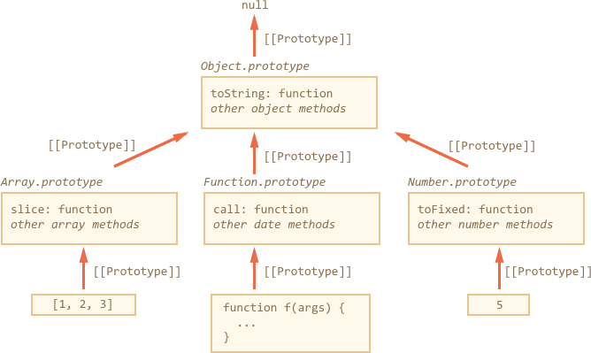

# Native prototypes

All built-in objects such as `Array`, `Date`, `Function` and others also keep methods in prototypes.

For instance, when we create an array, `[1, 2, 3]`, the default `new Array()` constructor is  used internally. So the array data is written into the new object, and `Array.prototype` becomes its prototype and provides methods. That's very memory-efficient.

By specification, all built-in prototypes have `Object.prototype` on the top. Sometimes people say that "everything inherits from objects".

[cut]

Here's the overall picture (for 3 built-ins to fit):



Let's check the prototypes: is the picture correct?

```js run
let arr = [1, 2, 3];

// it inherits from Array.prototype?
alert( arr.__proto__ === Array.prototype ); // true

// then from Object.prototype?
alert( arr.__proto__.__proto__ === Object.prototype ); // true

// and null on the top.
alert( arr.__proto__.__proto__.__proto__ ); // null
```

Some methods in prototypes may overlap, for instance, `Array.prototype` has its own `toString` that lists comma-delimited elements:

```js run
let arr = [1, 2, 3]
alert(arr); // 1,2,3 <-- the result of Array.prototype.toString
```

As we've seen before, `Object.prototype` has `toString` as well, but `Array.prototype` is closer in the chain, so the array variant is used.


Functions also work the same way. They are objects of a built-in `Function` constructor, and their methods: `call/apply` and others are taken from `Function.prototype`. Functions have their own `toString` too.

The most intricate thing happens with strings, numbers and booleans.

As we remember, they are not objects. But if we try to access their properties, then temporary wrapper objects are created using built-in constructors `String`, `Number`, `Boolean`, they provide the methods and disappear. These objects are created invisibly to us and most engines optimize them out, but the specification describes it exactly this way. Methods of these objects also reside in prototypes, available as `String.prototype`, `Number.prototype` and `Boolean.prototype`.

````warn header="Constructors `String/Number/Boolean` are for internal use only"
Technically, we can create "wrapper objects" for primitives manually using `new Number(1)`. But things will go crazy in many places.

For instance:

```js run
alert( typeof 1 ); // "number"

alert( typeof new Number(1) ); // "object"!
```

And, because it's an object:

```js run
let zero = new Number(0);

if (zero) { // zero is true, because it's an object
  alert( "zero is true in the boolean context?!?" );
}
```

The same functions `String/Number/Boolean` without `new` have a totally different behavior: they convert a value to the corresponding type: to a string, a number, or a boolean.

This is totally valid:
```js
let num = Number("123"); // convert a string to number
```
````

```warn header="Values `null` and `undefined` have no object wrappers"
Special values `null` and `undefined` stand apart. They have no object wrappers, so methods and properties are not available for them.
```

## Changing native prototypes [#native-prototype-change]

Native prototypes can be modified. For instance, if we add a method to `String.prototype`,  it becomes available to all strings:

```js run
String.prototype.show = function() {
  alert(this);
};

"BOOM!".show(); // BOOM!
```

During the process of development we may have ideas which new built-in methods we'd like to have. And there may be a slight temptation to add them to native prototypes. But that is generally a bad idea.

Prototypes are global, so it's easy to get a conflict. If two libraries add a method `String.prototype.show`, then one of them overwrites the other one.

In modern programming, there is only one case when modifying native prototypes is approved. That's polyfills. In other words, if there's a method in Javascript specification that is not yet supported by our Javascript engine (or any of those that we want to support), then may implement it manually and populate the built-in prototype with it.

For instance:

```js run
if (!String.prototype.repeat) { // if there's no such method
  // add it to the prototype

  String.prototype.repeat = function(n) {
    // repeat the string n times

    // actually, the code should be more complex than that,
    // throw errors for negative values of "n"
    // the full algorithm is in the specification
    return new Array(n + 1).join(this);
  };
}

alert( "La".repeat(3) ); // LaLaLa
```

## Borrowing from prototypes

In the chapter <info:call-apply-decorators#method-borrowing> we talked about method borrowing:

```js run
function showArgs() {
*!*
  // borrow join from array and call in the context of arguments
  alert( [].join.call(arguments, " - ") );
*/!*
}

showList("John", "Pete", "Alice"); // John - Pete - Alice
```

Because `join` resides in `Array.prototype`, we can call it from there directly and rewrite it as:

```js
function showArgs() {
*!*
  alert( Array.prototype.join.call(arguments, " - ") );
*/!*
}
```

That's more efficient, because evades creation of an extra array object `[]`. From the other side -- more letters to write it.

## Summary [todo]

- Методы встроенных объектов хранятся в их прототипах.
- Встроенные прототипы можно расширить или поменять.
- Добавление методов в `Object.prototype`, если оно не сопровождается `Object.defineProperty` с установкой `enumerable` (IE9+), "сломает" циклы `for..in`, поэтому стараются в этот прототип методы не добавлять.

    Другие прототипы изменять менее опасно, но все же не рекомендуется во избежание конфликтов.

    Отдельно стоит изменение с целью добавления современных методов в старые браузеры, таких как <a href="https://developer.mozilla.org/en/JavaScript/Reference/Global_Objects/Object/create">Object.create</a>, <a href="https://developer.mozilla.org/en/JavaScript/Reference/Global_Objects/Object/keys">Object.keys</a>, <a href="https://developer.mozilla.org/en/JavaScript/Reference/Global_Objects/Function/bind">Function.prototype.bind</a> и т.п. Это допустимо и как раз делается [es5-shim](https://github.com/kriskowal/es5-shim).
