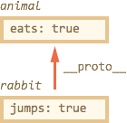

# Прототип объекта

Объекты в JavaScript можно организовать в цепочки, так, чтобы если свойство не найдено в одном объекте -- оно автоматически искалось бы его в другом.

Связующим звеном выступает специальное свойство `__proto__`.

[cut]
## Прототип __proto__ 

Если один объект имеет специальную ссылку `__proto__` на другой объект, то при чтении свойства из него, если свойство отсутствует в самом объекте, оно ищется в объекте `__proto__`.

Свойство `__proto__` доступно во всех браузерах, кроме IE10-, а в более старых IE оно, конечно же, тоже есть, но напрямую к нему не обратиться, требуются чуть более сложные способы, которые мы рассмотрим позднее.

Пример кода (кроме IE10-):

```js
//+ run
var animal = {
  eats: true
};
var rabbit = {
  jumps: true
};

*!*
rabbit.__proto__ = animal;
*/!*

// в rabbit можно найти оба свойства
alert( rabbit.jumps ); // true
alert( rabbit.eats ); // true
```

<ol>
<li>Первый `alert` здесь работает очевидным образом -- он выводит свойство `jumps` объекта `rabbit`.</li>
<li>Второй `alert` хочет вывести `rabbit.eats`, ищет его в самом объекте `rabbit`, не находит -- и продолжает поиск в объекте `rabbit.__proto__`, то есть, в данном случае, в `animal`.</li>
</ol>

Иллюстрация происходящего при чтении `rabbit.eats` (поиск идет снизу вверх):



**Объект, на который указывает ссылка `__proto__`, называется *"прототипом"*. В данном случае получилось, что `animal` является прототипом для `rabbit`.**

**Также говорят, что объект `rabbit` *"прототипно наследует"* от `animal`.**

Обратим внимание -- прототип используется исключительно при чтении. Запись значения, например, `rabbit.eats = value` или удаление `delete rabbit.eats` -- работает напрямую с объектом. 

В примере ниже мы записываем свойство в сам `rabbit`, после чего `alert` перестаёт брать его у прототипа, а берёт уже из самого объекта:

```js
//+ run
var animal = {
  eats: true
};
var rabbit = {
  jumps: true,
  eats: false
};

rabbit.__proto__ = animal;

*!*
alert( rabbit.eats ); // false, свойство взято из rabbit 
*/!*
```

**Другими словами, прототип -- это "резервное хранилище свойств и методов" объекта, автоматически используемое при поиске.**

У объекта, который является `__proto__`, может быть свой `__proto__`, у того -- свой, и так далее. При этом свойства будут искаться по цепочке.

[smart header="Ссылка __proto__ в спецификации"]
Если вы будете читать спецификацию EcmaScript -- свойство `__proto__` обозначено в ней как `[[Prototype]]`. 

Двойные квадратные скобки здесь важны, чтобы не перепутать его с совсем другим свойством, которое называется `prototype`, и которое мы рассмотрим позже.
[/smart]

 
## Метод hasOwnProperty

Обычный цикл `for..in` не делает различия между свойствами объекта и его прототипа.

Он перебирает всё, например:

```js
//+ run
var animal = {
  eats: true
};

var rabbit = {
  jumps: true,
  __proto__: animal
};

*!*
for (var key in rabbit) {
  alert( key + " = " + rabbit[key] ); // выводит и "eats" и "jumps"
}
*/!*
```

Иногда хочется посмотреть, что находится именно в самом объекте, а не в прототипе.

**Вызов [obj.hasOwnProperty(prop)](https://developer.mozilla.org/en/JavaScript/Reference/Global_Objects/Object/HasOwnProperty) возвращает `true`, если свойство `prop` принадлежит самому объекту `obj`, иначе `false`.**

Например:

```js
//+ run
var animal = {
  eats: true
};

var rabbit = {
  jumps: true,
  __proto__: animal
};

*!*
alert( rabbit.hasOwnProperty('jumps') ); // true: jumps принадлежит rabbit

alert( rabbit.hasOwnProperty('eats') ); // false: eats не принадлежит
*/!*
```

Для того, чтобы перебрать свойства самого объекта, достаточно профильтровать `key` через `hasOwnProperty`:

```js
//+ run
var animal = {
  eats: true
};

var rabbit = {
  jumps: true,
  __proto__: animal
};

for (var key in rabbit) {
*!*
  if (!rabbit.hasOwnProperty(key)) continue; // пропустить "не свои" свойства
*/!*
  alert( key + " = " + rabbit[key] ); // выводит только "jumps"
}
```


## Методы для работы с __proto__

В современных браузерах есть два дополнительных метода для работы с `__proto__`. Зачем они нужны, если есть `__proto__`? В общем-то, не очень нужны, но по историческим причинам тоже существуют.

<dl>
<dt>Чтение: [Object.getPrototypeOf(obj)](https://developer.mozilla.org/en/JavaScript/Reference/Global_Objects/Object/getPrototypeOf)</dt>
<dd>Возвращает `obj.__proto__` (кроме IE8-)</dd>
<dt>Запись: [Object.setPrototypeOf(obj, proto)](https://developer.mozilla.org/en/JavaScript/Reference/Global_Objects/Object/setPrototypeOf)</dt>
<dd>Устанавливает `obj.__proto__ = proto` (кроме IE10-).</dd>
</dl>

Кроме того, есть ещё один вспомогательный метод:
<dt>Создание объекта с прототипом: [Object.create(proto, descriptors)](https://developer.mozilla.org/en/JavaScript/Reference/Global_Objects/Object/create)</dt>
<dd>Создаёт пустой объект с `__proto__`, равным первому аргументу (кроме IE8-), второй необязательный аргумент может содержать [дескрипторы свойств](/descriptors-getters-setters).</dd>
</dl>

## Итого


<ul>
<li>В JavaScript есть встроенное "наследование" между объектами при помощи специального свойства `__proto__`.</li>
<li>При установке свойства `rabbit.__proto__ = animal` говорят, что объект `animal` будет "прототипом" `rabbit`.</li>
<li>При чтении свойства из объекта, если его в нём нет, оно ищется в `__proto__`. Прототип задействуется только при чтении свойства. Операции присвоения `obj.prop =` или удаления `delete obj.prop` совершаются всегда над самим объектом `obj`.</li>
</ul>

Несколько прототипов одному объекту присвоить нельзя, но можно организовать объекты в цепочку, когда один объект ссылается на другой при помощи `__proto__`, тот ссылается на третий, и так далее.

В современных браузерах есть методы для работы с прототипом:

<ul>
<li>[Object.getPrototypeOf(obj)](https://developer.mozilla.org/en/JavaScript/Reference/Global_Objects/Object/getPrototypeOf) (кроме IE8-)</li>
<li>[Object.setPrototypeOf(obj, proto)](https://developer.mozilla.org/en/JavaScript/Reference/Global_Objects/Object/setPrototypeOf) (кроме IE10-)</li>
<li>[Object.create(proto, descriptors)](https://developer.mozilla.org/en/JavaScript/Reference/Global_Objects/Object/create) (кроме IE8-)</li>
</ul>

Возможно, вас смущает недостаточная поддержка `__proto__` в старых IE. Но это не страшно. В последующих главах мы рассмотрим дополнительные методы работы с `__proto__`, включая те, которые работают везде.

Также мы рассмотрим, как свойство `__proto__` используется внутри самого языка JavaScript и как организовать классы с его помощью.


[head]
<script>
function inherit(proto) {
  function F() {}     
  F.prototype = proto;
  return new F();
}
</script>
[/head]