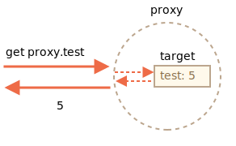

# Proxy and Reflect

A `Proxy` object wraps another object and intercepts operations, like reading/writing properties and others, optionally handling them on its own, or transparently allowing the object to handle them.

Proxies are used in many libraries and some browser frameworks. We'll see many practical applications in this article.

## Proxy

The syntax:

```js
let proxy = new Proxy(target, handler)
```

- `target` -- is an object to wrap, can be anything, including functions.
- `handler` -- proxy configuration: an object with "traps", methods that intercept operations. - e.g. `get` trap for reading a property of `target`, `set` trap for writing a property into `target`, and so on.

For operations on `proxy`, if there's a corresponding trap in `handler`, then it runs, and the proxy has a chance to handle it, otherwise the operation is performed on `target`.

As a starting example, let's create a proxy without any traps:

```js run
let target = {};
let proxy = new Proxy(target, {}); // empty handler

proxy.test = 5; // writing to proxy (1)
alert(target.test); // 5, the property appeared in target!

alert(proxy.test); // 5, we can read it from proxy too (2)

for(let key in proxy) alert(key); // test, iteration works (3)
```

As there are no traps, all operations on `proxy` are forwarded to `target`.

1. A writing operation `proxy.test=` sets the value on `target`.
2. A reading operation `proxy.test` returns the value from `target`.
3. Iteration over `proxy` returns values from `target`.

As we can see, without any traps, `proxy` is a transparent wrapper around `target`.



`Proxy` is a special "exotic object". It doesn't have own properties. With an empty `handler` it transparently forwards operations to `target`.

To activate more capabilities, let's add traps.

What can we intercept with them?

For most operations on objects, there's a so-called "internal method" in the JavaScript specification that describes how it works at the lowest level. For instance `[[Get]]`, the internal method to read a property, `[[Set]]`, the internal method to write a property, and so on. These methods are only used in the specification, we can't call them directly by name.

Proxy traps intercept invocations of these methods. They are listed in the [Proxy specification](https://tc39.es/ecma262/#sec-proxy-object-internal-methods-and-internal-slots) and in the table below.

For every internal method, there's a trap in this table: the name of the method that we can add to the `handler` parameter of `new Proxy` to intercept the operation:

| Internal Method | Handler Method | Triggers when... |
|-----------------|----------------|-------------|
| `[[Get]]` | `get` | reading a property |
| `[[Set]]` | `set` | writing to a property |
| `[[HasProperty]]` | `has` | `in` operator |
| `[[Delete]]` | `deleteProperty` | `delete` operator |
| `[[Call]]` | `apply` | function call |
| `[[Construct]]` | `construct` | `new` operator |
| `[[GetPrototypeOf]]` | `getPrototypeOf` | [Object.getPrototypeOf](mdn:/JavaScript/Reference/Global_Objects/Object/getPrototypeOf) |
| `[[SetPrototypeOf]]` | `setPrototypeOf` | [Object.setPrototypeOf](mdn:/JavaScript/Reference/Global_Objects/Object/setPrototypeOf) |
| `[[IsExtensible]]` | `isExtensible` | [Object.isExtensible](mdn:/JavaScript/Reference/Global_Objects/Object/isExtensible) |
| `[[PreventExtensions]]` | `preventExtensions` | [Object.preventExtensions](mdn:/JavaScript/Reference/Global_Objects/Object/preventExtensions) |
| `[[DefineOwnProperty]]` | `defineProperty` | [Object.defineProperty](mdn:/JavaScript/Reference/Global_Objects/Object/defineProperty), [Object.defineProperties](mdn:/JavaScript/Reference/Global_Objects/Object/defineProperties) |
| `[[GetOwnProperty]]` | `getOwnPropertyDescriptor` | [Object.getOwnPropertyDescriptor](mdn:/JavaScript/Reference/Global_Objects/Object/getOwnPropertyDescriptor), `for..in`, `Object.keys/values/entries` |
| `[[OwnPropertyKeys]]` | `ownKeys` | [Object.getOwnPropertyNames](mdn:/JavaScript/Reference/Global_Objects/Object/getOwnPropertyNames), [Object.getOwnPropertySymbols](mdn:/JavaScript/Reference/Global_Objects/Object/getOwnPropertySymbols), `for..in`, `Object.keys/values/entries` |

```warn header="Invariants"
JavaScript enforces some invariants -- conditions that must be fulfilled by internal methods and traps.

Most of them are for return values:
- `[[Set]]` must return `true` if the value was written successfully, otherwise `false`.
- `[[Delete]]` must return `true` if the value was deleted successfully, otherwise `false`.
- ...and so on, we'll see more in examples below.

There are some other invariants, like:
- `[[GetPrototypeOf]]`, applied to the proxy object must return the same value as `[[GetPrototypeOf]]` applied to the proxy object's target object. In other words, reading prototype of a proxy must always return the prototype of the target object.

Traps can intercept these operations, but they must follow these rules.

Invariants ensure correct and consistent behavior of language features. The full invariants list is in [the specification](https://tc39.es/ecma262/#sec-proxy-object-internal-methods-and-internal-slots). You probably won't violate them if you're not doing something weird.
```

Let's see how that works in practical examples.

## Default value with "get" trap

The most common traps are for reading/writing properties.

To intercept reading, the `handler` should have a method `get(target, property, receiver)`.

It triggers when a property is read, with following arguments:

- `target` -- is the target object, the one passed as the first argument to `new Proxy`,
- `property` -- property name,
- `receiver` -- if the target property is a getter, then `receiver` is the object that's going to be used as `this` in its call. Usually that's the `proxy` object itself (or an object that inherits from it, if we inherit from proxy). Right now we don't need this argument, so it will be explained in more detail later.

Let's use `get` to implement default values for an object.

We'll make a numeric array that returns `0` for nonexistent values.

Usually when one tries to get a non-existing array item, they get `undefined`, but we'll wrap a regular array into the proxy that traps reading and returns `0` if there's no such property:

```js run
let numbers = [0, 1, 2];

numbers = new Proxy(numbers, {
  get(target, prop) {
    if (prop in target) {
      return target[prop];
    } else {
      return 0; // default value
    }
  }
});

*!*
alert( numbers[1] ); // 1
alert( numbers[123] ); // 0 (no such item)
*/!*
```

As we can see, it's quite easy to do with a `get` trap.

We can use `Proxy` to implement any logic for "default" values.

Imagine we have a dictionary, with phrases and their translations:

```js run
let dictionary = {
  'Hello': 'Hola',
  'Bye': 'Adiós'
};

alert( dictionary['Hello'] ); // Hola
alert( dictionary['Welcome'] ); // undefined
```

Right now, if there's no phrase, reading from `dictionary` returns `undefined`. But in practice, leaving a phrase untranslated is usually better than `undefined`. So let's make it return an untranslated phrase in that case instead of `undefined`.

To achieve that, we'll wrap `dictionary` in a proxy that intercepts reading operations:

```js run
let dictionary = {
  'Hello': 'Hola',
  'Bye': 'Adiós'
};

dictionary = new Proxy(dictionary, {
*!*
  get(target, phrase) { // intercept reading a property from dictionary
*/!*
    if (phrase in target) { // if we have it in the dictionary
      return target[phrase]; // return the translation
    } else {
      // otherwise, return the non-translated phrase
      return phrase;
    }
  }
});

// Look up arbitrary phrases in the dictionary!
// At worst, they're not translated.
alert( dictionary['Hello'] ); // Hola
*!*
alert( dictionary['Welcome to Proxy']); // Welcome to Proxy (no translation)
*/!*
```

````smart
Please note how the proxy overwrites the variable:

```js
dictionary = new Proxy(dictionary, ...);
```

The proxy should totally replace the target object everywhere. No one should ever reference the target object after it got proxied. Otherwise it's easy to mess up.
````

## Validation with "set" trap

Let's say we want an array exclusively for numbers. If a value of another type is added, there should be an error.

The `set` trap triggers when a property is written.

`set(target, property, value, receiver)`:

- `target` -- is the target object, the one passed as the first argument to `new Proxy`,
- `property` -- property name,
- `value` -- property value,
- `receiver` -- similar to `get` trap, matters only for setter properties.

The `set` trap should return `true` if setting is successful, and `false` otherwise (triggers `TypeError`).

Let's use it to validate new values:

```js run
let numbers = [];

numbers = new Proxy(numbers, { // (*)
*!*
  set(target, prop, val) { // to intercept property writing
*/!*
    if (typeof val == 'number') {
      target[prop] = val;
      return true;
    } else {
      return false;
    }
  }
});

numbers.push(1); // added successfully
numbers.push(2); // added successfully
alert("Length is: " + numbers.length); // 2

*!*
numbers.push("test"); // TypeError ('set' on proxy returned false)
*/!*

alert("This line is never reached (error in the line above)");
```

Please note: the built-in functionality of arrays is still working! Values are added by `push`. The `length` property auto-increases when values are added. Our proxy doesn't break anything.

We don't have to override value-adding array methods like `push` and `unshift`, and so on, to add checks in there, because internally they use the `[[Set]]` operation that's intercepted by the proxy.

So the code is clean and concise.

```warn header="Don't forget to return `true`"
As said above, there are invariants to be held.

For `set`, it must return `true` for a successful write.

If we forget to do it or return any falsy value, the operation triggers `TypeError`.
```

## Iteration with "ownKeys" and "getOwnPropertyDescriptor"

`Object.keys`, `for..in` loop and most other methods that iterate over object properties use `[[OwnPropertyKeys]]` internal method (intercepted by `ownKeys` trap) to get a list of properties.

Such methods differ in details:
- `Object.getOwnPropertyNames(obj)` returns non-symbol keys.
- `Object.getOwnPropertySymbols(obj)` returns symbol keys.
- `Object.keys/values()` returns non-symbol keys/values with `enumerable` flag (property flags were explained in the article <info:property-descriptors>).
- `for..in` loops over non-symbol keys with `enumerable` flag, and also prototype keys.

...But all of them start with that list.

In the example below we use `ownKeys` trap to make `for..in` loop over `user`, and also `Object.keys` and `Object.values`, to skip properties starting with an underscore `_`:

```js run
let user = {
  name: "John",
  age: 30,
  _password: "***"
};

user = new Proxy(user, {
*!*
  ownKeys(target) {
*/!*
    return Object.keys(target).filter(key => !key.startsWith('_'));
  }
});

// "ownKeys" filters out _password
for(let key in user) alert(key); // name, then: age

// same effect on these methods:
alert( Object.keys(user) ); // name,age
alert( Object.values(user) ); // John,30
```

So far, it works.

Although, if we return a key that doesn't exist in the object, `Object.keys` won't list it:

```js run
let user = { };

user = new Proxy(user, {
*!*
  ownKeys(target) {
*/!*
    return ['a', 'b', 'c'];
  }
});

alert( Object.keys(user) ); // <empty>
```

Why? The reason is simple: `Object.keys` returns only properties with the `enumerable` flag. To check for it, it calls the internal method `[[GetOwnProperty]]` for every property to get [its descriptor](info:property-descriptors). And here, as there's no property, its descriptor is empty, no `enumerable` flag, so it's skipped.

For `Object.keys` to return a property, we need it to either exist in the object, with the `enumerable` flag, or we can intercept calls to `[[GetOwnProperty]]` (the trap `getOwnPropertyDescriptor` does it), and return a descriptor with `enumerable: true`.

Here's an example of that:

```js run
let user = { };

user = new Proxy(user, {
  ownKeys(target) { // called once to get a list of properties
    return ['a', 'b', 'c'];
  },

  getOwnPropertyDescriptor(target, prop) { // called for every property
    return {
      enumerable: true,
      configurable: true
      /* ...other flags, probable "value:..." */
    };
  }

});

alert( Object.keys(user) ); // a, b, c
```

Let's note once again: we only need to intercept `[[GetOwnProperty]]` if the property is absent in the object.

## Protected properties with "deleteProperty" and other traps

There's a widespread convention that properties and methods prefixed by an underscore `_` are internal. They shouldn't be accessed from outside the object.

Technically that's possible though:

```js run
let user = {
  name: "John",
  _password: "secret"
};

alert(user._password); // secret
```

Let's use proxies to prevent any access to properties starting with `_`.

We'll need the traps:
- `get` to throw an error when reading such property,
- `set` to throw an error when writing,
- `deleteProperty` to throw an error when deleting,
- `ownKeys` to exclude properties starting with `_` from `for..in` and methods like `Object.keys`.

Here's the code:

```js run
let user = {
  name: "John",
  _password: "***"
};

user = new Proxy(user, {
*!*
  get(target, prop) {
*/!*
    if (prop.startsWith('_')) {
      throw new Error("Access denied");
    }
    let value = target[prop];
    return (typeof value === 'function') ? value.bind(target) : value; // (*)
  },
*!*
  set(target, prop, val) { // to intercept property writing
*/!*
    if (prop.startsWith('_')) {
      throw new Error("Access denied");
    } else {
      target[prop] = val;
      return true;
    }
  },
*!*
  deleteProperty(target, prop) { // to intercept property deletion
*/!*
    if (prop.startsWith('_')) {
      throw new Error("Access denied");
    } else {
      delete target[prop];
      return true;
    }
  },
*!*
  ownKeys(target) { // to intercept property list
*/!*
    return Object.keys(target).filter(key => !key.startsWith('_'));
  }
});

// "get" doesn't allow to read _password
try {
  alert(user._password); // Error: Access denied
} catch(e) { alert(e.message); }

// "set" doesn't allow to write _password
try {
  user._password = "test"; // Error: Access denied
} catch(e) { alert(e.message); }

// "deleteProperty" doesn't allow to delete _password
try {
  delete user._password; // Error: Access denied
} catch(e) { alert(e.message); }

// "ownKeys" filters out _password
for(let key in user) alert(key); // name
```

Please note the important detail in the `get` trap, in the line `(*)`:

```js
get(target, prop) {
  // ...
  let value = target[prop];
*!*
  return (typeof value === 'function') ? value.bind(target) : value; // (*)
*/!*
}
```

Why do we need a function to call `value.bind(target)`?

The reason is that object methods, such as `user.checkPassword()`, must be able to access `_password`:

```js
user = {
  // ...
  checkPassword(value) {
    // object method must be able to read _password
    return value === this._password;
  }
}
```


A call to `user.checkPassword()` gets proxied `user` as `this` (the object before dot becomes `this`), so when it tries to access `this._password`, the `get` trap activates (it triggers on any property read) and throws an error.

So we bind the context of object methods to the original object, `target`, in the line `(*)`. Then their future calls will use `target` as `this`, without any traps.

That solution usually works, but isn't ideal, as a method may pass the unproxied object somewhere else, and then we'll get messed up: where's the original object, and where's the proxied one?

Besides, an object may be proxied multiple times (multiple proxies may add different "tweaks" to the object), and if we pass an unwrapped object to a method, there may be unexpected consequences.

So, such a proxy shouldn't be used everywhere.

```smart header="Private properties of a class"
Modern JavaScript engines natively support private properties in classes, prefixed with `#`. They are described in the article <info:private-protected-properties-methods>. No proxies required.

Such properties have their own issues though. In particular, they are not inherited.
```

## "In range" with "has" trap

Let's see more examples.

We have a range object:

```js
let range = {
  start: 1,
  end: 10
};
```

We'd like to use the `in` operator to check that a number is in `range`.

The `has` trap intercepts `in` calls.

`has(target, property)`

- `target` -- is the target object, passed as the first argument to `new Proxy`,
- `property` -- property name

Here's the demo:

```js run
let range = {
  start: 1,
  end: 10
};

range = new Proxy(range, {
*!*
  has(target, prop) {
*/!*
    return prop >= target.start && prop <= target.end;
  }
});

*!*
alert(5 in range); // true
alert(50 in range); // false
*/!*
```

Nice syntactic sugar, isn't it? And very simple to implement.

## Wrapping functions: "apply" [#proxy-apply]

We can wrap a proxy around a function as well.

The `apply(target, thisArg, args)` trap handles calling a proxy as function:

- `target` is the target object (function is an object in JavaScript),
- `thisArg` is the value of `this`.
- `args` is a list of arguments.

For example, let's recall `delay(f, ms)` decorator, that we did in the article <info:call-apply-decorators>.

In that article we did it without proxies. A call to `delay(f, ms)` returned a function that forwards all calls to `f` after `ms` milliseconds.

Here's the previous, function-based implementation:

```js run
function delay(f, ms) {
  // return a wrapper that passes the call to f after the timeout
  return function() { // (*)
    setTimeout(() => f.apply(this, arguments), ms);
  };
}

function sayHi(user) {
  alert(`Hello, ${user}!`);
}

// after this wrapping, calls to sayHi will be delayed for 3 seconds
sayHi = delay(sayHi, 3000);

sayHi("John"); // Hello, John! (after 3 seconds)
```

As we've seen already, that mostly works. The wrapper function `(*)` performs the call after the timeout.

But a wrapper function does not forward property read/write operations or anything else. After the wrapping, the access is lost to properties of the original functions, such as `name`, `length` and others:

```js run
function delay(f, ms) {
  return function() {
    setTimeout(() => f.apply(this, arguments), ms);
  };
}

function sayHi(user) {
  alert(`Hello, ${user}!`);
}

*!*
alert(sayHi.length); // 1 (function length is the arguments count in its declaration)
*/!*

sayHi = delay(sayHi, 3000);

*!*
alert(sayHi.length); // 0 (in the wrapper declaration, there are zero arguments)
*/!*
```

`Proxy` is much more powerful, as it forwards everything to the target object.

Let's use `Proxy` instead of a wrapping function:

```js run
function delay(f, ms) {
  return new Proxy(f, {
    apply(target, thisArg, args) {
      setTimeout(() => target.apply(thisArg, args), ms);
    }
  });
}

function sayHi(user) {
  alert(`Hello, ${user}!`);
}

sayHi = delay(sayHi, 3000);

*!*
alert(sayHi.length); // 1 (*) proxy forwards "get length" operation to the target
*/!*

sayHi("John"); // Hello, John! (after 3 seconds)
```

The result is the same, but now not only calls, but all operations on the proxy are forwarded to the original function. So `sayHi.length` is returned correctly after the wrapping in the line `(*)`.

We've got a "richer" wrapper.

Other traps exist: the full list is in the beginning of this article. Their usage pattern is similar to the above.

## Reflect

`Reflect` is a built-in object that simplifies creation of `Proxy`.

It was said previously that internal methods, such as `[[Get]]`, `[[Set]]` and others are specification-only, they can't be called directly.

The `Reflect` object makes that somewhat possible. Its methods are minimal wrappers around the internal methods.

Here are examples of operations and `Reflect` calls that do the same:

| Operation |  `Reflect` call | Internal method |
|-----------------|----------------|-------------|
| `obj[prop]` | `Reflect.get(obj, prop)` | `[[Get]]` |
| `obj[prop] = value` | `Reflect.set(obj, prop, value)` | `[[Set]]` |
| `delete obj[prop]` | `Reflect.deleteProperty(obj, prop)` | `[[Delete]]` |
| `new F(value)` | `Reflect.construct(F, value)` | `[[Construct]]` |
| ... | ... | ... |

For example:

```js run
let user = {};

Reflect.set(user, 'name', 'John');

alert(user.name); // John
```

In particular, `Reflect` allows us to call operators (`new`, `delete`...) as functions (`Reflect.construct`, `Reflect.deleteProperty`, ...). That's an interesting capability, but here another thing is important.

**For every internal method, trappable by `Proxy`, there's a corresponding method in `Reflect`, with the same name and arguments as the `Proxy` trap.**

So we can use `Reflect` to forward an operation to the original object.

In this example, both traps `get` and `set` transparently (as if they didn't exist) forward reading/writing operations to the object, showing a message:

```js run
let user = {
  name: "John",
};

user = new Proxy(user, {
  get(target, prop, receiver) {
    alert(`GET ${prop}`);
*!*
    return Reflect.get(target, prop, receiver); // (1)
*/!*
  },
  set(target, prop, val, receiver) {
    alert(`SET ${prop}=${val}`);
*!*
    return Reflect.set(target, prop, val, receiver); // (2)
*/!*
  }
});

let name = user.name; // shows "GET name"
user.name = "Pete"; // shows "SET name=Pete"
```

Here:

- `Reflect.get` reads an object property.
- `Reflect.set` writes an object property and returns `true` if successful, `false` otherwise.

That is, everything's simple: if a trap wants to forward the call to the object, it's enough to call `Reflect.<method>` with the same arguments.

In most cases we can do the same without `Reflect`, for instance, reading a property `Reflect.get(target, prop, receiver)` can be replaced by `target[prop]`. There are important nuances though.

### Proxying a getter

Let's see an example that demonstrates why `Reflect.get` is better. And we'll also see why `get/set` have the third argument `receiver`, that we didn't use before.

We have an object `user` with `_name` property and a getter for it.

Here's a proxy around it:

```js run
let user = {
  _name: "Guest",
  get name() {
    return this._name;
  }
};

*!*
let userProxy = new Proxy(user, {
  get(target, prop, receiver) {
    return target[prop];
  }
});
*/!*

alert(userProxy.name); // Guest
```

The `get` trap is "transparent" here, it returns the original property, and doesn't do anything else. That's enough for our example.

Everything seems to be all right. But let's make the example a little bit more complex.

After inheriting another object `admin` from `user`, we can observe the incorrect behavior:

```js run
let user = {
  _name: "Guest",
  get name() {
    return this._name;
  }
};

let userProxy = new Proxy(user, {
  get(target, prop, receiver) {
    return target[prop]; // (*) target = user
  }
});

*!*
let admin = {
  __proto__: userProxy,
  _name: "Admin"
};

// Expected: Admin
alert(admin.name); // outputs: Guest (?!?)
*/!*
```

Reading `admin.name` should return `"Admin"`, not `"Guest"`!

What's the matter? Maybe we did something wrong with the inheritance?

But if we remove the proxy, then everything will work as expected.

The problem is actually in the proxy, in the line `(*)`.

1. When we read `admin.name`, as `admin` object doesn't have such own property, the search goes to its prototype.
2. The prototype is `userProxy`.
3. When reading `name` property from the proxy, its `get` trap triggers and returns it from the original object as `target[prop]` in the line `(*)`.

    A call to `target[prop]`, when `prop` is a getter, runs its code in the context `this=target`. So the result is `this._name` from the original object `target`, that is: from `user`.

To fix such situations, we need `receiver`, the third argument of `get` trap. It keeps the correct `this` to be passed to a getter. In our case that's `admin`.

How to pass the context for a getter? For a regular function we could use `call/apply`, but that's a getter, it's not "called", just accessed.

`Reflect.get` can do that. Everything will work right if we use it.

Here's the corrected variant:

```js run
let user = {
  _name: "Guest",
  get name() {
    return this._name;
  }
};

let userProxy = new Proxy(user, {
  get(target, prop, receiver) { // receiver = admin
*!*
    return Reflect.get(target, prop, receiver); // (*)
*/!*
  }
});


let admin = {
  __proto__: userProxy,
  _name: "Admin"
};

*!*
alert(admin.name); // Admin
*/!*
```

Now `receiver` that keeps a reference to the correct `this` (that is `admin`), is passed to the getter using `Reflect.get` in the line `(*)`.

We can rewrite the trap even shorter:

```js
get(target, prop, receiver) {
  return Reflect.get(*!*...arguments*/!*);
}
```


`Reflect` calls are named exactly the same way as traps and accept the same arguments. They were specifically designed this way.

So, `return Reflect...` provides a safe no-brainer to forward the operation and make sure we don't forget anything related to that.

## Proxy limitations

Proxies provide a unique way to alter or tweak the behavior of the existing objects at the lowest level. Still, it's not perfect. There are limitations.

### Built-in objects: Internal slots

Many built-in objects, for example `Map`, `Set`, `Date`, `Promise` and others make use of so-called "internal slots".

These are like properties, but reserved for internal, specification-only purposes. For instance, `Map` stores items in the internal slot `[[MapData]]`. Built-in methods access them directly, not via `[[Get]]/[[Set]]` internal methods. So `Proxy` can't intercept that.

Why care? They're internal anyway!

Well, here's the issue. After a built-in object like that gets proxied, the proxy doesn't have these internal slots, so built-in methods will fail.

For example:

```js run
let map = new Map();

let proxy = new Proxy(map, {});

*!*
proxy.set('test', 1); // Error
*/!*
```

Internally, a `Map` stores all data in its `[[MapData]]` internal slot. The proxy doesn't have such a slot. The [built-in method `Map.prototype.set`](https://tc39.es/ecma262/#sec-map.prototype.set) method tries to access the internal property `this.[[MapData]]`, but because `this=proxy`, can't find it in `proxy` and just fails.

Fortunately, there's a way to fix it:

```js run
let map = new Map();

let proxy = new Proxy(map, {
  get(target, prop, receiver) {
    let value = Reflect.get(...arguments);
*!*
    return typeof value == 'function' ? value.bind(target) : value;
*/!*
  }
});

proxy.set('test', 1);
alert(proxy.get('test')); // 1 (works!)
```

Now it works fine, because `get` trap binds function properties, such as `map.set`, to the target object (`map`) itself.

Unlike the previous example, the value of `this` inside `proxy.set(...)` will be not `proxy`, but the original `map`. So when the internal implementation of `set` tries to access `this.[[MapData]]` internal slot, it succeeds.

```smart header="`Array` has no internal slots"
A notable exception: built-in `Array` doesn't use internal slots. That's for historical reasons, as it appeared so long ago.

So there's no such problem when proxying an array.
```

### Private fields

A similar thing happens with private class fields.

For example, `getName()` method accesses the private `#name` property and breaks after proxying:

```js run
class User {
  #name = "Guest";

  getName() {
    return this.#name;
  }
}

let user = new User();

user = new Proxy(user, {});

*!*
alert(user.getName()); // Error
*/!*
```

The reason is that private fields are implemented using internal slots. JavaScript does not use `[[Get]]/[[Set]]` when accessing them.

In the call `getName()` the value of `this` is the proxied `user`, and it doesn't have the slot with private fields.

Once again, the solution with binding the method makes it work:

```js run
class User {
  #name = "Guest";

  getName() {
    return this.#name;
  }
}

let user = new User();

user = new Proxy(user, {
  get(target, prop, receiver) {
    let value = Reflect.get(...arguments);
    return typeof value == 'function' ? value.bind(target) : value;
  }
});

alert(user.getName()); // Guest
```

That said, the solution has drawbacks, as explained previously: it exposes the original object to the method, potentially allowing it to be passed further and breaking other proxied functionality.

### Proxy != target

The proxy and the original object are different objects. That's natural, right?

So if we use the original object as a key, and then proxy it, then the proxy can't be found:

```js run
let allUsers = new Set();

class User {
  constructor(name) {
    this.name = name;
    allUsers.add(this);
  }
}

let user = new User("John");

alert(allUsers.has(user)); // true

user = new Proxy(user, {});

*!*
alert(allUsers.has(user)); // false
*/!*
```

As we can see, after proxying we can't find `user` in the set `allUsers`, because the proxy is a different object.

```warn header="Proxies can't intercept a strict equality test `===`"
Proxies can intercept many operators, such as `new` (with `construct`), `in` (with `has`), `delete` (with `deleteProperty`) and so on.

But there's no way to intercept a strict equality test for objects. An object is strictly equal to itself only, and no other value.

So all operations and built-in classes that compare objects for equality will differentiate between the object and the proxy. No transparent replacement here.
```

## Revocable proxies

A *revocable* proxy is a proxy that can be disabled.

Let's say we have a resource, and would like to close access to it any moment.

What we can do is to wrap it into a revocable proxy, without any traps. Such a proxy will forward operations to object, and we can disable it at any moment.

The syntax is:

```js
let {proxy, revoke} = Proxy.revocable(target, handler)
```

The call returns an object with the `proxy` and `revoke` function to disable it.

Here's an example:

```js run
let object = {
  data: "Valuable data"
};

let {proxy, revoke} = Proxy.revocable(object, {});

// pass the proxy somewhere instead of object...
alert(proxy.data); // Valuable data

// later in our code
revoke();

// the proxy isn't working any more (revoked)
alert(proxy.data); // Error
```

A call to `revoke()` removes all internal references to the target object from the proxy, so they are no longer connected. 

Initially, `revoke` is separate from `proxy`, so that we can pass `proxy` around while leaving `revoke` in the current scope.

We can also bind `revoke` method to proxy by setting `proxy.revoke = revoke`.

Another option is to create a `WeakMap` that has `proxy` as the key and the corresponding `revoke` as the value, that allows to easily find `revoke` for a proxy:

```js run
*!*
let revokes = new WeakMap();
*/!*

let object = {
  data: "Valuable data"
};

let {proxy, revoke} = Proxy.revocable(object, {});

revokes.set(proxy, revoke);

// ..somewhere else in our code..
revoke = revokes.get(proxy);
revoke();

alert(proxy.data); // Error (revoked)
```

We use `WeakMap` instead of `Map` here because it won't block garbage collection. If a proxy object becomes "unreachable" (e.g. no variable references it any more), `WeakMap` allows it to be wiped from memory together with its `revoke` that we won't need any more.

## References

- Specification: [Proxy](https://tc39.es/ecma262/#sec-proxy-object-internal-methods-and-internal-slots).
- MDN: [Proxy](mdn:/JavaScript/Reference/Global_Objects/Proxy).

## Summary

`Proxy` is a wrapper around an object, that forwards operations on it to the object, optionally trapping some of them.

It can wrap any kind of object, including classes and functions.

The syntax is:

```js
let proxy = new Proxy(target, {
  /* traps */
});
```

...Then we should use `proxy` everywhere instead of `target`. A proxy doesn't have its own properties or methods. It traps an operation if the trap is provided, otherwise forwards it to `target` object.

We can trap:
- Reading (`get`), writing (`set`), deleting (`deleteProperty`) a property (even a non-existing one).
- Calling a function (`apply` trap).
- The `new` operator (`construct` trap).
- Many other operations (the full list is at the beginning of the article and in the [docs](mdn:/JavaScript/Reference/Global_Objects/Proxy)).

That allows us to create "virtual" properties and methods, implement default values, observable objects, function decorators and so much more.

We can also wrap an object multiple times in different proxies, decorating it with various aspects of functionality.

The [Reflect](mdn:/JavaScript/Reference/Global_Objects/Reflect) API is designed to complement [Proxy](mdn:/JavaScript/Reference/Global_Objects/Proxy). For any `Proxy` trap, there's a `Reflect` call with same arguments. We should use those to forward calls to target objects.

Proxies have some limitations:

- Built-in objects have "internal slots", access to those can't be proxied. See the workaround above.
- The same holds true for private class fields, as they are internally implemented using slots. So proxied method calls must have the target object as `this` to access them.
- Object equality tests `===` can't be intercepted.
- Performance: benchmarks depend on an engine, but generally accessing a property using a simplest proxy takes a few times longer. In practice that only matters for some "bottleneck" objects though.
