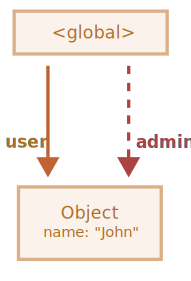
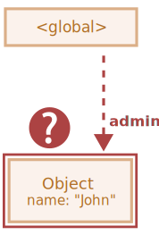
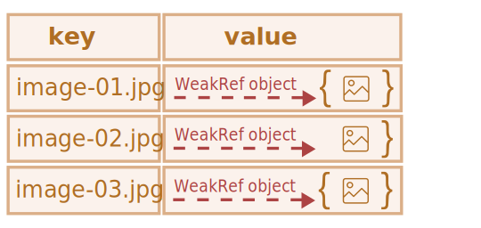
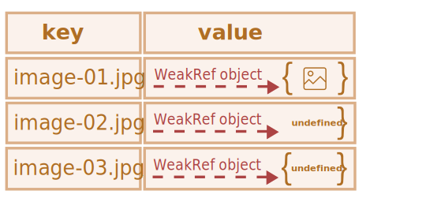
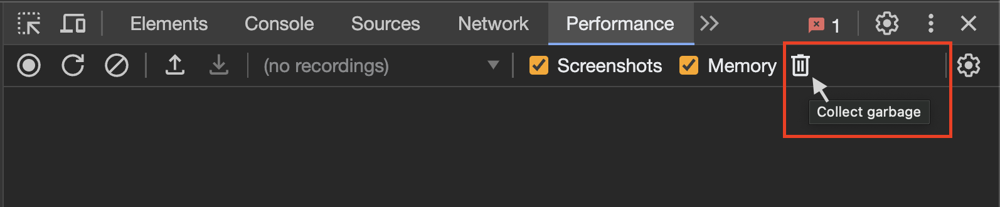
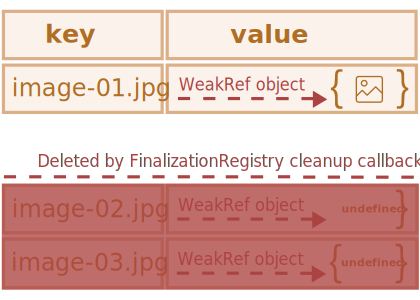

# WeakRef and FinalizationRegistry

```warn header="\"Hidden\" features of the language"
This article covers a very narrowly focused topic, that most developers extremely rarely encounter in practice (and may not even be aware of its existence).  

We recommend skipping this chapter if you have just started learning JavaScript.
```

Recalling the basic concept of the *reachability principle* from the <info:garbage-collection> chapter,
we can note that the JavaScript engine is guaranteed to keep values in memory that are accessible or in use.

For example:


```js
//  the user variable holds a strong reference to the object
let user = { name: "John" };

// let's overwrite the value of the user variable
user = null;

// the reference is lost and the object will be deleted from memory

```

Or a similar, but slightly more complicated code with two strong references:

```js
//  the user variable holds a strong reference to the object
let user = { name: "John" };

// copied the strong reference to the object into the admin variable
*!*
let admin = user;
*/!*

// let's overwrite the value of the user variable
user = null;

// the object is still reachable through the admin variable
```
The object `{ name: "John" }` would only be deleted from memory if there were no strong references to it (if we also overwrote the value of the `admin` variable).  

In JavaScript, there is a concept called `WeakRef`, which behaves slightly differently in this case.


````smart header="Terms: \"Strong reference\", \"Weak reference\""
**Strong reference** - is a reference to an object or value, that prevents them from being deleted by the garbage collector. Thereby, keeping the object or value in memory, to which it points.  

This means, that the object or value remains in memory and is not collected by the garbage collector as long, as there are active strong references to it.  

In JavaScript, ordinary references to objects are strong references. For example:

```js
// the user variable holds a strong reference to this object
let user = { name: "John" };
```
**Weak reference** - is a reference to an object or value, that does *not* prevent them from being deleted by the garbage collector.
An object or value can be deleted by the garbage collector if, the only remaining references to them are weak references.
````

## WeakRef


````warn header="Note of caution"
Before we dive into it, it is worth noting that the correct use of the structures discussed in this article requires very careful thought, and they are best avoided if possible. 
````

`WeakRef` - is an object, that contains a weak reference to another object, called `target` or `referent`. 

The peculiarity of `WeakRef` is that it does not prevent the garbage collector from deleting its referent-object. In other words, a `WeakRef` object does not keep the `referent` object alive.  

Now let's take the `user` variable as the "referent" and create a weak reference from it to the `admin` variable.
To create a weak reference, you need to use the `WeakRef` constructor, passing in the target object (the object you want a weak reference to).

In our case — this is the `user` variable:


```js
//  the user variable holds a strong reference to the object
let user = { name: "John" };

//  the admin variable holds a weak reference to the object
*!*
let admin = new WeakRef(user);
*/!*

```

The diagram below depicts two types of references: a strong reference using the `user` variable and a weak reference using the `admin` variable:

  

Then, at some point, we stop using the `user` variable - it gets overwritten, goes out of scope, etc., while keeping the `WeakRef` instance in the `admin` variable:

```js
// let's overwrite the value of the user variable
user = null;
```

A weak reference to an object is not enough to keep it "alive". When the only remaining references to a referent-object are weak references, the garbage collector is free to destroy this object and use its memory for something else.

However, until the object is actually destroyed, the weak reference may return it, even if there are no more strong references to this object.
That is, our object becomes a kind of "[Schrödinger's cat](https://en.wikipedia.org/wiki/Schr%C3%B6dinger%27s_cat)" – we cannot know for sure whether it's "alive" or "dead":



At this point, to get the object from the `WeakRef` instance, we will use its `deref()` method.  

The `deref()` method returns the referent-object that the `WeakRef` points to, if the object is still in memory. If the object has been deleted by the garbage collector, then the `deref()` method will return `undefined`:


```js
let ref = admin.deref();

if (ref) {
  // the object is still accessible: we can perform any manipulations with it
} else {
  // the object has been collected by the garbage collector
}
```

## WeakRef use cases

`WeakRef` is typically used to create caches or [associative arrays](https://en.wikipedia.org/wiki/Associative_array) that store resource-intensive objects.
This allows one to avoid preventing these objects from being collected by the garbage collector solely based on their presence in the cache or associative array.  

One of the primary examples - is a situation when we have numerous binary image objects (for instance, represented as `ArrayBuffer` or `Blob`), and we want to associate a name or path with each image.
Existing data structures are not quite suitable for these purposes:

- Using `Map` to create associations between names and images, or vice versa, will keep the image objects in memory since they are present in the `Map` as keys or values.
- `WeakMap` is ineligible for this goal either: because the objects represented as `WeakMap` keys use weak references, and are not protected from deletion by the garbage collector.

But, in this situation, we need a data structure that would use weak references in its values.

For this purpose, we can use a `Map` collection, whose values are `WeakRef` instances referring to the large objects we need.
Consequently, we will not keep these large and unnecessary objects in memory longer than they should be.  

Otherwise, this is a way to get the image object from the cache if it is still reachable.
If it has been garbage collected, we will re-generate or re-download it again.  

This way, less memory is used in some situations.  

## Example №1: using WeakRef for caching

Below is a code snippet that demonstrates the technique of using `WeakRef`.  

In short, we use a `Map` with string keys and `WeakRef` objects as their values.
If the `WeakRef` object has not been collected by the garbage collector, we get it from the cache.
Otherwise, we re-download it again and put it in the cache for further possible reuse:  

```js
function fetchImg() {
    // abstract function for downloading images...
}

function weakRefCache(fetchImg) { // (1)
    const imgCache = new Map(); // (2)

    return (imgName) => { // (3)
        const cachedImg = imgCache.get(imgName); // (4)

        if (cachedImg?.deref()) { // (5)
            return cachedImg?.deref();
        }

        const newImg = fetchImg(imgName); // (6)
        imgCache.set(imgName, new WeakRef(newImg)); // (7)

        return newImg;
    };
}

const getCachedImg = weakRefCache(fetchImg);
```  

Let's delve into the details of what happened here:
1. `weakRefCache` - is a higher-order function that takes another function, `fetchImg`, as an argument. In this example, we can neglect a detailed description of the `fetchImg` function, since it can be any logic for downloading images.
2. `imgCache` - is a cache of images, that stores cached results of the `fetchImg` function, in the form of string keys (image name) and `WeakRef` objects as their values.
3. Return an anonymous function that takes the image name as an argument. This argument will be used as a key for the cached image.
4. Trying to get the cached result from the cache, using the provided key (image name).
5. If the cache contains a value for the specified key, and the `WeakRef` object has not been deleted by the garbage collector, return the cached result.
6. If there is no entry in the cache with the requested key, or `deref()` method returns `undefined` (meaning that the `WeakRef` object has been garbage collected), the `fetchImg` function downloads the image again.
7. Put the downloaded image into the cache as a `WeakRef` object.  

Now we have a `Map` collection, where the keys - are image names as strings, and values - are `WeakRef` objects containing the images themselves.

This technique helps to avoid allocating a large amount of memory for resource-intensive objects, that nobody uses anymore.
It also saves memory and time in case of reusing cached objects.  

Here is a visual representation of what this code looks like:  

 

But, this implementation has its drawbacks: over time, `Map` will be filled with strings as keys, that point to a `WeakRef`, whose referent-object has already been garbage collected:  



One way to handle this problem - is to periodically scavenge the cache and clear out "dead" entries.
Another way - is to use finalizers, which we will explore next.  


## Example №2: Using WeakRef to track DOM objects

Another use case for `WeakRef` - is tracking DOM objects.  

Let's imagine a scenario where some third-party code or library interacts with elements on our page as long as they exist in the DOM.
For example, it could be an external utility for monitoring and notifying about the system's state (commonly so-called "logger" – a program that sends informational messages called "logs").

Interactive example:  

[codetabs height=420 src="weakref-dom"]  

When the "Start sending messages" button is clicked, in the so-called "logs display window" (an element with the `.window__body` class), messages (logs) start to appear.  

But, as soon as this element is deleted from the DOM, the logger should stop sending messages.
To reproduce the removal of this element, just click the "Close" button in the top right corner.  

In order not to complicate our work, and not to notify third-party code every time our DOM-element is available, and when it is not, it will be enough to create a weak reference to it using `WeakRef`.    

Once the element is removed from the DOM, the logger will notice it and stop sending messages.  

Now let's take a closer look at the source code (*tab `index.js`*):

1. Get the DOM-element of the "Start sending messages" button.
2. Get the DOM-element of the "Close" button.
3. Get the DOM-element of the logs display window using the `new WeakRef()` constructor. This way, the `windowElementRef` variable holds a weak reference to the DOM-element.
4. Add an event listener on the "Start sending messages" button, responsible for starting the logger when clicked.
5. Add an event listener on the "Close" button, responsible for closing the logs display window when clicked.
6. Use `setInterval` to start displaying a new message every second.
7. If the DOM-element of the logs display window is still accessible and kept in memory, create and send a new message.
8. If the `deref()` method returns `undefined`, it means that the DOM-element has been deleted from memory. In this case, the logger stops displaying messages and clears the timer.
9. `alert`, which will be called, after the DOM-element of the logs display window is deleted from memory (i.e. after clicking the "Close" button). **Note, that deletion from memory may not happen immediately, as it depends only on the internal mechanisms of the garbage collector.**

   We cannot control this process directly from the code. However, despite this, we still have the option to force garbage collection from the browser.

   In Google Chrome, for example, to do this, you need to open the developer tools (`key:Ctrl` + `key:Shift` + `key:J` on Windows/Linux or `key:Option` + `key:⌘` + `key:J` on macOS), go to the "Performance" tab, and click on the bin icon button – "Collect garbage":

   

    <br>
    This functionality is supported in most modern browsers. After the actions are taken, the <code>alert</code> will trigger immediately.

## FinalizationRegistry

Now it is time to talk about finalizers. Before we move on, let's clarify the terminology:  

**Cleanup callback (finalizer)** - is a function that is executed, when an object, registered in the `FinalizationRegistry`, is deleted from memory by the garbage collector.  

Its purpose - is to provide the ability to perform additional operations, related to the object, after it has been finally deleted from memory.  

**Registry** (or `FinalizationRegistry`) - is a special object in JavaScript that manages the registration and unregistration of objects and their cleanup callbacks.  

This mechanism allows registering an object to track and associate a cleanup callback with it.
Essentially it is a structure that stores information about registered objects and their cleanup callbacks, and then automatically invokes those callbacks when the objects are deleted from memory.  

To create an instance of the `FinalizationRegistry`, it needs to call its constructor, which takes a single argument - the cleanup callback (finalizer).  

Syntax:

```js
function cleanupCallback(heldValue) { 
  // cleanup callback code 
}

const registry = new FinalizationRegistry(cleanupCallback);
```

Here:

- `cleanupCallback` - a cleanup callback that will be automatically called when a registered object is deleted from memory.
- `heldValue` - the value that is passed as an argument to the cleanup callback. If `heldValue` is an object, the registry keeps a strong reference to it.
- `registry` - an instance of `FinalizationRegistry`.

`FinalizationRegistry` methods:

- `register(target, heldValue [, unregisterToken])` - used to register objects in the registry.

  `target` - the object being registered for tracking. If the `target` is garbage collected, the cleanup callback will be called with `heldValue` as its argument.

  Optional `unregisterToken` – an unregistration token. It can be passed to unregister an object before the garbage collector deletes it. Typically, the `target` object is used as `unregisterToken`, which is the standard practice.
- `unregister(unregisterToken)` - the `unregister` method is used to unregister an object from the registry. It takes one argument - `unregisterToken` (the unregister token that was obtained when registering the object).  

Now let's move on to a simple example. Let's use the already-known `user` object and create an instance of `FinalizationRegistry`:  

```js
let user = { name: "John" };

const registry = new FinalizationRegistry((heldValue) => {
  console.log(`${heldValue} has been collected by the garbage collector.`);
});
```

Then, we will register the object, that requires a cleanup callback by calling the `register` method:

```js
registry.register(user, user.name);
```

The registry does not keep a strong reference to the object being registered, as this would defeat its purpose. If the registry kept a strong reference, then the object would never be garbage collected.  

If the object is deleted by the garbage collector, our cleanup callback may be called at some point in the future, with the `heldValue` passed to it:

```js
// When the user object is deleted by the garbage collector, the following message will be printed in the console:
"John has been collected by the garbage collector."
```

There are also situations where, even in implementations that use a cleanup callback, there is a chance that it will not be called.

For example:
- When the program fully terminates its operation (for example, when closing a tab in a browser).
- When the `FinalizationRegistry` instance itself is no longer reachable to JavaScript code.
  If the object that creates the `FinalizationRegistry` instance goes out of scope or is deleted, the cleanup callbacks registered in that registry might also not be invoked.

## Caching with FinalizationRegistry

Returning to our *weak* cache example, we can notice the following:
- Even though the values wrapped in the `WeakRef` have been collected by the garbage collector, there is still an issue of "memory leakage" in the form of the remaining keys, whose values have been collected by the garbage collector.

Here is an improved caching example using `FinalizationRegistry`:

```js
function fetchImg() {
  // abstract function for downloading images...
}

function weakRefCache(fetchImg) {
  const imgCache = new Map();

  *!*
  const registry = new FinalizationRegistry((imgName) => { // (1)
    const cachedImg = imgCache.get(imgName);
    if (cachedImg && !cachedImg.deref()) imgCache.delete(imgName);
  });
  */!*

  return (imgName) => {
    const cachedImg = imgCache.get(imgName);
    
    if (cachedImg?.deref()) {
      return cachedImg?.deref();
    }

    const newImg = fetchImg(imgName);
    imgCache.set(imgName, new WeakRef(newImg));
    *!*
    registry.register(newImg, imgName); // (2)
    */!*

    return newImg;
  };
}

const getCachedImg = weakRefCache(fetchImg);
```

1. To manage the cleanup of "dead" cache entries, when the associated `WeakRef` objects are collected by the garbage collector, we create a `FinalizationRegistry` cleanup registry.

   The important point here is, that in the cleanup callback, it should be checked, if the entry was deleted by the garbage collector and not re-added, in order not to delete a "live" entry.
2. Once the new value (image) is downloaded and put into the cache, we register it in the finalizer registry to track the `WeakRef` object.

This implementation contains only actual or "live" key/value pairs.
In this case, each `WeakRef` object is registered in the `FinalizationRegistry`.
And after the objects are cleaned up by the garbage collector, the cleanup callback will delete all `undefined` values.

Here is a visual representation of the updated code:  



A key aspect of the updated implementation is that finalizers allow parallel processes to be created between the "main" program and cleanup callbacks.
In the context of JavaScript, the "main" program - is our JavaScript-code, that runs and executes in our application or web page.  

Hence, from the moment an object is marked for deletion by the garbage collector, and to the actual execution of the cleanup callback, there may be a certain time gap.
It is important to understand that during this time gap, the main program can make any changes to the object or even bring it back to memory.  

That's why, in the cleanup callback, we must check to see if an entry has been added back to the cache by the main program to avoid deleting "live" entries.
Similarly, when searching for a key in the cache, there is a chance that the value has been deleted by the garbage collector, but the cleanup callback has not been executed yet.  

Such situations require special attention if you are working with `FinalizationRegistry`.

## Using WeakRef and FinalizationRegistry in practice

Moving from theory to practice, imagine a real-life scenario, where a user synchronizes their photos on a mobile device with some cloud service
(such as [iCloud](https://en.wikipedia.org/wiki/ICloud) or [Google Photos](https://en.wikipedia.org/wiki/Google_Photos)),
and wants to view them from other devices. In addition to the basic functionality of viewing photos, such services offer a lot of additional features, for example:  

- Photo editing and video effects.
- Creating "memories" and albums.
- Video montage from a series of photos.
- ...and much more.

Here, as an example, we will use a fairly primitive implementation of such a service.
The main point - is to show a possible scenario of using `WeakRef` and `FinalizationRegistry` together in real life.

Here is what it looks like:


<br>
On the left side, there is a cloud library of photos (they are displayed as thumbnails).
We can select the images we need and create a collage, by clicking the "Create collage" button on the right side of the page.
Then, the resulting collage can be downloaded as an image.
</br><br>

To increase page loading speed, it would be reasonable to download and display photo thumbnails in *compressed* quality.
But, to create a collage from selected photos, download and use them in *full-size* quality.  

Below, we can see, that the intrinsic size of the thumbnails is 240x240 pixels.
The size was chosen on purpose to increase loading speed.
Moreover, we do not need full-size photos in preview mode.


<br>
Let's assume, that we need to create a collage of 4 photos: we select them, and then click the "Create collage" button.
At this stage, the already known to us <code>weakRefCache</code> function checks whether the required image is in the cache.
If not, it downloads it from the cloud and puts it in the cache for further use.
This happens for each selected image:
</br><br>


</br>

Paying attention to the output in the console, you can see, which of the photos were downloaded from the cloud - this is indicated by <span style="background-color:#133159;color:white;font-weight:500">FETCHED_IMAGE</span>.
Since this is the first attempt to create a collage, this means, that at this stage the "weak cache" was still empty, and all the photos were downloaded from the cloud and put in it.

But, along with the process of downloading images, there is also a process of memory cleanup by the garbage collector.
This means, that the object stored in the cache, which we refer to, using a weak reference, is deleted by the garbage collector.
And our finalizer executes successfully, thereby deleting the key, by which the image was stored in the cache.
<span style="background-color:#901e30;color:white;font-weight:500;">CLEANED_IMAGE</span> notifies us about it:


<br>
Next, we realize that we do not like the resulting collage, and decide to change one of the images and create a new one.
To do this, just deselect the unnecessary image, select another one, and click the "Create collage" button again:
</br><br>


<br>
But this time not all images were downloaded from the network, and one of them was taken from the weak cache: the <span style="background-color:#385950;color:white;font-weight:500;">CACHED_IMAGE</span> message tells us about it.
This means that at the time of collage creation, the garbage collector had not yet deleted our image, and we boldly took it from the cache,
thereby reducing the number of network requests and speeding up the overall time of the collage creation process:
</br><br>


<br>
Let's "play around" a little more, by replacing one of the images again and creating a new collage:
</br><br>


<br>
This time the result is even more impressive. Of the 4 images selected, 3 of them were taken from the weak cache, and only one had to be downloaded from the network.
The reduction in network load was about 75%. Impressive, isn't it?
</br><br>


</br>

Of course, it is important to remember, that such behavior is not guaranteed, and depends on the specific implementation and operation of the garbage collector.  

Based on this, a completely logical question immediately arises: why do not we use an ordinary cache, where we can manage its entities ourselves, instead of relying on the garbage collector?
That's right, in the vast majority of cases there is no need to use `WeakRef` and `FinalizationRegistry`.  

Here, we simply demonstrated an alternative implementation of similar functionality, using a non-trivial approach with interesting language features.
Still, we cannot rely on this example, if we need a constant and predictable result.

You can [open this example in the sandbox](sandbox:weakref-finalizationregistry).

## Summary

`WeakRef` - designed to create weak references to objects, allowing them to be deleted from memory by the garbage collector if there are no longer strong references to them.
This is beneficial for addressing excessive memory usage and optimizing the utilization of system resources in applications.

`FinalizationRegistry` - is a tool for registering callbacks, that are executed when objects that are no longer strongly referenced, are destroyed.
This allows releasing resources associated with the object or performing other necessary operations before deleting the object from memory.