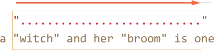
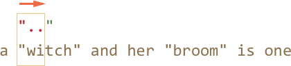

# Жадные и ленивые квантификаторы

Квантификаторы -- с виду очень простая, но на самом деле очень хитрая штука.

Необходимо очень хорошо понимать, как именно происходит поиск, если конечно мы хотим искать что-либо сложнее чем `pattern:/\d+/`.

[cut]

Для примера рассмотрим задачу, которая часто возникает в типографике -- заменить в тексте кавычки вида `"..."` (их называют "английские кавычки") на "кавычки-ёлочки": `«...»`.

Для этого нужно сначала найти все слова в таких кавычках.

Соответствующее регулярное выражение может выглядеть так: `pattern:/".+"/g`, то есть мы ищем кавычку, после которой один или более произвольный символ, и в конце опять кавычка.

Однако, если попробовать применить его на практике, даже на таком простом случае...

```js run
var reg = /".+"/g;

var str = 'a "witch" and her "broom" is one';

alert( str.match(reg) ); // "witch" and her "broom"
```

...Мы увидим, что оно работает совсем не так, как задумано!

Вместо того, чтобы найти два совпадения `match:"witch"` и `match:"broom"`, оно находит одно: `match:"witch" and her "broom"`.

Это как раз тот случай, когда *жадность* -- причина всех зол.

## Жадный поиск

Чтобы найти совпадение, движок регулярных выражений обычно использует следующий алгоритм:

- Для каждой позиции в поисковой строке
    - Проверить совпадение на данной позиции
    - Посимвольно, с учётом классов и квантификаторов сопоставив с ней регулярное выражение.

Это общие слова, гораздо понятнее будет, если мы проследим, что именно он делает для регэкспа `pattern:".+"`.

1. Первый символ шаблона -- это кавычка `pattern:"`.

    Движок регулярных выражений пытается сопоставить её на 0-й позиции в строке, но символ `a`, поэтому на 0-й позиции соответствия явно нет.

    Далее он переходит 1ю, 2ю позицию в исходной строке и, наконец, обнаруживает кавычку на 3-й позиции:

    

2. Кавычка найдена, далее движок проверяет, есть ли соответствие для остальной части паттерна.

    В данном случае следующий символ шаблона: `pattern:.` (точка). Она обозначает "любой символ", так что следующая буква строки `match:'w'` вполне подходит:

    

3. Далее "любой символ" повторяется, так как стоит квантификатор `pattern:.+`. Движок регулярных выражений берёт один символ за другим, до тех пор, пока у него это получается.

    В данном случае это означает "до конца строки":

    

4. Итак, текст закончился, движок регулярных выражений больше не может найти "любой символ", он закончил повторения для `pattern:.+` и переходит к следующему символу шаблона.

    Следующий символ шаблона -- это кавычка. Её тоже необходимо найти, чтобы соответствие было полным. А тут -- беда, ведь поисковый текст завершился!

    Движок регулярных выражений понимает, что, наверное, взял многовато `pattern:.+` и начинает отступать обратно.

    Иными словами, он сокращает текущее совпадение на один символ:

    

    Это называется "фаза возврата" или "фаза бэктрекинга" (backtracking -- англ.).

    Теперь `pattern:.+` соответствует почти вся оставшаяся строка, за исключением одного символа, и движок регулярных выражений ещё раз пытается подобрать соответствие для остатка шаблона, начиная с оставшейся части строки.

    Если бы последним символом строки была кавычка `pattern:'"'`, то на этом бы всё и закончилось. Но последний символ `subject:'e'`, так что совпадения нет.

5. ...Поэтому движок уменьшает число повторений `pattern:.+` ещё на один символ:

    

    Кавычка `pattern:'"'` не совпадает с `subject:'n'`. Опять неудача.

6. Движок продолжает отступать, он уменьшает количество повторений точки `pattern:'.'` до тех пор, пока остаток паттерна, то есть в данном случае кавычка `pattern:'"'`, не совпадёт:

    

7. Совпадение получено. Дальнейший поиск по оставшейся части строки `subject:is one` новых совпадений не даст.

Возможно, это не совсем то, что мы ожидали.

**В жадном режиме (по умолчанию) регэксп повторяет квантификатор настолько много раз, насколько это возможно, чтобы найти соответствие.**

То есть, любой символ `pattern:.+` повторился максимальное количество раз, что и привело к такой длинной строке.

А мы, наверное, хотели, чтобы каждая строка в кавычках была независимым совпадением? Для этого можно переключить квантификатор `+` в "ленивый" режим, о котором будет речь далее.

## Ленивый режим

Ленивый режим работы квантификаторов -- противоположность жадному, он означает "повторять минимальное количество раз".

Его можно включить, если поставить знак вопроса `pattern:'?'` после квантификатора, так что он станет таким: `pattern:*?` или `pattern:+?` или даже `pattern:??` для `pattern:'?'`.

Чтобы не возникло путаницы -- важно понимать: обычно `?` сам является квантификатором (ноль или один). Но если он стоит *после другого квантификатора (или даже после себя)*, то обретает другой смысл -- в этом случае он меняет режим его работы на ленивый.

Регэксп `pattern:/".+?"/g` работает, как задумано -- находит отдельно `match:witch` и `match:broom`:

```js run
var reg = /".+?"/g;

var str = 'a "witch" and her "broom" is one';

alert( str.match(reg) ); // witch, broom
```

Чтобы в точности понять, как поменялась работа квантификатора, разберём поиск по шагам.

1. Первый шаг -- тот же, кавычка `pattern:'"'` найдена на 3-й позиции:

    

2. Второй шаг -- тот же, находим произвольный символ `pattern:'.'`:

    

3. А вот дальше -- так как стоит ленивый режим работы `+`, то движок не повторит точку (произвольный символ) ещё раз, а останавливается на достигнутом и пытается проверить, есть ли соответствие остальной части шаблона, то есть `pattern:'"'`:

    

    Если бы остальная часть шаблона на данной позиции совпала, то совпадение было бы найдено. Но в данном случае -- нет, символ `'i'` не равен '"'.
4. Движок регулярных выражений увиличивает количество повторений точки на одно и пытается найти соответствие остатку шаблона ещё раз:

    
Опять неудача. Тогда поисковой движок увеличивает количество повторений ещё и ещё...
5. Только на пятом шаге поисковой движок наконец находит соответствие для остатка паттерна:

    
6. Так как поиск происходит с флагом `g`, то он продолжается с конца текущего совпадения, давая ещё один результат:

    

В примере выше продемонстрирована работа ленивого режима для `pattern:+?`. Квантификаторы  `pattern:+?` и `pattern:??` ведут себя аналогично -- "ленивый" движок увеличивает количество повторений только в том случае, если для остальной части шаблона на данной позиции нет соответствия.

**Ленивость распространяется только на тот квантификатор, после которого стоит `?`.**

Прочие квантификаторы остаются жадными.

Например:

```js run
alert( "123 456".match(/\d+ \d+?/g) ); // 123 4
```

1. Подшаблон `pattern:\d+` пытается найти столько цифр, сколько возможно (работает жадно), так что он находит `match:123` и останавливается, поскольку символ пробела `pattern:' '` не подходит под `pattern:\d`.
2. Далее в шаблоне пробел, он совпадает.
3. Далее в шаблоне идёт `pattern:\d+?`.

    Квантификатор указан в ленивом режиме, поэтому он находит одну цифру `match:4` и пытается проверить, есть ли совпадение с остатком шаблона.

    Но после `pattern:\d+?` в шаблоне ничего нет.

    **Ленивый режим без необходимости лишний раз квантификатор не повторит.**

    Так как шаблон завершился, то искать дальше, в общем-то нечего. Получено совпадение `match:123 4`.
4. Следующий поиск продолжится с `5`, но ничего не найдёт.

```smart header="Конечные автоматы и не только"
Современные движки регулярных выражений могут иметь более хитрую реализацию внутренних алгоритмов, чтобы искать быстрее.

Однако, чтобы понять, как работает регулярное выражение, и строить регулярные выражения самому, знание этих хитрых алгоритмов ни к чему. Они служат лишь внутренней оптимизации способа поиска, описанного выше.

Кроме того, сложные регулярные выражения плохо поддаются всяким оптимизациям, так что поиск вполне может работать и в точности как здесь описано.
```

## Альтернативный подход

В данном конкретном случае, возможно искать строки в кавычках, оставаясь в жадном режиме, с использованием регулярного выражения `pattern:"[^"]+"`:

```js run
var reg = /"[^"]+"/g;

var str = 'a "witch" and her "broom" is one';

alert( str.match(reg) ); // witch, broom
```

Регэксп `pattern:"[^"]+"` даст правильные результаты, поскольку ищет кавычку `pattern:'"'`, за которой идут столько не-кавычек (исключающие квадратные скобки), сколько возможно.

Так что вторая кавычка автоматически прекращает повторения `pattern:[^"]+` и позволяет найти остаток шаблона `pattern:"`.

**Эта логика ни в коей мере не заменяет ленивые квантификаторы!**

Она просто другая. И то и другое бывает полезно.

Давайте посмотрим пример, когда нужен именно такой вариант, а ленивые квантификаторы не подойдут.

Например, мы хотим найти в тексте ссылки вида `<a href="..." class="doc">`, с любым содержанием `href`.

Какое регулярное выражение для этого подойдёт?

Первый вариант может выглядеть так: `pattern:/<a href=".*" class="doc">/g`.

Проверим его:
```js run
var str = '...<a href="link" class="doc">...';
var reg = /<a href=".*" class="doc">/g;

// Сработало!
alert( str.match(reg) ); // <a href="link" class="doc">
```

А если в тексте несколько ссылок?

```js run
var str = '...<a href="link1" class="doc">... <a href="link2" class="doc">...';
var reg = /<a href=".*" class="doc">/g;

// Упс! Сразу две ссылки!
alert( str.match(reg) ); // <a href="link1" class="doc">... <a href="link2" class="doc">
```

На этот раз результат неверен.

Жадный `pattern:.*` взял слишком много символов.

Соответствие получилось таким:
```
<a href="....................................." class="doc">
<a href="link1" class="doc">... <a href="link2" class="doc">
```

Модифицируем шаблон -- добавим ленивость квантификатору `pattern:.*?`:

```js run
var str = '...<a href="link1" class="doc">... <a href="link2" class="doc">...';
var reg = /<a href=".*?" class="doc">/g;

// Сработало!
alert( str.match(reg) ); // <a href="link1" class="doc">, <a href="link2" class="doc">
```

Теперь всё верно, два результата:

```
<a href="....." class="doc">    <a href="....." class="doc">
<a href="link1" class="doc">... <a href="link2" class="doc">
```

Почему теперь всё в порядке -- для внимательного читателя, после объяснений, данных выше в этой главе, должно быть полностью очевидно.

Поэтому не будем останавливаться здесь на деталях, а попробуем ещё пример:

```js run
var str = '...<a href="link1" class="wrong">... <p style="" class="doc">...';
var reg = /<a href=".*?" class="doc">/g;

// Неправильное совпадение!
alert( str.match(reg) ); // <a href="link1" class="wrong">... <p style="" class="doc">
```

Совпадение -- не ссылка, а более длинный текст.

Получилось следующее:

1. Найдено совпадение `match:<a href="`.
2. Лениво ищем `pattern:.*?`, после каждого символа проверяя, есть ли совпадение остальной части шаблона.

    Подшаблон `pattern:.*?` будет брать символы до тех пор, пока не найдёт `match:class="doc">`.

    В данном случае этот поиск закончится уже за пределами ссылки, в теге `<p>`, вообще не имеющем отношения к `<a>`.
3. Получившееся совпадение:

    ```
    <a href="..................................." class="doc">
    <a href="link1" class="wrong">... <p style="" class="doc">
    ```

Итак, ленивость нам не помогла.

Необходимо как-то прекратить поиск `pattern:.*`, чтобы он не вышел за пределы кавычек.

Для этого мы используем более точное указание, какие символы нам подходят, а какие нет.

Правильный вариант: `pattern:[^"]*`. Этот шаблон будет брать все символы до ближайшей кавычки, как раз то, что требуется.

Рабочий пример:

```js run
var str1 = '...<a href="link1" class="wrong">... <p style="" class="doc">...';
var str2 = '...<a href="link1" class="doc">... <a href="link2" class="doc">...';
var reg = /<a href="[^"]*" class="doc">/g;

// Работает!
alert( str1.match(reg) ); // null, совпадений нет, и это верно
alert( str2.match(reg) ); // <a href="link1" class="doc">, <a href="link2" class="doc">
```

## Итого

Квантификаторы имеют два режима работы:

Жадный
: Режим по умолчанию -- движок регулярных выражений повторяет его по-максимуму. Когда повторять уже нельзя, например нет больше цифр для `\d+`, он продолжает поиск с оставшейся части текста. Если совпадение найти не удалось -- отступает обратно, уменьшая количество повторений.

Ленивый
: При указании после квантификатора символа `?` он работает в ленивом режиме. То есть, он перед каждым повторением проверяет совпадение оставшейся части шаблона на текущей позиции.

Как мы видели в примере выше, ленивый режим -- не панацея от "слишком жадного" забора символов. Альтернатива -- более аккуратно настроенный "жадный", с исключением символов. Как мы увидим далее, можно исключать не только символы, но и целые подшаблоны.

