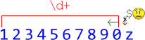
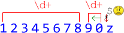
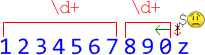

# Чёрная дыра бэктрекинга [todo]

Некоторые регулярные выражения, с виду являясь простыми, могут выполняться оооочень долго, и даже подвешивать браузер.

[cut]
Например, попробуйте пример ниже в Chrome или IE (осторожно, подвесит браузер!):

```js
//+ run
alert( '123456789012345678901234567890z'.match(/(\d+)*$/) );
```

Некоторые движки регулярных выражений (Firefox) справляются с таким регэкспом, а некоторые (IE, Chrome) -- нет.

В чём же дело, что не так с регэкспом?

Да с регэкспом-то всё так, синтаксис вполне допустимый. Проблема в том, как выполняется поиск по нему.

Для краткости рассмотрим более короткую строку: <code class="subject">1234567890z</code>:

<ol>
<li>Первым делом, движок регэкспов пытается найти <code class="pattern">\d+</code>. Плюс <code class="pattern">+</code> является жадным по умолчанию, так что он хватает все цифры, какие может.

Затем движок пытается применить звёздочку вокруг скобок <code class="pattern">(\d+)*</code>, но больше цифр нет, так что звёздочка не даёт повторений. 

После этого в паттерне остаётся <code class="pattern">$</code>, а в тексте -- символ <code class="subject">z</code>. 



Так как соответствия нет, то жадный плюс <code class="pattern">+</code> отступает на один символ (бэктрекинг, зелёная стрелка на рисунке выше).
</li>
<li>После бэктрекинга, <code class="pattern">\d+</code> содержит всё число, кроме последней цифры. Затем движок снова пытается найти совпадение, уже с новой позиции (`9`). 

Звёздочка <code class="pattern">(\d+)*</code> теперь может быть применена -- она даёт ещё одно число <code class="match">9</code>:


Движок пытается найти `$`, но это ему не удаётся -- на его пути опять `z`:


Так как совпадения нет, то поисковой движок отступает назад ещё раз.
</li>
<li>Теперь первое число <code class="pattern">\d+</code> будет содержать 8 цифр, а остаток строки <code class="subject">90</code> становится вторым <code class="pattern">\d+</code>:



Увы, всё ещё нет соответствия для <code class="pattern">$</code>.

Поисковой движок снова должен отступить назад. При этом последний жадный квантификатор отпускает символ. В данном случае это означает, что укорачивается второй <code class="pattern">\d+</code>, до одного символа <code class="subject">9</code>.
</li>
<li>Теперь движок регулярных выражений снова может применить звёздочку и находит третье число <code class="pattern">\d+</code>:


...И снова неудача. Второе и третье <code class="pattern">\d+</code> отступили по-максимуму, так что сокращается снова первое число.
</li>
<li>Теперь есть 7 цифр в первом <code class="pattern">\d+</code>. Поисковой движок видит место для второго <code class="pattern">\d+</code>, теперь уже с позиции 8:



Так как совпадения нет, второй <code class="pattern">\d+</code> отступает назад....
</li>
<li>...И так далее, легко видеть, что поисковой движок будет перебирать *все возможные комбинации* <code class="pattern">\d+</code> в числе. А их много.</li>
</ol>

На этом месте умный читатель может воскликнуть: "Бэктрекинг? Давайте включим ленивый режим -- и не будет никакого бэктрекинга!"

Что ж, заменим <code class="pattern">\d+</code> на <code class="pattern">\d+?</code> и посмотрим (аккуратно, может подвесить браузер):

```js
//+ run
alert( '123456789012345678901234567890z'.match(/(\d+?)*$/) );
```

Не помогло!

**Ленивые регулярные выражения делают то же самое, но в обратном порядке.**

Просто подумайте о том, как будет в этом случае работать поисковой движок.

Некоторые движки регулярных выражений, например Firefox, содержат хитрые проверки, в дополнение к алгоритму выше, которые позволяют избежать бесконечного перебора или кардинально ускорить его, но все движки и не всегда.
