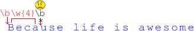
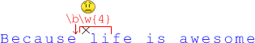

# Word boundary

Another position check is a *word boundary* <code class="pattern">\b</code>. It doesn't match a character, but matches in situations when a wordly character follows a non-wordly or vice versa. A "non-wordly" may also be text start or end.
[cut]
For example, <code class=pattern">\bdog\b</code> matches a standalone <code class="subject">dog</code>, not <code class="subject">doggy</code> or <code class="subject">catdog</code>:

```js
//+ run
showMatch("doggy catdog dog", /\bdog\b/) // "dog"
```

Here, <code class="match">dog</code> matches, because the previous char is a space (non-wordly), and the next position is text end.

Normally, <code class="pattern">\w{4}</code> matches 4 consequent word characters.
If the word is long enough, it may match multiple times:

```js
//+ run
showMatch("Boombaroom", /\w{4}/g) // 'Boom', 'baro'
```

Appending <code class="pattern">\b</code> causes <code class="pattern">\w{4}\b</code> to match only at word end:

```js
//+ run
showMatch("Because life is awesome", /\w{4}\b/g) // 'ause', 'life', 'some'
```

**The word boundary <code class="pattern">\b</code> like <code class="pattern">^</code> and <code class="pattern">$</code> doesn't match a char. It only performs the check.**

Let's add the check from another side, <code class="pattern">\b\w{4}\b</code>:

```js
//+ run
showMatch("Because life is awesome", /\b\w{4}\b/g) //  'life'
```

Now there is only one result <code class="match">life</code>.

<ol>
<li>The regexp engine matches first word boundary <code class="pattern">\b</code> at zero position:

</li>
<li>Then it successfully matches <code class="pattern">\w{4}</code>, but fails to match finishing <code class="pattern">\b</code>.



So, the match at position zero fails. 
</li>
<li>The search continues from position 1, and the closest <code class="pattern">\b</code> is right after <code class="subject">Because</code> (position 9):



Now <code class="pattern">\w{4}</code> doesn't match, because the next character is a space.
</li>
<li>The search continues, and the closest <code class="pattern">\b</code> is right before <code class="subject">life</code> at position 11.


Finally, <code class="pattern">\w{4}</code> matches and the position check <code class="pattern">\b</code> after it is positive. We've got the result.
</li>
<li>The search continues after the match, but doesn't yield new results.</li>
</ol>

**The word boundary check <code class="pattern">/\b/</code> works only for words in latin alphabet,** because it is based on <code class="pattern">\w</code> as "wordly" chars. Sometimes that's acceptable, but limits the application range of the feature. 

And, for completeness..
**There is also an inverse check <code class="pattern">\B</code>, meaning a position other than <code class="pattern">\b</code>.** It is extremely rarely used.

