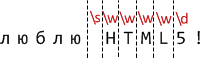

# Классы и спецсимволы

Рассмотрим практическую задачу -- есть телефонный номер `"+7(903)-123-45-67"`, и нам нужно найти в этой строке цифры. А остальные символы нас не интересуют.

Для поиска символов определённого вида в регулярных выражениях предусмотрены "классы символов".

[cut]

Класс символов -- это специальное обозначение, под которое подходит любой символ данного класса.

Например, класс "любая цифра" обозначается `\d`. Это обозначение вставляется в паттерн наравне с остальными символами, и при поиске под него подходит любая цифра.

Регулярное выражение <code class="pattern">/\d/</code> ищет ровно одну цифру (первую):

```js
//+ run
var str = "+7(903)-123-45-67";

var reg = /\d/;

alert( str.match(reg) ); // 7
```

...Ну а для поиска всех цифр достаточно добавить к нему флаг `g`:

```js
//+ run
var str = "+7(903)-123-45-67";

var reg = /\d/g;

alert( str.match(reg) ); // массив цифр: 7,9,0,3,1,2,3,4,5,6,7
```

## Важнейшие классы

Это был класс для цифр.

Конечно же, есть и другие. Самые полезные классы:
<dl>
<dt>`\d` (от английского "digit" - "цифра")</dt>
<dd>Цифра, символ от `0` до `9`.</dd>
<dt>`\s` (от английского "space" - "пробел")</dt>
<dd>Пробельный символ, включая табы, переводы строки и т.п.</dd>
<dt>`\w` (от английского "word" -- "слово") </dt>
<dd>Символ латинского алфавита или цифра или подчёркивание `'_'`. Не-английские буквы не являются `\w`.</dd>
</dl>

Регулярное выражение как правило содержит одновременно и обычные символы и классы.

Например, <code class="pattern">CSS\d</code> найдёт строку <code class="match">CSS</code>, с любой цифрой после неё.

Пример ниже найдёт строку `CSS` с любой цифровой версией:

```js
//+ run
var str = "Стандарт CSS4 - это здорово";
var reg = /CSS\d/

alert( str.match(reg) ); // CSS4
```

Можно указать и несколько классов в одном регэкспе:

```js
//+ run
alert( "Я люблю HTML5!".match(/\s\w\w\w\w\d/) ); // 'HTML5'
```

Совпадение (каждому классу в регэкспе соответствует один символ результата):




## Обратные классы

Для каждого символьного класса существует "обратный ему", представленный такой же, но заглавной буквой.

"Обратный" -- означает, что ему соответствуют все остальные символы, например:

<dl>
<dt>`\D`</dt>
<dd>Не-цифра, то есть любой символ кроме `\d`, например буква.</dd>
<dt>`\S`</dt>
<dd>Не-пробел, то есть любой символ кроме `\s`, например буква.</dd>
<dt>`\W`</dt>
<dd>Любой символ, кроме `\w`, то есть не латинница, не подчёркивание, не цифра. В частности, русские буквы принадлежат этому классу.</dd>
</dl>

В начале этой главы мы видели, как получить из телефона <code class="subject">+7(903)-123-45-67</code> все цифры.

Первый способ -- найти все цифры через `match(/\d/g)`, но есть и альтернативный -- найти все НЕцифры и удалить их из строки:

```js
//+ run
var str = "+7(903)-123-45-67";

alert( str.replace(/\D/g, "") ); // 79031234567
```

## Спецсимволы

Регулярное выражение может также содержать стандартные спецсимволы строк, такие как перевод строки `\n`, табуляцию `\t` и другие.

Отличить их от классов очень просто -- для классов зарезервированы другие буквы. Так что никакого конфликта здесь нет.

## Пробелы

Обычно мы не обращаем внимание на пробелы. Для нашего взгляда строки <code class="subject">1-5</code> и <code class="subject">1 - 5</code> почти идентичны.

Но в регулярных выражениях пробел - такой же символ, как и другие.

Поиск ниже не сработает, так как не учитывает пробелы вокруг дефиса:

```js
//+ run
alert(  "1 - 5".match (/\d-\d/) );  // null, нет совпадений!
```

Поправим это, добавив в регэксп пробелы:

```js
//+ run
alert(  "1 - 5".match (/\d - \d/) );  // работает, пробелы вокруг дефиса
```

В регулярные выражения также не надо вставлять лишние пробелы. Все символы имеют значение:

```js
//+ run
alert( "1-5".match( /\d - \d/ ) ); // null, так как в строке 1-5 нет пробелов
```

## Класс точка

Особым классом символов является точка `"."`.

В регулярном выражении, точка <code class="pattern">"."</code> обозначает *любой символ*, кроме перевода строки:

```js
//+ run
alert( "Z".match(/./) ); // найдено Z
```

Посередине регулярного выражения:

```js
//+ run
var re = /CS.4/;

alert( "CSS4".match(re) ); // найдено "CSS4"
alert( "CS-4".match(re) ); // найдено "CS-4" 
alert( "CS 4".match(re) ); // найдено "CS 4" (пробел тоже символ)
```

Обратим внимание -- точка означает именно "произвольный символ". 

То есть какой-то символ на этом месте в строке должен быть:

```js
//+ run
alert( "CS4".match (/CS.4/) ); // нет совпадений, так как для точки нет символа
```

## Экранирование специальных символов

В регулярных выражениях есть и другие символы, имеющие особый смысл. 

Они используются, чтобы расширить возможности поиска. 

Вот их полный список: <code class="pattern">[ \ ^ $ . | ? * + ( )</code>.

Не пытайтесь запомнить его -- когда мы разберёмся с каждым из них по отдельности, он запомнится сам собой.

**Чтобы использовать специальный символ в качестве обычного, он должен быть *экранирован*.** 

Или, другими словами, перед символом должен быть обратный слэш `'\'`. 

Например, нам нужно найти точку <code class="pattern">'.'</code>. В регулярном выражении она означает "любой символ, кроме новой строки", поэтому чтобы найти именно сам символ "точка" -- её нужно экранировать: <code class="pattern">\.</code>.

```js
//+ run
alert( "Глава 5.1".match( /\d\.\d/ ) );  // 5.1
```

Круглые скобки также являются специальными символами, так что для поиска именно скобки нужно использовать `\(`. Пример ниже ищет строку `"g()"`:

```js
//+ run
alert( "function g()".match( /g\(\)/ ) );  // "g()"
```

Сам символ слэш `'/'`, хотя и не является специальными символом в регулярных выражениях, но открывает-закрывает регэксп в синтаксисе <code class="pattern">/...pattern.../</code>, поэтому его тоже нужно экранировать.

Так выглядит поиск слэша `'/'`:

```js
//+ run
alert( "/".match( /\// ) );  // '/'
```

Ну и, наконец, если нам нужно найти сам обратный слэш `\`, то его нужно просто задублировать.

Так выглядит поиск обратного слэша `"\"`:

```js
//+ run
alert( "1\2".match( /\\/ ) );  // '\'
```

## Итого

Мы рассмотрели классы для поиска типов символов:

<ul>
<li>`\d` -- цифры.</li>
<li>`\D` -- не-цифры.</li>
<li>`\s` -- пробельные символы, переводы строки.</li>
<li>`\S` -- всё, кроме `\s`.</li>
<li>`\w` -- латинница, цифры, подчёркивание `'_'`.</li>
<li>`'.'` -- точка обозначает любой символ, кроме перевода строки.</li>
</ul>

Кроме того, в регэкспах допустимы и обычные спец-символы строк, например `\n`.

Если хочется поискать именно точку или какой-то другой "особый" символ, то его экранируют: <code class="pattern">\.</code>


