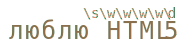

# Классы и спецсимволы

Рассмотрим практическую задачу -- есть телефонный номер `"+7(903)-123-45-67"`, и нам нужно найти в этой строке цифры. А остальные символы нас не интересуют.

Для поиска символов определённого вида в регулярных выражениях предусмотрены "классы символов".

[cut]

Класс символов -- это специальное обозначение, под которое подходит любой символ из определённого набора.

Например, есть класс "любая цифра". Он обозначается `\d`. Это обозначение вставляется в шаблон, и при поиске под него подходит любая цифра.

То есть, регулярное выражение <code class="pattern">/\d/</code> ищет ровно одну цифру:

```js
//+ run
var str = "+7(903)-123-45-67";

var reg = /\d/;

// не глобальный регэксп, поэтому ищет только первую цифру
alert( str.match(reg) ); // 7
```

...Ну а для поиска всех цифр достаточно добавить к регэкспу флаг `g`:

```js
//+ run
var str = "+7(903)-123-45-67";

var reg = /\d/g;

alert( str.match(reg) ); // массив всех совпадений: 7,9,0,3,1,2,3,4,5,6,7
```

## Важнейшие классы: \d \s \w

Это был класс для цифр.

Конечно же, есть и другие.

Наиболее часто используются:
<dl>
<dt>`\d` (от английского "digit" -- "цифра")</dt>
<dd>Цифра, символ от `0` до `9`.</dd>
<dt>`\s` (от английского "space" -- "пробел")</dt>
<dd>Пробельный символ, включая табы, переводы строки и т.п.</dd>
<dt>`\w` (от английского "word" -- "слово") </dt>
<dd>Символ "слова", а точнее -- буква латинского алфавита или цифра или подчёркивание `'_'`. Не-английские буквы не являются `\w`, то есть русская буква не подходит.</dd>
</dl>

Например, <code class="pattern">\d\s\w</code> обозначает цифру, за которой идёт пробельный символ, а затем символ слова.

Регулярное выражение может содержать одновременно и обычные символы и классы.

Например, <code class="pattern">CSS\d</code> найдёт строку <code class="match">CSS</code>, с любой цифрой после неё:

```js
//+ run
var str = "Стандарт CSS4 - это здорово";
var reg = /CSS\d/

alert( str.match(reg) ); // CSS4
```

И много классов подряд:

```js
//+ run
alert( "Я люблю HTML5!".match(/\s\w\w\w\w\d/) ); // 'HTML5'
```

Совпадение (каждому классу в регэкспе соответствует один символ результата):



## Граница слова \b

Граница слова <code class="pattern">\b</code> -- это особый класс.

Он интересен тем, что обозначает не символ, а границу между символами.

Например, <code class="pattern">\bJava\b</code> найдёт слово <code class="match">Java</code> в строке <code class="subject">Hello, Java!</code>, но не в строке <code class="subject">Hello, Javascript!</code>.


```js
//+ run

alert( "Hello, Java!".match(/\bJava\b/) ); // Java
alert( "Hello, Javascript!".match(/\bJava\b/) ); // null
```

Граница имеет "нулевую ширину" в том смысле, что обычно символам регулярного выражения соответствуют символы строки, но не в этом случае. 

Граница -- это проверка.

При поиске движок регулярных выражений идёт по шаблону и одновременно по строке, пытаясь построить соответствие. Когда он видит <code class="pattern">\b</code>, то проверяет, что текущая позиция в строке подходит под одно из условий:
<ul>
<li>Начало текста, если первый символ `\w`.</li>
<li>Конец текста, если последний символ `\w`.</li>
<li>Внутри текста, если с одной стороны `\w`, а с другой -- не `\w`.</li>
</ul>

Например, в строке <code class="subject">Hello, Java!</code> под `\b` подходят следующие позиции:


Как правило, `\b` используется, чтобы искать отдельно стоящее слово. Не на русском конечно, хотя подобную проверку, как мы увидим далее, можно легко сделать для любого языка. А вот на английском, как в примере выше или для чисел, которые являются частным случаем `\w` -- легко.

Например, регэксп <code class="pattern">\b\d\d\b</code> ищет отдельно двузначные числа. Иными словами, он требует, чтобы до и после <code class="pattern">\d\d</code> был символ, отличный от `\w` (или начало/конец текста).


## Обратные классы

Для каждого класса существует "обратный ему", представленный такой же, но заглавной буквой.

"Обратный" -- означает, что ему соответствуют все остальные символы, например:

<dl>
<dt>`\D`</dt>
<dd>Не-цифра, то есть любой символ кроме `\d`, например буква.</dd>
<dt>`\S`</dt>
<dd>Не-пробел, то есть любой символ кроме `\s`, например буква.</dd>
<dt>`\W`</dt>
<dd>Любой символ, кроме `\w`, то есть не латинница, не подчёркивание, не цифра. В частности, русские буквы принадлежат этому классу.</dd>
<dt>`\B`</dt>
<dd>Проверка, обратная `\b`.</dd>
</dl>

В начале этой главы мы видели, как получить из телефона <code class="subject">+7(903)-123-45-67</code> все цифры.

Первый способ -- найти все цифры через `match(/\d/g)`.

Обратные классы помогут реализовать альтернативный -- найти все НЕцифры и удалить их из строки:

```js
//+ run
var str = "+7(903)-123-45-67";

alert( str.replace(/\D/g, "") ); // 79031234567
```

## Пробелы -- обычные символы

Заметим, что в регулярных выражениях пробел -- такой же символ, как и другие.

Обычно мы не обращаем внимание на пробелы. Для нашего взгляда строки <code class="subject">1-5</code> и <code class="subject">1 - 5</code> почти идентичны.

Однако, если регэксп не учитывает пробелов, то он не сработает.

Попытаемся найти цифры, разделённые дефисом:

```js
//+ run
alert( "1 - 5".match(/\d-\d/) ); // null, нет совпадений!
```

Поправим это, добавив в регэксп пробелы:

```js
//+ run
alert( "1 - 5".match(/\d - \d/) ); // работает, пробелы вокруг дефиса
```

Конечно же, пробелы в регэкспе нужны лишь тогда, когда мы их ищем. Лишние пробелы (как и любые лишние символы) могут навредить:

```js
//+ run
alert( "1-5".match(/\d - \d/) ); // null, так как в строке 1-5 нет пробелов
```

Короче говоря, в регулярном выражении все символы имеют значение. Даже (и тем более) -- пробелы.

## Точка -- любой символ

Особым классом символов является точка `"."`.

В регулярном выражении, точка <code class="pattern">"."</code> обозначает *любой символ*, кроме перевода строки:

```js
//+ run
alert( "Z".match(/./) ); // найдено Z
```

Посередине регулярного выражения:

```js
//+ run
var re = /CS.4/;

alert( "CSS4".match(re) ); // найдено "CSS4"
alert( "CS-4".match(re) ); // найдено "CS-4" 
alert( "CS 4".match(re) ); // найдено "CS 4" (пробел тоже символ)
```

Обратим внимание -- точка означает именно "произвольный символ". 

То есть какой-то символ на этом месте в строке должен быть:

```js
//+ run
alert( "CS4".match(/CS.4/) ); // нет совпадений, так как для точки нет символа
```

## Экранирование специальных символов

В регулярных выражениях есть и другие символы, имеющие особый смысл. 

Они используются, чтобы расширить возможности поиска. 

Вот их полный список: <code class="pattern">[ \ ^ $ . | ? * + ( )</code>.

Не пытайтесь запомнить его -- когда мы разберёмся с каждым из них по отдельности, он запомнится сам собой.

**Чтобы использовать специальный символ в качестве обычного, он должен быть *экранирован*.** 

Или, другими словами, перед символом должен быть обратный слэш `'\'`. 

Например, нам нужно найти точку <code class="pattern">'.'</code>. В регулярном выражении она означает "любой символ, кроме новой строки", поэтому чтобы найти именно сам символ "точка" -- её нужно экранировать: <code class="pattern">\.</code>.

```js
//+ run
alert( "Глава 5.1".match(/\d\.\d/) ); // 5.1
```

Круглые скобки также являются специальными символами, так что для поиска именно скобки нужно использовать `\(`. Пример ниже ищет строку `"g()"`:

```js
//+ run
alert( "function g()".match(/g\(\)/) ); // "g()"
```

Сам символ слэш `'/'`, хотя и не является специальными символом в регулярных выражениях, но открывает-закрывает регэксп в синтаксисе <code class="pattern">/...pattern.../</code>, поэтому его тоже нужно экранировать.

Так выглядит поиск слэша `'/'`:

```js
//+ run
alert( "/".match(/\//) ); // '/'
```

Ну и, наконец, если нам нужно найти сам обратный слэш `\`, то его нужно просто задублировать.

Так выглядит поиск обратного слэша `"\"`:

```js
//+ run
alert( "1\2".match(/\\/) ); // '\'
```


## Итого

Мы рассмотрели классы для поиска типов символов:

<ul>
<li>`\d` -- цифры.</li>
<li>`\D` -- не-цифры.</li>
<li>`\s` -- пробельные символы, переводы строки.</li>
<li>`\S` -- всё, кроме `\s`.</li>
<li>`\w` -- латинница, цифры, подчёркивание `'_'`.</li>
<li>`'.'` -- точка обозначает любой символ, кроме перевода строки.</li>
</ul>

Если хочется поискать именно сочетание `"\d"` или символ "точка", то его экранируют обратным слэшем, вот так: <code class="pattern">\.</code>

Заметим, что регулярное выражение может также содержать перевод строки `\n`, табуляцию `\t` и прочие спецсимволы для строк. Конфликта с классами не происходит, так как для них зарезервированы другие буквы. 


