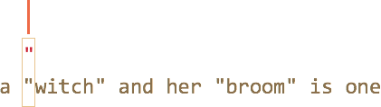
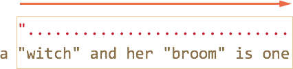
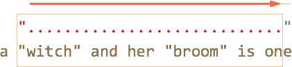
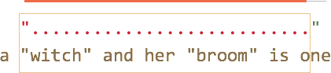
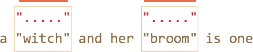

# Жадные и ленивые квантификаторы 

Квантификаторы -- с виду очень простая, но на самом деле очень хитрая штука.

Необходимо очень хорошо понимать, как именно происходит поиск, если конечно мы хотим искать что-либо сложнее чем <code class="pattern">/\d+/</code>.

[cut]

Для примера рассмотрим задачу, которая часто возникает в типографике -- заменить в тексте кавычки вида `"..."` (их называют "английские кавычки") на "кавычки-ёлочки": `«...»`.

Для этого нужно сначала найти все слова в таких кавычках.

Соотверствующее регулярное выражение может выглядеть так: <code class="pattern">/".+"/g</code>, то есть мы ищем кавычку, после которой один или более произвольный символ, и в конце опять кавычка.

Однако, если попробовать применить его на практике, даже на таком простом случае...

```js
//+ run
var reg = /".+"/g;

var str = 'a "witch" and her "broom" is one';

alert( str.match(reg) ); // "witch" and her "broom"
```

...Мы увидим, что оно работает совсем не так, как задумано!

Вместо того, чтобы найти два совпадения <code class="match">"witch"</code> и <code class="match">"broom"</code>, оно находит одно: <code class="match">"witch" and her "broom"</code>.

Это как раз тот случай, когда *жадность* -- причина всех зол.

## Жадный поиск

Чтобы найти совпадение, движок регулярных выражений обычно использует следующий алгоритм:

<ul>
<li>Для каждой позиции в поисковой строке
<ul>
<li>Проверить совпадение на данной позиции
<ul><li>Посимвольно, с учётом классов и квантификаторов сопоставив с ней регулярное выражение.</li></ul>
</li>
</ul>
</li>
</ul>

Это общие слова, гораздо понятнее будет, если мы проследим, что именно он делает для регэкспа <code class="pattern">".+"</code>.

<ol>
<li>Первый символ шаблона -- это кавычка <code class="pattern">"</code>. 

Движок регулярных выражений пытается сопоставить её на 0й позиции в строке, но символ `a`, поэтому на 0й позиции соответствия явно нет.

Далее он переходит 1ю, 2ю позицию в исходной строке и, наконец, обнаруживает кавычку на 3й позиции:

</li>
<li>Кавычка найдена, далее движок проверяет, есть ли соответствие для остальной части паттерна. 

В данном случае следующий символ шаблона: <code class="pattern">.</code> (точка). Она обозначает "любой символ", так что следующая буква строки <code class="match">'w'</code> вполне подходит:

</li>
<li>Далее "любой символ" повторяется, так как стоит квантификатор <code class="pattern">.+</code>. Движок регулярных выражений берёт один символ за другим, до тех пор, пока у него это получается. 

В данном случае это означает "до конца строки":

</li>
<li>Итак, текст закончился, движок регулярных выражений больше не может найти "любой символ", он закончил повторения для <code class="pattern">.+</code> и переходит к следующему символу шаблона.

Следующий символ шаблона -- это кавычка. Её тоже необходимо найти, чтобы соответствие было полным. А тут -- беда, ведь поисковый текст завершился!

Движок регулярных выражений понимает, что, наверное, взял многовато <code class="pattern">.+</code> и начинает отступать обратно.

Иными словами, он сокращает текущее совпадение на один символ:



Это называется "фаза возврата" или "фаза бэктрекинга" (backtracking -- англ.).

Теперь <code class="pattern">.+</code> соответствует почти вся оставшаяся строка, за исключением одного символа, и движок регулярных выражений ещё раз пытается подобрать соответствие для остатка шаблона, начиная с оставшейся части строки. 

Если бы последним символом строки была кавычка <code class="pattern">'"'</code>, то на этом бы всё и закончилось. Но последний символ <code class="subject">'e'</code>, так что совпадения нет.</li>
<li>...Поэтому движок уменьшает число повторений <code class="pattern">.+</code> ещё на один символ:



Кавычка <code class="pattern">'"'</code> не совпадает с <code class="subject">'n'</code>. Опять неудача.</li>
<li>Движок продолжает отступать, он уменьшает количество повторений точки <code class="pattern">'.'</code> до тех пор, пока остаток паттерна, то есть в данном случае кавычка <code class="pattern">'"'</code>, не совпадёт:


</li>
<li>Совпадение получено. Дальнейший поиск по оставшейся части строки <code class="subject">is one</code> новых совпадений не даст.</li>
</ol>

Возможно, это не совсем то, что мы ожидали.

**В жадном режиме (по умолчанию) регэксп повторяет квантификатор настолько много раз, насколько это возможно, чтобы найти соответствие.**

То есть, любой символ <code class="pattern">.+</code> повторился максимальное количество раз, что и привело к такой длинной строке.

А мы, наверное, хотели, чтобы каждая строка в кавычках была независимым совпадением? Для этого можно переключить квантификатор `+` в "ленивый" режим, о котором будет речь далее.

## Ленивый режим

Ленивый режим работы квантификаторов -- противоположность жадному, он означает "повторять минимальное количество раз".

Его можно включить, если поставить знак вопроса <code class="pattern">'?'</code> после квантификатора, так что он станет таким: <code class="pattern">*?</code> или <code class="pattern">+?</code> или даже <code class="pattern">??</code> для <code class="pattern">'?'</code>.

Чтобы не возникло путаницы -- важно понимать: обычно `?` сам является квантификатором (ноль или один). Но если он стоит *после другого квантификатора (или даже после себя)*, то обретает другой смысл -- в этом случае он меняет режим его работы на ленивый.

Регэксп <code class="pattern">/".+?"/g</code> работает, как задумано -- находит отдельно <code class="match">witch</code> и <code class="match">broom</code>:

```js
//+ run
var reg = /".+?"/g;

var str = 'a "witch" and her "broom" is one';

alert( str.match(reg) ); // witch, broom
```

Чтобы в точности понять, как поменялась работа квантификатора, разберём поиск по шагам.

<ol>
<li>Первый шаг -- тот же, кавычка <code class="pattern">'"'</code> найдена на 3й позиции:

</li>

<li>Второй шаг -- тот же, находим произвольный символ <code class="pattern">'.'</code>:

</li>

<li>А вот дальше -- так как стоит ленивый режим работы `+`, то движок не повторет точку (произвольный символ) ещё раз, а останавливается на достигнутом и пытается проверить, есть ли соответствие остальной части шаблона, то есть <code class="pattern">'"'</code>:


Если бы остальная часть шаблона на данной позиции совпала, то совпадение было бы найдено. Но в данном случе -- нет, символ `'i'` не равен '"'.
</li>
<li>Движок регулярных выражений увиличивает количество повторений точки на одно и пытается найти соответствие остатку шаблона ещё раз:


Опять неудача. Тогда поисковой движок увеличивает количество повторений ещё и ещё...
</li>
<li>Только на 5м шаге поисковой движок наконец находит соответствие для остатка паттерна:


</li>
<li>Так как поиск происходит с флагом `g`, то он продолжается с конца текущего совпадения, давая ещё один результат:


</li>
</ol>

В примере выше продемонстрирована работа ленивого режима для <code class="pattern">+?</code>. Квантификаторы  <code class="pattern">+?</code> и <code class="pattern">??</code> ведут себя аналогично -- "ленивый" движок увеличивает количество повторений только в том случае, если для остальной части шаблона на данной позиции нет соответствия.

**Ленивость распространяется только на тот квантификатор, после которого стоит `?`.**

Прочие квантификаторы остаются жадными.

Например:

```js
//+ run
alert( "123 456".match(/\d+ \d+?/g) ); // 123 4
```

<ol>
<li>Подшаблон <code class="pattern">\d+</code> пытается найти столько цифр, сколько возможно (работает жадно), так что он находит <code class="match">123</code> и останавливается, поскольку символ пробела <code class="pattern">' '</code> не подходит под <code class="pattern">\d</code>.</li>
<li>Далее в шаблоне пробел, он совпадает.</li>
<li>Далее в шаблоне идёт <code class="pattern">\d+?</code>. 

Квантификатор указан в ленивом режиме, поэтому он находит одну цифру <code class="match">4</code> и пытается проверить, есть ли совпадение с остатком шаблона. 

Но после <code class="pattern">\d+?</code> в шаблоне ничего нет. 

**Ленивый режим без необходимости лишний раз квантификатор не повторит.**

Так как шаблон завершился, то искать дальше, в общем-то нечего. Получено совпадение <code class="match">123 4</code>.</li>
<li>Следующий поиск продолжится с `5`, но ничего не найдёт.</li>
</ol>

[smart header="Конечные автоматы и не только"]
Современные движки регулярных выражений могут иметь более хитрую реализацию внутренних алгоритмов, чтобы искать быстрее.

Однако, чтобы понять, как работает регулярное выражение, и строить регулярные выражения самому, знание этих хитрых алгоритмов ни к чему. Они служат лишь внутренней оптимизации способа поиска, описанного выше.

Кроме того, сложные регулярные выражения плохо поддаются всяким оптимизациям, так что поиск вполне может работать и в точности как здесь описано.
[/smart]

## Альтернативный подход

В данном конкретном случае, возможно искать строки в кавычках, оставаясь в жадном режиме, с использованием регулярного выражения <code class="pattern">"[^"]+"</code>:

```js
//+ run
var reg = /"[^"]+"/g;

var str = 'a "witch" and her "broom" is one';

alert( str.match(reg) ); // witch, broom
```

Регэксп <code class="pattern">"[^"]+"</code> даст правильные результаты, поскольку ищет кавычку <code class="pattern">'"'</code>, за которой идут столько не-кавычек (исключающие квадратные скобки), сколько возможно.

Так что вторая кавычка автоматически прекращает повторения <code class="pattern">[^"]+</code> и позволяет найти остаток шаблона <code class="pattern">"</code>.

**Эта логика ни в коей мере не заменяет ленивые квантификаторы!**


Она просто другая. И то и другое бывает полезно.

Давайте посмотрим пример, когда нужен именно такой вариант, а ленивые квантификаторы не подойдут.

Например, мы хотим найти в тексте ссылки вида `<a href="..." class="doc">`, с любым содержанием `href`.

Какое регулярное выражение для этого подойдёт?

Первый вариант может выглядеть так: <code class="pattern">/&lt;a href=".*" class="doc"&gt;/g</code>.

Проверим его:
```js
//+ run
var str = '...<a href="link" class="doc">...';
var reg = /<a href=".*" class="doc">/g;

// Сработало!
alert( str.match(reg) ); // <a href="link" class="doc">
```

А если в тексте несколько ссылок?

```js
//+ run
var str = '...<a href="link1" class="doc">... <a href="link2" class="doc">...';
var reg = /<a href=".*" class="doc">/g;

// Упс! Сразу две ссылки!
alert( str.match(reg) ); // <a href="link1" class="doc">... <a href="link2" class="doc">
```

На этот раз результат неверен.

Жадный <code class="pattern">.*</code> взял слишком много символов.

Соответствие получилось таким:
```
<a href="....................................." class="doc"> 
<a href="link1" class="doc">... <a href="link2" class="doc">
```

Модифицируем шаблон -- добавим ленивость квантификатору <code class="pattern">.*?</code>:

```js
//+ run
var str = '...<a href="link1" class="doc">... <a href="link2" class="doc">...';
var reg = /<a href=".*?" class="doc">/g;

// Сработало!
alert( str.match(reg) ); // <a href="link1" class="doc">, <a href="link2" class="doc">
```

Теперь всё верно, два результата:

```
<a href="....." class="doc">    <a href="....." class="doc"> 
<a href="link1" class="doc">... <a href="link2" class="doc">
```

Почему теперь всё в порядке -- для внимательного читателя, после объяснений, данных выше в этой главе, должно быть полностью очевидно. 

Поэтому не будем останавливаться здесь на деталях, а попробуем ещё пример:

```js
//+ run
var str = '...<a href="link1" class="wrong">... <p style="" class="doc">...';
var reg = /<a href=".*?" class="doc">/g;

// Неправильное совпадение!
alert( str.match(reg) ); // <a href="link1" class="wrong">... <p style="" class="doc">
```

Совпадение -- не ссылка, а более длинный текст. 

Получилось следующее:
<ol>
<li>Найдено совпадение <code class="match">&lt;a href="</code>.</li>
<li>Лениво ищем <code class="pattern">.*?</code>, после каждого символа проверяя, есть ли совпадение остальной части шаблона. 

Подшаблон <code class="pattern">.*?</code> будет брать символы до тех пор, пока не найдёт <code class="match">class="doc"&gt;</code>.

В данном случае этот поиск закончится уже за пределами ссылки, в теге `<p>`, вообще не имеющем отношения к `<a>`.
</li>
<li>Получившееся совпадение:

```
<a href="..................................." class="doc">
<a href="link1" class="wrong">... <p style="" class="doc">
```
</li>
</ol>

Итак, ленивость нам не помогла. 

Необходимо как-то прекратить поиск <code class="pattern">.*</code>, чтобы он не вышел за пределы кавычек.

Для этого мы используем более точное указание, какие символы нам подходят, а какие нет.

Правильный вариант: <code class="pattern">[^"]*</code>. Этот шаблон будет брать все символы до ближайшей кавычки, как раз то, что требуется.

Рабочий пример:

```js
//+ run
var str1 = '...<a href="link1" class="wrong">... <p style="" class="doc">...';
var str2 = '...<a href="link1" class="doc">... <a href="link2" class="doc">...';
var reg = /<a href="[^"]*" class="doc">/g;

// Работает!
alert( str1.match(reg) ); // null, совпадений нет, и это верно
alert( str2.match(reg) ); // <a href="link1" class="doc">, <a href="link2" class="doc">
```

## Итого

Квантификаторы имеют два режима работы:
<dl>
<dt>Жадный</dt>
<dd>Режим по умолчанию -- движок регулярных выражений повторяет его по-максимуму. Когда повторять уже нельзя, например нет больше цифр для `\d+`, он продолжает поиск с оставшейся части текста. Если совпадение найти не удалось -- отступает обратно, уменьшая количество повторений.</dd>
<dt>Ленивый</dt>
<dd>При указании после квантификатора символа `?` он работает в ленивом режиме. То есть, он перед каждым повторением проверяет совпадение оставшейся части шаблона на текущей позиции.</dd>
</dl>

Как мы видели в примере выше, ленивый режим -- не панацея от "слишком жадного" забора символов. Альтернатива -- более аккуратно настроенный "жадный", с исключением символов. Как мы увидим далее, можно исключать не только символы, но и целые подшаблоны.


