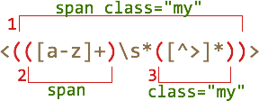

# Скобочные группы

Часть шаблона может быть заключена в скобки <code class="pattern">(...)</code>. Такие выделенные части шаблона называют "скобочными выражениями" или "скобочными группами".

У такого выделения есть два эффекта:
<ol>
<li>Он позволяет выделить часть совпадения в отдельный элемент массива при поиске через [String#match](https://developer.mozilla.org/ru/docs/Web/JavaScript/Reference/Global_Objects/String/match) или [RegExp#exec](https://developer.mozilla.org/ru/docs/Web/JavaScript/Reference/Global_Objects/RegExp/exec).</li>
<li>Если поставить квантификатор после скобки, то он применится *ко всей скобке*, а не всего лишь к одному символу.</li>
</ol>

[cut]

## Пример

В примере ниже, шаблон <code class="pattern">(go)+</code> находит один или более повторяющихся <code class="pattern">'go'</code>:

```js
//+ run
alert( 'Gogogo now!'.match(/(go)+/i ); // "Gogogo"
```

Без скобок, шаблон <code class="pattern">/go+/</code> означал бы <code class="subject">g</code>, после которого идёт одна или более <code class="subject">o</code>, например: <code class="match">goooo</code>. А скобки "группируют" <code class="pattern">(go)</code> вместе.


## Содержимое группы

Скобки нумеруются слева направо. Поисковой движок запоминает содержимое каждой скобки и позволяет обращаться к нему -- в шаблоне и строке замены и, конечно же, в результатах.

Например, найти HTML-тег можно шаблоном <code class="pattern">&lt;.*?&gt;</code>. 

После поиска мы захотим что-то сделать с результатом. Для удобства заключим содержимое `<...>` в скобки: <code class="pattern">&lt;(.*?)&gt;</code>. Тогда оно будет доступно отдельно.

При поиске методом [String#match](https://developer.mozilla.org/ru/docs/Web/JavaScript/Reference/Global_Objects/String/match) в результирующем массиве будет сначала всё совпадение, а далее -- скобочные группы. В шаблоне <code class="pattern">&lt;(.*?)&gt;</code> скобочная группа только одна:

```js
//+ run
var str = '<h1>Привет, мир!</h1>';
var reg = /<(.*?)>/;

alert( str.match(reg) ); // массив: <h1>, h1
```

Заметим, что метод [String#match](https://developer.mozilla.org/ru/docs/Web/JavaScript/Reference/Global_Objects/String/match) выдаёт скобочные группы только при поиске без флага `/.../g`. В примере выше он нашёл только первое совпадение <code class="match">&lt;h1&gt;</code>, а закрывающий <code class="match">&lt;/h1&gt;</code> не нашёл, поскольку без флага `/.../g` ищется только первое совпадение.

Для того, чтобы искать и с флагом `/.../g` и со скобочными группами, используется метод [RegExp#exec](https://developer.mozilla.org/ru/docs/Web/JavaScript/Reference/Global_Objects/RegExp/exec):

```js
//+ run
var str = '<h1>Привет, мир!</h1>';
var reg = /<(.*?)>/g;

var match;

while ((match = reg.exec(str)) !== null) {
  // сначала выведет первое совпадение: <h1>,h1
  // затем выведет второе совпадение: </h1>,/h1
  alert(match);
}
```

Теперь найдено оба совпадения <code class="pattern">&lt;(.*?)&gt;</code>, каждое -- массив из полного совпадения и скобочных групп (одна в данном случае).

## Вложенные группы
Скобки могут быть и вложенными. В этом случае нумерация также идёт слева направо.

Например, при поиске тега в <code class="subject">&lt;span class="my"&gt;</code> нас может интересовать:

<ol>
<li>Содержимое тега целиком: `span class="my"`.</li>
<li>В отдельную переменную для удобства хотелось бы поместить тег: `span`.</li>
<li>Также может быть удобно отдельно выделить атрибуты `class="my"`.</li>
</ol>

Добавим скобки в регулярное выражение:

```js
//+ run
var str = '<span class="my">';

reg = /<(([a-z]+)\s*([^>]*))>/;

alert( str.match(reg) ); // <span class="my">, span, s
```

Вот так выглядят скобочные группы:



На нулевом месте -- всегда совпадение полностью, далее -- группы. Нумерация всегда идёт слева направо, по открывающей скобке.

В данном случае получилось, что группа 1 включает в себя содержимое групп 2 и 3. Это совершенно нормальная ситуация, которая возникает, когда нужно выделить что-то отдельное внутри большей группы.

**Даже если скобочная группа необязательна и не входит в совпадение, соответствующий элемент массива существует (и равен `undefined`).**

Например, рассмотрим регэксп <code class="pattern">a(z)?(c)?</code>. Он ищет `"a"`, за которой не обязательно идёт буква `"z"`, за которой необязательно идёт буква `"c"`.

Если напустить его на строку из одной буквы `"a"`, то результат будет таков:

```js
//+ run
match = 'a'.match(/a(z)?(c)?/)

alert( match.length ); // 3
alert( match[0] ); // a
alert( match[1] ); // undefined
alert( match[2] ); // undefined
```

Массив получился длины `3`, но все скобочные группы -- `undefined`.

А теперь более сложная ситуация, строка <code class="subject">ack</code>:

```js
//+ run
match = 'ack'.match(/a(z)?(c)?/)

alert( match.length ); // 3
alert( match[0] ); // ac, всё совпадение
alert( match[1] ); // undefined, для (z)? ничего нет
alert( match[2] ); // c
```

Длина массива результатов по-прежнему `3`. Она постоянна. А вот для скобочной группы <code class="pattern">(z)?</code> в ней ничего нет, поэтому результат: `["ac", undefined, "c"]`.

## Исключение из запоминания через ?:

Бывает так, что скобки нужны, чтобы квантификатор правильно применился, а вот запоминать её в массиве не нужно. 

Скобочную группу можно исключить из запоминаемых и нумеруемых, добавив в её начало <code class="pattern">?:</code>.


Например, мы хотим найти <code class="pattern">(go)+</code>, но содержимое скобок (`go`) в отдельный элемент массива выделять не хотим. 

Для этого нужно сразу после открывающей скобки поставить `?:`, то есть: <code class="pattern">(?:go)+</code>.

Например:

```js
//+ run
var str = "Gogo John!";
*!*
var reg = /(?:go)+ (\w+)/i;
*/!*

var result = str.match(reg);

alert( result.length ); // 2
alert( result[1] ); // John
```

В примере выше массив результатов имеет длину `2` и содержит только полное совпадение и результат <code class="pattern">(\w+)</code>. Это удобно в тех случаях, когда содержимое скобок нас не интересует.
