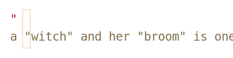
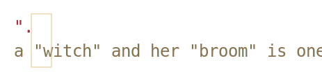
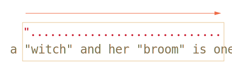
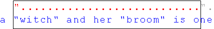

# Жадные и ленивые квантификаторы [todo]

Квантификаторы -- с виду очень простая, но на самом деле очень хитрая штука.

Необходимо очень хорошо понимать, как именно происходит поиск, если конечно мы хотим искать что-либо сложнее чем <code class="pattern">/\d+/</code>.

[cut]

Для примера рассмотрим задачу, которая часто возникает в типографике -- заменить в тексте кавычки вида `"..."` (их называют "английские кавычки") на "кавычки-ёлочки": `«...»`.

Для этого нужно сначала найти все слова в таких кавычках.

Соотверствующее регулярное выражение может выглядеть так: <code class="pattern">/".+"/g</code>, то есть мы ищем кавычку, после которой один или более произвольный символ, и в конце опять кавычка.

Однако, если попробовать применить его на практике, даже на таком простом случае...

```js
//+ run
var reg = /".+"/g;

var str = 'a "witch" and her "broom" is one';

alert( str.match(reg) ); // "witch" and her "broom"
```

...Мы увидим, что оно работает совсем не так, как задумано!

Вместо того, чтобы найти два совпадения <code class="match">"witch"</code> и <code class="match">"broom"</code>, оно находит одно: <code class="match">"witch" and her "broom"</code>.

Это как раз тот случай, когда *жадность* -- причина всех зол.

## Жадный поиск

Чтобы найти совпадение, движок регулярных выражений обычно использует следующий алгоритм:

<ul>
<li>Для каждой позиции в поисковой строке
<ul>
<li>Проверить совпадение на данной позиции
<ul><li>Посимвольно, с учётом классов и квантификаторов сопоставив с ней регулярное выражение.</li></ul>
</li>
</ul>
</li>
</ul>

Это общие слова, гораздо понятнее будет, если мы проследим, что именно он делает для регэкспа <code class="pattern">".+"</code>.

<ol>
<li>Первый символ шаблона -- это кавычка <code class="pattern">"</code>. 

Движок регулярных выражений пытается сопоставить её на 0й позиции в строке, но символ `a`, поэтому на 0й позиции соответствия явно нет.

Далее он переходит 1ю, 2ю позицию в исходной строке и, наконец, обнаруживает кавычку на 3й позиции:

</li>
<li>Кавычка найдена, далее движок проверяет, есть ли соответствие для остальной части паттерна. 

В данном случае следующий символ паттерна -- `.` (точка). Она обозначает "любой символ", так что следующая буква строки <code class="match">'w'</code> вполне подходит:

</li>
<li>Далее "любой символ" повторяется, так как стоит квантификатор <code class="pattern">.+</code>. Движок регулярных выражений берёт один символ за другим, до тех пор, пока у него это получается. 

В данном случае это означает "до конца строки":

</li>
<li>Итак, текст закончился, движок регулярных выражений больше не может найти "любой символ", он закончил строить соответствие для <code class="pattern">.+</code> и очень рад по этому поводу.

Следующий символ шаблона -- это кавычка. Её тоже необходимо найти, чтобы соответствие было полным. А тут -- беда, ведь поисковый текст завершился!

Движок регулярных выражений понимает, что, наверное, взял многовато <code class="pattern">.+</code> и начинает отступать обратно ("фаза бэктрекинга" -- backtracking на англ.).

Иными словами, он сокращает текущее совпадение на один символ:


После этого он ещё раз пытается подобрать соответствие для остатка паттерна. Но кавычка <code class="pattern">'"'</code> не совпадает с <code class="subject">'e'</code>.</li>
<li>...Так что движок уменьшает число повторений <code class="pattern">.+</code> ещё раз:



Кавычка <code class="pattern">'"'</code> не совпадает с <code class="subject">'n'</code>. Опять неудача.</li>
<li>Движок продолжает отступать, он уменьшает количество повторений точки <code class="pattern">'.'</code> до тех пор, пока остаток паттерна не совпадёт:


</li>
<li>Мы получили результат. Так как у регэкспа есть флаг `g`, то поиск продолжится, однако это произойдёт после первого совпадения и не даст новых результатов.</li>
</ol>

**В жадном режиме (по умолчанию) регэксп повторяет квантификатор настолько много раз, насколько это возможно, чтобы найти соответствие.**

Возможно, это не совсем то, что мы хотели, но так это работает.

## Ленивый режим

Ленивый режим работы квантификаторов -- противоположность жадному, он означает "повторять минимальное количество раз".

Его можно включить, если поставить знак вопроса <code class="pattern">'?'</code> после квантификатора, так что он станет таким: <code class="pattern">*?</code> или <code class="pattern">+?</code> или даже <code class="pattern">??</code> для <code class="pattern">'?'</code>.

Чтобы не возникло путаницы -- важно понимать: обычно `?` сам является квантификатором (ноль или один). Но если он стоит *после другого квантификатора (или даже после себя)*, то обретает другой смысл -- в этом случае он меняет режим его работы на ленивый.

Регэксп <code class="pattern">/".+?"/g</code> работает, как задумано -- находит отдельно <code class="match">witch</code> и <code class="match">broom</code>:

```js
//+ run
var reg = /".+?"/g;

var str = 'a "witch" and her "broom" is one';

alert( str.match(reg) ); // witch, broom
```

Чтобы в точности понять, что происходим, разберём в деталях, как ищется <code class="pattern">".+?"</code>.

<ol>
<li>Первый шаг -- тот же, кавычка <code class="pattern">'"'</code> найдена на 3й позиции:

</li>

<li>Второй шаг -- тот же, находим произвольный символ <code class="pattern">'.'</code>:

</li>

<li>А вот дальше -- так как стоит ленивый режим работы `+`, то движок пытается повторять точку (произвольный символ) *минимальное количество раз*.

Так что он тут же пытается проверить, достаточно ли повторить 1 раз -- и для этого пытается найти соответствие остальной части шаблона, то есть <code class="pattern">'"'</code>:


Нет, один раз повторить недостаточно. В данном случае, символ `'i' != '"'`, но если бы оставшаяся часть паттерна была бы более сложной -- алгоритм остался бы тем же. Если остаток шаблона не находится -- увеличиваем количество повторений.
</li>
<li>Движок регулярных выражений увиличивает количество повторений точки на одно и пытается найти соответствие остатку шаблона ещё раз:


Опять неудача. Тогда поисковой движок увеличивает количество повторений ещё и ещё...
</li>
<li>Только на 5м шаге поисковой движок наконец находит соответствие для остатка паттерна:


</li>
<li>Так как поиск происходит с флагом `g`, то он продолжается с конца текущего совпадения, давая ещё один результат:


</li>
</ol>

В примере выше продемонстрирована работа ленивого режима для <code class="pattern">+?</code>. Квантификаторы  <code class="pattern">+?</code> и <code class="pattern">??</code> ведут себя аналогично -- "ленивый" движок увеличивает количество повторений только в том случае, если для остальной части шаблона на данной позиции нет соответствия, в то время как жадный сначала берёт столько повторений, сколько возможно, а потом отступает назад.

**Ленивость распространяется только на тот квантификатор, после которого стоит `?`.**

Прочие квантификаторы остаются жадными.

Например:

```js
//+ run
alert( "123 456".match ( /\d+ \d+?/g) );  // 123 4
```

<ol>
<li>Подпаттерн <code class="pattern">\d+</code> пытается найти столько символов, сколько возможно (работает жадно), так что он находит <code class="match">123</code> и останавливается, поскольку символ пробела <code class="pattern">' '</code> не подходит под <code class="pattern">\d</code>.</li>
<li>Далее идёт пробел, и в игру вступает <code class="pattern">\d+?</code>. 

Он находит один символ <code class="match">'4'</code> и пытатся проверить, есть ли совпадение с остатком шаблона (после <code class="pattern">\d+?</code>).

Здесь мы ещё раз заметим -- ленивый режим без необходимости ничего не возьмёт.

Так как шаблон закончился, то поиск завершается и <code class="match">123 4</code> становится результатом.</li>
<li>Следующий поиск продолжится с `5`, но ничего не найдёт.</li>
</ol>

[smart header="Конечные автоматы и не только"]
Современные движки регулярных выражений могут иметь более хитрую реализацию внутренних алгоритмов, чтобы искать быстрее.

Однако, чтобы понять, как работает регулярное выражение, и строить регулярные выражения самому, знание этих хитрых алгоритмов ни к чему. Они служат лишь внутренней оптимизации способа поиска, описанного выше.

Кроме того, сложные регулярные выражения плохо поддаются всяким оптимизациям, так что поиск вполне может работать и в точности как здесь описано.
[/smart]

## Альтернативный подход

В данном конкретном случае, возможно искать строки в кавычках, оставаясь в жадном режиме, с использованием регулярного выражения <code class="pattern">"[^"]+"</code>:

```js
//+ run
var reg = /"[^"]+"/g;

var str = 'a "witch" and her "broom" is one';

alert( str.match(reg) ); // witch, broom
```

Регэксп <code class="pattern">"[^"]+"</code> даст правильные результаты, поскольку ищет кавычку <code class="pattern">'"'</code>, за которой идут столько не-кавычек (исключающие квадратные скобки), сколько возможно. Так что вторая кавычка автоматически прекращает повторения <code class="pattern">[^"]+</code> и позволяет найти остаток шаблона <code class="pattern">"</code>.


