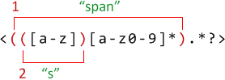

# Группы [todo]

Часть шаблона может быть заключена в скобки <code class="pattern">(...)</code>. Такие выделенные части шаблона называют "скобочными выражениями" или "скобочными группами".

У такого выделения есть два эффекта:
<ol>
<li>Он позволяет выделить часть совпадения в отдельный элемент массива при поиске через [String#match](https://developer.mozilla.org/ru/docs/Web/JavaScript/Reference/Global_Objects/String/match) или [RegExp#exec](https://developer.mozilla.org/ru/docs/Web/JavaScript/Reference/Global_Objects/RegExp/exec).</li>
<li>Если поставить квантификатор после скобки, то он применится *ко всей скобке*, а не всего лишь к одному символу.</li>
</ol>

[cut]
В примере ниже, шаблон <code class="pattern">(go)+</code> находит один или более повторяющихся <code class="pattern">'go'</code>:

```js
//+ run
alert( 'Gogogo now!'.match(/(go)+/i ); // "Gogogo"
```

Без скобок, шаблон <code class="pattern">/go+/</code> означал бы <code class="subject">g</code>, после которого идёт одна или более <code class="subject">o</code>, например: <code class="match">goooo</code>.


**Скобки нумеруются слева направо. Поисковой движок запоминает содержимое каждой скобки и позволяет обращаться к нему, в том числе -- в шаблоне и строке замены.**

Например, найти HTML-тег можно шаблоном <code class="pattern">&lt;.*?&gt;</code>. Скорее всего, после поиска мы захотим что-то сделать с результатом, и нас будет интересовать содержимое `<...>`.

Для удобства заключим его в скобки: <code class="pattern">&lt;(.*?)&gt;</code>. Тогда содержимое скобок можно будет получить отдельно.

Используем метод [String#match](https://developer.mozilla.org/ru/docs/Web/JavaScript/Reference/Global_Objects/String/match). В результирующем массиве будет сначала всё совпадение, а далее -- скобочные группы, в данном случае -- только одна:

```js
//+ run
var str = '<h1>Привет, мир!</h1>'
var reg = /<(.*?)>/

alert(str.match(reg)) // массив: <h1>, h1
```

Для поиска всех совпадений, как мы обсуждали ранее, используется метод [RegExp#exec](https://developer.mozilla.org/ru/docs/Web/JavaScript/Reference/Global_Objects/RegExp/exec).

**Скобки могут быть и вложенными. В этом случае нумерация также идёт слева направо.**

Например, в строке <code class="subject">&lt;span class="my"&gt;</code> нас может интересовать отдельно тег `span` и, для примера, его первая буква.

Добавим скобки в регулярное выражение:

```js
//+ run
var str = '<span class="my">';

reg = /<(([a-z])[a-z0-9]*).*?>/;

alert( str.match(reg) ); // <span class="my">, span, s
```

Вот так выглядят скобочные группы:


На нулевом месте -- всегда совпадение полностью, далее -- группы. Их вложенность означает всего лишь, что группа 1 содержит группу 2. Нумерация всегда идёт слева направо, по открывающей скобке.

**Даже если скобочная группа необязательна и не входит в совпадение, соответствующий элемент массива существует (и равен `undefined`).**

Например, рассмотрим регэксп <code class="pattern">a(z)?(c)?</code>. Он ищет `"a"`, за которой не обязательно идёт буква `"z"`, за которой необязательно идёт буква `"c"`.

Если напустить его на строку из одной буквы `"a"`, то результат будет таков:

```js
//+ run
match = 'a'.match(/a(z)?(c)?/)

alert( match.length ); // 3
alert( match[0] ); // a
alert( match[1] ); // undefined
alert( match[2] ); // undefined
```

Массив получился длины `3`, но все скобочные группы -- `undefined`.

А теперь более сложная ситуация, строка <code class="subject">ack</code>:

```js
//+ run
match = 'ack'.match(/a(z)?(c)?/)

alert( match.length ); // 3
alert( match[0] ); // ac, всё совпадение
alert( match[1] ); // undefined, для (z)? ничего нет
alert( match[2] ); // c
```

Длина массива результатов по-прежнему `3`. Она постоянна. А вот для скобочной группы <code class="pattern">(z)?</code> в ней ничего нет.

**Скобочную группу можно исключить из запоминаемых и нумеруемых, добавив в её начало <code class="pattern">?:</code>**

Бывает так, что скобки нужны, чтобы квантификатор правильно применился, а вот запоминать её в массиве не нужно. Тогда мы просто ставим сразу после открывающей скобки `?:`

В примере ниже есть скобочная группа <code class="pattern">(go-?)</code>, которая сама по себе не интересна, но входит в результаты:

```js
//+ run
var str = "Go-go John!";
*!*
var reg = /(go-?)* (\w+)/i;
*/!*

var result = str.match(reg);

alert( result[0] ); // Go-go John
alert( result[1] ); // go
alert( result[2] ); // John
```

Исключим её из запоминаемых:

```js
//+ run
var str = "Go-go John!";
*!*
var reg = /(?:go-?)* (\w+)/i;
*/!*

var result = str.match(reg);

alert( result[0] ); // Go-go John
alert( result[1] ); // John
```

