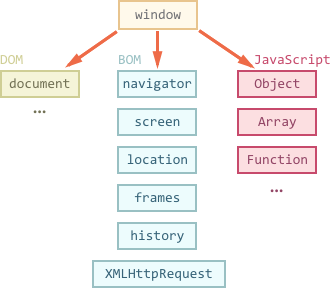

# Browser environment, specs

The JavaScript language was initially created for web browsers. Since then, it has evolved and become a language with many uses and platforms.

A platform may be a browser, or a web-server, or a washing machine, or another *host*. Each of them provides platform-specific functionality. The JavaScript specification calls that a *host environment*.

A host environment provides platform-specific objects and functions additional to the language core. Web browsers give a means to control web pages. Node.JS provides server-side features, and so on.

Here's a bird's-eye view of what we have when JavaScript runs in a web-browser:



There's a "root" object called `window`. It has two roles:

1. First, it is a global object for JavaScript code, as described in the chapter <info:global-object>.
2. Second, it represents the "browser window" and provides methods to control it.

For instance, here we use it as a global object:

```js run
function sayHi() {
  alert("Hello");
}

// global functions are accessible as properties of window
window.sayHi();
```

And here we use it as a browser window, to see the window height:

```js run
alert(window.innerHeight); // inner window height
```

There are more window-specific methods and properties, we'll cover them later.

## Document Object Model (DOM)

The `document` object gives access to the page content. We can change or create anything on the page using it.

For instance:
```js run
// change the background color to red
document.body.style.background = "red";

// change it back after 1 second
setTimeout(() => document.body.style.background = "", 1000);
```

Here we used `document.body.style`, but there's much, much more. Properties and methods are described in the specification. There happen to be two working groups who develop it:

1. [W3C](https://en.wikipedia.org/wiki/World_Wide_Web_Consortium) -- the documentation is at <https://www.w3.org/TR/dom>.
2. [WhatWG](https://en.wikipedia.org/wiki/WHATWG), publishing at <https://dom.spec.whatwg.org>.

As it happens, the two groups don't always agree, so it's like we have two sets of standards. But they are very similar and eventually things merge. The documentation that you can find on the given resources is very similar, with about a 99% match. There are very minor differences that you probably won't notice.

Personally, I find <https://dom.spec.whatwg.org> more pleasant to use.

In the ancient past, there was no standard at all -- each browser implemented however it wanted. Different browsers had different sets, methods, and properties for the same thing, and developers had to write different code for each of them. Dark, messy times.

Even now we can sometimes meet old code that uses browser-specific properties and works around incompatibilities. But, in this tutorial we'll use modern stuff: there's no need to learn old things until you really need to (chances are high that you won't).

Then the DOM standard appeared, in an attempt to bring everyone to an agreement. The first version was "DOM Level 1", then it was extended by DOM Level 2, then DOM Level 3, and now it's reached DOM Level 4. People from WhatWG group got tired of version numbers and are calling it just "DOM", without a number. So we'll do the same.

```smart header="DOM is not only for browsers"
The DOM specification explains the structure of a document and provides objects to manipulate it. There are non-browser instruments that use it too.

For instance, server-side tools that download HTML pages and process them use the DOM. They may support only a part of the specification though.
```

```smart header="CSSOM for styling"
CSS rules and stylesheets are not structured like HTML. There's a separate specification [CSSOM](https://www.w3.org/TR/cssom-1/) that explains how they are represented as objects, and how to read and write them.

CSSOM is used together with DOM when we modify style rules for the document. In practice though, CSSOM is rarely required, because usually CSS rules are static. We rarely need to add/remove CSS rules from JavaScript, so we won't cover it right now.
```

## BOM (part of HTML spec)

Browser Object Model (BOM) are additional objects provided by the browser (host environment) to work with everything except the document.

For instance:

- The [navigator](mdn:api/Window/navigator) object provides background information about the browser and the operating system. There are many properties, but the two most widely known are: `navigator.userAgent` -- about the current browser, and `navigator.platform` -- about the platform (can help to differ between Windows/Linux/Mac etc).
- The [location](mdn:api/Window/location) object allows us to read the current URL and can redirect the browser to a new one.

Here's how we can use the `location` object:

```js run
alert(location.href); // shows current URL
if (confirm("Go to wikipedia?")) {
  location.href = "https://wikipedia.org"; // redirect the browser to another URL
}
```

Functions `alert/confirm/prompt` are also a part of BOM: they are directly not related to the document, but represent pure browser methods of communicating with the user.


```smart header="HTML specification"
BOM is the part of the general [HTML specification](https://html.spec.whatwg.org).

Yes, you heard that right. The HTML spec at <https://html.spec.whatwg.org> is not only about the "HTML language" (tags, attributes), but also covers a bunch of objects, methods and browser-specific DOM extensions. That's "HTML in broad terms".
```

## Summary

Talking about standards, we have:

DOM specification
: Describes the document structure, manipulations and events, see <https://dom.spec.whatwg.org>.

CSSOM specification
: Describes stylesheets and style rules, manipulations with them and their binding to documents, see <https://www.w3.org/TR/cssom-1/>.

HTML specification
: Describes the HTML language (e.g. tags) and also the BOM (browser object model) -- various browser functions: `setTimeout`, `alert`, `location` and so on, see <https://html.spec.whatwg.org>. It takes the DOM specification and extends it with many additional properties and methods.

Now we'll get down to learning DOM, because the document plays the central role in the UI.

Please note the links above, as there's so much stuff to learn it's impossible to cover and remember everything.

When you'd like to read about a property or a method, the Mozilla manual at <https://developer.mozilla.org/en-US/search> is a nice resource, but reading the corresponding spec may be better: it's more complex and longer to read, but will make your fundamental knowledge sound and complete.
