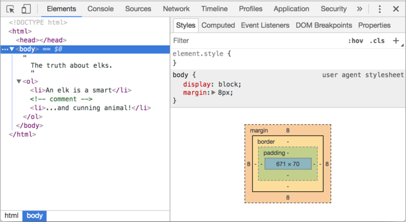
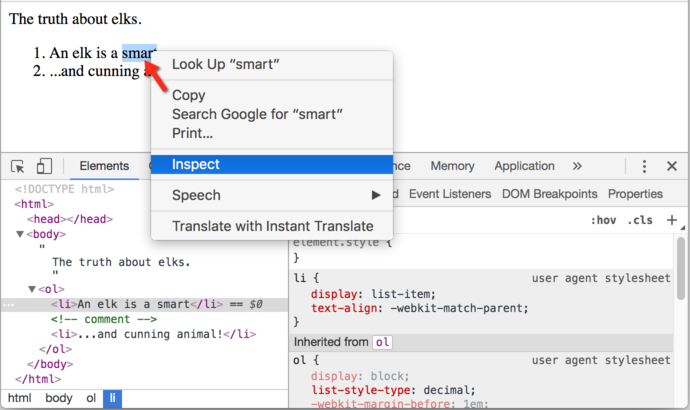

libs:
  - d3
  - domtree

---

# DOM tree

When we look at HTML we see nested tags, right? According to Document Object Model (DOM), every HTML-tag is an object. Nested tags are his "children". And the text inside it is an object as well. All these objects are accessible using Javascript.

## An example of DOM

For instance, let's see the DOM tree for this document:

```html run no-beautify
<!DOCTYPE HTML>
<html>
<head>
  <title>About elks</title>
</head>
<body>
  The truth about elks.
</body>
</html>
```

Here's how it looks:

<div class="domtree"></div>

<script>
var node = {"name":"HTML","nodeType":1,"children":[{"name":"HEAD","nodeType":1,"children":[{"name":"#text","nodeType":3,"content":"\n    "},{"name":"TITLE","nodeType":1,"children":[{"name":"#text","nodeType":3,"content":"About elks"}]},{"name":"#text","nodeType":3,"content":"\n  "}]},{"name":"#text","nodeType":3,"content":"\n  "},{"name":"BODY","nodeType":1,"children":[{"name":"#text","nodeType":3,"content":"\n  The truth about elks."}]}]}

drawHtmlTree(node, 'div.domtree', 690, 300);
</script>

There are two types of tree nodes in the example:

1. Tags are called *element nodes* (or just elements). Naturally, nested tags become children of the enclosing ones. Because of that we have a tree.
2. The text inside elements forms *text nodes*, labelled as `#text`. A text node contains only a string. It may not have children and is always a leaf of the tree.

```online
**On the picture above element nodes you can click on element nodes. Their children will open/collapse.**
```

Please note the special characters in text nodes:

- a newline: `↵` (in Javascript known as `\n`)
- a space: `␣`

**Spaces and newlines -- are all valid characters, they form text nodes and become a part of the DOM.**

For instance, in the example above `<html>` contains not only elements `<head>` and `<body>`, but also the `#text` (spaces, line breaks) between them.

However, on the topmost level there are exclusions of that rule: spaces and newlines before `<head>` are ignored for historical reasons, and if we put something after `</body>`, then it is considered a malformed HTML, and that text is moved inside the `body`, at the end (there may be nothing after the `body`).

In other cases everything's honest -- if there are spaces (just like any character) in the document, then they text nodes in DOM, and if we remove them, then there won't be any in DOM, like here:

```html no-beautify
<!DOCTYPE HTML>
<html><head><title>About elks</title></head><body>The truth about elks.</body></html>
```

<div class="domtree"></div>

<script>
var node = {"name":"HTML","nodeType":1,"children":[{"name":"HEAD","nodeType":1,"children":[{"name":"TITLE","nodeType":1,"children":[{"name":"#text","nodeType":3,"content":"About elks"}]}]},{"name":"BODY","nodeType":1,"children":[{"name":"#text","nodeType":3,"content":"The truth about elks."}]}]}

drawHtmlTree(node, 'div.domtree', 690, 210);
</script>

```smart header="Starting/ending spaces and line breaks are usually not shown in DOM tools"
Tools working with DOM usually do not show spaces at start/end of the text and line-breaks between nodes. That's because they are mainly used to decorate HTML, and do not affect (in most cases) how it is shown.

On our DOM pictures we'll omit them too where they are not important, to keep things short.
```


## Autocorrection

If the browser encounters malformed HTML, it automatically corrects it when making DOM.

For instance, the top tag is always `<html>`. Even if it doesn't exist in the document -- it will be in DOM, the browser will create it. The same about `<body>`.

Like, if the HTML file is a single word `"Hello"`, the browser will wrap it into `<html>` and `<body>`.

**While generating DOM, browser automatically processes errors in the document, closes tags and so on.**

Such an "invalid" document:

```html no-beautify
<p>Hello
<li>Mom
<li>and
<li>Dad
```

...Will become a normal DOM, as the browser read tags and restores the missing parts:

<div class="domtree"></div>

<script>
var node = {"name":"HTML","nodeType":1,"children":[{"name":"HEAD","nodeType":1,"children":[]},{"name":"BODY","nodeType":1,"children":[{"name":"P","nodeType":1,"children":[{"name":"#text","nodeType":3,"content":"Hello"}]},{"name":"LI","nodeType":1,"children":[{"name":"#text","nodeType":3,"content":"Mom"}]},{"name":"LI","nodeType":1,"children":[{"name":"#text","nodeType":3,"content":"and"}]},{"name":"LI","nodeType":1,"children":[{"name":"#text","nodeType":3,"content":"Dad"}]}]}]}

drawHtmlTree(node, 'div.domtree', 690, 360);
</script>

````warn header="Tables always have `<tbody>`"
An interesting "special case" is tables. By the DOM specification they must have `<tbody>`, but HTML text may omit it. Then the browser creates `<tbody>` on it's own.

For the HTML:

```html no-beautify
<table id="table"><tr><td>1</td></tr></table>
```

DOM-structure will be:
<div class="domtree"></div>

<script>
var node = {"name":"TABLE","nodeType":1,"children":[{"name":"TBODY","nodeType":1,"children":[{"name":"TR","nodeType":1,"children":[{"name":"TD","nodeType":1,"children":[{"name":"#text","nodeType":3,"content":"1"}]}]}]}]};

drawHtmlTree(node,  'div.domtree', 600, 200);
</script>

You see? The `<tbody>` has appeared out of nowhere. Should keep in mind while working with tables to evade surprises.
````

## Other node types

Let's add more tags and a comment to the page:

```html
<!DOCTYPE HTML>
<html>
<body>
  The truth about elks.
  <ol>
    <li>An elk is a smart</li>
*!*
    <!-- comment -->
*/!*
    <li>...and cunning animal!</li>
  </ol>
</body>
</html>
```

<div class="domtree"></div>

<script>
var node = {"name":"HTML","nodeType":1,"children":[{"name":"HEAD","nodeType":1,"children":[]},{"name":"BODY","nodeType":1,"children":[{"name":"#text","nodeType":3,"content":"\n  The truth about elks.\n    "},{"name":"OL","nodeType":1,"children":[{"name":"#text","nodeType":3,"content":"\n      "},{"name":"LI","nodeType":1,"children":[{"name":"#text","nodeType":3,"content":"An elk is a smart"}]},{"name":"#text","nodeType":3,"content":"\n      "},{"name":"#comment","nodeType":8,"content":"comment"},{"name":"#text","nodeType":3,"content":"\n      "},{"name":"LI","nodeType":1,"children":[{"name":"#text","nodeType":3,"content":"...and cunning animal!"}]},{"name":"#text","nodeType":3,"content":"\n    "}]},{"name":"#text","nodeType":3,"content":"\n  \n"}]}]};

drawHtmlTree(node, 'div.domtree', 690, 500);
</script>

Here we see a new tree node type -- *comment node*.

We may think -- why a comment is added to the DOM? It doesn't affect the visual representation anyway. But there's a rule -- if something's in HTML, then it also must be in the DOM tree.

**Everything in HTML, even comments, becomes a part of DOM.**

Even the `<!DOCTYPE...>` directive at the very beginning of HTML is also a DOM node. It's in the DOM tree right before `<html>`. We are not going to touch that node, but it's there.

The `document` object that represents the whole document is, formally, a DOM node as well.

There are [12 node types](https://dom.spec.whatwg.org/#node). In practice we mainly work with 4 of them:

1. `document` -- the "entry point" into DOM.
2. element nodes -- HTML-tags, the tree building blocks.
3. text nodes -- they contain text.
4. comments -- sometimes we can put the information there, that won't be shown, but JS can read it from DOM.

## See it yourself

To see the DOM structure in real-time, try [Live DOM Viewer](http://software.hixie.ch/utilities/js/live-dom-viewer/). Just type in the document, and it will show up DOM at instant.

## In the browser inspector

Another way to explore DOM is to use browser developer tools. Actually, that's what we use when developing.

To do so, open the web-page [elks.html](elks.html), turn on browser developer tools and switch to Elements tab.

Should look like this:



So you can see the DOM, click on elements, see the details about them and so on.

Please note that the DOM structure show in developer tools is simplified. Text nodes are shown just as text. And there are no "blank" (space only) text nodes at all. That's fine, because most of time we are interested in element nodes.

Clicking the <span class="devtools" style="background-position:-328px -124px"></span> button allows to choose a node from the webpage using a mouse (or alike) and "inspect" it. Works great when we have a huge HTML page and would like to see the DOM of a particular place in it.

Another way to do it would be just right-clicking on a webpage and selecting "Inspect element" in the context menu.



The right part has tabs:
- Styles -- to see CSS applied to the current element rule by rule, including built-in rules (gray). Almost everything can be edited at-place including the dimensions/margins/paddings of the box below.
- Computed -- to see CSS applied to the element by property: for each property we can see a rule that gives it (including CSS inheritance and such).
- ...there are other less used tabs as well.

The best way to study them is to click around. Again, please note that most values are in-place editable.

## Interaction with console

As we explore the DOM, open/close nodes, we also may want to apply Javascript to it. Like get a node and some code on it, to see how it works. There are few tips to travel between nodes in Elements tab and the console.

Press `key:Esc` -- it will open console right below the Elements tab.

Now, the most recently selected element is available as `$0`, the previous one as `$1` etc.

We can run commands on them, like `$0.style.background = 'red'` here:


From the other side, if we're in console and have a node in a variable, then we can use the command `inspect(node)` to see it in the Elements pane. Or we can just output it and explore "at-place".


From the next chapter on we'll study how to access and modify the DOM using Javascript. The browser developer tools are the great help in debugging things.

## Summary

An HTML/XML document are represented inside the browser as the DOM tree.

- Tags become element nodes and form the structure.
- Text becomes text nodes.
- ...etc, everything in HTML has its place in DOM, even comments.

We can use developer tools to inspect DOM and modify it manually. There's an extensive documentation about Chrome developer tools at <https://developers.google.com/web/tools/chrome-devtools>, but the best way to learn it is to click here and there, see various menus: most options are obvious. And then later, when you know most stuff, read the docs and pick up the rest. 

DOM nodes have properties and methods that allow to modify them. We'll get down to it in further chapters.
