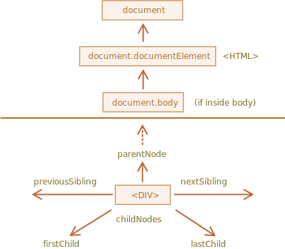

libs:
  - d3
  - domtree

---

# Walking the DOM

The DOM allows us to do anything with elements and their contents, but first we need to reach the corresponding DOM object.

All operations on the DOM start with the `document` object. That's the main "entry point" to DOM. From it we can access any node.

Here's a picture of links that allow for travel between DOM nodes:



Let's discuss them in more detail.

## On top: documentElement and body

The topmost tree nodes are available directly as `document` properties:

`<html>` = `document.documentElement`
: The topmost document node is `document.documentElement`. That's the DOM node of the `<html>` tag.

`<body>` = `document.body`
: Another widely used DOM node is the `<body>` element -- `document.body`.

`<head>` = `document.head`
: The `<head>` tag is available as `document.head`.

````warn header="There's a catch: `document.body` can be `null`"
A script cannot access an element that doesn't exist at the moment of running.

In particular, if a script is inside `<head>`, then `document.body` is unavailable, because the browser did not read it yet.

So, in the example below the first `alert` shows `null`:

```html run
<html>

<head>
  <script>
*!*
    alert( "From HEAD: " + document.body ); // null, there's no <body> yet
*/!*
  </script>
</head>

<body>

  <script>
    alert( "From BODY: " + document.body ); // HTMLBodyElement, now it exists
  </script>

</body>
</html>
