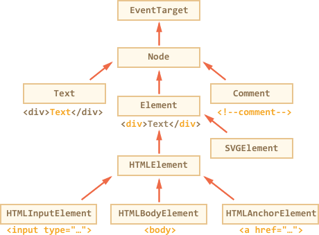

# Node properties: type, tag and contents

Let's get a more in-depth look at DOM nodes.

In this chapter we'll see more into what they are and their most used properties.

[cut]

## DOM node classes

DOM nodes have different properties depending on their class. For instance, element nodes corresponding to tag `<a>` have link-related properties, and those corresponding to `<input>` have input-related and so on.

Text nodes are not the same as element nodes: they have properties of their own.

Still, there's something in common between all of them, because of the inheritance. DOM objects belong to different classes which form a hierarchy.

The root object is [EventTarget](https://dom.spec.whatwg.org/#eventtarget), then goes  [Node](http://dom.spec.whatwg.org/#interface-node), and other DOM nodes inherit from it:



The classes are:

- [EventTarget](https://dom.spec.whatwg.org/#eventtarget) is the root "abstract" class. Objects of that class are never created. It serves as a base, because all DOM nodes support so-called "events", we'll study them later.
- [Node](http://dom.spec.whatwg.org/#interface-node) is also an "abstract" class, serving as a base  for DOM nodes. It provides the core tree functionality like  `parentNode`, `nextSibling`, `childNodes` and so on. Objects of bare `Node` are never created. But there are concrete node classes that inherit from it, namely: `Text` for text nodes, `Element` for element nodes and few more exotic ones like `Comment` for comment nodes.
- [Element](http://dom.spec.whatwg.org/#interface-element) is a base class for DOM elements. It provides element-level navigation like `nextElementSibling`, `children` and searching methods like `getElementsByTagName`, `querySelector`. In the browser there may be not only HTML, but also XML and SVG documents. The `Element` class serves as a base for `SVGElement`, `XMLElement` and `HTMLElement`.
- [HTMLElement](https://html.spec.whatwg.org/multipage/dom.html#htmlelement) is finally the class for HTML elements. It is inherited by various HTML elements:
    - For `<input>` -- `HTMLInputElement`
    - For `<body>` -- `HTMLBodyElement`
    - For `<a>` -- `HTMLAnchorElement`... and so on, that have their own specific properties.


So, the full set of properties and methods of a given node comes as the result of the inheritance.

For instance, `<input>` element is of the [HTMLInputElement](https://html.spec.whatwg.org/multipage/forms.html#htmlinputelement) class:
- `HTMLInputElement` provides input-specific properties and inherits the common HTML element properties from `HTMLElement`.
- Then it has common element properties, because `HTMLElement` inherits from `Element`.
- Then it has common DOM node properties from `Node` and so on.

To see the DOM node class, we can check its constructor name or just `toString` it:

```js run
alert( document.body.constructor.name ); // HTMLBodyElement
alert( document.body ); // [object HTMLBodyElement]
```

We also can use `instanceof` to check the inheritance chain:

```js run
alert( document.body instanceof HTMLBodyElement ); // true
alert( document.body instanceof HTMLElement ); // true
alert( document.body instanceof Element ); // true
alert( document.body instanceof Node ); // true
alert( document.body instanceof EventTarget ); // true
```

As we can see, DOM nodes are regular Javascript objects. They use prototype-style classes for inheritance. That's easy to see by outputting an element with `console.dir(elem)`. There you can see `HTMLElement.prototype`, `Element.prototype` and so on.

```smart header="`console.dir(elem)` versus `console.log(elem)`"
Most browsers support two commands: `console.log` and `console.dir`. For Javascript objects these commands usually do the same.

But for DOM elements:

- `console.log(elem)` shows the element DOM tree.
- `console.dir(elem)` shows the element as a DOM object, good for analyzing its properties.

Try it on `document.body`.
```

````smart header="IDL in the spec"
In the specification classes are described using not Javascript, but a special [Interface description language](https://en.wikipedia.org/wiki/Interface_description_language) (IDL), that is usually easy to understand.

Here's an excerpt from it, with comments:

```js
// Define HTMLInputElement
// The colon means that it inherits from HTMLElement
interface HTMLInputElement: HTMLElement {

  // string properties
  // accept, alt, autocomplete, value
  attribute DOMString accept;
  attribute DOMString alt;
  attribute DOMString autocomplete;
  attribute DOMString value;

  // and the boolean property: autofocus
  attribute boolean autofocus;
  ...
  // and also the method select(),
  // "void" means that that returns no value
  void select();
  ...
}
```
````

## The "nodeType" property

The `nodeType` property provides one more, old-fashioned way to get the "type" of a DOM object.

It has a numeric value:
- `elem.nodeType == 1` for element nodes,
- `elem.nodeType == 3` for text nodes,
- `elem.nodeType == 9` for the document object,
- there are few other values in [the specification](https://dom.spec.whatwg.org/#node).

For instance:

```html run
<body>
  <script>  
  let elem = document.body;

  // let's examine what it is?
  alert(elem.nodeType); // 1 => element

  // and the first child is...
  alert(elem.firstChild.nodeType); // 3 => text

  // for the document object, the type is 9
  alert( document.nodeType ); // 9
  </script>
</body>
```

In the modern scripts, we can use `instanceof` and other class-based tests to see the node type, but `nodeType` may be simpler.


We can only read `nodeType`, not change it.

## Tag: nodeName and tagName

Given a DOM node, we can read its tag name from `nodeName` or `tagName` properties:

For instance:

```js run
alert( document.body.nodeName ); // BODY
alert( document.body.tagName ); // BODY
```

```smart header="The tag name is always uppercase except XHTML"
The browser has two modes of processing documents: HTML and XML. Usually the HTML-mode is used for webpages. And `nodeName/tagName` are always uppercase for it, both for `<body>` and `<BoDy>`.

XML-mode is enabled when the browser receives an XML-document with the header: `Content-Type: application/xml+xhtml`. Then the case is kept "as is". But in practice XML-mode is rarely used.
```

### Any difference between tagName and nodeName?

The difference is reflected in their names, but is indeed a bit subtle.

- The `tagName` property exists only for `Element` nodes.
- The `nodeName` is defined for any `Node`:
    - for elements it means the same as `tagName`.
    - for other node types (text, comment etc) it has a string with the node type.

So `tagName` can only be used for elements, while `nodeName` can say something about other node types.

For instance let's compare `tagName` and `nodeName` for the `document` and a comment node:


```html run
<body><!-- comment -->

  <script>
    // for comment
    alert( document.body.firstChild.tagName ); // undefined (not element)
    alert( document.body.firstChild.nodeName ); // #comment

    // for document
    alert( document.tagName ); // undefined (not element)
    alert( document.nodeName ); // #document
  </script>
</body>
```

If we only deal with elements, then `tagName` is the only thing we should use.

## innerHTML: the contents

The [innerHTML](https://w3c.github.io/DOM-Parsing/#widl-Element-innerHTML) property allows to get the HTML inside the element as a string.

We can also modify it. So its truly one of most powerful ways to change the page.

The example shows the contents of `document.body` and then replaces it completely:

```html run
<body>
  <p>A paragraph</p>
  <div>A div</div>

  <script>
    alert( document.body.innerHTML ); // read the current contents
    document.body.innerHTML = 'The new BODY!'; // replace it
  </script>

</body>
```

We can try to insert an invalid HTML, the browser will fix our errors:

```html run
<body>

  <script>
    document.body.innerHTML = '<b>test'; // forgot to close the tag
    alert( document.body.innerHTML ); // <b>test</b> (fixed)
  </script>

</body>
```

```smart header="Scripts don't execute"
If `innerHTML` inserts a `<script>` tag into the document -- it doesn't execute.

It will become a part of HTML, just as a script that has already run.
```

### Beware: "innerHTML+=" does a full overwrite

We can add "more HTML" by using `elem.innerHTML+="something"`.

Like this:

```js
chatDiv.innerHTML += "<div>Hello !</div>";
chatDiv.innerHTML += "How goes?";
```

But in practice we should be very careful about doing it, because what's going on is *not* an addition, but a full overwrite.

Technically, these two lines do the same:

```js
elem.innerHTML += "...";
// is a shorter way to write:
*!*
elem.innerHTML = elem.HTML + "..."
*/!*
```

In other words, `innerHTML+=` does this:

1. The old contents is removed.
2. The new `innerHTML` is written instead.

As the content is "zeroed-out" and rewritten from the scratch, **all images and other resources will be reloaded**.

In the `chatDiv` example above the second line reloads `smile.gif` that was added before. If `chatDiv` had a lot of other text and images, then the reload will be rather noticeable.

There are other side-effects as well. For instance, if the existing text was selected with the mouse, then most browsers will remove the selection upon rewriting `innerHTML`. And if there was `<input>` with a text entered by the visitor, then the text will be removed also. And so on.

Luckily, there are other ways to add HTML besides `innerHTML`, and we'll study them soon.

## outerHTML: full HTML of the element

The `outerHTML` property contains the full HTML of the element. That's like `innerHTML` plus the element itself.

Here's an example:

```html run
<div id="elem">Hello <b>World</b></div>

<script>
  alert(elem.outerHTML); // <div id="elem">Hello <b>World</b></div>
</script>
```

Unlike `innerHTML`, writing to `outerHTML` does not change the element. Instead, it replaces it as a whole in the outer context.

Consider the example:

```html run
<div>Hello, world!</div>

<script>
  let div = document.querySelector('div');

*!*
  // replace div.outerHTML with <p>...</p>
*/!*
  div.outerHTML = '<p>A new element!</p>'; // (*)

*!*
  // Wow! The div is still the same!
*/!*
  alert(div.outerHTML); // <div>Hello, world!</div>
</script>
```

In the line `(*)` the `<div>...</div>` is replaced by `<p>...</p>` in the document. But the old `div` variable is still the same. The `outerHTML` assignment does not modify the element, but rather inserts a new piece of HTML instead of it.

```warn header="Wrote into `outerHTML`? Mind the consequences!"
Novice developers sometimes make an error here: they modify `div.outerHTML` and then continue to work with `div` as if it had the new content in it.

That's possible with `innerHTML`, but not with `outerHTML`.

We can write to `outerHTML`, but should keep in mind that it doesn't change the element we're writing to. It creates the new content on its place instead. We can access new elements by querying DOM.

```

## nodeValue/data: text node content

The `innerHTML` property is only valid for element nodes.

Other node types have the counterpart: `nodeValue` and `data` properties. These two are almost the same for practical use, so we'll use `data`, cause it's shorter.

We can read it, like this:

```html run height="50"
<body>
  Hello
  <!-- Comment -->
  <script>
    let text = document.body.firstChild;
    alert(text.data); // Hello

    let comment = text.nextSibling;
    alert(comment.data); // Comment
  </script>
</body>
```

For text nodes we can imagine why read or modify them, but why comments? Usually, they are not interesting, but sometimes developers embed information into HTML using them like this:

```html
<!-- if isAdmin -->
  <div>Welcome, Admin!</div>
<!-- /if -->
```

...And then Javascript can read it.

## textContent: pure text

The `textContent` provides access to *text* inside the element: only text, minus all `<tags>`.

For instance:

```html run
<div id="news">
  <h1>Headline!</h1>
  <p>Martians attack people!</p>
</div>

<script>
  // Headline! Martians attack people!
  alert(news.textContent);
</script>
```

As we can see, only text is returned, as if all `<tags>` were cut out, but the text in them remained.

In practice, reading such text is rarely needed.

**Writing to `textContent` is much more useful, because it allows to write the text "as text".**

Compare that with writing "as HTML" with `innerHTML`:

```html run
<div id="elem1"></div>
<div id="elem2"></div>

<script>
  let name = prompt("What's your name?", "<b>Winnie-the-pooh!</b>");

  elem1.innerHTML = name;
  elem2.textContent = name;
</script>
```

1. The first `<div>` gets the name "as HTML": all tags become tags, so we see the bold name.
2. The second `<div>` gets the nams "as text", so we literally see `<b>Winnie-the-pooh!</b>`.

In most cases, if don't really want users to insert arbitrary HTML-code in our site. Using `textContent` is one of ways to defend from it.

## The "hidden" property

The "hidden" attribute and the DOM property is a way to define whether the element is seen or not.

We can use it in HTML or assign using Javascript, like this:

```html run height="80"
<div>Both divs below are hidden</div>
<div hidden>With the attribute "hidden"</div>
<div id="elem">Javascript assigned the property "hidden"</div>

<script>
  elem.hidden = true;
</script>
```

Technically, the `hidden` works the same as `style="display:none"`. But it's easier to set with Javascript. Also screenreaders and other special devices may use it.

## More properties

DOM elements also have additional properties, many of them depend on the class:

- `value` -- the value for `<input>`, `<select>` and `<textarea>`.
- `href` -- the "href" for `<a href="...">`.
- `id` -- the value of "id" attribute, for all elements.
- ...and much more...

For instance:

```html run height="80"
<input type="text" id="elem" value="value">

<script>
  alert(elem.type); // "text"
  alert(elem.id); // "elem"
  alert(elem.value); // value
</script>
```

Actually, most standard HTML attributes have the corresponding DOM property.

In case we want to know the full list of supported properties for a given class, we can refer to the specification. For instance, HTMLInputElement can be found at <https://html.spec.whatwg.org/#htmlinputelement>.

Or if we're interested to see it in the concrete browser -- we can always output the element using `console.dir(elem)` or explore "DOM properties" in Elements tab of the browser developer tools.

## Summary

DOM objects form a class hierarchy. The full set of properties and methods comes as the result of inheritance.

Main DOM node properties are:

`nodeType`
: Node type. We can get it from the DOM object class, but often we need just to see is it a text or element node. The `nodeType` property is good for that. It has numeric values, most important are: `1` -- for elements,`3` -- for text nodes. Read-only.

`nodeName/tagName`
: For elements, tag name (uppercased unless XML-mode). For non-element nodes `nodeName` describes what is it. Read-only.

`innerHTML`
: The HTML content of the element. Can modify.

`outerHTML`
: The full HTML of the element. A write operation into `elem.outerHTML` does not touch `elem` itself. Instead it gets replaced with the new HTML in the outer context.

`nodeValue/data`
: The content of a non-element node (text, comment). These two are almost the same, usually we use `data`. Can modify.

`textContent`
: The text inside the element, basically HTML minus all `<tags>`. Writing into it puts the text inside the element, with all special characters and tags treated exactly as text. Can safely insert user-generated text and protect from unwanted HTML insertions.

`hidden`
: When set to `true`, does the same as CSS `display:none`.

DOM nodes also have other properties depending on their class. For instance, `<input>` elements (`HTMLInputElement`) support `value`, `type`, while `<a>` elements (`HTMLAnchorElement`) support `href` etc. Most standard HTML attributes have the corresponding DOM property. But HTML attributes and DOM properties are not the same (to be explained in the next chapters).
