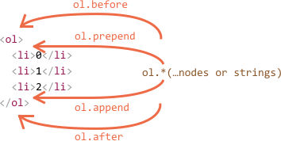
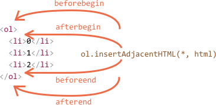

# Modifying the document

DOM modifications is the key to create "live" pages.

Here we'll see how to create new elements "on the fly" and modify the existing page content.

First we'll see a simple example and then explain the methods.

## Example: show a message

For a start, let's see how to add a message on the page that looks nicer than `alert`.

Here's how it will look:

```html autorun height="80"
<style>
.alert {
  padding: 15px;
  border: 1px solid #d6e9c6;
  border-radius: 4px;
  color: #3c763d;
  background-color: #dff0d8;
}
</style>

*!*
<div class="alert">
  <strong>Hi there!</strong> You've read an important message.
</div>
*/!*
```

That was an HTML example. Now let's create the same `div` with JavaScript (assuming that the styles are still in the HTML or an external CSS file).

## Creating an element


To create DOM nodes, there are two methods:

`document.createElement(tag)`
: Creates a new element with the given tag:

    ```js
    let div = document.createElement('div');
    ```

`document.createTextNode(text)`
: Creates a new *text node* with the given text:

    ```js
    let textNode = document.createTextNode('Here I am');
    ```

### Creating the message

In our case we want to make a `div` with given classes and the message in it:

```js
let div = document.createElement('div');
div.className = "alert alert-success";
div.innerHTML = "<strong>Hi there!</strong> You've read an important message.";
```

After that, we have our DOM element ready. Right now it is just in a variable and we cannot see it. That is because it's not yet inserted into the page.

## Insertion methods

To make the `div` show up, we need to insert it somewhere into `document`. For instance, in `document.body`.

There's a special method for that: `document.body.appendChild(div)`.

Here's the full code:

```html run height="80"
<style>
.alert {
  padding: 15px;
  border: 1px solid #d6e9c6;
  border-radius: 4px;
  color: #3c763d;
  background-color: #dff0d8;
}
</style>

<script>
  let div = document.createElement('div');
  div.className = "alert alert-success";
  div.innerHTML = "<strong>Hi there!</strong> You've read an important message.";

*!*
  document.body.appendChild(div);
*/!*
</script>
```

Here's a brief list of methods to insert a node into a parent element (`parentElem` for short):

`parentElem.appendChild(node)`
: Appends `node` as the last child of `parentElem`.

    The following example adds a new `<li>` to the end of `<ol>`:

    ```html run height=100
    <ol id="list">
      <li>0</li>
      <li>1</li>
      <li>2</li>
    </ol>

    <script>
      let newLi = document.createElement('li');
      newLi.innerHTML = 'Hello, world!';

      list.appendChild(newLi);
    </script>
    ```

`parentElem.insertBefore(node, nextSibling)`
: Inserts `node` before `nextSibling` into `parentElem`.

    The following code inserts a new list item before the second `<li>`:

    ```html run height=100
    <ol id="list">
      <li>0</li>
      <li>1</li>
      <li>2</li>
    </ol>
    <script>
      let newLi = document.createElement('li');
      newLi.innerHTML = 'Hello, world!';

    *!*
      list.insertBefore(newLi, list.children[1]);
    */!*
    </script>
    ```
    To insert `newLi` as the first element, we can do it like this:

    ```js
    list.insertBefore(newLi, list.firstChild);
    ```

`parentElem.replaceChild(node, oldChild)`
: Replaces `oldChild` with `node` among children of `parentElem`.

All these methods return the inserted node. In other words, `parentElem.appendChild(node)` returns `node`. But usually the returned value is not used, we just run the method.

These methods are "old school": they exist from the ancient times and we can meet them in many old scripts. Unfortunately, there are some tasks that are hard to solve with them.

For instance, how to insert *html* if we have it as a string? Or, given a node, how to insert another node *before* it? Of course, all that is doable, but not in an elegant way.

So there exist two other sets of insertion methods to handle all cases easily.

### prepend/append/before/after

This set of methods provides more flexible insertions:

- `node.append(...nodes or strings)` -- append nodes or strings at the end of `node`,
- `node.prepend(...nodes or strings)` -- insert nodes or strings into the beginning of `node`,
- `node.before(...nodes or strings)` –- insert nodes or strings before the `node`,
- `node.after(...nodes or strings)` –- insert nodes or strings after the `node`,
- `node.replaceWith(...nodes or strings)` –- replaces `node` with the given nodes or strings.

Here's an example of using these methods to add more items to a list and the text before/after it:

```html autorun
<ol id="ol">
  <li>0</li>
  <li>1</li>
  <li>2</li>
</ol>

<script>
  ol.before('before');
  ol.after('after');

  let prepend = document.createElement('li');
  prepend.innerHTML = 'prepend';
  ol.prepend(prepend);  

  let append = document.createElement('li');
  append.innerHTML = 'append';
  ol.append(append);
</script>
```

Here's a small picture what methods do:



So the final list will be:

```html
before
<ol id="ol">
  <li>prepend</li>
  <li>0</li>
  <li>1</li>
  <li>2</li>
  <li>append</li>
</ol>
after
```

These methods can insert multiple lists of nodes and text pieces in a single call.

For instance, here a string and an element are inserted:

```html run
<div id="div"></div>
<script>
  div.before('<p>Hello</p>', document.createElement('hr'));
</script>
```

All text is inserted *as text*.

So the final HTML is:

```html run
*!*
&lt;p&gt;Hello&lt;/p&gt;
*/!*
<hr>
<div id="div"></div>
```

In other words, strings are inserted in a safe way, like `elem.textContent` does it.

So, these methods can only be used to insert DOM nodes or text pieces.

But what if we want to insert HTML "as html", with all tags and stuff working, like `elem.innerHTML`?

### insertAdjacentHTML/Text/Element

There's another, pretty versatile method: `elem.insertAdjacentHTML(where, html)`.

The first parameter is a string, specifying where to insert. Must be one of the following:

- `"beforebegin"` -- insert `html` before `elem`,
- `"afterbegin"` -- insert `html` into `elem`, at the beginning,
- `"beforeend"` -- insert `html` into `elem`, at the end,
- `"afterend"` -- insert `html` after `elem`.

The second parameter is an HTML string, inserted "as is".

For instance:

```html run
<div id="div"></div>
<script>
  div.insertAdjacentHTML('beforebegin', '<p>Hello</p>');
  div.insertAdjacentHTML('afterend', '<p>Bye</p>');
</script>
```

...Would lead to:

```html run
<p>Hello</p>
<div id="div"></div>
<p>Bye</p>
```

That's how we can append an arbitrary HTML to our page.

Here's the picture of insertion variants:



We can easily notice similarities between this and the previous picture. The insertion points are actually the same, but this method inserts HTML.

The method has two brothers:

- `elem.insertAdjacentText(where, text)` -- the same syntax, but a string of `text` is inserted "as text" instead of HTML,
- `elem.insertAdjacentElement(where, elem)` -- the same syntax, but inserts an element.

They exist mainly to make the syntax "uniform". In practice, only `insertAdjacentHTML` is used most of the time. Because for elements and text, we have methods `append/prepend/before/after` -- they are shorter to write and can insert nodes/text pieces.

So here's an alternative variant of showing a message:

```html run
<style>
.alert {
  padding: 15px;
  border: 1px solid #d6e9c6;
  border-radius: 4px;
  color: #3c763d;
  background-color: #dff0d8;
}
</style>

<script>
  document.body.insertAdjacentHTML("afterbegin", `<div class="alert alert-success">
    <strong>Hi there!</strong> You've read an important message.
  </div>`);
</script>
```

## Cloning nodes: cloneNode

How to insert one more similar message?

We could make a function and put the code there. But the alternative way would be to *clone* the existing `div` and modify the text inside it (if needed).

Sometimes when we have a big element, that may be faster and simpler.

- The call `elem.cloneNode(true)` creates a "deep" clone of the element -- with all attributes and subelements. If we call `elem.cloneNode(false)`, then the clone is made without child elements.

An example of copying the message:

```html run height="120"
<style>
.alert {
  padding: 15px;
  border: 1px solid #d6e9c6;
  border-radius: 4px;
  color: #3c763d;
  background-color: #dff0d8;
}
</style>

<div class="alert" id="div">
  <strong>Hi there!</strong> You've read an important message.
</div>

<script>
*!*
  let div2 = div.cloneNode(true); // clone the message
  div2.querySelector('strong').innerHTML = 'Bye there!'; // change the clone

  div.after(div2); // show the clone after the existing div
*/!*
</script>
```


## DocumentFragment [#document-fragment]

`DocumentFragment` is a special DOM node that serves as a wrapper to pass around groups of nodes.

We can append other nodes to it, but when we insert it somewhere, then it "disappears", leaving its content inserted instead.

For example, `getListContent` below generates a fragment with `<li>` items, that are later inserted into `<ul>`:

```html run
<ul id="ul"></ul>

<script>
function getListContent() {
  let fragment = new DocumentFragment();

  for(let i=1; i<=3; i++) {
    let li = document.createElement('li');
    li.append(i);
    fragment.append(li);
  }

  return fragment;
}

*!*
ul.append(getListContent()); // (*)
*/!*
</script>
```

Please note, at the last line `(*)` we append `DocumentFragment`, but it "blends in", so the resulting structure will be:

```html
<ul>
  <li>1</li>
  <li>2</li>
  <li>3</li>
</ul>
```

`DocumentFragment` is rarely used explicitly. Why append to a special kind of node, if we can return an array of nodes instead? Rewritten example:

```html run
<ul id="ul"></ul>

<script>
function getListContent() {
  let result = [];

  for(let i=1; i<=3; i++) {
    let li = document.createElement('li');
    li.append(i);
    result.push(li);
  }

  return result;
}

*!*
ul.append(...getListContent()); // append + "..." operator = friends!
*/!*
</script>
```

We mention `DocumentFragment` mainly because there are some concepts on top of it, like [template](info:template-element) element, that we'll cover much later.


## Removal methods

To remove nodes, there are the following methods:


`parentElem.removeChild(node)`
: Removes `node` from  `parentElem` (assuming it's a child).

`node.remove()`
: Removes the `node` from its place.

We can easily see that the second method is much shorter. The first one exists for historical reasons.

````smart
If we want to *move* an element to another place -- there's no need to remove it from the old one.

**All insertion methods automatically remove the node from the old place.**

For instance, let's swap elements:

```html run height=50
<div id="first">First</div>
<div id="second">Second</div>
<script>
  // no need to call remove
  second.after(first); // take #second and after it - insert #first
</script>
```
````

Let's make our message disappear after a second:

```html run untrusted
<style>
.alert {
  padding: 15px;
  border: 1px solid #d6e9c6;
  border-radius: 4px;
  color: #3c763d;
  background-color: #dff0d8;
}
</style>

<script>
  let div = document.createElement('div');
  div.className = "alert alert-success";
  div.innerHTML = "<strong>Hi there!</strong> You've read an important message.";

  document.body.append(div);
*!*
  setTimeout(() => div.remove(), 1000);
  // or setTimeout(() => document.body.removeChild(div), 1000);
*/!*
</script>
```

## A word about "document.write"

There's one more, very ancient method of adding something to a web-page: `document.write`.

The syntax:

```html run
<p>Somewhere in the page...</p>
*!*
<script>
  document.write('<b>Hello from JS</b>');
</script>
*/!*
<p>The end</p>
```

The call to `document.write(html)` writes the `html` into page "right here and now". The `html` string can be dynamically generated, so it's kind of flexible. We can use JavaScript to create a full-fledged webpage and write it.

The method comes from times when there was no DOM, no standards... Really old times. It still lives, because there are scripts using it.

In modern scripts we can rarely see it, because of the following important limitation:

**The call to `document.write` only works while the page is loading.**

If we call it afterwards, the existing document content is erased.

For instance:

```html run
<p>After one second the contents of this page will be replaced...</p>
*!*
<script>
  // document.write after 1 second
  // that's after the page loaded, so it erases the existing content
  setTimeout(() => document.write('<b>...By this.</b>'), 1000);
</script>
*/!*
```

So it's kind of unusable at "after loaded" stage, unlike other DOM methods we covered above.

That was the downside.

Technically, when `document.write` is called while the browser is still reading HTML, it appends something to it, and the browser consumes it just as it were initially there.

That gives us the upside -- it works blazingly fast, because there's *no DOM modification*. It writes directly into the page text, while the DOM is not yet built, and the browser puts it into DOM at generation-time.

So if we need to add a lot of text into HTML dynamically, and we're at page loading phase, and the speed matters, it may help. But in practice these requirements rarely come together. And usually we can see this method in scripts just because they are old.

## Summary

Methods to create new nodes:

- `document.createElement(tag)` -- creates an element with the given tag,
- `document.createTextNode(value)` -- creates a text node (rarely used),
- `elem.cloneNode(deep)` -- clones the element, if `deep==true` then with all descendants.  

Insertion and removal of nodes:

- From the parent:
  - `parent.appendChild(node)`
  - `parent.insertBefore(node, nextSibling)`
  - `parent.removeChild(node)`
  - `parent.replaceChild(newElem, node)`

  All these methods return `node`.

- Given a list of nodes and strings:
  - `node.append(...nodes or strings)` -- insert into `node`, at the end,
  - `node.prepend(...nodes or strings)` -- insert into `node`, at the beginning,
  - `node.before(...nodes or strings)` –- insert right before `node`,
  - `node.after(...nodes or strings)` –- insert right after `node`,
  - `node.replaceWith(...nodes or strings)` –- replace `node`.
  - `node.remove()` –- remove the `node`.

  Text strings are inserted "as text".

- Given a piece of HTML: `elem.insertAdjacentHTML(where, html)`, inserts depending on where:
  - `"beforebegin"` -- insert `html` right before `elem`,
  - `"afterbegin"` -- insert `html` into `elem`, at the beginning,
  - `"beforeend"` -- insert `html` into `elem`, at the end,
  - `"afterend"` -- insert `html` right after `elem`.

  Also there are similar methods `elem.insertAdjacentText` and `elem.insertAdjacentElement`, they  insert text strings and elements, but they are rarely used.

- To append HTML to the page before it has finished loading:
  - `document.write(html)`

  After the page is loaded such a call erases the document. Mostly seen in old scripts.
