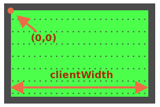

The ball has `position:absolute`. It means that its `left/top` coordinates are measured from the nearest positioned element, that is `#field` (because it has `position:relative`).

The coordinates start from the inner left-upper corner of the field:



The inner field width/height is `clientWidth/clientHeight`. So the field center has coordinates `(clientWidth/2, clientHeight/2)`.

...But if we set `ball.style.left/top` to such values, then not the ball as a whole, but the left-upper edge of the ball would be in the center:

```js
ball.style.left = Math.round(field.clientWidth / 2) + 'px';
ball.style.top = Math.round(field.clientHeight / 2) + 'px';
```

Here's how it looks:

[iframe height=180 src="ball-half"]

To align the ball center with the center of the field, we should move the ball to the half of its width to the left and to the half of its height to the top:

```js
ball.style.left = Math.round(field.clientWidth / 2 - ball.offsetWidth / 2) + 'px';
ball.style.top = Math.round(field.clientHeight / 2 - ball.offsetHeight / 2) + 'px';
```

**Attention: the pitfall!**

The code won't work reliably while `` has no width/height:

```html

```

When the browser does not know the width/height of an image (from tag attributes or CSS), then it assumes them to equal `0` until the image finishes loading.

After the first load browser usually caches the image, and on next loads it will have the size immediately. But on the first load the value of `ball.offsetWidth` is `0`. That leads to wrong coordinates.

We should fix that by adding `width/height` to ``:

```html

```

...Or provide the size in CSS:

```css
#ball {
  width: 40px;
  height: 40px;
}
```
