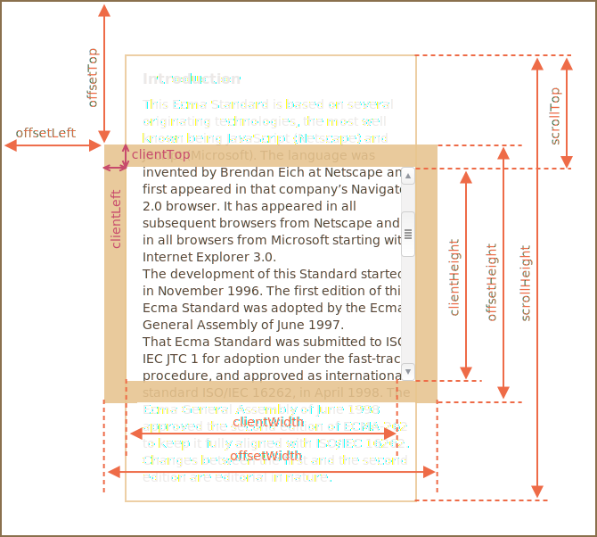
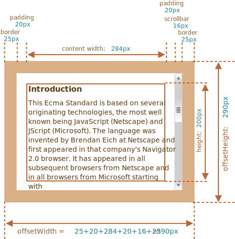
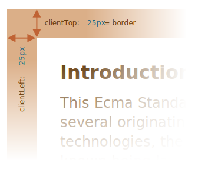
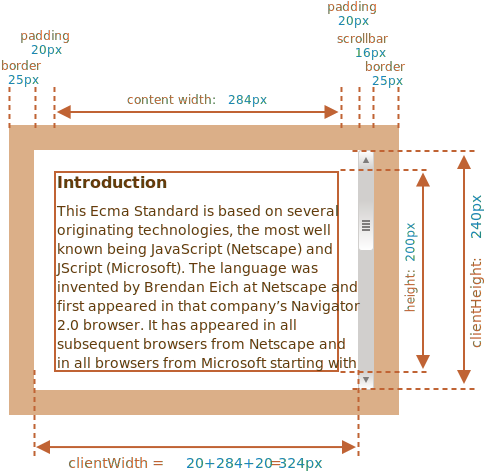
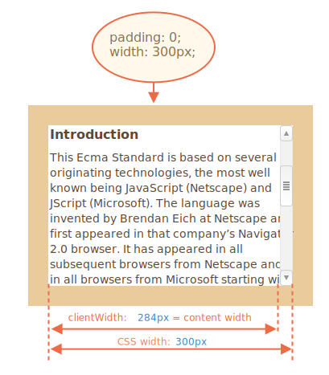
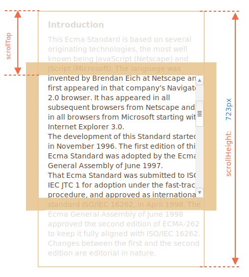

# Element size and scrolling

There are many JavaScript properties that allow us to read information about element width, height and other geometry features.

We often need them when moving or positioning elements in JavaScript.

## Sample element

As a sample element to demonstrate properties we'll use the one given below:

```html no-beautify
<div id="example">
  ...Text...
</div>
<style>
  #example {
    width: 300px;
    height: 200px;
    border: 25px solid #E8C48F;
    padding: 20px;              
    overflow: auto;             
  }
</style>
```

It has the border, padding and scrolling. The full set of features. There are no margins, as they are not the part of the element itself, and there are no special properties for them.

The element looks like this:


You can [open the document in the sandbox](sandbox:metric).

```smart header="Mind the scrollbar"
The picture above demonstrates the most complex case when the element has a scrollbar. Some browsers (not all) reserve the space for it by taking it from the content (labeled as "content width" above).

So, without scrollbar the content width would be `300px`, but if the scrollbar is `16px` wide (the width may vary between devices and browsers) then only `300 - 16 = 284px` remains, and we should take it into account. That's why examples from this chapter assume that there's a scrollbar. Without it, some calculations are simpler.
```

```smart header="The `padding-bottom` area may be filled with text"
Usually paddings are shown empty on our illustrations, but if there's a lot of text in the element and it overflows, then browsers show the "overflowing" text at `padding-bottom`, that's normal.
```

## Geometry

Here's the overall picture with geometry properties:



Values of these properties are technically numbers, but these numbers are "of pixels", so these are pixel measurements.

Let's start exploring the properties starting from the outside of the element.

## offsetParent, offsetLeft/Top

These properties are rarely needed, but still they are the "most outer" geometry properties, so we'll start with them.

The `offsetParent` is the nearest ancestor that the browser uses for calculating coordinates during rendering.

That's the nearest ancestor that is one of the following:

1. CSS-positioned (`position` is `absolute`, `relative`, `fixed` or `sticky`),  or
2. `<td>`, `<th>`, or `<table>`,  or
3. `<body>`.

Properties `offsetLeft/offsetTop` provide x/y coordinates relative to `offsetParent` upper-left corner.

In the example below the inner `<div>` has `<main>` as `offsetParent` and `offsetLeft/offsetTop` shifts from its upper-left corner (`180`):

```html run height=10
<main style="position: relative" id="main">
  <article>
    <div id="example" style="position: absolute; left: 180px; top: 180px">...</div>
  </article>
</main>
<script>
  alert(example.offsetParent.id); // main
  alert(example.offsetLeft); // 180 (note: a number, not a string "180px")
  alert(example.offsetTop); // 180
</script>
```


There are several occasions when `offsetParent` is `null`:

1. For not shown elements (`display:none` or not in the document).
2. For `<body>` and `<html>`.
3. For elements with `position:fixed`.

## offsetWidth/Height

Now let's move on to the element itself.

These two properties are the simplest ones. They provide the "outer" width/height of the element. Or, in other words, its full size including borders.



For our sample element:

- `offsetWidth = 390` -- the outer width, can be calculated as inner CSS-width (`300px`) plus paddings (`2 * 20px`) and borders (`2 * 25px`).
- `offsetHeight = 290` -- the outer height.

````smart header="Geometry properties are zero/null for elements that are not displayed"
Geometry properties are calculated only for displayed elements.

If an element (or any of its ancestors) has `display:none` or is not in the document, then all geometry properties are zero (or `null` for `offsetParent`).

For example, `offsetParent` is `null`, and `offsetWidth`, `offsetHeight` are `0` when we created an element, but haven't inserted it into the document yet, or it (or it's ancestor) has `display:none`.

We can use this to check if an element is hidden, like this:

```js
function isHidden(elem) {
  return !elem.offsetWidth && !elem.offsetHeight;
}
```

Please note that such `isHidden` returns `true` for elements that are on-screen, but have zero sizes (like an empty `<div>`).
````

## clientTop/Left

Inside the element we have the borders.

To measure them, there are properties `clientTop` and `clientLeft`.

In our example:

- `clientLeft = 25` -- left border width
- `clientTop = 25` -- top border width



...But to be precise -- these properties are not border width/height, but rather relative coordinates of the inner side from the outer side.

What's the difference?

It becomes visible when the document is right-to-left (the operating system is in Arabic or Hebrew languages). The scrollbar is then not on the right, but on the left, and then `clientLeft` also includes the scrollbar width.

In that case, `clientLeft` would be not `25`, but with the scrollbar width `25 + 16 = 41`.

Here's the example in hebrew:


## clientWidth/Height

These properties provide the size of the area inside the element borders.

They include the content width together with paddings, but without the scrollbar:



On the picture above let's first consider `clientHeight`.

There's no horizontal scrollbar, so it's exactly the sum of what's inside the borders: CSS-height `200px` plus top and bottom paddings (`2 * 20px`) total `240px`.

Now `clientWidth` -- here the content width is not `300px`, but `284px`, because `16px` are occupied by the scrollbar. So the sum is `284px` plus left and right paddings, total `324px`.

**If there are no paddings, then `clientWidth/Height` is exactly the content area, inside the borders and the scrollbar (if any).**



So when there's no padding we can use `clientWidth/clientHeight` to get the content area size.

## scrollWidth/Height

These properties are like `clientWidth/clientHeight`, but they also include the scrolled out (hidden) parts:


On the picture above:

- `scrollHeight = 723` -- is the full inner height of the content area including the scrolled out parts.
- `scrollWidth = 324` -- is the full inner width, here we have no horizontal scroll, so it equals `clientWidth`.

We can use these properties to expand the element wide to its full width/height.

Like this:

```js
// expand the element to the full content height
element.style.height = `${element.scrollHeight}px`;
```

```online
Click the button to expand the element:

<div id="element" style="width:300px;height:200px; padding: 0;overflow: auto; border:1px solid black;">text text text text text text text text text text text text text text text text text text text text text text text text text text text text text text text text text text text text text text text text text text text text text text text text text text text text text text text text text text text text text text text text text text text text text text text text text text text text text text text text text text text text text text text text text text text text text text text text text text text text text text text text text text text text text text text text text text text text text text text text text text text text text text text text text text text text text text text text text text text text</div>

<button style="padding:0" onclick="element.style.height = `${element.scrollHeight}px`">element.style.height = `${element.scrollHeight}px`</button>
```

## scrollLeft/scrollTop

Properties `scrollLeft/scrollTop` are the width/height of the hidden, scrolled out part of the element.

On the picture below we can see `scrollHeight` and `scrollTop` for a block with a vertical scroll.



In other words, `scrollTop` is "how much is scrolled up".

````smart header="`scrollLeft/scrollTop` can be modified"
Most of the geometry properties here are read-only, but `scrollLeft/scrollTop` can be changed, and the browser will scroll the element.

```online
If you click the element below, the code `elem.scrollTop += 10` executes. That makes the element content scroll `10px` down.

<div onclick="this.scrollTop+=10" style="cursor:pointer;border:1px solid black;width:100px;height:80px;overflow:auto">Click<br>Me<br>1<br>2<br>3<br>4<br>5<br>6<br>7<br>8<br>9</div>
```

Setting `scrollTop` to `0` or `Infinity` will make the element scroll to the very top/bottom respectively.
````

## Don't take width/height from CSS

We've just covered geometry properties of DOM elements, that can be used to get widths, heights and calculate distances.

But as we know from the chapter <info:styles-and-classes>, we can read CSS-height and width using `getComputedStyle`.

So why not to read the width of an element with `getComputedStyle`, like this?

```js run
let elem = document.body;

alert( getComputedStyle(elem).width ); // show CSS width for elem
```

Why should we use geometry properties instead? There are two reasons:

1. First, CSS `width/height` depend on another property: `box-sizing` that defines "what is" CSS width and height. A change in `box-sizing` for CSS purposes may break such JavaScript.
2. Second, CSS `width/height` may be `auto`, for instance for an inline element:

    ```html run
    <span id="elem">Hello!</span>

    <script>
    *!*
      alert( getComputedStyle(elem).width ); // auto
    */!*
    </script>
    ```

    From the CSS standpoint, `width:auto` is perfectly normal, but in JavaScript we need an exact size in `px` that we can use in calculations. So here CSS width is useless.

And there's one more reason: a scrollbar. Sometimes the code that works fine without a scrollbar becomes buggy with it, because a scrollbar takes the space from the content in some browsers. So the real width available for the content is *less* than CSS width. And `clientWidth/clientHeight` take that into account.

...But with `getComputedStyle(elem).width` the situation is different. Some browsers (e.g. Chrome) return the real inner width, minus the scrollbar, and some of them (e.g. Firefox) -- CSS width (ignore the scrollbar). Such cross-browser differences is the reason not to use `getComputedStyle`, but rather rely on geometry properties.

```online
If your browser reserves the space for a scrollbar (most browsers for Windows do), then you can test it below.

[iframe src="cssWidthScroll" link border=1]

The element with text has CSS `width:300px`.

On a Desktop Windows OS, Firefox, Chrome, Edge all reserve the space for the scrollbar. But  Firefox shows `300px`, while Chrome and Edge show less. That's because Firefox returns the CSS width and other browsers return the "real" width.
```

Please note that the described difference is only about reading `getComputedStyle(...).width` from JavaScript, visually everything is correct.

## Summary

Elements have the following geometry properties:

- `offsetParent` -- is the nearest positioned ancestor or `td`, `th`, `table`, `body`.
- `offsetLeft/offsetTop` -- coordinates relative to the upper-left edge of `offsetParent`.
- `offsetWidth/offsetHeight` -- "outer" width/height of an element including borders.
- `clientLeft/clientTop` -- the distance from the upper-left outer corner the inner corner. For left-to-right OS they are always the widths of left/top borders. For right-to-left OS the vertical scrollbar is on the left so `clientLeft` includes its width too.
- `clientWidth/clientHeight` -- the width/height of the content including paddings, but without the scrollbar.
- `scrollWidth/scrollHeight` -- the width/height of the content, just like `clientWidth/clientHeight`, but also include scrolled-out, invisible part of the element.
- `scrollLeft/scrollTop` -- width/height of the scrolled out upper part of the element, starting from its upper-left corner.

All properties are read-only except `scrollLeft/scrollTop` that make the browser scroll the element if changed.
