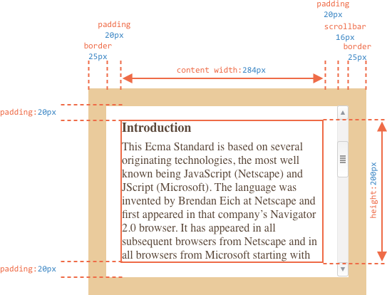
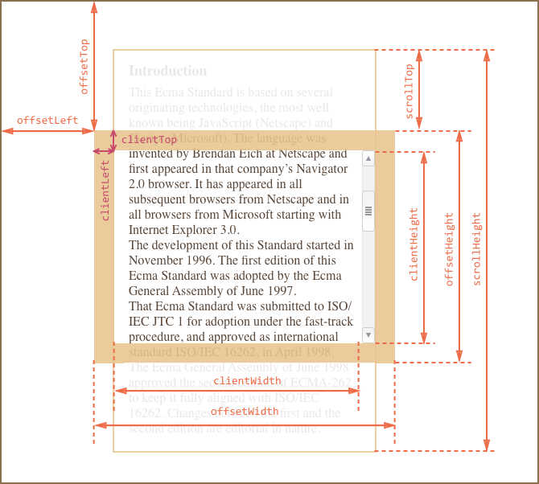
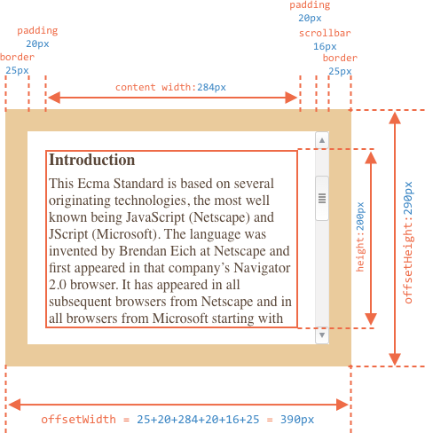
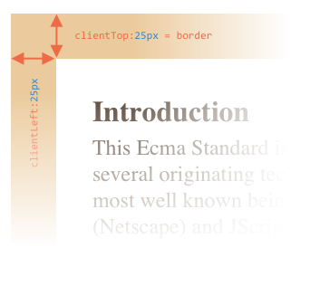
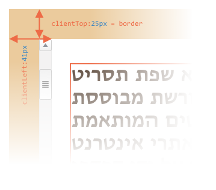
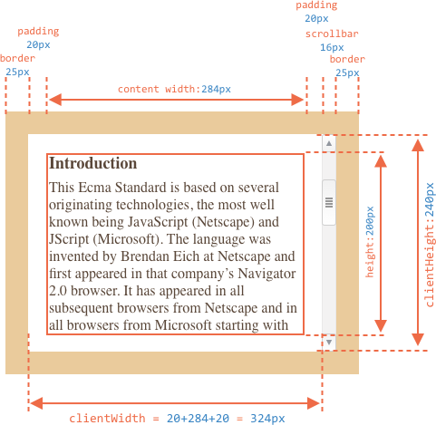
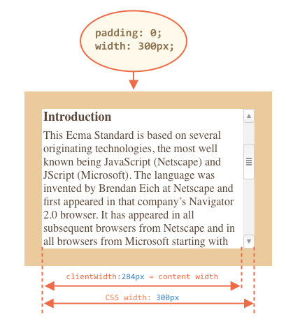
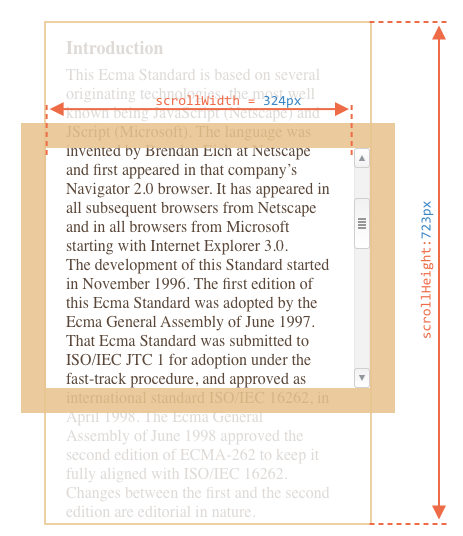
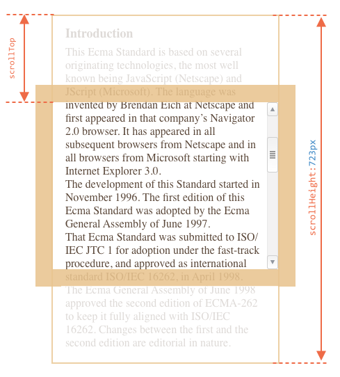

# Element size and scrolling

To show elements at arbitrary places in the page we should:

1. First, know CSS positioning.
2. Second, know how to handle "geometry" properties in Javascript.

[cut]

## Sample element

For the example we'll use the element with the border, padding and scrolling:

```html no-beautify
<div id="example">
  ...Text...
</div>
<style>
  #example {
    width: 300px;
    height: 200px;
    border: 25px solid #E8C48F;
    padding: 20px;              
    overflow: auto;             
  }
</style>
```

It has no margins, because they are irrelevant here for us, as they are not the part of the element itself.

The element looks like this:



You can [open the document in the sandbox](sandbox:metric).

```smart header="Mind the scrollbar"
The picture above demonstrates the most complex case when the element has a scrollbar. Some browsers (not all) reserve the space for it by taking it from the content.

So, without scrollbar the content width would be `300px`, but if the scrollbar is `16px` wide (the width may vary for devices and browsers) then only `300-16 = 284px` remains. Our code should work well if the scrollbar exists and occupies some place, so we consider it the case here.
```

```smart header="The `padding-bottom` may be filled with text"
Usually paddings are shown empty on illustrations, but if there's a lot of text in the element and it overflows, then the browsers show it at `padding-bottom`.
```

## Geometry

Element properties that provide width, height and other geometry are always numbers. They are assumed to be in pixels.

Here's the overall picture:



All properties hardly fit in the picture, but as we'll see soon, their values are simple and easy to understand.

Let's start exploring them from the outer side of the element.

## offsetParent, offsetLeft/Top

These properties are rarely needed. But still they are the "most outer" geometry properties, so we'll start with them.

The `offsetParent` is the nearest ancestor that is:

1. CSS-positioned (`position` is `absolute`, `relative` or `fixed`).
2. or `<td>`, `<th>`, `<table>`.
2. or `<body>`

The `offsetParent` alone has no use. But `offsetLeft/offsetTop` provide x/y coordinates relative to it's left-upper corner.

In the example below the inner `<div>` has `<main>` as `offsetParent` and `offsetLeft/offsetTop` are shifts from its left-upper corner (`180`):

```html run height=10
<main style="position: relative" id="main">
  <article>
    <div id="example" style="position: absolute; left: 180px; top: 180px">...</div>
  </article>
</main>
<script>
  alert(example.offsetParent.id); // main
  alert(example.offsetLeft); // 180 (note: a number, not a string "180px")
  alert(example.offsetTop); // 180
</script>
```


There are several occasions when `offsetParent` is `null`:

1. For not shown elements (`display:none` or not in the document).
2. For `<body>` and `<html>`.
3. For elements with `position:fixed` on them.

## offsetWidth/Height

Now let's move to the element itself.

These two properties are the simplest ones. They provide the "outer" width/height of the element. Or, in other words, its full size including borders.



For our sample element:

- `offsetWidth = 390` -- the outer width, can be calculated as inner CSS-width (`300px`) plus paddings (`2*20px`) and borders (`2*25px`).
- `offsetHeight = 290` -- the outer height.

````smart header="Geometry properties for not shown elements are zero/null"
Geometry properties are calculated only for shown elements.

If an element (or any of its ancestors) has `display:none` or is not in the document, then `offsetParent` is `null` and `offsetWidth`, `offsetHeight` and other numeric properties are `0`.

We can use this to check if an element is hidden, like this:

```js
function isHidden(elem) {
  return !elem.offsetWidth && !elem.offsetHeight;
}
```

Should keep in mind that such `isHidden` returns `true` for elements that are on-screen, but have zero sizes (like an empty `<div>`).
````

## clientTop/Left

Inside the element we have the borders.

To measure them, there are properties `clientTop` and `clientLeft`.

In our example:

- `clientLeft = 25` -- left border width
- `clientTop = 25` -- top border width



...But to be precise -- they are not borders, but relative coordinates of the inner side from the outer side.

What's the difference?

It becomes visible when the document is right-to-left (OS in arabic or hebrew languages). The scrollbar is then not on the right, but on the left, and then `clientLeft` also includes the scrollbar width.

In that case `clientLeft` in our example would be not `25`, but with the scrollbar width `25+16=41`:



## clientWidth/Height

These properties provide the size of the area inside the element borders.

They include the content width together with paddings, but without the scrollbar:



On the picture above let's first consider `clientHeight`: it's easier to evaluate. There's no horizontal scrollbar, so its exactly the sum of what's inside the borders: CSS-height `200px` plus top and bottom paddings (`2*20px`) total `240px`.

Now `clientWidth` -- here the content width is not `300px`, but `284px`, because `16px` are occupied by the scrollbbar. So the sum is `284px` plus left and right paddings, total `324px`.

**If there are no paddings, then `clientWidth/Height` is exactly the content area, inside the borders and the scrollbar (if any).**



So when there's no padding we can use `clientWidth/clientHeight` to get the content area size.

## scrollWidth/Height

- Properties `clientWidth/clientHeight` only account for the visible part of the element.
- Properties `scrollWidth/scrollHeight` add the scrolled out (hidden) part:



On the picture above:

- `scrollHeight = 723` -- is the full inner height of the content area including the scrolled out part.
- `scrollWidth = 324` -- is the full inner width, here we have no horizontal scroll, so it equals `clientWidth`.

We can use these properties to open the element wide to its full width/height, by the code:

```js
element.style.height = element.scrollHeight + 'px';
```

```online
Click the button to open wide the element:

<div id="element" style="width:300px;height:200px; padding: 0;overflow: auto; border:1px solid black;">text text text text text text text text text text text text text text text text text text text text text text text text text text text text text text text text text text text text text text text text text text text text text text text text text text text text text text text text text text text text text text text text text text text text text text text text text text text text text text text text text text text text text text text text text text text text text text text text text text text text text text text text text text text text text text text text text text text text text text text text text text text text text text text text text text text text text text text text text text text text</div>

<button style="padding:0" onclick="element.style.height = element.scrollHeight + 'px'">element.style.height = element.scrollHeight + 'px'</button>
```

## scrollLeft/scrollTop

Properties `scrollLeft/scrollTop` show how much is hidden behind the scroll. It's the width/height of the hidden, scrolled out part of the element.

On the picture below we can see `scrollHeight` and `scrollTop` for a block with a vertical scroll:



````smart header="`scrollLeft/scrollTop` can be modified"
Unlike most other geometry properties that are read-only, `scrollLeft/scrollTop` can be changed, and the browser will scroll the element.

```online
If you click the element below, the code `elem.scrollTop += 10` executes. That makes the element content scroll `10px` below.

<div onclick="this.scrollTop+=10" style="cursor:pointer;border:1px solid black;width:100px;height:80px;overflow:auto">Click<br>Me<br>1<br>2<br>3<br>4<br>5<br>6<br>7<br>8<br>9</div>
```

Setting `scrollTop` to `0` or `Infinity` will make the element scroll to the top/bottom respectively.
````

## Don't take width/height from CSS

We've just covered geometry properties of DOM elements. They are normally used to get widths, heights and distances.

Now let's see what we should not use.

As we know from the chapter <info:styles-and-classes>, we can read CSS-height and width using `getComputedStyle`.

So we can try to read the width of an element like this:

```js run
let elem = document.body;

alert( getComputedStyle(elem).width ); // show CSS width for elem
```

Why we should use geometry properties instead?

1. First, CSS `width/height` depend on another property -- `box-sizing` that defines "what is" CSS width and height. A change in `box-sizing` for purposes of CSS may break such JavaScript.
2. Second, CSS `width/height` may be `auto`, for instance for an inline element:

    ```html run
    <span id="elem">Hello!</span>

    <script>
    *!*
      alert( getComputedStyle(elem).width ); // auto
    */!*
    </script>
    ```

    From the CSS standpoint, `width:auto` is perfectly normal, but in JavaScript we need an exact size in `px` that we can use in calculations. So here CSS width is useless at all.

And there's one more reason. A scrollbar is the reason of many problems. The devil is in the detail. Sometimes the code that works fine without a scrollbar starts to bug with it.

As we've seen a scrollbar takes the space from the content in some browsers. So the real width available for the content is *less* than CSS width. And `clientWidth/clientHeight` take that into account.

...But some browsers also take that into account in `getComputedStyle(elem).width`. That is: some of them return real inner width and some of them -- CSS width. Such cross-browser differences is a reason not to use `getComputedStyle`, but rather rely on geometry propeties.

```online
If your browser reserves the space for a scrollbar (most browsers for Windows do), then you can test it below.

[iframe src="cssWidthScroll" link border=1]

The element with text has CSS `width:300px`.

Desktop Windows Firefox, Chrome, Edge all reserve the space for the scrollbar. But  Firefox shows `300px`, while Chrome and Edge show less. That's because Firefox returns the CSS width and other browsers return the "real" width.
```

Please note that the described difference are only about reading `getComputedStyle(...).width` from JavaScript, visually everything is correct.

## Summary

Elements have the following geometry properties:

- `offsetParent` -- is the nearest positioned ancestor or `td`, `th`, `table`, `body`.
- `offsetLeft/offsetTop` -- coordinates relative to the left-upper edge of `offsetParent`.
- `offsetWidth/offsetHeight` -- "outer" width/height of an element including borders.
- `clientLeft/clientTop` -- the distance from the left-upper outer corner to its left-upper inner corner. For left-to-right OS they are always the widths of left/top borders. For right-to-left OS the vertical scrollbar is on the left so `clientLeft` includes its width too.
- `clientWidth/clientHeight` -- the width/height of the content including paddings, but without the scrollbar.
- `scrollWidth/scrollHeight` -- the width/height of the content including the scrolled out part. Also includes paddings, but not the scrollbar.
- `scrollLeft/scrollTop` -- width/height of the scrolled out part of the element, starting from its left-upper corner.

All properties are read-only except `scrollLeft/scrollTop`. They make the browser scroll the element if changed.
