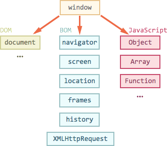

# Окружение: DOM, BOM и JS

Сам по себе язык JavaScript не предусматривает работы с браузером.

Он вообще не знает про HTML. Но позволяет легко расширять себя новыми функциями и объектами.

[cut]


На рисунке ниже схематически отображена структура, которая получается если посмотреть на совокупность браузерных объектов с "высоты птичьего полёта".



Как видно из рисунка, на вершине стоит `window`.

У этого объекта двоякая позиция -- он с одной стороны является глобальным объектом в JavaScript, с другой -- содержит свойства и методы для управления окном браузера, открытия новых окон, например:

```js
//+ run
// открыть новое окно/вкладку с URL http://ya.ru
window.open('http://ya.ru');
```

## Объектная модель документа (DOM)

Глобальный объект `document` даёт возможность взаимодействовать с содержимым страницы.

Пример использования:
```js
//+ run
document.body.style.background = 'red';
alert('Элемент BODY стал красным, а сейчас обратно вернётся');
document.body.style.background = '';
```

Он и громадное количество его свойств и методов описаны в [стандарте W3C DOM](http://www.w3.org/DOM/DOMTR).

По историческим причинам когда-то появилась первая версия стандарта DOM Level 1, затем придумали ещё свойства и методы, и появился DOM Level 2, на текущий момент поверх них добавили ещё DOM Level 3 и готовится DOM 4.

Современные браузеры также поддерживают некоторые возможности, которые не вошли в стандарты, но де-факто существуют давным-давно и отказываться от них никто не хочет. Их условно называют "DOM Level 0".

Также информацию по работе с элементами страницы можно найти в стандарте [HTML 5](http://www.w3.org/TR/html5/Overview.html).

Мы подробно ознакомимся с DOM далее в этой части учебника.

## Объектная модель браузера (BOM)

BOM -- это объекты для работы с чем угодно, кроме документа.

Например:
<ul>
<li>Объект [navigator](https://developer.mozilla.org/en/DOM/window.navigator) содержит общую информацию о браузере и операционной системе. Особенно примечательны два свойства: `navigator.userAgent` -- содержит информацию о браузере и `navigator.platform` -- содержит информацию о платформе, позволяет различать Windows/Linux/Mac и т.п.</li>
<li>Объект [location](https://developer.mozilla.org/en-US/docs/Web/API/Window.location) содержит информацию о текущем URL страницы и позволяет перенаправить посетителя на новый URL.</li>
<li>Функции `alert/confirm/prompt` -- тоже входят в BOM.</li>
</ul>

Пример использования:
```js
//+ run
alert(location.href); // выведет текущий адрес
```

Большинство возможностей BOM стандартизированы в [HTML 5](http://www.w3.org/TR/html5/Overview.html), хотя различные браузеры и предоставляют зачастую что-то своё, в дополнение к стандарту.

## Итого

Итак, у нас есть DOM, BOM и, собственно, язык JavaScript, который даёт возможность управлять всем этим. 

Далее мы приступим к изучению DOM, поскольку именно документ занимает центральную роль в организации интерфейса, и работа с ним -- сложнее всего.