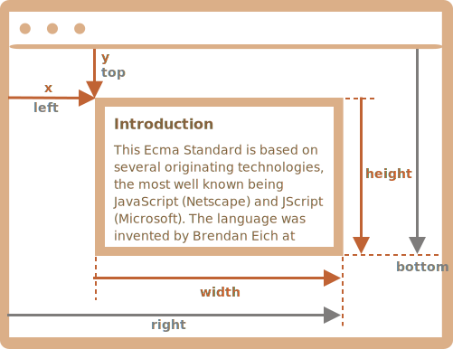
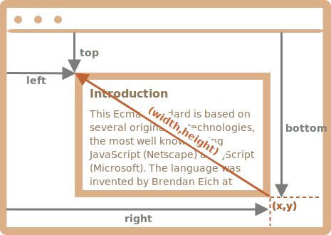

# Coordinates

To move elements around we should be familiar with coordinates.

Most JavaScript methods deal with one of two coordinate systems:

1. **Relative to the window** - similar to `position:fixed`, calculated from the window top/left edge.
    - we'll denote these coordinates as `clientX/clientY`, the reasoning for such name will become clear later, when we study event properties.
2. **Relative to the document** - similar to `position:absolute` in the document root, calculated from the document top/left edge.
    - we'll denote them `pageX/pageY`.

When the page is scrolled to the very beginning, so that the top/left corner of the window is exactly the document top/left corner, these coordinates equal each other. But after the document shifts, window-relative coordinates of elements change, as elements move across the window, while document-relative coordinates remain the same.

On this picture we take a point in the document and demonstrate its coordinates before the scroll (left) and after it (right):


When the document scrolled:
- `pageY` - document-relative coordinate stayed the same, it's counted from the document top (now scrolled out).
- `clientY` - window-relative coordinate did change (the arrow became shorter), as the same point became closer to window top.

## Element coordinates: getBoundingClientRect

The method `elem.getBoundingClientRect()` returns window coordinates for a minimal rectangle that encloses `elem` as an object of built-in [DOMRect](https://www.w3.org/TR/geometry-1/#domrect) class.

Main `DOMRect` properties:

- `x/y` -- X/Y-coordinates of the rectangle origin relative to window,
- `width/height` -- width/height of the rectangle (can be negative).

Additionally, there are derived properties:

- `top/bottom` -- Y-coordinate for the top/bottom rectangle edge,
- `left/right` -- X-coordinate for the left/right rectangle edge.

```online
For instance click this button to see its window coordinates:

<p><input id="brTest" type="button" style="max-width: 90vw;" value="Get coordinates using button.getBoundingClientRect() for this button" onclick='showRect(this)'/></p>

<script>
function showRect(elem) {
  let r = elem.getBoundingClientRect();
  alert(`x:${r.x}
y:${r.y}
width:${r.width}
height:${r.height}
top:${r.top}
bottom:${r.bottom}
left:${r.left}
right:${r.right}
`);
}
</script>

If you scroll the page and repeat, you'll notice that as window-relative button position changes, its window coordinates (`y/top/bottom` if you scroll vertically) change as well.
```

Here's the picture of `elem.getBoundingClientRect()` output:



As you can see, `x/y` and `width/height` fully describe the rectangle. Derived properties can be easily calculated from them:

- `left = x`
- `top = y`
- `right = x + width`
- `bottom = y + height`

Please note:

- Coordinates may be decimal fractions, such as `10.5`. That's normal, internally browser uses fractions in calculations. We don't have to round them when setting to `style.left/top`.
- Coordinates may be negative. For instance, if the page is scrolled so that `elem` is now above the window, then `elem.getBoundingClientRect().top` is negative.

```smart header="Why derived properties are needed? Why does `top/left` exist if there's `x/y`?"
Mathematically, a rectangle is uniquely defined with its starting point `(x,y)` and the direction vector `(width,height)`. So the additional derived properties are for convenience.

Technically it's possible for `width/height` to be negative, that allows for "directed" rectangle, e.g. to represent mouse selection with properly marked start and end.

Negative `width/height` values mean that the rectangle starts at its bottom-right corner and then "grows" left-upwards.

Here's a rectangle with negative `width` and `height` (e.g. `width=-200`, `height=-100`):



As you can see, `left/top` do not equal `x/y` in such case.

In practice though, `elem.getBoundingClientRect()` always returns positive width/height, here we mention negative `width/height` only for you to understand why these seemingly duplicate properties are not actually duplicates.
```

```warn header="Internet Explorer: no support for `x/y`"
Internet Explorer doesn't support `x/y` properties for historical reasons.

So we can either make a polyfill (add getters in `DomRect.prototype`) or just use `top/left`, as they are always the same as `x/y` for positive `width/height`, in particular in the result of `elem.getBoundingClientRect()`.
```

```warn header="Coordinates right/bottom are different from CSS position properties"
There are obvious similarities between window-relative coordinates and CSS `position:fixed`.

But in CSS positioning, `right` property means the distance from the right edge, and `bottom` property means the distance from the bottom edge.

If we just look at the picture above, we can see that in JavaScript it is not so. All window coordinates are counted from the top-left corner, including these ones.
```

## elementFromPoint(x, y) [#elementFromPoint]

The call to `document.elementFromPoint(x, y)` returns the most nested element at window coordinates `(x, y)`.

The syntax is:

```js
let elem = document.elementFromPoint(x, y);
```

For instance, the code below highlights and outputs the tag of the element that is now in the middle of the window:

```js run
let centerX = document.documentElement.clientWidth / 2;
let centerY = document.documentElement.clientHeight / 2;

let elem = document.elementFromPoint(centerX, centerY);

elem.style.background = "red";
alert(elem.tagName);
```

As it uses window coordinates, the element may be different depending on the current scroll position.

````warn header="For out-of-window coordinates the `elementFromPoint` returns `null`"
The method `document.elementFromPoint(x,y)` only works if `(x,y)` are inside the visible area.

If any of the coordinates is negative or exceeds the window width/height, then it returns `null`.

Here's a typical error that may occur if we don't check for it:

```js
let elem = document.elementFromPoint(x, y);
// if the coordinates happen to be out of the window, then elem = null
*!*
elem.style.background = ''; // Error!
*/!*
```
````

## Using for "fixed" positioning

Most of time we need coordinates in order to position something.

To show something near an element, we can use `getBoundingClientRect` to get its coordinates, and then CSS `position` together with `left/top` (or `right/bottom`).

For instance, the function `createMessageUnder(elem, html)` below shows the message under `elem`:

```js
let elem = document.getElementById("coords-show-mark");

function createMessageUnder(elem, html) {
  // create message element
  let message = document.createElement('div');
  // better to use a css class for the style here
  message.style.cssText = "position:fixed; color: red";

*!*
  // assign coordinates, don't forget "px"!
  let coords = elem.getBoundingClientRect();

  message.style.left = coords.left + "px";
  message.style.top = coords.bottom + "px";
*/!*

  message.innerHTML = html;

  return message;
}

// Usage:
// add it for 5 seconds in the document
let message = createMessageUnder(elem, 'Hello, world!');
document.body.append(message);
setTimeout(() => message.remove(), 5000);
```

```online
Click the button to run it:

<button id="coords-show-mark">Button with id="coords-show-mark", the message will appear under it</button>
```

The code can be modified to show the message at the left, right, below, apply CSS animations to "fade it in" and so on. That's easy, as we have all the coordinates and sizes of the element.

But note the important detail: when the page is scrolled, the message flows away from the button.

The reason is obvious: the message element relies on `position:fixed`, so it remains at the same place of the window while the page scrolls away.

To change that, we need to use document-based coordinates and `position:absolute`.

## Document coordinates [#getCoords]

Document-relative coordinates start from the upper-left corner of the document, not the window.

In CSS, window coordinates correspond to `position:fixed`, while document coordinates are similar to `position:absolute` on top.

We can use `position:absolute` and `top/left` to put something at a certain place of the document, so that it remains there during a page scroll. But we need the right coordinates first.

There's no standard method to get the document coordinates of an element. But it's easy to write it.

The two coordinate systems are connected by the formula:
- `pageY` = `clientY` + height of the scrolled-out vertical part of the document.
- `pageX` = `clientX` + width of the scrolled-out horizontal part of the document.

The function `getCoords(elem)` will take window coordinates from `elem.getBoundingClientRect()` and add the current scroll to them:

```js
// get document coordinates of the element
function getCoords(elem) {
  let box = elem.getBoundingClientRect();

  return {
    top: box.top + window.pageYOffset,
    right: box.right + window.pageXOffset,
    bottom: box.bottom + window.pageYOffset,
    left: box.left + window.pageXOffset
  };
}
```

If in the example above we used it with `position:absolute`, then the message would stay near the element on scroll.

The modified `createMessageUnder` function:

```js
function createMessageUnder(elem, html) {
  let message = document.createElement('div');
  message.style.cssText = "*!*position:absolute*/!*; color: red";

  let coords = *!*getCoords(elem);*/!*

  message.style.left = coords.left + "px";
  message.style.top = coords.bottom + "px";

  message.innerHTML = html;

  return message;
}
```

## Summary

Any point on the page has coordinates:

1. Relative to the window -- `elem.getBoundingClientRect()`.
2. Relative to the document -- `elem.getBoundingClientRect()` plus the current page scroll.

Window coordinates are great to use with `position:fixed`, and document coordinates do well with `position:absolute`.

Both coordinate systems have their pros and cons; there are times we need one or the other one, just like CSS `position` `absolute` and `fixed`.
